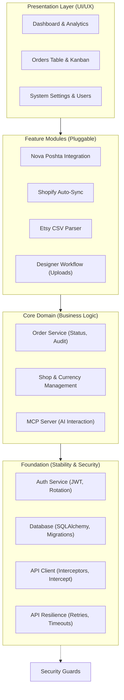

# Implementation Plan - OrderHub CRM

## Sprint History
- Sprint 1 status: `DONE` (Core Architecture)
- Sprint 2 status: `DONE` (Database & Auth)
- Sprint 3 status: `DONE` (Frontend Scaffolding)
- Sprint 4 status: `DONE` (Core Frontend)
- Sprint 5 status: `DONE` (Dashboard & Management)
- Sprint 6 status: `DONE` (Integrations & MCP)
- Sprint 7 status: `DONE` (Stability & Recovery)
- Sprint 8 status: `DONE` (Full Persistence)
- Sprint 9 status: `DONE` (Attachments & Designer Workflow)
- Sprint 10 status: `DONE` (Shop Management & Manual Entry)
- Sprint 11 status: `NOT STARTED`

## Architecture Schematic



## Actual Repository Snapshot

Verified against the current tree (See [Audit Report 2026-04-21](docs/audit/REPORT_2026_04_21.md) for details):

**Backend:**
- Fully implemented routers for all modules (Orders, Shops, Dashboard, Imports, Users, Auth, Shipping, MCP).
- Services for Shopify Sync, Nova Poshta, Encryption, and Etsy parsing are active.
- **NEW**: Persistent rotating file logging system implemented (backend/logs/server.log).

**Frontend:**
- Completed all primary feature pages (Orders, Dashboard, Customers, Imports, Archive, Shops, Users, Settings).
- **NEW**: Modular Order Detail view with 8 specialized sub-components.

### Component Hierarchy (Frontend)
```
frontend/src/
├── components/orders/
│   ├── OrdersLayout.tsx — orchestrates view state and modals
│   ├── OrdersTable.tsx — renders tabular order list
│   ├── PipelineBoard.tsx — renders kanban-style columns
│   ├── PipelineCard.tsx — individual order card
│   ├── StatusTabs.tsx — status category tabs
│   ├── ViewToggle.tsx — table/board switch
│   ├── OrderDetailPanel.tsx — orchestrator for modular order view
│   ├── detail/ — sub-components (Header, Notes, Items, Customer, Logistics, Finance, Timeline, BentoCard)
│   └── NewOrderDialog.tsx — [SRP VIOLATION] Order creation form
├── store/
│   └── authStore.ts — single-purpose auth state
└── api/
    ├── client.ts — Axios with interceptors
    ├── auth.ts, orders.ts, shops.ts, users.ts
    ├── attachments.ts, customers.ts, imports.ts
    └── shipping.ts — Nova Poshta integration
```

## Unified Backlog (Pending Tasks & Fixes)

### A. Production & Deployment

**Sprint 11 — Production & Deployment** (Status: `NOT STARTED`)

| ID | Task | Scope | Status |
|---|---|---|---|
| S11-1 | SSL & Domain Configuration | nginx | TODO |
| S11-2 | Database Backup Jobs | cron | TODO |
| S11-3 | Performance Monitoring | prometheus/grafana | TODO |

**Performance & Testing**

| ID | Task | Scope | Status |
|---|---|---|---|
| PERF-1 | Route-level chunk splitting | frontend bundler | TODO |
| TEST-1 | Smoke test coverage | vitest + playwright | TODO |

### B. Post-Audit Achievements (Completed 2026-04-21)

**Frontend & Architecture**

| ID | Task | Scope | Status |
|---|---|---|---|
| FE-1 | Refactor `OrderDetailPanel.tsx` — SRP Violation | Extracted 8 sub-components to `detail/` | DONE |
| INFRA-1 | Implement Backend Logging System | Rotating logs with 25MB safety cap | DONE |

**Backend Resilience & Business Logic**

| ID | Task | Scope | Status |
|---|---|---|---|
| BE-1 | Implement timeouts/retries for Nova Poshta | `nova_poshta.py` | DONE |
| BE-2 | Implement timeouts/retries for Shopify Sync | `shopify_sync.py` | DONE |
| BE-3 | Enhance `etsy_parser.py` error thresholds | Detailed error reports | DONE |
| AUDIT-1 | Extend `order_service.py` audit history | Log all mutations | DONE |

### C. Remaining Technical Debt

**Security** (Critical Priority)

| ID | Task | Scope | Effort |
|---|---|---|---|
| SEC-1 | Add authentication guards to MCP Router | `mcp.py` — /sse and /messages | S |

**Frontend Refactoring** (Medium Priority)

| ID | Task | Scope | Effort |
|---|---|---|---|
| FE-2 | Refactor `NewOrderDialog.tsx` — SRP Violation | Extract logic to hook | M |
