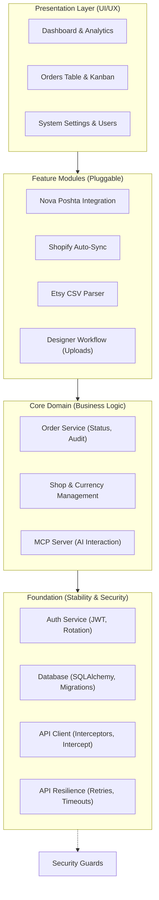

# Implementation Plan - OrderHub CRM

## Sprint History
- Sprint 1 status: `DONE` (Core Architecture)
- Sprint 2 status: `DONE` (Database & Auth)
- Sprint 3 status: `DONE` (Frontend Scaffolding)
- Sprint 4 status: `DONE` (Core Frontend)
- Sprint 5 status: `DONE` (Dashboard & Management)
- Sprint 6 status: `DONE` (Integrations & MCP)
- Sprint 7 status: `DONE` (Stability & Recovery)
- Sprint 8 status: `DONE` (Full Persistence)
- Sprint 9 status: `DONE` (Attachments & Designer Workflow)
- Sprint 10 status: `DONE` (Shop Management & Manual Entry)
- UI Modernization (Block 11) status: `DONE` (Customers, Users, Imports, Dashboard unified)
- Sprint PC-A status: `DONE` (Foundation: Pricing, Cost & Stock — commit `0bf0583`)
- Sprint PC-B status: `DONE` (Product Detail Page — commit `f99494f`)
- Sprint PC-B.1 status: `DONE` (Shopify-style Inline Product Editing — commit `bf9f8ba`)
- Sprint PC-B.2 status: `DONE` (Column Visibility Picker on ProductsPage — commit `46783bf`)
- Sprint 11 status: `NOT STARTED` (Production & Deployment)

## Architecture Schematic



## Actual Repository Snapshot

Verified against the current tree (See [Audit Report 2026-04-21](docs/audit/REPORT_2026_04_21.md) for details):

**Backend:**
- Fully implemented routers for all modules (Orders, Shops, Dashboard, Imports, Users, Auth, Shipping, MCP).
- Services for Shopify Sync, Nova Poshta, Encryption, and Etsy parsing are active.
- **NEW**: Persistent rotating file logging system implemented (backend/logs/server.log).

**Frontend:**
- **NEW**: Full-page `CreateOrderPage.tsx` replaces restrictive modal dialog.
- **NEW**: Modernized directory pages (`CustomersPage`, `UsersPage`) with deterministic avatars.
- **NEW**: Strategic `DashboardPage` with high-contrast intelligence widgets.
- **NEW**: Extraction-focused `ImportsPage` with step-based sync workflow.

### Component Hierarchy (Frontend)
```
frontend/src/
├── components/
│   ├── layout/
│   │   ├── AppLayout.tsx — modern zinc-950 shell
│   │   └── Topbar.tsx — premium header with user context
│   ├── ui/
│   │   ├── StatusBadge.tsx — multi-color status pill
│   │   ├── EmptyState.tsx — standardized feedback
│   │   └── Toast.tsx — custom notification system
│   └── orders/
│       ├── OrdersLayout.tsx — search, filter, and view orchestration
│       ├── OrdersTable.tsx — redesigned data-dense table
│       ├── PipelineBoard.tsx — updated kanban cards
│       ├── StatusTabs.tsx — grouped status navigation
│       ├── OrderDetailPanel.tsx — modular console
│       └── detail/ — 8 intelligence sub-components
├── utils/
│   ├── avatar.ts — initials & color generation
│   └── shopTheme.ts — deterministic shop branding
├── store/
│   └── authStore.ts — single-purpose auth state
└── api/
    └── ...
```

## Unified Backlog (Pending Tasks & Fixes)

### A. Product Catalog — Enhancement Sprints

**Sprint PC-A — Foundation: Pricing, Cost & Stock** (Status: `DONE` — commit `0bf0583`)

Goal: Add price, cost_price, and stock_quantity to ProductVariant. Update form and list view.

| ID | Task | Scope | Status |
|---|---|---|---|
| PC-A-1 | Alembic migration: add `price`, `cost_price`, `stock_quantity` to `product_variants` | backend/DB | DONE |
| PC-A-2 | Update `ProductVariant` model + Pydantic schemas (Create/Read/Update) | backend | DONE |
| PC-A-3 | Add price, cost_price, stock_quantity fields to `ProductForm.tsx` per variant | frontend | DONE |
| PC-A-4 | Update products list: add Price Range, Stock, Status badge columns | frontend | DONE |
| PC-A-5 | Update `ProductsPage.tsx`: show archived filter tab | frontend | DONE |

**Post-sprint notes:**
- Migration `d72589d_add_variant_pricing_and_stock_fields.py` added the three numeric columns to `product_variants`.
- `catalog_service.update_product` now applies **per-variant patches by id** (previously rewrote the whole list); the create path persists the new fields too.
- `ProductForm.tsx` gained a Price / Cost Price / Stock Qty row with a **live Margin % badge** (green ≥30, amber 10–29, red <10) — the threshold logic is now the source of truth for stock/margin coloring downstream.
- `ProductsPage.tsx` gained Active/Archived tabs (filter by `is_active`), Price Range, Stock (color-coded by qty), and Status columns. The archived view reuses the same query hook with a flag.

**Sprint PC-B — Product Detail Page** (Status: `DONE` — commit `f99494f`; PC-B.1 inline-edit follow-up `bf9f8ba`; PC-B.2 column picker `46783bf`)

Goal: Replace modal-only flow with a full-page product view at `/products/:id`.

| ID | Task | Scope | Status |
|---|---|---|---|
| PC-B-1 | New route `/products/:id` + `ProductDetailPage.tsx` | frontend | DONE |
| PC-B-2 | Detail page header: title, shop badge, status, Archive/Restore + Edit buttons | frontend | DONE |
| PC-B-3 | Variants table: all fields incl. price, cost, stock, volume, margin % per variant | frontend | DONE |
| PC-B-4 | Row click in `ProductsPage.tsx` navigates to detail page (replaces modal trigger) | frontend | DONE |
| PC-B-5 | Archive/Restore backend endpoint (PATCH `is_active`) if not already exposed | backend | DONE |

**Post-sprint notes:**
- Route is wrapped in `RequireAuth` only (**not `RequireRole`**) so designers with shop access can view — backend `GET /products/{id}` uses `get_current_user`, so role-gating in the frontend would have over-restricted.
- New `useProduct(id)` hook keyed on `['product', id]`. `useUpdateProduct` invocations on the detail page pass `shopId: product.shop_id` explicitly and the mutation **invalidates both `['products', shopId]` and `['product', id]`** — without the second key the detail view goes stale after Save.
- Row Edit/Delete buttons in `ProductsPage` use `e.stopPropagation()` so the row's `onClick → navigate(...)` doesn't fire alongside the inline action.
- Backend was unchanged — `PATCH /products/{id}` already supported `is_active` and per-variant patches from PC-A.
- Type aliases `ProductRead / ProductCreate / ProductUpdate / ProductVariantCreate / ProductVariantPatch` were added to `types/inventory.ts`; they had been imported by `productsApi` and `useProducts` since LOG-2 but never actually defined (compile passed because the consumers were `any`-typed).

**Sprint PC-B.1 — Shopify-style Inline Product Editing** (Status: `DONE` — commit `bf9f8ba`)

Goal: Convert `/products/:id` from a read-only view with an Edit modal into an always-editable inline form, Shopify-style. Make "Add Variant" persist end-to-end.

| ID | Task | Scope | Status |
|---|---|---|---|
| PC-B.1-1 | Convert `ProductDetailPage.tsx` to always-editable inline form (title/description as inputs, variant rows as input rows; Volume/Margin % stay computed) | frontend | DONE |
| PC-B.1-2 | Show Save Changes / Cancel only when the draft diverges from the loaded product | frontend | DONE |
| PC-B.1-3 | "Add Variant" appends a new row that persists on save — variant patches without an `id` now create new `ProductVariant` rows | backend + frontend | DONE |
| PC-B.1-4 | Trash icon on a variant row does local-only removal (DB-level deletion deferred) | frontend | DONE |
| PC-B.1-5 | Pencil icon on `ProductsPage` navigates to detail page; modal retained only for "Add Product" | frontend | DONE |

**Post-sprint notes:**
- `catalog_service.update_product` previously expected every variant patch to carry an `id`; it now treats **id-less patches as creates**, so `Add Variant` no longer requires a separate POST round-trip.
- "DB-level deletion deferred" is intentional — trash icon mutates client-side draft state only. A future sprint will need a soft-delete or hard-delete endpoint plus reconciliation against `order_items` snapshots before this can persist.
- Save/Cancel visibility is gated on a **deep diff between `draft` and the React-Query cached product**; do not switch to a shallow `dirty` boolean — variant arrays need element-by-element comparison.
- "Add Product" still uses the modal (`ProductForm`) — only edit flows moved inline.

**Sprint PC-B.2 — Column Visibility Picker** (Status: `DONE` — commit `46783bf`)

Goal: Let users toggle which columns are visible on the `ProductsPage` table, persisting the choice per browser via `localStorage`.

| ID | Task | Scope | Status |
|---|---|---|---|
| PC-B.2-1 | Add a **Columns** dropdown (right of search bar) using `DropdownMenuCheckboxItem` for Variants, SKUs, Weight Range, Price Range, Stock, Status | frontend | DONE |
| PC-B.2-2 | Persist visibility map to `localStorage` under `orderhub:productsTable:columnVisibility`, hydrated via merge-over-defaults | frontend | DONE |
| PC-B.2-3 | Wrap toggleable `<TableHead>` / `<TableCell>` in `{visibility.X && ...}`; keep Title and Actions always-on | frontend | DONE |
| PC-B.2-4 | Derive empty-state `colSpan` from live visible-column count | frontend | DONE |

**Post-sprint notes:**
- Storage key: **`orderhub:productsTable:columnVisibility`** (namespaced; reuse the `orderhub:` prefix for any future per-browser preferences).
- **Merge-over-defaults** on hydration (`{ ...DEFAULT_VISIBILITY, ...parsed }`) is the forward-compatibility hook: when a future column is added to `TOGGLEABLE_COLUMNS`, existing users' stored objects don't override its default-visible state — the new column simply appears.
- The persist `useEffect` depends on `[visibility]` only — do **not** add other deps; an unrelated dep would re-write `localStorage` on every render.
- No shared `useLocalStorage` hook was extracted (single call site). If a second consumer appears, hoist the inline `useState(() => ...)` + `useEffect` pair into `frontend/src/hooks/useLocalStorageState.ts` rather than reaching for a Zustand persist middleware — Zustand's persist middleware is currently unused in this repo (see `authStore.ts`).
- Title and Actions are intentionally **not** in `TOGGLEABLE_COLUMNS`; the visible-count formula is `2 + Object.values(visibility).filter(Boolean).length` and would need updating if either becomes toggleable.

**Sprint PC-C — Sales Analytics per Product** (Status: `NOT STARTED`)

Goal: Show order history and sales stats per product variant on the detail page.

| ID | Task | Scope | Status |
|---|---|---|---|
| PC-C-1 | Backend: extend GET `/products/{id}` response with per-variant stats (orders_count, units_sold, last_order_date) | backend | TODO |
| PC-C-2 | Frontend: Sales Analytics section on `ProductDetailPage.tsx` | frontend | TODO |
| PC-C-3 | Show: total orders, units sold, revenue, last sale date per variant | frontend | TODO |

**Future (not scheduled)**

| ID | Task | Notes |
|---|---|---|
| PC-F-1 | Product photos | Requires new file upload infrastructure per product. Deferred. |

---

### B. Production & Deployment

**Sprint 11 — Production & Deployment** (Status: `NOT STARTED`)

| ID | Task | Scope | Status |
|---|---|---|---|
| S11-1 | SSL & Domain Configuration | nginx | TODO |
| S11-2 | Database Backup Jobs | cron | TODO |
| S11-3 | Performance Monitoring | prometheus/grafana | TODO |

**Performance & Testing**

| ID | Task | Scope | Status |
|---|---|---|---|
| PERF-1 | Route-level chunk splitting | frontend bundler | TODO |
| TEST-1 | Smoke test coverage | vitest + playwright | TODO |

### B. Post-Audit Achievements (Completed 2026-04-22)

**Frontend & Architecture**

| ID | Task | Scope | Status |
|---|---|---|---|
| FE-1 | Refactor `OrderDetailPanel.tsx` | Extracted 8 sub-components to `detail/` | DONE |
| FE-2 | Modernize `CreateOrderPage.tsx` | Replaced modal with spacious full-page form | DONE |
| FE-3 | Advanced Dashboard Analytics | Shop filtering & premium telemetry widgets | DONE |
| FE-4 | Unified CRM Visuals | Modernized Customers, Users, and Imports pages | DONE |
| SEC-1 | MCP Security Guards | Added auth protection to /sse and /messages | DONE |
| INFRA-1 | Backend Logging System | Rotating logs with 25MB safety cap | DONE |

**Backend Resilience & Business Logic**

| ID | Task | Scope | Status |
|---|---|---|---|
| BE-1 | Nova Poshta Resilience | Timeouts/retries implemented | DONE |
| BE-2 | Shopify Sync Resilience | Timeouts/retries implemented | DONE |
| BE-3 | Enhanced Etsy Parser | Detailed error reporting thresholds | DONE |
| AUDIT-1 | Order Audit History | Log all status mutations | DONE |
| BUG-1 | Order Status Persistence | Fixed frontend-backend sync in OrderDetailView | DONE |
| BE-4 | Manual Shop Creation | Fixed Enum conflict in DB and backend (MANUAL) | DONE |
| FE-5 | Navigation & Dropdowns | Fixed Back button history and Status dropdown UX | DONE |
| FE-6 | Shops UI Polish | Fixed null checks and ID display in ShopsPage | DONE |

### C. Nova Poshta Full Audit Fixes (Completed 2026-04-23)

Comprehensive overhaul based on the [NP Audit Report](file:///home/serhii/projects/OrderHub/agents/skills/np-audit/SKILL.md).

| ID | Category | Task | Status |
|---|---|---|---|
| NP-P0 | Backend | Implementation of basic stability (timeouts, retries) | DONE |
| NP-P1 | Backend | NovaPoshtaAPIError, COD support, sender caching, timezone fix | DONE |
| NP-P2 | Frontend | Debouncing, dropdown positioning, click-to-copy | DONE |
| NP-P3 | Cleanup | Encryption decoupling (ENCRYPTION_KEY), dead code removal, delete TTN | DONE |

**Key Outcomes:**
- **Zero Redundant Calls**: Sender references are cached in the DB.
- **Data Integrity**: Refs are auto-cleared on manual input; dates are Kiev-compliant.
- **Security**: All API keys are Fernet-encrypted and masked in the UI.

### D. Logistics Automation & Product Catalog Foundation (Phases 1-6)

Implementation of automated parcel estimation and a robust Product Catalog which serves as the foundation for future Warehouse Management.
See [Nova Poshta Details](docs/integrations/nova-poshta.md) and [Product Catalog Foundation](docs/inventory/product-catalog.md).

| ID | Phase | Milestone | Status |
|---|---|---|---|
| LOG-1 | Phase 1 | Database Schema (Products, Variants, Packaging) | DONE |
| LOG-2 | Phase 2 | Backend API (CRUD, Two-step CSV Import Preview/Confirm) | DONE |
| LOG-3 | Phase 3 | Order Item Linking & Snapshots (Atomic SKU matching) | DONE |
| LOG-4 | Phase 4 | Parcel Calculation Service (Packaging selection & Vol. Weight) | DONE |
| LOG-5 | Phase 5 | Frontend Logistics Panel (Calculated pre-fills & Badges) | DONE |
| LOG-6 | Phase 6 | Catalog & Packaging Administration UI (Products/Packaging Admin) | DONE |

**Key Outcomes:**
- **Inventory Foundation**: Established a source-of-truth for products and variants, prepared for full Warehouse management.
- **Automated Logistics**: Parcel dimensions and weights are pre-filled based on the product catalog.
- **Data Safety**: Atomic snapshots preserve historical order data even if catalog specs change.
- **Administrative Control**: Full UI for managing physical specs and safe bulk CSV importing.
