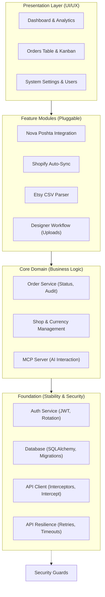

# Implementation Plan - OrderHub CRM

## Sprint History
- Sprint 1 status: `DONE` (Core Architecture)
- Sprint 2 status: `DONE` (Database & Auth)
- Sprint 3 status: `DONE` (Frontend Scaffolding)
- Sprint 4 status: `DONE` (Core Frontend)
- Sprint 5 status: `DONE` (Dashboard & Management)
- Sprint 6 status: `DONE` (Integrations & MCP)
- Sprint 7 status: `DONE` (Stability & Recovery)
- Sprint 8 status: `DONE` (Full Persistence)
- Sprint 9 status: `DONE` (Attachments & Designer Workflow)
- Sprint 10 status: `DONE` (Shop Management & Manual Entry)
- UI Modernization (Block 11) status: `DONE` (Customers, Users, Imports, Dashboard unified)
- Sprint 11 status: `NOT STARTED` (Production & Deployment)

## Architecture Schematic



## Actual Repository Snapshot

Verified against the current tree (See [Audit Report 2026-04-21](docs/audit/REPORT_2026_04_21.md) for details):

**Backend:**
- Fully implemented routers for all modules (Orders, Shops, Dashboard, Imports, Users, Auth, Shipping, MCP).
- Services for Shopify Sync, Nova Poshta, Encryption, and Etsy parsing are active.
- **NEW**: Persistent rotating file logging system implemented (backend/logs/server.log).

**Frontend:**
- **NEW**: Full-page `CreateOrderPage.tsx` replaces restrictive modal dialog.
- **NEW**: Modernized directory pages (`CustomersPage`, `UsersPage`) with deterministic avatars.
- **NEW**: Strategic `DashboardPage` with high-contrast intelligence widgets.
- **NEW**: Extraction-focused `ImportsPage` with step-based sync workflow.

### Component Hierarchy (Frontend)
```
frontend/src/
├── components/
│   ├── layout/
│   │   ├── AppLayout.tsx — modern zinc-950 shell
│   │   └── Topbar.tsx — premium header with user context
│   ├── ui/
│   │   ├── StatusBadge.tsx — multi-color status pill
│   │   ├── EmptyState.tsx — standardized feedback
│   │   └── Toast.tsx — custom notification system
│   └── orders/
│       ├── OrdersLayout.tsx — search, filter, and view orchestration
│       ├── OrdersTable.tsx — redesigned data-dense table
│       ├── PipelineBoard.tsx — updated kanban cards
│       ├── StatusTabs.tsx — grouped status navigation
│       ├── OrderDetailPanel.tsx — modular console
│       └── detail/ — 8 intelligence sub-components
├── utils/
│   ├── avatar.ts — initials & color generation
│   └── shopTheme.ts — deterministic shop branding
├── store/
│   └── authStore.ts — single-purpose auth state
└── api/
    └── ...
```

## Unified Backlog (Pending Tasks & Fixes)

### A. Production & Deployment

**Sprint 11 — Production & Deployment** (Status: `NOT STARTED`)

| ID | Task | Scope | Status |
|---|---|---|---|
| S11-1 | SSL & Domain Configuration | nginx | TODO |
| S11-2 | Database Backup Jobs | cron | TODO |
| S11-3 | Performance Monitoring | prometheus/grafana | TODO |

**Performance & Testing**

| ID | Task | Scope | Status |
|---|---|---|---|
| PERF-1 | Route-level chunk splitting | frontend bundler | TODO |
| TEST-1 | Smoke test coverage | vitest + playwright | TODO |

### B. Post-Audit Achievements (Completed 2026-04-22)

**Frontend & Architecture**

| ID | Task | Scope | Status |
|---|---|---|---|
| FE-1 | Refactor `OrderDetailPanel.tsx` | Extracted 8 sub-components to `detail/` | DONE |
| FE-2 | Modernize `CreateOrderPage.tsx` | Replaced modal with spacious full-page form | DONE |
| FE-3 | Advanced Dashboard Analytics | Shop filtering & premium telemetry widgets | DONE |
| FE-4 | Unified CRM Visuals | Modernized Customers, Users, and Imports pages | DONE |
| SEC-1 | MCP Security Guards | Added auth protection to /sse and /messages | DONE |
| INFRA-1 | Backend Logging System | Rotating logs with 25MB safety cap | DONE |

**Backend Resilience & Business Logic**

| ID | Task | Scope | Status |
|---|---|---|---|
| BE-1 | Nova Poshta Resilience | Timeouts/retries implemented | DONE |
| BE-2 | Shopify Sync Resilience | Timeouts/retries implemented | DONE |
| BE-3 | Enhanced Etsy Parser | Detailed error reporting thresholds | DONE |
| AUDIT-1 | Order Audit History | Log all status mutations | DONE |
| BUG-1 | Order Status Persistence | Fixed frontend-backend sync in OrderDetailView | DONE |
| BE-4 | Manual Shop Creation | Fixed Enum conflict in DB and backend (MANUAL) | DONE |
| FE-5 | Navigation & Dropdowns | Fixed Back button history and Status dropdown UX | DONE |
| FE-6 | Shops UI Polish | Fixed null checks and ID display in ShopsPage | DONE |

### C. Nova Poshta Full Audit Fixes (Completed 2026-04-23)

Comprehensive overhaul based on the [NP Audit Report](file:///home/serhii/projects/OrderHub/agents/skills/np-audit/SKILL.md).

| ID | Category | Task | Status |
|---|---|---|---|
| NP-P0 | Backend | Implementation of basic stability (timeouts, retries) | DONE |
| NP-P1 | Backend | NovaPoshtaAPIError, COD support, sender caching, timezone fix | DONE |
| NP-P2 | Frontend | Debouncing, dropdown positioning, click-to-copy | DONE |
| NP-P3 | Cleanup | Encryption decoupling (ENCRYPTION_KEY), dead code removal, delete TTN | DONE |

**Key Outcomes:**
- **Zero Redundant Calls**: Sender references are cached in the DB.
- **Data Integrity**: Refs are auto-cleared on manual input; dates are Kiev-compliant.
- **Security**: All API keys are Fernet-encrypted and masked in the UI.
