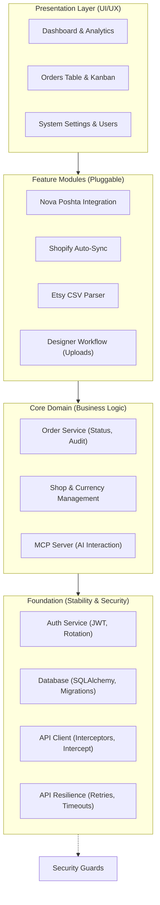

# Implementation Plan - OrderHub CRM

## Sprint History
- Sprint 1 status: `DONE` (Core Architecture)
- Sprint 2 status: `DONE` (Database & Auth)
- Sprint 3 status: `DONE` (Frontend Scaffolding)
- Sprint 4 status: `DONE` (Core Frontend)
- Sprint 5 status: `DONE` (Dashboard & Management)
- Sprint 6 status: `DONE` (Integrations & MCP)
- Sprint 7 status: `DONE` (Stability & Recovery)
- Sprint 8 status: `DONE` (Full Persistence)
- Sprint 9 status: `DONE` (Attachments & Designer Workflow)
- Sprint 10 status: `DONE` (Shop Management & Manual Entry)
- UI Modernization (Block 11) status: `DONE` (Customers, Users, Imports, Dashboard unified)
- Sprint PC-A status: `DONE` (Foundation: Pricing, Cost & Stock — commit `0bf0583`)
- Sprint PC-B status: `DONE` (Product Detail Page — commit `f99494f`)
- Sprint PC-B.1 status: `DONE` (Shopify-style Inline Product Editing — commit `bf9f8ba`)
- Sprint PC-B.2 status: `DONE` (Column Visibility Picker on ProductsPage — commit `46783bf`)
- Sprint 11 status: `NOT STARTED` (Production & Deployment)
- **Active Roadmap (2026-05-08):** Bug-Hunt & Imports — see Unified Backlog → "Active Roadmap" section.

## Architecture Schematic



## Actual Repository Snapshot

Verified against the current tree (See [Audit Report 2026-04-21](docs/audit/REPORT_2026_04_21.md) for details):

**Backend:**
- Fully implemented routers for all modules (Orders, Shops, Dashboard, Imports, Users, Auth, Shipping, MCP).
- Services for Shopify Sync, Nova Poshta, Encryption, and Etsy parsing are active.
- **NEW**: Persistent rotating file logging system implemented (backend/logs/server.log).

**Frontend:**
- **NEW**: Full-page `CreateOrderPage.tsx` replaces restrictive modal dialog.
- **NEW**: Modernized directory pages (`CustomersPage`, `UsersPage`) with deterministic avatars.
- **NEW**: Strategic `DashboardPage` with high-contrast intelligence widgets.
- **NEW**: Extraction-focused `ImportsPage` with step-based sync workflow.

### Component Hierarchy (Frontend)
```
frontend/src/
├── components/
│   ├── layout/
│   │   ├── AppLayout.tsx — modern zinc-950 shell
│   │   └── Topbar.tsx — premium header with user context
│   ├── ui/
│   │   ├── StatusBadge.tsx — multi-color status pill
│   │   ├── EmptyState.tsx — standardized feedback
│   │   └── Toast.tsx — custom notification system
│   └── orders/
│       ├── OrdersLayout.tsx — search, filter, and view orchestration
│       ├── OrdersTable.tsx — redesigned data-dense table
│       ├── PipelineBoard.tsx — updated kanban cards
│       ├── StatusTabs.tsx — grouped status navigation
│       ├── OrderDetailPanel.tsx — modular console
│       └── detail/ — 8 intelligence sub-components
├── utils/
│   ├── avatar.ts — initials & color generation
│   └── shopTheme.ts — deterministic shop branding
├── store/
│   └── authStore.ts — single-purpose auth state
└── api/
    └── ...
```

## Unified Backlog (Pending Tasks & Fixes)

### Active Roadmap — Bug-Hunt & Imports (2026-05-08)

Source-of-truth for current focus. Sprints below are sequenced from most-critical
to least-critical based on the 2026-05-08 planning conversation. Sprints land in
`task.md` one at a time, get reviewed with the planning agent, then executed by
Claude Code. As each closes, its `Status` flips to `DONE` and post-fix notes are
captured here. The "Explicitly deferred" table at the bottom is exhaustive — if
a backlog item isn't in either an active sprint or that table, surface it before
starting work on it.

---

**Round 1 — UX micro-fix**

**Sprint UX-1 — Products page remembers last selected shop** (Status: `DONE` — commit `eb32eb6`)

Goal: When the user navigates to `/products`, default the active shop to the last
one they viewed there. Persist via `localStorage` under
`orderhub:productsPage:lastShopId` (mirrors the `orderhub:productsTable:columnVisibility`
pattern from PC-B.2).

| ID | Task | Scope | Status |
|---|---|---|---|
| UX-1-1 | Read+write `orderhub:productsPage:lastShopId` in `ProductsPage.tsx` | frontend | DONE |
| UX-1-2 | On mount: if stored `shop_id` resolves against `useShops()`, restore as initial selection; else fall back to current default | frontend | DONE |
| UX-1-3 | Archived/deleted shop in localStorage gracefully ignored — no error, no console noise | frontend | DONE |

**Post-fix notes (UX-1):**
- **Design pivot from `useEffect` to `useMemo`.** The original plan called for a
  `useRef` + `useEffect([shops])` pair to apply the stored preference once
  `useShops()` resolved. The repo's ESLint configuration flags `setState`
  inside effect bodies via `react-hooks/set-state-in-effect`, so the
  implementation pivoted to a **`useMemo`-derived `effectiveShopId`**. No
  effect, no extra render cycle — validation happens inline.
- Two-state split: `selectedShopId` (lazy-init from `localStorage`) drives
  the `ShopSelector` dropdown and the write effect. `effectiveShopId`
  (`null` until shops load and the stored UUID resolves) drives **all
  product-related logic** — query, actions, conditional rendering. The
  divergence between the two values is intentional and only observable
  in the transient invalid-UUID case (see follow-up below).
- **Storage key:** `orderhub:productsPage:lastShopId`, single string UUID,
  reusing the `orderhub:` namespace established in PC-B.2.
- **Write effect skips `null` transitions** to preserve the stored shop_id
  when the user returns to a placeholder state. There is no explicit
  "Clear shop" gesture today, so this is a one-way ratchet — once a shop
  is picked, the preference sticks until a different shop is chosen.
- **`useShops()` deduped by React Query** — the new validation hook does
  not add a network call beyond what `ShopSelector` already makes
  internally on mount.

**Verified by smoke test:**
- Switch to KoraKlenu → /dashboard → /products → KoraKlenu still active. ✓
- Hard reload (F5) → KoraKlenu sticks. ✓
- DevTools → `localStorage` → `orderhub:productsPage:lastShopId` =
  `c2bb2b4e-60d1-40eb-b221-4b2eabcd96fd`. ✓
- Manually set the key to `00000000-0000-0000-0000-000000000000` → reload →
  graceful fallback to "No shop selected" placeholder, no console error,
  no toast. ✓
- Recovery: pick KoraKlenu after invalid state → `localStorage` overwrites
  with the correct UUID via the write effect. ✓

**Found during UX-1 smoke test, kept out of scope:**
- **Cosmetic only:** after a reload with an invalid stored UUID, the
  `ShopSelector` dropdown renders **empty** rather than falling back to
  the "Select a manual shop" placeholder. Cause: `selectedShopId` retains
  the stale UUID while `effectiveShopId` is `null` — the two state vars
  diverge in this transient case. Triggers only when `localStorage` is
  manipulated directly (DevTools, browser-extension, manual deletion of
  a shop, etc.); invisible in normal usage. Possible follow-up: clear
  `selectedShopId` to `null` when the validation in `useMemo` fails. Not
  filed as a bug; revisit only if a user actually hits this path.
- **Test 5 from the original verification list (multi-shop persistence)
  was not exercised** — current seed data has exactly one MANUAL shop
  (KoraKlenu). The fix logic is shop-agnostic, so it should hold for
  additional manual shops once they exist. Re-test when a second one
  appears (or after IMP-1/IMP-2 when imports start landing real data).

---

**Round 2 — Imports auto-populate catalog**

**Sprint IMP-1 — Etsy CSV importer auto-creates Products** (Status: `NOT STARTED`)

Goal: Inside the existing two-step CSV preview/confirm flow, also INSERT into
`products` and `product_variants` for SKUs not already in catalog. Pull every
field the CSV offers; the user adjusts visibility/details in catalog later.
**Skip-on-existing** by `(shop_id, sku)` — full skip, no field updates (preserves
local edits). Empty SKU is generated as `etsy-{listing_id}` for single-variant
rows or `etsy-{listing_id}-{n}` for multi-variant. Set `external_ref = listing_id`.
**No retroactive linking** of existing `order_items` to newly-created variants —
that decision is parked until we observe IMP-1 in practice.

| ID | Task | Scope | Status |
|---|---|---|---|
| IMP-1-1 | Extend Etsy CSV parser in `services/import_service.py` to emit Product/Variant inserts alongside Order/OrderItem inserts | backend | TODO |
| IMP-1-2 | Skip-on-existing-SKU logic keyed by `(shop_id, sku)` — no field updates on collision | backend | TODO |
| IMP-1-3 | Empty-SKU fallback: generate `etsy-{listing_id}[-{n}]` | backend | TODO |
| IMP-1-4 | Set `external_ref = listing_id` on the appropriate level (verify against CSV structure during planning) | backend | TODO |
| IMP-1-5 | Preview step surfaces "N new products / M new variants will be created" alongside existing order preview | backend + frontend | TODO |
| IMP-1-6 | Tests: re-importing same CSV creates zero duplicates; partial CSV creates only the missing entries; user-edited prices preserved on re-import | backend tests | TODO |

Verification (manual):
- Import a fresh Etsy CSV → Products page shows N new entries.
- Re-import the same CSV → no duplicates created; no error toast.
- Manually edit a generated row's price in catalog → re-import → edit preserved.
- Inspect one auto-created variant in DB → `external_ref` matches Etsy listing ID.

---

**Sprint IMP-2 — Shopify sync auto-creates Products** (Status: `NOT STARTED`)

Goal: Mirror IMP-1 inside the Shopify sync service. Pull all product+variant data
from Shopify API. Skip-if-exists by `(shop_id, sku)`. Use Shopify's `variant.id`
as `external_ref`. Empty SKU (rare for Shopify) → `shopify-{product_id}-{variant_id}`.

| ID | Task | Scope | Status |
|---|---|---|---|
| IMP-2-1 | Extend `services/shopify_sync.py` to call catalog ensure-product/variant per item | backend | TODO |
| IMP-2-2 | Same skip-on-existing semantics as IMP-1 | backend | TODO |
| IMP-2-3 | Generated SKU fallback for the empty-SKU edge case | backend | TODO |
| IMP-2-4 | Tests: incremental Shopify sync does not duplicate products on repeated runs | backend tests | TODO |

---

**Round 3 — Nova Poshta initiative (separate cadence, no CC)**

**Sprint NP-DISC — Research, audit, and sandbox confirmation** (Status: `NOT STARTED`)

Goal: Produce `docs/integrations/nova-poshta-audit-2026-05.md`. **No code changes** —
discovery only. The planning agent drives the research and writes the doc;
the user observes and approves the deliverable. Claude Code is **not** involved
at this stage.

The doc will contain:
1. Competitive research — how 2-3 other CRM systems handle NP integration
   (TTN creation, label printing, tracking, sender warehouse handling).
2. Feature-by-feature audit of current OrderHub NP code
   (`backend/services/nova_poshta_service.py`, `backend/routers/shipping.py`,
   frontend NP forms) against the typical CRM feature set from #1.
3. Confirmation of NP sandbox/test API existence + auth requirements.
4. Prioritized fix list to drive subsequent NP-FIX-* sprints.

Triggering context: a previous live test produced an unintended courier
dispatch because no sender warehouse was selected on the TTN form. Rather
than add a defensive validation immediately, the user wants to research the
broader integration first, surface every related issue at once, and then
test fixes against the sandbox API instead of risking live calls.

| ID | Task | Scope | Status |
|---|---|---|---|
| NP-DISC-1 | Competitive research: 2-3 CRM systems' approach to NP | docs | TODO |
| NP-DISC-2 | Code audit OrderHub vs typical NP feature set | docs | TODO |
| NP-DISC-3 | NP sandbox/test API verification (existence, entrypoint, auth) | docs + small spike | TODO |
| NP-DISC-4 | Deliverable: `docs/integrations/nova-poshta-audit-2026-05.md` with findings + prioritized fix list | docs | TODO |

**Sprint NP-FIX-*** — TBD, defined after NP-DISC ships and the user approves
the prioritized fix list. Each fix sprint follows the standard cycle
(`task.md` → CC plan review → execute → smoke test → post-fix notes).

---

**Explicitly deferred (parked, no work this round)**

Tracked here so the roadmap is exhaustive — none of these is forgotten,
none is being worked on now. Each links to its existing detail elsewhere
in this document where applicable, to avoid duplication.

| ID | Task | Why deferred (2026-05-08) |
|---|---|---|
| BUG-4 | Orders list TOTAL + Dashboard widgets read stale `order.total_price` | Pending more user interaction with the system before deciding if it's a bug or by-design |
| LINK-BACKFILL | Retroactively link historical `order_items` to catalog variants when their SKU appears in catalog | Decision blocked on observing IMP-1/IMP-2 behavior in practice |
| PC-C | Sales Analytics per Product (see Section A) | Pure feature; revisit after current round closes |
| Sprint 11 | Production & Deployment (see Section B) | System still local; prod is too early |
| PERF-1 | Route-level chunk splitting (see Section B) | No measured perf issue yet |
| TEST-1 | Vitest + Playwright smoke coverage (see Section B) | Out of current bug-hunting focus; revisit after IMP-2 |
| PC-F-1 | Product photos (see Section A) | Requires new file-upload infrastructure |
| Unlinked backfill (carried over from BUG-2/BUG-3 smoke tests) | UI gesture or migration to link historical Unlinked items in existing orders | Pre-existing constraint; no operational need yet |

---

### A. Product Catalog — Enhancement Sprints

**Sprint PC-A — Foundation: Pricing, Cost & Stock** (Status: `DONE` — commit `0bf0583`)

Goal: Add price, cost_price, and stock_quantity to ProductVariant. Update form and list view.

| ID | Task | Scope | Status |
|---|---|---|---|
| PC-A-1 | Alembic migration: add `price`, `cost_price`, `stock_quantity` to `product_variants` | backend/DB | DONE |
| PC-A-2 | Update `ProductVariant` model + Pydantic schemas (Create/Read/Update) | backend | DONE |
| PC-A-3 | Add price, cost_price, stock_quantity fields to `ProductForm.tsx` per variant | frontend | DONE |
| PC-A-4 | Update products list: add Price Range, Stock, Status badge columns | frontend | DONE |
| PC-A-5 | Update `ProductsPage.tsx`: show archived filter tab | frontend | DONE |

**Post-sprint notes:**
- Migration `d72589d_add_variant_pricing_and_stock_fields.py` added the three numeric columns to `product_variants`.
- `catalog_service.update_product` now applies **per-variant patches by id** (previously rewrote the whole list); the create path persists the new fields too.
- `ProductForm.tsx` gained a Price / Cost Price / Stock Qty row with a **live Margin % badge** (green ≥30, amber 10–29, red <10) — the threshold logic is now the source of truth for stock/margin coloring downstream.
- `ProductsPage.tsx` gained Active/Archived tabs (filter by `is_active`), Price Range, Stock (color-coded by qty), and Status columns. The archived view reuses the same query hook with a flag.

**Sprint PC-B — Product Detail Page** (Status: `DONE` — commit `f99494f`; PC-B.1 inline-edit follow-up `bf9f8ba`; PC-B.2 column picker `46783bf`)

Goal: Replace modal-only flow with a full-page product view at `/products/:id`.

| ID | Task | Scope | Status |
|---|---|---|---|
| PC-B-1 | New route `/products/:id` + `ProductDetailPage.tsx` | frontend | DONE |
| PC-B-2 | Detail page header: title, shop badge, status, Archive/Restore + Edit buttons | frontend | DONE |
| PC-B-3 | Variants table: all fields incl. price, cost, stock, volume, margin % per variant | frontend | DONE |
| PC-B-4 | Row click in `ProductsPage.tsx` navigates to detail page (replaces modal trigger) | frontend | DONE |
| PC-B-5 | Archive/Restore backend endpoint (PATCH `is_active`) if not already exposed | backend | DONE |

**Post-sprint notes:**
- Route is wrapped in `RequireAuth` only (**not `RequireRole`**) so designers with shop access can view — backend `GET /products/{id}` uses `get_current_user`, so role-gating in the frontend would have over-restricted.
- New `useProduct(id)` hook keyed on `['product', id]`. `useUpdateProduct` invocations on the detail page pass `shopId: product.shop_id` explicitly and the mutation **invalidates both `['products', shopId]` and `['product', id]`** — without the second key the detail view goes stale after Save.
- Row Edit/Delete buttons in `ProductsPage` use `e.stopPropagation()` so the row's `onClick → navigate(...)` doesn't fire alongside the inline action.
- Backend was unchanged — `PATCH /products/{id}` already supported `is_active` and per-variant patches from PC-A.
- Type aliases `ProductRead / ProductCreate / ProductUpdate / ProductVariantCreate / ProductVariantPatch` were added to `types/inventory.ts`; they had been imported by `productsApi` and `useProducts` since LOG-2 but never actually defined (compile passed because the consumers were `any`-typed).

**Sprint PC-B.1 — Shopify-style Inline Product Editing** (Status: `DONE` — commit `bf9f8ba`)

Goal: Convert `/products/:id` from a read-only view with an Edit modal into an always-editable inline form, Shopify-style. Make "Add Variant" persist end-to-end.

| ID | Task | Scope | Status |
|---|---|---|---|
| PC-B.1-1 | Convert `ProductDetailPage.tsx` to always-editable inline form (title/description as inputs, variant rows as input rows; Volume/Margin % stay computed) | frontend | DONE |
| PC-B.1-2 | Show Save Changes / Cancel only when the draft diverges from the loaded product | frontend | DONE |
| PC-B.1-3 | "Add Variant" appends a new row that persists on save — variant patches without an `id` now create new `ProductVariant` rows | backend + frontend | DONE |
| PC-B.1-4 | Trash icon on a variant row does local-only removal (DB-level deletion deferred) | frontend | DONE |
| PC-B.1-5 | Pencil icon on `ProductsPage` navigates to detail page; modal retained only for "Add Product" | frontend | DONE |

**Post-sprint notes:**
- `catalog_service.update_product` previously expected every variant patch to carry an `id`; it now treats **id-less patches as creates**, so `Add Variant` no longer requires a separate POST round-trip.
- "DB-level deletion deferred" is intentional — trash icon mutates client-side draft state only. A future sprint will need a soft-delete or hard-delete endpoint plus reconciliation against `order_items` snapshots before this can persist.
- Save/Cancel visibility is gated on a **deep diff between `draft` and the React-Query cached product**; do not switch to a shallow `dirty` boolean — variant arrays need element-by-element comparison.
- "Add Product" still uses the modal (`ProductForm`) — only edit flows moved inline.

**Sprint PC-B.2 — Column Visibility Picker** (Status: `DONE` — commit `46783bf`)

Goal: Let users toggle which columns are visible on the `ProductsPage` table, persisting the choice per browser via `localStorage`.

| ID | Task | Scope | Status |
|---|---|---|---|
| PC-B.2-1 | Add a **Columns** dropdown (right of search bar) using `DropdownMenuCheckboxItem` for Variants, SKUs, Weight Range, Price Range, Stock, Status | frontend | DONE |
| PC-B.2-2 | Persist visibility map to `localStorage` under `orderhub:productsTable:columnVisibility`, hydrated via merge-over-defaults | frontend | DONE |
| PC-B.2-3 | Wrap toggleable `<TableHead>` / `<TableCell>` in `{visibility.X && ...}`; keep Title and Actions always-on | frontend | DONE |
| PC-B.2-4 | Derive empty-state `colSpan` from live visible-column count | frontend | DONE |

**Post-sprint notes:**
- Storage key: **`orderhub:productsTable:columnVisibility`** (namespaced; reuse the `orderhub:` prefix for any future per-browser preferences).
- **Merge-over-defaults** on hydration (`{ ...DEFAULT_VISIBILITY, ...parsed }`) is the forward-compatibility hook: when a future column is added to `TOGGLEABLE_COLUMNS`, existing users' stored objects don't override its default-visible state — the new column simply appears.
- The persist `useEffect` depends on `[visibility]` only — do **not** add other deps; an unrelated dep would re-write `localStorage` on every render.
- No shared `useLocalStorage` hook was extracted (single call site). If a second consumer appears, hoist the inline `useState(() => ...)` + `useEffect` pair into `frontend/src/hooks/useLocalStorageState.ts` rather than reaching for a Zustand persist middleware — Zustand's persist middleware is currently unused in this repo (see `authStore.ts`).
- Title and Actions are intentionally **not** in `TOGGLEABLE_COLUMNS`; the visible-count formula is `2 + Object.values(visibility).filter(Boolean).length` and would need updating if either becomes toggleable.

**Sprint PC-C — Sales Analytics per Product** (Status: `NOT STARTED`)

Goal: Show order history and sales stats per product variant on the detail page.

| ID | Task | Scope | Status |
|---|---|---|---|
| PC-C-1 | Backend: extend GET `/products/{id}` response with per-variant stats (orders_count, units_sold, last_order_date) | backend | TODO |
| PC-C-2 | Frontend: Sales Analytics section on `ProductDetailPage.tsx` | frontend | TODO |
| PC-C-3 | Show: total orders, units sold, revenue, last sale date per variant | frontend | TODO |

**Future (not scheduled)**

| ID | Task | Notes |
|---|---|---|
| PC-F-1 | Product photos | Requires new file upload infrastructure per product. Deferred. |

---

### B. Production & Deployment

**Sprint 11 — Production & Deployment** (Status: `NOT STARTED`)

| ID | Task | Scope | Status |
|---|---|---|---|
| S11-1 | SSL & Domain Configuration | nginx | TODO |
| S11-2 | Database Backup Jobs | cron | TODO |
| S11-3 | Performance Monitoring | prometheus/grafana | TODO |

**Performance & Testing**

| ID | Task | Scope | Status |
|---|---|---|---|
| PERF-1 | Route-level chunk splitting | frontend bundler | TODO |
| TEST-1 | Smoke test coverage | vitest + playwright | TODO |

### B. Post-Audit Achievements

**Frontend & Architecture (Completed 2026-04-22)**

| ID | Task | Scope | Status |
|---|---|---|---|
| FE-1 | Refactor `OrderDetailPanel.tsx` | Extracted 8 sub-components to `detail/` | DONE |
| FE-2 | Modernize `CreateOrderPage.tsx` | Replaced modal with spacious full-page form | DONE |
| FE-3 | Advanced Dashboard Analytics | Shop filtering & premium telemetry widgets | DONE |
| FE-4 | Unified CRM Visuals | Modernized Customers, Users, and Imports pages | DONE |
| SEC-1 | MCP Security Guards | Added auth protection to /sse and /messages | DONE |
| INFRA-1 | Backend Logging System | Rotating logs with 25MB safety cap | DONE |

**Backend Resilience & Business Logic (Completed 2026-04-22)**

| ID | Task | Scope | Status |
|---|---|---|---|
| BE-1 | Nova Poshta Resilience | Timeouts/retries implemented | DONE |
| BE-2 | Shopify Sync Resilience | Timeouts/retries implemented | DONE |
| BE-3 | Enhanced Etsy Parser | Detailed error reporting thresholds | DONE |
| AUDIT-1 | Order Audit History | Log all status mutations | DONE |
| BUG-1 | Order Status Persistence | Fixed frontend-backend sync in OrderDetailView | DONE |
| BE-4 | Manual Shop Creation | Fixed Enum conflict in DB and backend (MANUAL) | DONE |
| FE-5 | Navigation & Dropdowns | Fixed Back button history and Status dropdown UX | DONE |
| FE-6 | Shops UI Polish | Fixed null checks and ID display in ShopsPage | DONE |

**Bug Fixes (2026-05-07)**

| ID | Task | Scope | Status |
|---|---|---|---|
| BUG-2 | Catalog search in OrderItemsEditor returned no matches (auth-bypassed fetch) | frontend | DONE — commit `46cb8d9` |
| BUG-3 | Product inventory Subtotal didn't reflect items[] (read mode used stale `order.total_price`) | frontend | DONE — commit `4f45979`, housekeeping `d4c3ab4` |

**Post-fix notes (BUG-2):**
- `frontend/src/components/orders/ProductVariantSelector.tsx` was calling raw
  `axios.get(...)` directly (its own `import axios from 'axios'`), bypassing the
  shared `frontend/src/api/client.ts` and its Bearer-token request interceptor.
  Every catalog fetch returned **403** and the silent `catch → console.error`
  made the failure look identical to a genuinely empty catalog
  ("No matches found. Using manual entry."). The bug had been latent since
  `ProductVariantSelector` was introduced in LOG-3.
- Fix replaces the local `useState<Product[]>` + fetch effect with the existing
  `useProducts(shopId)` hook (React Query) from `frontend/src/hooks/useProducts.ts`.
  Two structural side-effects worth knowing:
  1. The cache key on `shopId` removes the brittle `products.length === 0` gate
     that would otherwise leak a stale list across shops.
  2. `DetailItems.tsx` mounts **two** selector instances (existing edited rows +
     new rows) — they now share one fetch via React Query dedupe instead of two
     parallel calls.
- Local `Variant.price` widened to `number | string | null` to match the actual
  `ProductRead` shape (backend serialises `Decimal` as a string like `"130.00"`).
  `handleSelect` does a safe `Number(price)` coercion before invoking `onChange`,
  so the parent's numeric `unit_price` input never receives a string. **Smoke
  test confirmed**: selecting a variant populates `130` (numeric), Subtotal
  recomputes correctly inside the editor, no `NaN`, no `"$130.00"` string leak.
- Distinct error branch added to the dropdown ("Failed to load catalog — try
  again", rose tone) — fetch failures no longer masquerade as empty results.
- **Bonus discovered during smoke test:** catalog linking now feeds the
  `parcel-estimate` service correctly. Adding a linked variant immediately
  populates Weight/Volume in Shipping & Logistics from the variant's
  `weight_g` / `length_mm` / `width_mm` / `height_mm`. No code change in the
  parcel service — the data path was simply being correctly fed for the
  first time. The "N item(s) have no dimensions linked" warning from LOG-4
  remains accurate: it now refers only to historically unlinked items.

**Post-fix notes (BUG-3):**
- Read-mode Subtotal cell at `frontend/src/components/orders/detail/DetailItems.tsx:271`
  was bound to `order.total_price` — a backend snapshot field that is not
  recomputed when items are mutated. Edit-mode in the same file already inlined
  `items.reduce((acc, it) => acc + it.quantity * it.unit_price, 0)`; the two
  branches diverged. Fix converges read-mode on the same expression — one-line
  change, no helper extraction (CLAUDE.md "three similar lines beats premature
  abstraction"; we have only two call sites in one file).
- No `Number()` coercion added — line 260 already calls `item.unit_price.toFixed(2)`
  directly on the same data path, proving runtime type is already number. Adding
  coercion only at the new site would diverge from edit-mode and the per-row render.
- `?? 0` guard for missing `order.items` matches existing patterns at lines 218
  and 281.
- **Backend `order.total_price` field intentionally NOT modified** — the snapshot
  still drives the Orders list TOTAL column and Dashboard NET PROFIT / revenue
  widgets, all of which read aggregated values via a separate code path. Fixing
  those would be a separate decision (recompute server-side on item mutation,
  affecting audit and migrations) — out of scope for this UI fix.
- Smoke test confirmed: 130.00 → 240.00 after adding Black variant; Orders list
  TOTAL unchanged (0 UAH); Dashboard widgets unchanged.

**Pre-task housekeeping (commit `d4c3ab4`):** `docs(plan): close BUG-2, queue BUG-3` —
landed before the code commit so git history reads as discrete docs vs. fix changes.

**Known limitation, no task (carried over from BUG-2 smoke test):**
- Items saved before the catalog existed (or
  before BUG-2 was fixed) carry `product_variant_id = null` permanently —
  there is no backfill path or UI gesture to retroactively link them. They
  display the orange "Unlinked" badge forever and contribute nothing to
  parcel-estimate. This is a pre-existing constraint from LOG-1…6, **not**
  introduced by BUG-2; the fix simply makes the contrast visible (linked and
  unlinked rows now sit side-by-side in the same order). Revisit only if a
  concrete operational need surfaces (e.g. bulk-link migration for ≥N
  historical orders) — at that point it becomes a UX/migration design
  decision, not a technical debt item.

### C. Nova Poshta Full Audit Fixes (Completed 2026-04-23)

Comprehensive overhaul based on the [NP Audit Report](file:///home/serhii/projects/OrderHub/agents/skills/np-audit/SKILL.md).

| ID | Category | Task | Status |
|---|---|---|---|
| NP-P0 | Backend | Implementation of basic stability (timeouts, retries) | DONE |
| NP-P1 | Backend | NovaPoshtaAPIError, COD support, sender caching, timezone fix | DONE |
| NP-P2 | Frontend | Debouncing, dropdown positioning, click-to-copy | DONE |
| NP-P3 | Cleanup | Encryption decoupling (ENCRYPTION_KEY), dead code removal, delete TTN | DONE |

**Key Outcomes:**
- **Zero Redundant Calls**: Sender references are cached in the DB.
- **Data Integrity**: Refs are auto-cleared on manual input; dates are Kiev-compliant.
- **Security**: All API keys are Fernet-encrypted and masked in the UI.

### D. Logistics Automation & Product Catalog Foundation (Phases 1-6)

Implementation of automated parcel estimation and a robust Product Catalog which serves as the foundation for future Warehouse Management.
See [Nova Poshta Details](docs/integrations/nova-poshta.md) and [Product Catalog Foundation](docs/inventory/product-catalog.md).

| ID | Phase | Milestone | Status |
|---|---|---|---|
| LOG-1 | Phase 1 | Database Schema (Products, Variants, Packaging) | DONE |
| LOG-2 | Phase 2 | Backend API (CRUD, Two-step CSV Import Preview/Confirm) | DONE |
| LOG-3 | Phase 3 | Order Item Linking & Snapshots (Atomic SKU matching) | DONE |
| LOG-4 | Phase 4 | Parcel Calculation Service (Packaging selection & Vol. Weight) | DONE |
| LOG-5 | Phase 5 | Frontend Logistics Panel (Calculated pre-fills & Badges) | DONE |
| LOG-6 | Phase 6 | Catalog & Packaging Administration UI (Products/Packaging Admin) | DONE |

**Key Outcomes:**
- **Inventory Foundation**: Established a source-of-truth for products and variants, prepared for full Warehouse management.
- **Automated Logistics**: Parcel dimensions and weights are pre-filled based on the product catalog.
- **Data Safety**: Atomic snapshots preserve historical order data even if catalog specs change.
- **Administrative Control**: Full UI for managing physical specs and safe bulk CSV importing.
