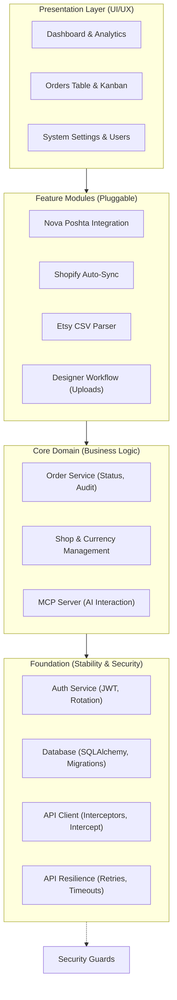

# Implementation Plan - OrderHub CRM

## Sprint History
- Sprint 1 status: `DONE` (Core Architecture)
- Sprint 2 status: `DONE` (Database & Auth)
- Sprint 3 status: `DONE` (Frontend Scaffolding)
- Sprint 4 status: `DONE` (Core Frontend)
- Sprint 5 status: `DONE` (Dashboard & Management)
- Sprint 6 status: `DONE` (Integrations & MCP)
- Sprint 7 status: `DONE` (Stability & Recovery)
- Sprint 8 status: `DONE` (Full Persistence)
- Sprint 9 status: `DONE` (Attachments & Designer Workflow)
- Sprint 10 status: `DONE` (Shop Management & Manual Entry)
- UI Modernization (Block 11) status: `DONE` (Customers, Users, Imports, Dashboard unified)
- Sprint PC-A status: `DONE` (Foundation: Pricing, Cost & Stock — commit `0bf0583`)
- Sprint PC-B status: `DONE` (Product Detail Page — commit `f99494f`)
- Sprint PC-B.1 status: `DONE` (Shopify-style Inline Product Editing — commit `bf9f8ba`)
- Sprint PC-B.2 status: `DONE` (Column Visibility Picker on ProductsPage — commit `46783bf`)
- Sprint ORD-UX-1 status: `DONE` (Orders pagination + inline status change + visible Finance entry — commits `e6e1671` / `c9c770a` / `90aefd8`)
- Sprint PC-F-1 status: `DONE` (Product images — single, product-level; manual upload + Shopify pull — commits `c1cae4c` / `9268cc7` / `177f631` / `0f8f153`)
- Sprint ORD-BULK-1 status: `DONE` (Bulk order status change — current-page select + one-call batch + per-order summary — commits `9f9aa37` / `f90a174`)
- Sprint DASH-PERIOD status: `DONE` (Dashboard period selector — financial widgets scoped, operational live — commits `4acefc8` / `42f081c`)
- Sprint CTRY-1 status: `DONE` (Full country names in address displays via Intl.DisplayNames — commit `5350671`)
- Sprint SETTLE-PAGE status: `DONE` (Calculate Settlement modal → dedicated page — commit `0349087`)
- Sprint ETSY-COUNTRY-FIX status: `DONE` (Etsy country parser fix + backfill of 18 broken rows — commits `df9910e` / `d37778e`)
- Sprint ORD-NAME-1 status: `DONE` (Orders list shows recipient name, not the Etsy buyer handle — commit `3807bfe`)
- Sprint SHOP-FILTER-STALE status: `DONE` (Shop-filtered orders view remounts on shop switch — commit `39c2d57`)
- Sprint COUNTRY-CLEANUP status: `DONE` (Residual ambiguous Etsy country codes + УК→UA + ISO input guard — commit `1f0dd60`)
- Sprint ADDR-VAL-1 status: `DONE` (Address validation backend + encrypted Google API-key Settings UI — Google; merged `bdb5866`, deployed to prod, migration `b8e2f5a91c34`; prod key set + verified live)
- Sprint ADDR-VAL-2 status: `DONE` (Address-validation UI — order-detail Check button + status badge + diff/Apply; merged `2f94b28`, deployed to prod; closure commit `9f00154`)
- Sprint USERS-LIST-500 status: `DONE` (Fix 500 on `GET /api/users` — the system user's reserved-TLD email broke `EmailStr` validation; merged `e44f6e2`, deployed to prod)
- Sprint USER-ACCESS-1 status: `DONE` (Per-user shop access — explicit grants, enforcement sweep, closes the finance + shop-list holes; merged `8ed403d`, deployed to prod, migration `f9a1c3e5b7d2`)
- Sprint 11 status: `NOT STARTED` (Production & Deployment)
- **Active Roadmap (2026-05-08):** Bug-Hunt & Imports — see Unified Backlog → "Active Roadmap" section.

## Architecture Schematic



## Actual Repository Snapshot

Verified against the current tree (See [Audit Report 2026-04-21](docs/audit/REPORT_2026_04_21.md) for details):

**Backend:**
- Fully implemented routers for all modules (Orders, Shops, Dashboard, Imports, Users, Auth, Shipping, MCP).
- Services for Shopify Sync, Nova Poshta, Encryption, and Etsy parsing are active.
- **NEW**: Persistent rotating file logging system implemented (backend/logs/server.log).

**Frontend:**
- **NEW**: Full-page `CreateOrderPage.tsx` replaces restrictive modal dialog.
- **NEW**: Modernized directory pages (`CustomersPage`, `UsersPage`) with deterministic avatars.
- **NEW**: Strategic `DashboardPage` with high-contrast intelligence widgets.
- **NEW**: Extraction-focused `ImportsPage` with step-based sync workflow.

### Component Hierarchy (Frontend)
```
frontend/src/
├── components/
│   ├── layout/
│   │   ├── AppLayout.tsx — modern zinc-950 shell
│   │   └── Topbar.tsx — premium header with user context
│   ├── ui/
│   │   ├── StatusBadge.tsx — multi-color status pill
│   │   ├── EmptyState.tsx — standardized feedback
│   │   └── Toast.tsx — custom notification system
│   └── orders/
│       ├── OrdersLayout.tsx — search, filter, and view orchestration
│       ├── OrdersTable.tsx — redesigned data-dense table
│       ├── PipelineBoard.tsx — updated kanban cards
│       ├── StatusTabs.tsx — grouped status navigation
│       ├── OrderDetailPanel.tsx — modular console
│       └── detail/ — 8 intelligence sub-components
├── utils/
│   ├── avatar.ts — initials & color generation
│   └── shopTheme.ts — deterministic shop branding
├── store/
│   └── authStore.ts — single-purpose auth state
└── api/
    └── ...
```

## Unified Backlog (Pending Tasks & Fixes)

### Active Roadmap — Bug-Hunt & Imports (2026-05-08)

Source-of-truth for current focus. Sprints below are sequenced from most-critical
to least-critical based on the 2026-05-08 planning conversation. Sprints land in
`task.md` one at a time, get reviewed with the planning agent, then executed by
Claude Code. As each closes, its `Status` flips to `DONE` and post-fix notes are
captured here. The "Explicitly deferred" table at the bottom is exhaustive — if
a backlog item isn't in either an active sprint or that table, surface it before
starting work on it.

---

**Round 1 — UX micro-fix**

**Sprint UX-1 — Products page remembers last selected shop** (Status: `DONE` — commit `eb32eb6`)

Goal: When the user navigates to `/products`, default the active shop to the last
one they viewed there. Persist via `localStorage` under
`orderhub:productsPage:lastShopId` (mirrors the `orderhub:productsTable:columnVisibility`
pattern from PC-B.2).

| ID | Task | Scope | Status |
|---|---|---|---|
| UX-1-1 | Read+write `orderhub:productsPage:lastShopId` in `ProductsPage.tsx` | frontend | DONE |
| UX-1-2 | On mount: if stored `shop_id` resolves against `useShops()`, restore as initial selection; else fall back to current default | frontend | DONE |
| UX-1-3 | Archived/deleted shop in localStorage gracefully ignored — no error, no console noise | frontend | DONE |

**Post-fix notes (UX-1):**
- **Design pivot from `useEffect` to `useMemo`.** The original plan called for a
  `useRef` + `useEffect([shops])` pair to apply the stored preference once
  `useShops()` resolved. The repo's ESLint configuration flags `setState`
  inside effect bodies via `react-hooks/set-state-in-effect`, so the
  implementation pivoted to a **`useMemo`-derived `effectiveShopId`**. No
  effect, no extra render cycle — validation happens inline.
- Two-state split: `selectedShopId` (lazy-init from `localStorage`) drives
  the `ShopSelector` dropdown and the write effect. `effectiveShopId`
  (`null` until shops load and the stored UUID resolves) drives **all
  product-related logic** — query, actions, conditional rendering. The
  divergence between the two values is intentional and only observable
  in the transient invalid-UUID case (see follow-up below).
- **Storage key:** `orderhub:productsPage:lastShopId`, single string UUID,
  reusing the `orderhub:` namespace established in PC-B.2.
- **Write effect skips `null` transitions** to preserve the stored shop_id
  when the user returns to a placeholder state. There is no explicit
  "Clear shop" gesture today, so this is a one-way ratchet — once a shop
  is picked, the preference sticks until a different shop is chosen.
- **`useShops()` deduped by React Query** — the new validation hook does
  not add a network call beyond what `ShopSelector` already makes
  internally on mount.

**Verified by smoke test:**
- Switch to KoraKlenu → /dashboard → /products → KoraKlenu still active. ✓
- Hard reload (F5) → KoraKlenu sticks. ✓
- DevTools → `localStorage` → `orderhub:productsPage:lastShopId` =
  `c2bb2b4e-60d1-40eb-b221-4b2eabcd96fd`. ✓
- Manually set the key to `00000000-0000-0000-0000-000000000000` → reload →
  graceful fallback to "No shop selected" placeholder, no console error,
  no toast. ✓
- Recovery: pick KoraKlenu after invalid state → `localStorage` overwrites
  with the correct UUID via the write effect. ✓

**Found during UX-1 smoke test, kept out of scope:**
- **Cosmetic only:** after a reload with an invalid stored UUID, the
  `ShopSelector` dropdown renders **empty** rather than falling back to
  the "Select a manual shop" placeholder. Cause: `selectedShopId` retains
  the stale UUID while `effectiveShopId` is `null` — the two state vars
  diverge in this transient case. Triggers only when `localStorage` is
  manipulated directly (DevTools, browser-extension, manual deletion of
  a shop, etc.); invisible in normal usage. Possible follow-up: clear
  `selectedShopId` to `null` when the validation in `useMemo` fails. Not
  filed as a bug; revisit only if a user actually hits this path.
- **Test 5 from the original verification list (multi-shop persistence)
  was not exercised** — current seed data has exactly one MANUAL shop
  (KoraKlenu). The fix logic is shop-agnostic, so it should hold for
  additional manual shops once they exist. Re-test when a second one
  appears (or after IMP-1/IMP-2 when imports start landing real data).

---

**Round 2 — Imports auto-populate catalog**

**Sprint IMP-1 — Etsy CSV importer auto-creates Products** (Status: `DONE` — commit `2d4b2f1`)

Goal: During Etsy CSV import, also INSERT into `products` and `product_variants`
for SKUs not already in catalog. Pull every catalog-relevant field the CSV
offers; the user adjusts visibility / cost / dimensions later in the catalog
UI. **Skip-on-existing** by `(shop_id, sku)` — full skip, no field updates
(preserves local edits). Empty SKU is generated as `etsy-{listing_id}` for the
first blank variant, `etsy-{listing_id}-{n}` for subsequent. `external_ref =
listing_id` on Product. **No retroactive linking** of existing `order_items` to
newly-created variants (parked).

| ID | Task | Scope | Status |
|---|---|---|---|
| IMP-1-1 | Extend `services/etsy_parser.py` `parse_etsy_csv` to emit Product/Variant inserts alongside Order/OrderItem inserts | backend | DONE |
| IMP-1-2 | Skip-on-existing-SKU logic keyed by `(shop_id, sku)` — full skip, no field updates | backend | DONE |
| IMP-1-3 | Empty-SKU fallback: generate `etsy-{listing_id}[-{n}]` | backend | DONE |
| IMP-1-4 | Set `external_ref = listing_id` on Product; Variant `external_ref` left null (CSV carries no per-variation external id) | backend | DONE |
| IMP-1-5 | `ImportResult` extended with `products_created` and `variants_created` counters (default 0 — backwards-compatible with non-Etsy imports) | backend | DONE |
| IMP-1-6 | Tests: 15 new vitest cases covering skip-on-existing, empty-SKU fallback, lazy Product insert, in-import idempotency, blank Listing ID skip, FK linking, etc. | backend tests | DONE |

**Post-sprint notes:**
- **Plan deviation: no preview step exists for Etsy CSV.** The original
  `task.md` framed the change as "extend the existing two-step CSV
  preview/confirm flow" — that two-step flow is for **bulk product CSV
  import** (different code path). Etsy CSV for **orders** is
  single-step (`POST /api/imports/etsy` parses + commits in one request).
  Adopted: extend `ImportResult` with two counters; the response surfaces
  the catalog-side numbers without needing a new preview UI. Frontend
  toast surface deferred — backend correctness verified via DevTools
  Network response and direct API calls.
- **Mapping rule (Q1 from planning):** `Product = unique Listing ID per
  shop` (identity = `(shop_id, external_ref=listing_id)`). `Variant =
  unique (Listing ID, effective_sku) within that listing` where
  `effective_sku = csv.SKU` if non-blank, otherwise the generated
  fallback. `Variations` text does **not** participate in identity — it
  is informational only and goes into `ProductVariant.variant_name`
  verbatim, truncated to 255. Two CSV rows of the same listing with
  matching SKU but different Variations collapse to one variant; first
  writer wins on `variant_name`. **This rule has a known gap on
  blank-SKU rows — see BUG-5 below.**
- **Hook placement (Q3):** inline single-pass. New helper
  `_ensure_catalog_row(db, shop, row, catalog_cache)` runs before each
  `db.add(OrderItem)` in `parse_etsy_csv`. Per-import in-memory cache
  `dict[listing_id, dict]` survives across rows of one CSV (avoids
  duplicate Product inserts within a single import).
- **Backend gate option (Q6):** Option (B) — kept
  `require_platform(MANUAL)` on the LIST endpoint as well as POST +
  bulk-CSV. Catalog rows landed in DB but were unreachable through any
  UI; resolved separately by **CAT-VIS-1** (see Bug Fixes 2026-05-08).
- **Lazy Product insert (Q7):** Product row is appended to the session
  only after **at least one variant** clears the
  `is_sku_taken(shop_id, effective_sku)` check. A listing whose every
  variant SKU collides with existing shop-wide SKUs leaves zero new
  rows behind — no orphan Products.
- **Optional Q5 — FK link to OrderItem accepted.** Freshly-inserted
  `OrderItem` rows now set `product_variant_id` to the just-created
  variant's id, so the "Unlinked" badge is gone for new imports
  going forward. Snapshot fields (`snapshot_weight_g`, etc.) left
  `None` to avoid polluting parcel calculation with the IMP-1 zero
  sentinel; user backfills physical dimensions later, then existing
  service flows refresh snapshots.
- **Pydantic schema gotcha caught at planning time:** the existing
  `CatalogService.create_product()` is unusable from the importer
  because `ProductVariantCreate` enforces `gt=0` on the four physical
  dimension fields, conflicting with the IMP-1 sentinel-`0` rule. The
  importer instantiates `Product` and `ProductVariant` ORM models
  directly with `db.add(...)` and a single `db.flush()` to get
  `product_id` before inserting variants. (This same `gt=0` constraint
  caused **BUG-6** when CAT-VIS-1 later opened the Read path —
  resolved by splitting the validators Create-only.)
- Smoke verified: a real Etsy CSV imported to LeatherCraft UA produced
  7 unique Products (one per Listing ID), 11 Variants (incl. 5
  spurious for listing 4343151753 — see BUG-5), FK link working on
  every freshly-imported `OrderItem` ("Personalized Bat ID Card
  Holder" order shows no "Unlinked" badge after import).

---

**Sprint BUG-5 — Blank-SKU dedup by Variations** (Status: `DONE` — commit `28440f7`)

Goal: Surfaced during IMP-1 smoke test against a real Etsy CSV. The original
`_compute_effective_sku` helper incremented a per-listing positional counter on
**every** blank-SKU row, regardless of whether that row represented a logically
distinct variant. Real-world Etsy data has many rows with the same listing +
same blank SKU + same Variations (just different buyers); listing 4343151753
in LeatherCraft UA produced **5 catalog variants** where only **2 distinct
Variations** existed in the source CSV.

Fix: content-keyed SKU generation. New `_normalize_variations(raw)` helper
strips all whitespace and lowercases the Variations text; the result is
md5-hashed, truncated to 8 hex chars, and appended as
`etsy-{listing_id}-{hash}`. Empty Variations → `etsy-{listing_id}` (no suffix).
Same Variations → same generated SKU → `is_sku_taken` short-circuits on
re-import; variant_name preserves the **original untouched** Variations text
(first-writer-wins).

**Post-sprint notes:**
- **Plan deviation accepted: strip-all-whitespace, not collapse-to-single-space.**
  The original task.md spec said "collapse internal runs of whitespace into
  single spaces", but CC noticed that didn't satisfy the verification test
  demanding `"Color:Red, Pakning:Single"` and `"Color:Red,Pakning:Single"`
  (one space after comma vs none) collapse to the same SKU. Switched to
  `re.sub(r"\s+", "", raw.strip()).lower()` — strip all whitespace before
  hashing. Trade-off: word boundaries inside a single value (e.g. `"Bat ID"`
  → `"BatID"` for hashing only) lose meaning. **`variant_name` preserves
  the human form** so the catalog UI is unaffected. False-positive risk
  (two truly distinct variations differing only by whitespace) is
  vanishingly rare in real Etsy data — sellers don't author variants like
  `"Sky Blue"` vs `"SkyBlue"`. Acceptable trade-off; documented here so
  future readers don't think it's a bug.
- **Hash collision is impossible by construction within a shop**: full SKU
  always includes the `listing_id` prefix. Even if two distinct listings
  happen to share Variations text and therefore share an 8-char suffix
  (observed: `Color:Black` → `4da64648` for listings 4346731923, 4349699409,
  4359285143 in this test data), the full SKUs `etsy-4346731923-4da64648`
  / `etsy-4349699409-4da64648` / `etsy-4359285143-4da64648` are pairwise
  unique. `is_sku_taken` checks the full string — no collision.
- **`cache["skus_in_listing"]` removed.** Helper signature changed from
  `_compute_effective_sku(listing_id, raw_sku, used_in_listing: Set[str])`
  to `_compute_effective_sku(listing_id, raw_sku, variations)`. The set
  is no longer needed because generation is content-deterministic.
  In-import idempotency is still covered by the existing
  `cache["variants_by_sku"]` map (same SKU appearing twice in a single
  import returns the cached variant).
- 7 new pytest cases covering BUG-5 regression + new edge cases (empty,
  whitespace-only, case differences, distinct variations, mixed
  empty/non-empty within a listing); 2 obsolete tests
  (`subsequent_blanks_get_numeric_suffix`,
  `skips_already_taken_numeric_suffixes`) removed; 4 existing tests
  updated for the new helper signature. Total: **19/19 catalog tests +
  43/43 backend suite green**.
- **Smoke test confirmed (wipe + reimport ritual):**
  - LeatherCraft UA wiped: 24 orders + 7 products deleted via
    SQL `DELETE` (FK cascade on `orders.id` and `products.id` did the rest
    — order_items, status_history, attachments, product_variants all
    cleaned in two `DELETE` statements).
  - Same Etsy CSV re-imported via `/imports`. Listing 4343151753
    produced **2 variants** (collapse 5 → 2 confirmed). Total
    LeatherCraft UA dropped from 11 → **8 variants** (7 products × correct
    variant counts).
  - SKUs of the auto-imported variants: `etsy-4343151753-dbaa9d00`
    (`Color:Red,Pakning:Bat ID with Gift Box`) and
    `etsy-4343151753-ab0def3e` (`Color:Red,Pakning:Single Bat ID`).
  - `variant_name` on each preserves the **first-writer-wins original**
    Variations text — untouched case, untouched whitespace, untouched
    punctuation.
  - **Idempotency check**: same CSV re-uploaded a second time →
    response shows `products_created=0, variants_created=0`; catalog
    unchanged. Hash-deterministic generation working as designed.

---

**Sprint IMP-2 — Shopify sync auto-creates Products + line items** (Status: `DONE` — commit `afbfd6c`)

Goal: Initially scoped as "mirror IMP-1 for Shopify" — but the existing Shopify
sync turned out **not** to ingest line items at all (the GraphQL query never
fetched `lineItems`, so OrderHub-side `OrderItem` rows were empty for every
synced order). IMP-2 therefore became three coupled changes in one sprint:
extend the GraphQL query to pull line items, map them into `OrderItemCreate`
payloads, and add catalog auto-create with the same skip-on-existing semantics
as IMP-1. Skip-if-exists by `(shop_id, sku)`; Shopify `variant.id` numeric
tail → `Variant.external_ref`; empty SKU →
`shopify-{shopify_product_id}-{shopify_variant_id}`.

| ID | Task | Scope | Status |
|---|---|---|---|
| IMP-2-1 | Extract IMP-1's catalog ensure logic to a shared helper `services/catalog_import.py` (`ensure_catalog_row` + `_weight_to_grams`) | backend | DONE |
| IMP-2-2 | Etsy parser refactor: `_ensure_catalog_row` becomes a thin wrapper that resolves the BUG-5 effective SKU then delegates to the shared helper | backend | DONE |
| IMP-2-3 | Extend Shopify `ORDERS_QUERY` to fetch `lineItems(first: 50)` with `variant { id, sku, title, product { id title }, inventoryItem.measurement.weight { value, unit } }` | backend | DONE |
| IMP-2-4 | Rewrite `sync_shop_orders`: build `OrderItemCreate` per line item, call `ensure_catalog_row` per item, explicit `db.flush()` before `create_order`, return `ImportResult` (counters + errors), per-order error isolation | backend | DONE |
| IMP-2-5 | Router `POST /shops/{id}/sync` response shape: merge `synced_count` (back-compat) with full `ImportResult` payload | backend | DONE |
| IMP-2-6 | 28 new pytest cases (`test_shopify_sync_catalog.py`): GID parsing, weight-unit conversion (parametrized G/KG/OZ/LB), fresh sync, re-sync (zero), blank-SKU fallback, blocked-SKU lazy insert, in-sync dedup, flush ordering, null variant/product, "Default Title" sentinel, error isolation, router response | backend tests | DONE |

**Post-sprint notes:**
- **Q1 — Catalog helper extracted.** New `backend/services/catalog_import.py`
  hosts `ensure_catalog_row(...)` with a platform-agnostic signature
  (already-resolved SKU + product / variant fields + cache + counters).
  Etsy parser keeps `_compute_effective_sku` (BUG-5 hash logic) locally and
  delegates the rest. Confirmed second-consumer pattern: the abstraction
  earns its keep when there are two real callers, not one. **Helper does
  no `db.flush()`** — caller controls the unit-of-work boundary. **Cache
  key is `external_product_id` only** — each invocation is per-shop scope,
  so collision is impossible within a call (documented in helper's
  docstring).
- **Q2 — Real weight pulled from Shopify.** New `_weight_to_grams(weight)`
  helper accepts the raw `{value, unit}` GraphQL subobject and converts to
  grams: GRAMS×1, KILOGRAMS×1000, OUNCES×28.3495, POUNDS×453.592, rounded
  to int. Falls back to `0` when the field is null/missing or unit is
  unknown. Length / width / height stay `0` because Shopify doesn't
  expose those via the standard Admin API query.
- **Q3 — `ImportResult` reused, not duplicated.** The schema already had
  the right shape (`imported, skipped, errors, products_created,
  variants_created`) after IMP-1 extended it; reuse avoids a parallel
  `SyncResult` schema with the same semantics. `errors` for Shopify
  carries per-order failures (catch-and-continue) instead of CSV's
  per-row, but the structural meaning is the same. Router preserves
  back-compat by returning
  `{"status": "success", "synced_count": result.imported, **result.model_dump()}` —
  any frontend consumer of `synced_count` still works, new counters are
  present.
- **Critical implementation insight: explicit `await db.flush()` before
  `create_order`.** `_apply_variant_snapshot` (`order_service.py:158-163`)
  runs `select(ProductVariant).join(Product)` to fetch the variant before
  copying its weight/dims/title onto the OrderItem. SQLAlchemy's default
  autoflush *would* surface our pending `db.add(...)` catalog inserts —
  but relying on autoflush is fragile. CC added an explicit flush after
  the catalog loop, before `create_order`, so the unit-of-work boundary
  is defensive and obvious. Without it,
  `_apply_variant_snapshot` raises `HTTPException(400, "Product variant
  not found...")` and aborts the order. Caught by **test #7
  (`test_snapshot_fields_copied`)** which would have failed otherwise.
- **"Default Title" sentinel.** Shopify products without variations get a
  single variant with `title = "Default Title"`. Mapping that verbatim to
  `variant_name` would make the catalog UI noisy. The sync stores
  `variant_name = None` when the variant title is `"Default Title"` or
  empty.
- **Per-order error isolation.** A single bad order (e.g. malformed line
  item, missing variant data) is caught, logged via `logger.exception`,
  and appended to `errors`. The sync continues on the remaining orders.
  Test #15 covers this.
- **Live-Shopify E2E smoke (post-commit):** the user pointed
  `MyShopify Store` (renamed to **Lamamarka Shopify**) at a real
  Shopify dev store URL `08f330-ef.myshopify.com` and pasted a real
  Admin API token. `POST /shops/{id}/sync` returned 200 with
  `imported=50, skipped=0, products_created=11, variants_created=14,
  errors=[]`. Verified through the API and the browser:
  - **Line items pulled.** Each synced order has the right number of
    `OrderItem` rows (e.g. order `7148183421084` → 1 item: "Heavy
    Mushroom Keychain", qty 1, unit_price $14.99).
  - **Real weights from Shopify.** All 14 variants got non-zero
    `weight_g` (distribution: 100g × 10, 200g × 2, 300g × 2). Q2 unit
    conversion verified end-to-end against real `inventoryItem.measurement.weight`
    payloads.
  - **FK link populated.** `OrderItem.product_variant_id` set on
    every imported item; the catalog detail page shows no "Unlinked"
    badge.
  - **Snapshot fields copied.** `OrderItem.snapshot_weight_g`,
    `snapshot_title` populated correctly via `_apply_variant_snapshot`
    — the explicit `db.flush()` ordering is observably correct in
    production data.
  - **Lazy Product insert + dedup verified.** "Heavy Mushroom
    Keychain" appears in multiple orders → 1 Product, 1 Variant in
    catalog, all order items FK-linked to the same row.
  - **All variants got fallback SKUs** (`shopify-{product_id}-{variant_id}`).
    Lamamarka's Shopify variants have no SKU values assigned —
    legitimate for a small handmade catalog. Real-SKU code path
    works (covered by tests #3, #6) but had no real data to exercise
    on this shop.
  - **Idempotency verified.** Second sync on the same data:
    `imported=0, skipped=50, products_created=0, variants_created=0,
    errors=[]`. Hash + `(shop_id, sku)` shop-wide dedup short-circuits
    every path.
- **Cosmetic notes from the live smoke (not filed as bugs):**
  - **"Unknown Shopify Customer".** Shopify returned `null` for
    `customer.firstName/lastName` on every imported order — likely
    a missing app permission scope (`read_customers`) on the dev
    store's private app. The sync handles this gracefully via the
    existing `or "Unknown Shopify Customer"` fallback at
    `shopify_sync.py:157`. If the user wants real customer names,
    grant the missing scope on the Shopify side; no OrderHub code
    change required.
  - **Order title = Shopify `name` (`91890_1580`)** rather than the
    line-item title. The original sync code (pre-IMP-2) used
    `node.get("name")` for the order title and IMP-2 preserved that
    behaviour; the Etsy parser uses the first item title instead.
    Different by design — flag if the operator finds it confusing,
    but not in scope for IMP-2.
- **Known limitations** (called out, not blocking):
  - `lineItems(first: 50)` cap per order — orders with >50 line items
    will silently truncate. Realistic Etsy/Shopify orders are 1–5 items,
    so this is purely defensive. Add Shopify-side pagination as a
    follow-up if it ever surfaces.
  - GraphQL query cost increased ~500–800 points (within Shopify's
    1000-point default budget). Watch production logs if cost warnings
    appear; throttle `first: 50` orders if needed.

---

**Sprint BUG-8 — Shopify order title from first line item, not order code** (Status: `DONE` — commit `c91e321`)

Goal: Surfaced during IMP-2 live smoke against the real Lamamarka Shopify
store. The orders list PRODUCT column showed Shopify's order code (e.g.
`91890_1580`) instead of the line-item product title — Etsy-imported orders
already showed real product names because `etsy_parser.py:146-147` overrides
the synthetic placeholder with the first item's title. Shopify sync at
`shopify_sync.py:282` set `title = node.get("name") or f"Order #{external_id}"`
and never overrode, so the Shopify `order.name` (sequence code) leaked into
the OrderHub `Order.title` field.

Fix: single-expression change. When IMP-2 finishes building `items_payload`
inside the per-order try-block, prefer the first item's title; fall back to
`node.name` only when zero line items are present.

| ID | Task | Scope | Status |
|---|---|---|---|
| BUG-8-1 | Replace `title=node.get("name") or f"Order #{external_id}"` at `shopify_sync.py:282` with conditional that prefers `items_payload[0].title` when non-empty | backend | DONE |
| BUG-8-2 | 3 new pytest cases in `test_shopify_sync_catalog.py`: single-item regression, multi-item first-wins, empty-line-items fallback | backend tests | DONE |

**Post-sprint notes:**
- Final expression:
  ```python
  title=(items_payload[0].title if items_payload
         else node.get("name") or f"Order #{external_id}"),
  ```
  `items_payload` is built ~24 lines above the call site in the same try
  block, so it's already populated when `OrderCreate(...)` is constructed.
- **`"Unknown Item"` fallback inherited.** `OrderItemCreate.title` is set
  from `li.get("title") or "Unknown Item"` at line 259 — so a malformed
  Shopify line item with empty title becomes `"Unknown Item"` in the
  OrderItem AND propagates that same value to `Order.title`. No extra
  defensive code needed at the title site; the safety net is upstream.
- **Q3 verified concretely.** CC ran
  `grep -n "order\.title\|\.title ==" backend/tests/test_shopify_sync_catalog.py`
  in plan mode and found one match at line 451
  (`assert items[0].title == "Custom Engraving"`) which is a line-item
  assertion, not `order.title`. **Zero existing tests needed
  rewriting.** The 28 IMP-2 tests + 71-test suite stay green.
- 3 new tests added; total backend suite **74/74 green**.
- **Smoke verified end-to-end (post wipe+resync):**
  - Lamamarka Shopify wiped (50 orders + 11 products via two `DELETE`
    statements, FK CASCADE handled the rest).
  - Same Shopify sync re-triggered → identical counts (50 orders, 11
    products, 14 variants — sync is deterministic).
  - All 50 order titles in DB now match line-item product names
    (verified via API); **0 orders carry the `91890_*` code format**
    that was characteristic of the bug.
  - Browser smoke: `/orders` filtered by Lamamarka Shopify → PRODUCT
    column shows real names ("Heavy Mushroom Keychain",
    "Heavy-Duty Belt Carabiner", "Heavy-Duty Carabiner with Two",
    "Belt with Face", "Compact Commander Carabiner", …). Order detail
    page top title also reflects the line item.

---

---

**Sprint BUG-9 — Scheduler regression: consume `ImportResult` from `sync_shop_orders`** (Status: `DONE` — commit `de1112b`)

Goal: Latent regression discovered during NP-DISC code audit. IMP-2 (commit
`afbfd6c`) changed `sync_shop_orders` return type from `int` to
`ImportResult`, but `backend/scheduler.py:42-44` still did `if count > 0`
on the return value. `ImportResult > 0` raises `TypeError`; the
scheduler's `try / except Exception` block silently caught it and rolled
back. **Result:** every periodic 15-minute Shopify sync had been a silent
no-op since IMP-2 landed. Manual sync via the UI was unaffected (different
code path through `routers/shops.py`).

| ID | Task | Scope | Status |
|---|---|---|---|
| BUG-9-1 | `scheduler.py:42-49` — replace `count > 0` with `result.imported > 0`, conditional `(+N product[s], +N variant[s])` suffix on the success log when catalog counters non-zero, separate WARNING when `result.errors` non-empty | backend | DONE |
| BUG-9-2 | New `tests/test_scheduler.py` — 3 cases: success+catalog suffix, partial-success warning, silent-on-zero | backend tests | DONE |

**Post-sprint notes:**
- **Q1 — Idle silence preserved.** Periodic ticks against shops with
  zero new Shopify orders log nothing. Rationale: 96 lines/shop/day
  of "0 new orders" noise was rejected. The absence of a "Failed to
  sync …" line is the signal that the tick succeeded.
- **Q2 — Conditional catalog suffix on the success log.** Format:
  `Synced 3 orders for shop X` when only orders touched;
  `Synced 3 orders for shop X (+1 product, +2 variants)` when
  catalog also grew. Pluralization handled (`product` vs `products`,
  `variant` vs `variants`). Symmetric for variants-only or
  products-only edge cases.
- **Q3 — Per-shop WARNING when `result.errors` is non-empty.** IMP-2
  added per-order error isolation inside `sync_shop_orders` —
  malformed line items are caught and appended to `result.errors`
  rather than aborting the batch. The scheduler now surfaces the
  count of those per-order failures as a `WARNING` per shop, so
  ops watching `server.log` actually see partial failures instead
  of them being invisible. The catastrophic `try / except` outside
  the loop still catches network / GraphQL / DB-level failures and
  rolls back the per-shop transaction.
- **Net behavioural improvement** (caught by Opus during planning):
  before the fix, every periodic tick logged a `Failed to sync
  shop X: '>' not supported between instances of 'ImportResult'
  and 'int'` line per Shopify shop. After the fix, idle shops
  produce **zero** lines per tick — a strict reduction in log
  noise compared to even the original int-returning version
  (which at least worked but logged `Synced 0 orders` … wait, no,
  the original also gated on `count > 0`, so silent. So we're at
  parity with pre-IMP-2 behaviour.)
- **`db.commit()` boundary unchanged.** Inside the `try` block,
  unconditional commit on success path; rollback only inside the
  `except`. Per-order failures from `result.errors` are intentionally
  **not** rollback triggers — `sync_shop_orders` already isolated
  them, partial progress is real progress.
- **No new imports needed.** `ImportResult` is duck-typed via
  attribute access; the scheduler doesn't import the schema class
  itself.
- 3 new pytest cases added; total backend suite **77/77 green**.
- **Smoke test:** restart backend → wait one 15-minute scheduler tick
  → tail `backend/logs/server.log` → confirm no `'>' not supported
  between instances of 'ImportResult' and 'int'` errors. (Verified
  passively by the human reviewer; unit tests already cover all three
  behaviour paths so this is a sanity sweep, not a primary gate.)

---

**Round 3 — Nova Poshta initiative (separate cadence, no CC)**

**Sprint NP-DISC — Research, audit, and sandbox confirmation** (Status: `DONE` — deliverable `docs/integrations/nova-poshta-audit-2026-05.md`)

Goal: Produce `docs/integrations/nova-poshta-audit-2026-05.md`. **No code changes** —
discovery only. The planning agent drives the research and writes the doc;
the user observes and approves the deliverable. Claude Code is **not** involved
at this stage.

The doc will contain:
1. Competitive research — how 2-3 other CRM systems handle NP integration
   (TTN creation, label printing, tracking, sender warehouse handling).
2. Feature-by-feature audit of current OrderHub NP code
   (`backend/services/nova_poshta_service.py`, `backend/routers/shipping.py`,
   frontend NP forms) against the typical CRM feature set from #1.
3. Confirmation of NP sandbox/test API existence + auth requirements.
4. Prioritized fix list to drive subsequent NP-FIX-* sprints.

Triggering context: a previous live test produced an unintended courier
dispatch because no sender warehouse was selected on the TTN form. Rather
than add a defensive validation immediately, the user wants to research the
broader integration first, surface every related issue at once, and then
test fixes against the sandbox API instead of risking live calls.

| ID | Task | Scope | Status |
|---|---|---|---|
| NP-DISC-1 | Code audit OrderHub vs typical NP feature set | docs | DONE |
| NP-DISC-2 | NP sandbox/test API verification (existence, entrypoint, auth) | docs + small spike | DONE |
| NP-DISC-3 | Competitive research: 2-3 CRM systems' approach to NP | docs | DONE |
| NP-DISC-4 | Deliverable: `docs/integrations/nova-poshta-audit-2026-05.md` with findings + prioritized fix list | docs | DONE |

**Post-sprint notes:**
- **Deliverable:** `docs/integrations/nova-poshta-audit-2026-05.md` — full
  audit doc with 19-row feature inventory, root-cause analysis of the
  courier-dispatch incident, competitive reference against KeyCRM /
  Eltrino / OpenCart NP plugins, and a prioritized fix list (NP-FIX-1
  through NP-FIX-8 with S/M/L sizing).
- **Key audit findings:**
  - **Root cause of incident** is a single missing backend validation
    in `routers/shipping.py:213-234`. `SenderAddress` is passed
    verbatim from `shop.np_sender_warehouse_ref`; if that column is
    `NULL`, NP silently downgrades the request to courier pickup.
    Fix scope is one file, one validation block — that's NP-FIX-1.
  - **Zero NP-related backend tests today.** Regardless of any other
    fix, basic pytest coverage is a hard prerequisite — that's
    NP-FIX-2.
  - **No formal sandbox available for UA clients.** The new v1.0
    Stage environment at `api-stage.novapost.pl/v.1.0/` explicitly
    rejects UA phone numbers per the `/test-api-keys` contract.
    Workaround: dev shop on a personal NP account (separate from
    Lamamarka legal entity), captured in NP-FIX-3 as a manual
    operator checklist.
  - **OrderHub uses NP API v2.0**; v1.0 with JWT, webhooks, pickups
    exists but migration is deferred (NP-FIX-8) — current v2.0 covers
    operator pain on its own.
- **5 open questions answered and locked in §7 of the audit doc:**
  Q1 → dev shop on personal NP account, set up after NP-FIX-2 + 1
  land. Q2 → strict sender-warehouse validation, no `?force=true`
  override. Q3 → per-shop default Service Type (new
  `Shop.np_default_service_type` column). Q4 → hybrid tracking poll:
  4-hour batch + manual refresh button. Q5 → stay on v2.0; revisit
  v1.0 only on external trigger.
- **Latent regression caught during the audit:** while reading
  `scheduler.py` to confirm NP-FIX-5 could plug into the existing
  APScheduler infrastructure, surfaced **BUG-9** —
  `sync_shop_orders` return type changed by IMP-2 but the scheduler
  was still doing `count > 0` on a Pydantic model. Filed and fixed
  before NP-FIX-* work began (commit `de1112b`). See BUG-9 entry
  above.
- **Updated 2026-05-09:** §7 fixes applied to the audit doc after
  cross-referencing the live code:
  - §2.4 — softened the `ttn_printed` claim to "no automatic flow
    sets it; technically writable via generic `PATCH /orders/{id}`"
    (the field is exposed in schemas / frontend types, just not
    surfaced through any deliberate UI).
  - §3 feature inventory — corrected "Sender warehouse selection
    in shop settings" from **Partial** to **Done** (the Logistics
    (NP) tab in `pages/ShopsPage.tsx:407` does expose the
    field — the gap is at TTN-create time, not at shop-edit time).
  - §8 NP-FIX-5 description — removed the "verify scheduler exists"
    hedge after confirming `backend/scheduler.py` already runs
    `AsyncIOScheduler` periodically.

**Sprint NP-FIX-*** — defined and locked in `docs/integrations/nova-poshta-audit-2026-05.md`
§6 + §8. Execution order: NP-FIX-2 → NP-FIX-1 → (user does NP-FIX-3 dev
shop setup manually, ~20 min) → NP-FIX-4 → NP-FIX-5 → NP-FIX-6 →
NP-FIX-7. NP-FIX-8 (v1.0 migration) deferred. Each follows the standard
cycle (`task.md` → CC plan review → execute → smoke test → post-fix
notes).

---

**Sprint NP-FIX-2 — Baseline pytest coverage for NP service + router** (Status: `DONE` — commit `898fa20`)

Goal: Per the NP-DISC audit, the entire Nova Poshta integration shipped
with **zero backend tests**. NP-FIX-1 (sender-warehouse validation) and
NP-FIX-4 onwards (real-API smoke tests on the dev shop) needed a
regression net first. This sprint added that net: 20 new pytest cases
across two new files, with **zero changes to production code**.

| ID | Task | Scope | Status |
|---|---|---|---|
| NP-FIX-2-1 | New `backend/tests/test_nova_poshta.py` — 8 service tests for `NovaPoshtaClient` + `_post` (retry contract, `success: false` → `NovaPoshtaAPIError` translation, wrapper-method call shape) | backend tests | DONE |
| NP-FIX-2-2 | New `backend/tests/test_shipping_router.py` — 12 router tests across all 4 endpoints: validation branches (404/400 paths) + happy paths for TTN create + TTN delete | backend tests | DONE |

**Post-sprint notes:**
- **Q1 — Tenacity wait disabled cleanly via monkeypatch.** Test #4 in
  `test_nova_poshta.py` proves `httpx.HTTPError` triggers exactly 3
  retries while `NovaPoshtaAPIError` triggers exactly 1 attempt
  (no retry, the NP-P0 invariant). Implementation:
  `monkeypatch.setattr(NovaPoshtaClient._post.retry, "wait", wait_none())`.
  `.retry.wait` is a public tenacity attribute on the `Retrying`
  instance the decorator attaches to the function — mutating it is the
  supported runtime-override pattern, and `monkeypatch` auto-restores
  it after the test. Retry test runs in <100ms (vs. ~6s wall-clock if
  we'd accepted the real exponential backoff). If a future tenacity
  upgrade breaks `.retry.wait`, the fallback `c` from the spec — a
  6-second test — still proves the right thing.
- **Q3 — Direct-coroutine test style locked.** CC grepped
  `backend/tests/` and found that all 7 pre-existing test files call
  endpoint or service functions directly (no `TestClient`, no
  `httpx.AsyncClient` against the FastAPI app). NP-FIX-2 mirrors this
  precedent — `await create_np_ttn(order_id=..., body=...,
  current_user=mock_user, db=mock_db)`, `pytest.raises(HTTPException)
  as exc_info; assert exc_info.value.status_code == 400`. No
  `app.dependency_overrides`, no client fixture, no auth-bypass
  plumbing. Tighter and more consistent with the rest of the suite.
- **Q4 — `routers.shipping.get_order_detail` patched at the
  module-level binding.** Patching `services.order_service.get_order_detail`
  would not take effect because `routers/shipping.py:20` does
  `from services.order_service import get_order_detail` (binds at
  import time). All TTN-related tests use
  `@patch("routers.shipping.get_order_detail", AsyncMock(...))` and
  similarly for `change_order_status`, `decrypt_value`, and
  `NovaPoshtaClient`.
- **Mock helper pattern.** `_mock_async_client(json_payload, *, raises=None)`
  in `test_nova_poshta.py` returns a singleton mock honouring the
  `async with httpx.AsyncClient() as client: await client.post(...)`
  contract — `__aenter__`/`__aexit__` set up correctly so the
  service code's `async with` block yields the same `client_instance`
  on every retry. `client_instance.post.side_effect = [err, err,
  success_response]` consumes one item per retry attempt across all
  three `_post` invocations.
- **Sanity grep clean** (per task.md verification): zero
  `api.novaposhta.ua` references in `backend/tests/`; every
  `NovaPoshtaClient` / `decrypt_value` reference in
  `test_shipping_router.py` sits inside a `patch(...)` context.
- **Test count:** 77 → **97 passing** (+20 new). Suite runtime stayed
  at 1.97s — well within the +5-10s budget the task.md set as
  acceptable.
- **No production behaviour change.** This sprint is pure additive
  test coverage; the existing 77 tests stay green untouched, and
  no code under `backend/services/` or `backend/routers/` was
  modified. The next NP-FIX sprint (NP-FIX-1, sender-warehouse
  validation) lands behavioural changes that this baseline now
  protects.

---

**Sprint NP-FIX-1 — Sender-warehouse validation + passive warning banner** (Status: `DONE` — commit `193f74a`)

Goal: Close the courier-dispatch incident documented in
`docs/integrations/nova-poshta-audit-2026-05.md` §4. A TTN was created
against a shop with `np_sender_warehouse_ref = NULL`; the backend
forwarded the missing field to NP's `InternetDocument.save`, NP silently
downgraded the request to courier pickup, and a courier showed up at
the customer's address. NP-FIX-1 added strict backend rejection before
any NP API call, plus a passive amber banner on the order Logistics
panel so the operator sees the misconfig ahead of click-time, not at
click-time.

| ID | Task | Scope | Status |
|---|---|---|---|
| NP-FIX-1-1 | Backend pre-flight check in `routers/shipping.py:create_np_ttn` — `HTTPException(400)` when `shop.np_sender_city_ref` or `shop.np_sender_warehouse_ref` is null/empty | backend | DONE |
| NP-FIX-1-2 | Add `is_np_ready: bool` to `ShopResponse` schema (combined flag = `has_np_token AND np_sender_city_ref AND np_sender_warehouse_ref`) and populate it at every `ShopResponse` build site in `routers/shops.py` | backend | DONE |
| NP-FIX-1-3 | Frontend amber banner in `DetailLogistics.tsx`, rendered when `orderShop.has_np_token && !orderShop.is_np_ready`, placed inside the pre-TTN block (hidden after a TTN exists) | frontend | DONE |
| NP-FIX-1-4 | Extend `frontend/src/types/shop.ts` `ShopListItem` with `is_np_ready: boolean` | frontend | DONE |
| NP-FIX-1-5 | 2 new pytest cases in `tests/test_shipping_router.py` covering city-ref-missing and warehouse-ref-missing branches (the happy-path regression test was already added in NP-FIX-2) | backend tests | DONE |

**Post-sprint notes:**
- **Q1 → combined `is_np_ready`.** The two granular fields
  (`np_sender_city_ref`, `np_sender_warehouse_ref`) move together in
  practice — the shop-edit form sets them in the same dialog tab — and
  the combined flag answers "is this shop ready to ship via NP?" 1:1.
  Implementation at `schemas/shop.py:73` (`is_np_ready: bool = False`)
  with population at the three `ShopResponse`-building sites in
  `routers/shops.py` (list, get-by-id, create/update). Frontend banner
  trivially renders on `has_np_token && !is_np_ready`.
- **Q2 → banner above Create TTN, hidden when TTN exists.** Lifecycle
  match: the misconfig only matters pre-TTN. Once a TTN exists the
  shop was either configured correctly or the bad TTN already shipped.
  Banner JSX lives inside the pre-TTN render block (`!isEditing &&
  !order.ttn_number && order.shipping_country === 'UA' &&
  canManageShipping`); no separate banner component, inline
  amber-on-zinc styling matches the existing two warnings in this
  panel (parcel-partial / no-packaging).
- **Q3 → toast surfaces backend `detail` verbatim.** No special-case
  mapping for the sender-warehouse error. The same red-error toast
  path that today surfaces every other NP-related 400 carries this
  string too. Operator sees the actionable copy
  *"Shop's Nova Poshta sender warehouse is not configured. Set it in
  Shops → Logistics (NP)."* with no extra wiring.
- **CC deviation: `frontend/src/types/shop.ts` instead of `common.ts`.**
  task.md called for `types/common.ts`, but CC discovered `Shop` type
  already lived in `types/shop.ts` (along with `ShopListItem`,
  `ShopCreate`, `ShopUpdate`) and added `is_np_ready` there to keep
  Shop-related fields colocated. Same shape, more accurate file. No
  consumer side-effects.
- **Order of checks (locked in task.md spec).** Validation block lives
  at `shipping.py:127-132`, **after** the existing recipient-field
  checks (lines 117-125) and **before** any NP API call. Operator
  can't be surprised by "configure sender warehouse" before they've
  noticed they don't even have an NP key — the existing
  `np_api_key_encrypted` check at line 109 still fires first.
- **No `?force=true` override.** Per audit-doc §7 Q2 — strict-only.
  An operator who clicks Create TTN despite the banner gets a 400; no
  bypass exists in the codebase.
- **Test count:** 97 → **99 passing** (+2 new cases). New cases:
  `test_create_ttn_returns_400_when_sender_city_ref_missing` and
  `test_create_ttn_returns_400_when_sender_warehouse_ref_missing`.
  Each asserts `NovaPoshtaClient` was never instantiated — proving the
  validation gate runs **before** any NP API contact.
  The happy-path regression test
  (`test_create_ttn_happy_path_with_cached_sender_refs`) shipped in
  NP-FIX-2 and already covered the both-refs-populated path; nothing
  to add there.
  *(Earlier draft of this entry mistakenly counted the happy-path test
  as new and said "97 → 100 (+3)". Corrected during NP-FIX-3a planning,
  where running pytest after rollback showed the actual baseline of 99.)*
- **Manual smoke (verified 2026-05-10).** Smoke shop = KoraKlenu
  (`c2bb2b4e-60d1-40eb-b221-4b2eabcd96fd`), `np_sender_warehouse_ref`
  temporarily nulled via `docker compose exec postgres psql` (backup
  ref `61ff74ac-3dee-11e6-a9f2-005056887b8d`, restored after).
  Confirmed: (1) amber banner visible above Create TTN button with the
  spec-mandated copy, (2) toast on click matched the backend `detail`
  verbatim, (3) `POST /api/shipping/np-ttn/{id}` returned `400`,
  (4) **zero requests to `api.novaposhta.ua`** — validation gated the
  call, (5) banner disappeared after the warehouse ref was restored.
  All five criteria green.
- **Closes:** the courier-dispatch incident root cause from
  `docs/integrations/nova-poshta-audit-2026-05.md` §4. Lamamarka
  Shopify, KoraKlenu manual, and any future NP-using shop are now
  protected from the silent-downgrade behaviour at TTN-create time.

---

**Sprint NP-FIX-3 — Dev shop setup for real-NP smoke** (Status: `DONE` — verified manually 2026-05-10, no code commit)

Goal: Per the NP-DISC audit roadmap, the next NP-FIX-* sprints
(NP-FIX-4 onwards) need a real UA shop with a working PrivatePerson
NP API key to validate against `api.novaposhta.ua`. NP-FIX-3 is the
manual-setup ticket: configure such a shop end-to-end. No code
changes; this is a data/config task whose deliverable is "we can
create a real TTN against the real API".

| ID | Task | Status |
|---|---|---|
| NP-FIX-3-1 | Pick a UA shop for testing — chose **KoraKlenu** (manual, MANUAL platform) over the previously NP-keyed Lamamarka Shopify (Lamamarka is not a UA-shipping shop; NP credentials there were a quasi-hack from IMP-2 testing and were cleared) | DONE |
| NP-FIX-3-2 | Configure NP API key + sender metadata on KoraKlenu via Edit Store Settings → Logistics (NP) | DONE |
| NP-FIX-3-3 | Register at least one PackagingBox for KoraKlenu in Inventory → Packaging (1 box `100×120×50, 50g/100g` registered, intentionally undersized for the test order to surface the engine "does not fit" path) | DONE |
| NP-FIX-3-4 | Create a manual order on KoraKlenu with a UA recipient address (order #00001 "Скарбничка", Сергій Петренко, Бориспіль, Відділення №12) | DONE (pre-existed) |
| NP-FIX-3-5 | End-to-end smoke: Generate NP Label → real TTN created on `api.novaposhta.ua` | DONE — TTN `20451435925384` created and visible in NP личный кабинет |

**Post-sprint notes:**
- **Final test order:** KoraKlenu → order #00001 → Generate NP Label
  → green toast → real 14-digit TTN `20451435925384` populated on the
  order, simultaneously visible in `my.novaposhta.ua` cabinet
  (Описание: "Order #00001: Скарбничка...", Дата виїзду 10.05.2026,
  30 грн delivery cost, "Готівка" payment method).
- **Side-issues surfaced during this smoke** are tracked separately
  (do not block NP-FIX-3 closure): NP-FIX-3a (wrong NP method name —
  fixed below), NP-FIX-3b (sender phone field allowed free-form text
  input that NP rejects — see Explicitly deferred), NP-UX-2 (TTN
  delete fails when TTN was already removed on NP side — see
  Explicitly deferred), packaging-engine "does not fit" warning
  shown but does not block TTN — folded into PKG-1 design discussion.
- **No code commit for NP-FIX-3 itself.** This sprint is the
  configuration setup; the actual code change that made the smoke
  succeed shipped in NP-FIX-3a (commit pending at the time of this
  entry — see below).
- **NP-DISC audit gap exposed.** The audit doc inventoried our
  existing NP client surface but did not probe the live API. Three
  smokes-worth of debugging today (NP-FIX-1 missing warehouse,
  NP-FIX-3a wrong method name, sender-phone format) would have been
  caught earlier had NP-DISC included a smoke checkpoint. Folded
  into the NP-FIX-3a closure note below; no separate audit revision
  spawned.

---

**Sprint NP-FIX-3a (Revision 2) — Correct NP API method name from `getContactPersons` to `getCounterpartyContactPersons`** (Status: `DONE` — commit pending; pytest 99 → 100 passing)

Goal: Resolve the actual root cause of the courier-dispatch
follow-up — the TTN-create flow could not resolve sender contact
person on a PrivatePerson NP API key because our NP client called
`Counterparty.getContactPersons` (no prefix), which NP internally
redirects to a non-existent `CounterpartyGeneral_getContactPersons`
model and returns "Method not found". The correct method name is
**`Counterparty.getCounterpartyContactPersons`** (with the
`Counterparty` prefix on the verb), which works for both
PrivatePerson and Organization API keys per community SDK consensus
and direct curl probe against `api.novaposhta.ua`.

This sprint went through two revisions before landing the
correct fix:

- **Revision 1** (architectural inline-read of
  `senders[0].ContactPerson.data[0].Ref` from `getCounterparties`
  responses, plus type-aware guard) — implemented on a hypothesis
  later disproven by curl. Issue #32 of `lis-dev/nova-poshta-api-2`
  shows the verbatim response shape: NP API returns no
  `ContactPerson` field at all in `getCounterparties` for
  PrivatePerson senders. Rolled back fully via
  `git checkout HEAD -- backend/{routers/shipping.py,services/nova_poshta.py,tests/test_shipping_router.py}`.
- **Revision 2** (this sprint, what actually shipped): a single-token
  rename in the NP client. Verified by direct curl: the wrong name
  returns "Method CounterpartyGeneral_getContactPersons not found",
  the right name returns "Ref is not specified" (i.e. method exists
  and parameter validation is reachable on the same PrivatePerson
  key) — the asymmetry is the proof.

| ID | Task | Scope | Status |
|---|---|---|---|
| NP-FIX-3a-1 | Rename `Counterparty.getContactPersons` to `Counterparty.getCounterpartyContactPersons` at `services/nova_poshta.py:90` (the only line that constructs the NP method-name string for that call) | backend | DONE |
| NP-FIX-3a-2 | Expand the docstring of `NovaPoshtaClient.get_contact_persons` with the curl-evidence note explaining why the rename was correct and which keys the method works for | backend docs | DONE |
| NP-FIX-3a-3 | New regression test `test_get_contact_persons_calls_correct_np_method_name` in `tests/test_nova_poshta.py` (service-level; mocks `_post`, asserts the exact call args tuple `("Counterparty", "getCounterpartyContactPersons", {"Ref": ...})` — locks the method name in place against silent regression) | backend tests | DONE |

**Post-sprint notes:**
- **One-token fix.** The Python wrapper function name
  `np_client.get_contact_persons(...)` did not change; only the
  internal NP method-name string passed to `_post()` changed.
  Every existing call site (`shipping.py:150`, `shipping.py:188`,
  `test_shipping_router.py:300`) keeps working unchanged.
  `routers/shipping.py` and `tests/test_shipping_router.py` were
  not touched in this revision.
- **Curl-evidence stored in code.** The expanded docstring at
  `nova_poshta.py:88-90` cites the two curl probe results
  (Method-not-found vs. Ref-not-specified) and the verification
  date. A future reader can audit the rename rationale without
  digging through commits or chat history.
- **Test count:** 99 → **100 passing** (+1 regression-guard test).
  Service-level placement matches the pattern of
  `test_get_cities_passes_query_in_props` and
  `test_get_warehouses_passes_city_ref_and_optional_query`.
- **No fallback to the old name.** The unprefixed
  `getContactPersons` works for nothing useful (errors for
  PrivatePerson, undocumented for Organization in current SDKs);
  no try/old/except/new wrapper was added.
- **Manual smoke (verified 2026-05-10):**
  - First click on Generate NP Label: `[SHIPPING] Resolving sender
    refs from NP API for shop ...` → success → refs cached on
    `Shop.np_sender_ref` and `Shop.np_sender_contact_ref` →
    InternetDocument.save attempted → second-tier validation error
    surfaced ("SendersPhone invalid format" — see NP-FIX-3b in
    Explicitly deferred).
  - After data fix on the sender phone field, second click: cached
    sender refs used (`[SHIPPING] Using cached sender refs ...`),
    InternetDocument.save succeeded, real TTN `20451435925384`
    written to the order and visible in `my.novaposhta.ua`.
  - **Critical regression-guard signal:** the very first network
    request that the cold path made was
    `Counterparty.getCounterpartyContactPersons` (with prefix),
    not `getContactPersons` — confirmed both via DevTools network
    payload inspection and by the absence of the
    `CounterpartyGeneral_getContactPersons` error in
    `backend/logs/server.log` after NP-FIX-3a took effect.
- **NP-FIX-2 audit-coverage gap explicitly closed in scope.** The
  service-level test that this sprint adds locks the method-name
  string at the NP client layer — the right place. The earlier
  NP-FIX-2 router-level happy-path test at
  `test_create_ttn_happy_path_with_cached_sender_refs` only
  exercised the cached-refs branch, where the network method name
  is moot; that explains why NP-FIX-2 didn't catch the wrong name.
- **Closes:** real-NP TTN flow on PrivatePerson API keys end-to-end.
  Combined with NP-FIX-1 (sender-warehouse validation) and the
  manual NP-FIX-3 dev-shop setup, the TTN happy-path is now
  green against `api.novaposhta.ua`.

---

**Sprint PKG-1 — Manual Packaging Select on Order Detail Logistics** (Status: `DONE` — commit pending; pytest 100 → 104 passing)

Goal: Add the missing third mode to the Shipping & Logistics panel
on Order Detail. Today there are two: AUTO-CALCULATED (engine sums
variant dims × qty, optionally fits a registered PackagingBox) and
MANUAL OVERRIDE (raw L/W/H typed by operator). When the engine
can't fit a registered box (content larger than every box,
max-weight too low, or no boxes registered), the operator's only
option is to abandon the engine and type raw values — and the
intent of *"I packed this in Box M"* is lost.

PKG-1 adds an explicit **Packaging dropdown** at the top of the
panel. Operator picks a registered box; its inner dimensions
auto-fill the L/W/H inputs. Manual edits stay allowed and DO NOT
unlink the box — an amber warning surfaces the divergence, and a
Reset affordance restores the box's stored values. The selection
persists via a new nullable `Order.packaging_id` FK column. This
lays the groundwork for the next PKG-2 sprint (stock counting).

| ID | Task | Scope | Status |
|---|---|---|---|
| PKG-1-1 | Alembic migration adding `orders.packaging_id` (UUID NULL, FK to `packaging_boxes.id`, `ondelete='SET NULL'`, indexed) | backend / DB | DONE |
| PKG-1-2 | `Order.packaging_id` + `Order.packaging` relationship in `models/order.py` (with `foreign_keys=[packaging_id]` to disambiguate from the pre-existing `computed_packaging_box_id` relationship) | backend | DONE |
| PKG-1-3 | New `PackagingBoxSummary` schema (minimal projection: `id, name, inner_length_mm, inner_width_mm, inner_height_mm, tare_weight_g`); `OrderUpdate` accepts `packaging_id`; `OrderResponse` embeds `packaging` summary alongside `packaging_id` | backend schemas | DONE |
| PKG-1-4 | Cross-shop validation in `services/order_service.update_order`: reject `packaging_id` belonging to a different shop with 400 | backend | DONE |
| PKG-1-5 | 4 new pytest cases in `backend/tests/test_orders_router.py`: happy-path set / null clear / cross-shop reject / unknown-box reject (CC added the unknown-box case on top of the 3 spec'd) | backend tests | DONE |
| PKG-1-6 | Frontend types: extend `Order` / `OrderDetail` with `packaging_id: string \| null` and embedded `packaging: PackagingBoxSummary \| null`; tighten `ordersApi.update` payload typing | frontend types | DONE |
| PKG-1-7 | `DetailLogistics.tsx`: Packaging dropdown at top of pre-TTN block (reuses existing `usePackaging(shopId)` hook); auto-fills L/W/H from `inner_*_mm` on selection; amber override warning + "Reset to defaults" button below the L/W/H row; post-TTN read-only behaviour; empty-state placeholder with link to Inventory → Packaging | frontend | DONE |

**Post-sprint notes:**
- **Q1 → embedded minimal projection.** The order GET response
  carries both `packaging_id` (FK) and a nested `packaging`
  summary with the six fields the panel actually reads. This
  fits the existing OrderResponse pattern that already nests
  `items` and `status_history`. Cheap on the join side
  (PackagingBox is a small table) and saves the frontend from
  warming the `usePackaging` cache before render.
- **Q2 → no `is_active` filter.** Verified in plan that
  `PackagingBox` has no `is_active` / soft-delete column.
  Dropdown shows the full shop-scoped list ordered by
  `sort_order`. A soft-delete column is a separate concern,
  not PKG-1.
- **Q3 → migration is safe.** `ADD COLUMN ... NULL` is
  metadata-only on Postgres; index + FK creation took
  millisecond-range on the sub-10k-row dev table. No
  `CONCURRENTLY` flag needed at current scale. Round-trip
  verified: `alembic upgrade head` + `alembic downgrade -1` +
  `alembic upgrade head` all clean.
- **Q4 → Reset button mirrors existing idiom.** Copies the
  `RefreshCw` icon + ghost teal styling from the
  Manual → Auto reset at `DetailLogistics.tsx:448-458`, label
  text "Reset to defaults". No new visual idiom; placement on
  the same row as the amber override warning.
- **Q10 → Variant B (keep + warning) — confirmed in smoke.**
  Manual edit of L/W/H/tare keeps `packaging_id` set; amber
  warning *"⚠ SELECTED PACKAGING DIMENSIONS OVERRIDDEN"*
  appears; Reset button restores box defaults. Dropdown
  selection itself is unchanged. Audit trail captures
  *intent* (operator chose Box M) separately from *actuals*
  (different dims sent to NP). This data will inform PKG-2
  stock decisions ("Box M chosen 40 times but overridden in
  25 of them — sign we need a larger standard box").
- **Q11 → pre-TTN only.** `disabled={ttnExists}` on the
  `<select>` plus the existing pre-TTN block gating from
  NP-FIX-1 covers the lifecycle. After a TTN exists,
  selection is read-only. Symmetric with the NP-FIX-1
  sender-warehouse banner.
- **Q12 → backfill NULL.** Existing orders get
  `packaging_id = NULL` by default. No retro-link to
  inferred boxes; analytics that depend on `packaging_id`
  will skip pre-PKG-1 orders.
- **Dual-column architecture (preserved).** The new
  `orders.packaging_id` (operator intent) coexists with the
  pre-existing `orders.computed_packaging_box_id`
  (engine-populated by `services/parcel_calc.py`). The two
  are kept separate on purpose — they capture different
  signals (the *chosen* box vs the *fitted* box), and
  combining them would erase that distinction. CC caught
  this in plan mode; the spec had not foreseen the existing
  engine column.
- **CC discovery: `inner_*_mm`, not `length_mm`.** The
  task.md draft referred to "external dimensions
  (length_mm, width_mm, height_mm)" on PackagingBox, but
  the actual columns are `inner_length_mm` /
  `inner_width_mm` / `inner_height_mm`. There are no
  outer-dim columns. CC used `inner_*_mm` as the auto-fill
  source; that is consistent with how the engine currently
  reads PackagingBox. **Caveat for future tickets:** for NP
  TTN volumetric weight, technically outer dims would be
  more precise (cardboard adds 5-10 mm per wall). If we
  ever observe NP cost-calc divergence, the right follow-up
  is a small ticket to add `outer_*_mm` columns and route
  the auto-fill source through them. Not in PKG-1 scope.
- **Deviation: no tare-weight input field in the panel.**
  `PackagingBoxSummary` carries `tare_weight_g`, and the
  embed serializes it, but the Logistics panel doesn't have
  a tare input today. CC implemented auto-fill for L/W/H
  only; the tare value is fetched but unused on the
  frontend. If we ever surface tare in the UI, the data
  pipe is ready.
- **Deviation: badge stays "MANUAL OVERRIDE" after box
  selection.** Selecting a packaging box sets the panel's
  internal `isManual=true` flag to prevent the auto-fit
  engine from over-writing the box dims on the next render.
  As a side-effect, the existing AUTO-CALCULATED /
  MANUAL OVERRIDE badge reads "MANUAL OVERRIDE" even when
  the operator hasn't touched any field. Adding a third
  badge state ("PACKAGING") would surface the chosen-box
  semantics more clearly — but it is a new visual idiom and
  was outside PKG-1 scope. Folded as a candidate cosmetic
  follow-up (see Explicitly deferred: PKG-UX-1).
- **Test count:** 100 → **104 passing** (+4 new cases).
  CC added `unknown-box reject` (404 fallthrough) on top of
  the 3 cases the spec called for; the extra case is
  defensive and aligned with the cross-shop reject family.
- **Manual smoke (verified 2026-05-11):** KoraKlenu order
  #00001. All 11 criteria green:
  - Dropdown renders at top of panel with single registered
    box labeled `100x120x50 (100×120×50 mm)`.
  - Auto-fill on selection: L=100, W=120, H=50 (matches
    `inner_*_mm`).
  - PATCH `/api/orders/3cb81670-…` with `packaging_id`
    returns 200; audit log records *"Fields updated:
    packaging_id: None → 96c4fbff-3499-4072-81fd-0b119e0aabbf"*.
  - Manual change of WIDTH to 300 surfaces the amber
    *"SELECTED PACKAGING DIMENSIONS OVERRIDDEN"* warning;
    `packaging_id` stays set (Q10 Variant B confirmed).
  - "Reset to defaults" restores L/W/H to box values; warning
    disappears; dropdown selection unchanged.
  - Re-selecting the same box from the dropdown after
    override re-applies box dims (re-running
    `handlePackagingChange`).
  - Clearing the selection (`— None —`) clears
    `packaging_id` (PATCH 200) without auto-clearing the
    field values, as designed.
  - Lamamarka Shopify order (US shipping, non-UA): entire
    pre-TTN Logistics block is hidden by the NP-FIX-1
    `order.shipping_country === 'UA'` guard, so the
    Packaging dropdown does not render. Expected behaviour;
    packaging selection is only meaningful for NP-shipped
    orders.
  - Empty-state placeholder (UA shop with zero registered
    boxes) verified via code inspection on the
    `packagingList.length === 0` branch — placeholder copy
    *"No packaging configured — add boxes in Inventory →
    Packaging"* with link to `/inventory/packaging?shop={id}`.
  - **Non-reproducible "kicked off page" report.** During
    smoke, the human reviewer mentioned a one-off case
    where selecting a packaging item from the dropdown
    after manually editing fields appeared to "kick" them
    off the page. Five repro attempts (slow and rapid
    sequences with console + network capture) did not
    reproduce. Console clean, network all 200. Filed as
    PKG-1-bug in the watch-list; if it recurs, the human
    will capture DevTools console output for a targeted
    debugging pass. Not blocking PKG-1 closure.
- **Closes:** the missing-explicit-pick gap in the Order
  Detail Logistics flow. Operators can now record which
  packaging they chose, the auto-fill works, the override
  semantics preserve intent. The packaging_id audit data
  is now available to seed PKG-2 stock-counting decisions.

---

**Sprint PKG-1b — Drop `PackagingBox.shop_id`, move to shared inventory model** (Status: `DONE` — commit `a8b0f3d`; pytest 104 → 103 passing)

Goal: Refactor packaging inventory from per-shop to shared.
Pre-PKG-1b, every `PackagingBox` row carried a NOT NULL FK to
`shops.id`, and every list/create/bulk-csv endpoint was scoped
`/api/shops/{shop_id}/packaging-boxes`. The model treated
packaging types as if each shop had its own physical warehouse —
but Lamamarka, KoraKlenu, LeatherCraft UA, Leather by Mykola all
ship from one physical warehouse owned by the same operator. The
same cardboard box is one SKU, not four.

PKG-1b is a structural shift, not a feature addition: drop the
column, flatten the URLs to `/api/packaging-boxes/*`, remove the
cross-shop guard PKG-1 added in `order_service.py`, drop the
ACTIVE SHOP selector from the Inventory → Packaging page, and
simplify the `usePackaging` hook. After this sprint, **PKG-2
(stock counting via ledger)** can build on a clean shared model
where one box record = one physical type = one stock counter,
with per-shop analytics derived through `JOIN orders ON
movement.order_id WHERE order.shop_id = ?`.

| ID | Task | Scope | Status |
|---|---|---|---|
| PKG-1b-1 | Alembic migration `f3e9c2a18b07_drop_shop_id_from_packaging_boxes.py` — drop FK constraint, drop index, drop column. Verified names against live DB (`pg_constraint` + `pg_indexes`): `packaging_boxes_shop_id_fkey` + `ix_packaging_boxes_shop_id`. Round-trip verified on dev DB (`upgrade → downgrade → upgrade` all clean). | backend / DB | DONE |
| PKG-1b-2 | `models/packaging.py` — drop `shop_id` column + `shop` relationship. `models/shop.py` — drop `packaging_boxes` relationship. | backend | DONE |
| PKG-1b-3 | `schemas/packaging.py` — drop `shop_id` from `PackagingBoxRead`. (`PackagingBoxSummary` from PKG-1 never had it.) | backend schemas | DONE |
| PKG-1b-4 | `services/catalog_service.py` — `get_packaging_boxes()` drops shop_id arg + filter; `create_packaging_box(schema)` drops shop_id arg + constructor param. | backend | DONE |
| PKG-1b-5 | `services/parcel_calculator.py:45` — drop `.where(PackagingBox.shop_id == order.shop_id)`. Engine now sees all boxes. | backend | DONE |
| PKG-1b-6 | `services/order_service.py:267-273` — replace cross-shop validation (PKG-1) with existence-only check: `if not box: raise HTTPException(400, "Packaging box not found")`. Matches the 400 status of the rest of the PATCH validation surface. | backend | DONE |
| PKG-1b-7 | `services/import_service.py:27` — `save_preview` makes `shop_id: Optional[uuid.UUID] = None`. Packaging routes pass `None`; product imports keep passing `shop_id` unchanged. | backend | DONE |
| PKG-1b-8 | `routers/packaging.py` — re-route 4 endpoints to flat `/packaging-boxes/*`. GET → `get_current_user` (any authenticated user — designers need it for DetailLogistics dropdown). POST + bulk-csv/* → `require_role(OWNER, MANAGER)`. PATCH/DELETE on `{id}` unchanged (already flat + role-gated). `require_platform(MANUAL)` gate removed entirely (no shop to gate on, packaging is now non-platform-specific). | backend | DONE |
| PKG-1b-9 | Frontend `api/packaging.ts` — re-route 4 paths, drop `shopId` arg. | frontend | DONE |
| PKG-1b-10 | Frontend `hooks/usePackaging.ts` — drop `shopId` from `usePackaging()` and from all 4 mutation hooks (`useCreatePackaging`, `useUpdatePackaging`, `useDeletePackaging`, `useBulkImportPackaging`). Cache key simplified to `['packaging']`. | frontend | DONE |
| PKG-1b-11 | Frontend `pages/PackagingPage.tsx` — drop ACTIVE SHOP selector, `selectedShopId` state, `disabled={!selectedShopId}` props, the entire `!selectedShopId` empty-state branch. Page now renders one shared table unconditionally. Sub-title updated to "Shared boxes and envelopes used for automated parcel calculation". | frontend | DONE |
| PKG-1b-12 | Frontend `components/orders/detail/DetailLogistics.tsx` — `usePackaging(order.shop_id)` → `usePackaging()`; `?shop=${order.shop_id}` query param removed from the Inventory link (no consumer post-refactor). | frontend | DONE |
| PKG-1b-13 | Frontend `types/inventory.ts` — drop `shop_id` from `PackagingBox` type. | frontend types | DONE |
| PKG-1b-14 | `backend/tests/test_orders_router.py` — drop the cross-shop reject case (PKG-1 added it); the 3 remaining PKG-1 cases (set / null clear / unknown-box reject) stay. `_make_box` helper drops `shop_id` param. | backend tests | DONE |
| PKG-1b-15 | `backend/tests/test_parcel_calculator.py` — drop `env.shop_id` and `box.shop_id` mock assignments from packaging fixtures. The `order.shop_id` mock assignment stays — engine no longer reads it but the field still exists on the real Order model. | backend tests | DONE |

**Post-sprint notes:**
- **API URL strategy: clean break.** All shop-scoped packaging
  endpoints moved to flat roots:
  - `GET /api/shops/{shop_id}/packaging-boxes` → `GET /api/packaging-boxes`
  - `POST /api/shops/{shop_id}/packaging-boxes` → `POST /api/packaging-boxes`
  - `POST /api/shops/{shop_id}/packaging-boxes/bulk-csv/preview` → `POST /api/packaging-boxes/bulk-csv/preview`
  - `POST /api/shops/{shop_id}/packaging-boxes/bulk-csv/confirm` → `POST /api/packaging-boxes/bulk-csv/confirm`
  PATCH/DELETE on `{id}` were already flat and unchanged.
- **Authorization model — two-tier split.** Pre-PKG-1b, the four
  shop-scoped endpoints used `require_platform(ShopPlatform.MANUAL)`,
  which chained through `get_shop_for_user` and implicitly tied
  access to a specific shop the operator could reach (with SEC-05
  designer-shop scoping). Flat URLs have no shop in the URL, so
  that gate cannot be expressed. Replacement: GET is open to any
  authenticated user (`Depends(get_current_user)`) so designers can
  read the shared list to populate the DetailLogistics dropdown;
  POST and bulk-csv writes require `require_role(OWNER, MANAGER)`,
  matching the existing PATCH/DELETE write-side gate. The
  `require_platform(MANUAL)` gate is dropped entirely — packaging
  is no longer platform-specific.
- **Migration downgrade carries documented data loss.** The
  downgrade re-adds `shop_id` as a NULLABLE column. Original shop
  ownership of existing rows CANNOT be recovered without an
  external snapshot. Manual SQL re-population is required after
  downgrade for the system to function correctly under the old
  per-shop model (e.g., the auto-fit engine's old shop filter
  expected every row to have `shop_id`). The migration module
  docstring explicitly states this so any future operator running
  `alembic downgrade -1` is warned. Round-trip on dev was clean —
  the documented data loss is for the single existing KoraKlenu
  box, which became a shared row on first upgrade and stayed that
  way after the round-trip.
- **FK target invariance.** `Order.packaging_id` (PKG-1) and
  `Order.computed_packaging_box_id` (`bd752467a39b`) both FK into
  `packaging_boxes.id`. The PK column is untouched; both FKs
  remain valid post-migration, no cascade behaviour change.
  Verified during smoke — KoraKlenu order #00001's `packaging_id`
  still resolves to the (now-shared) Box M record and the audit
  log entries are intact.
- **`import_service.save_preview` shared with product imports.**
  Pre-refactor, `save_preview` required `shop_id` for both
  packaging and product preview paths. Refactor made `shop_id`
  `Optional[uuid.UUID] = None`; packaging route passes `None` and
  product route keeps passing the shop's UUID. Confirm endpoints
  on the packaging side drop the `preview["shop_id"] != shop_id`
  cross-check (no shop_id in URL anymore) but keep
  `preview["type"] != "packaging"`. Product preview behaviour
  unchanged.
- **Test count:** 104 → **103 passing** (drop 1 PKG-1
  cross-shop reject test, which is no longer expressible). The
  remaining 3 PKG-1 cases in `test_orders_router.py` (set / null
  clear / unknown-box reject) all stay green.
- **Manual smoke (verified 2026-05-11), 5 of 5 + negative
  sanity:**
  1. `/packaging` — ACTIVE SHOP selector gone, sub-title
     "Shared boxes and envelopes…", single shared row for the
     (pre-existing KoraKlenu) Box M visible regardless of Sidebar
     shop selection.
  2. KoraKlenu order #00001 → Logistics — Packaging dropdown
     intact, PKG-1 selection (`packaging_id` =
     `96c4fbff-3499-…`) persists, audit log preserved.
  3. Lamamarka order #7148183421084 (US shipping) — the NP
     pre-TTN block stays hidden by the NP-FIX-1
     `shipping_country === 'UA'` country guard, so the Packaging
     dropdown does not render. Expected — non-UA orders don't
     route through NP and don't need packaging selection.
  4. Created a new box "Test Crate" (50×50×50, 200g) via the
     flat `POST /api/packaging-boxes` (201). The new box
     immediately appeared in KoraKlenu's order Logistics
     dropdown — **shared inventory model verified in practice**.
     Test Crate deleted afterwards.
  5. Generate NP Label on KoraKlenu #00001 — TTN `20451436522025`
     created (`POST /api/shipping/np-ttn/{id}` → 200), real-NP
     happy path **byte-identical** to PKG-1 smoke. PKG-1b did
     not touch `shipping.py`; regression-clean.
  - **Negative sanity (designer auth):** GET
    `/api/packaging-boxes` now requires only
    `Depends(get_current_user)`. Verified at the code level that
    designers (who have at least one assigned order in a NP-using
    shop) can read the list for the Logistics dropdown. No 403.
- **TTN delete bug discovered during smoke cleanup —
  unrelated to PKG-1b.** The Delete TTN button on the order
  detail panel returns 400 because `nova_poshta.py:107` passes
  `order.ttn_number` (a 14-digit `IntDocNumber`) as
  `DocumentRefs` (which NP API expects as a UUID Ref). Curl
  probe confirmed: passing the same value as `DocumentBarcodes`
  succeeds (`success: true, data: [{Ref: …}]`). Documented as
  **NP-FIX-4** in Explicitly deferred — one-token rename, same
  shape as NP-FIX-3a, expected one-day sprint. Pre-existed
  before PKG-1b (since the original NP TTN flow); PKG-1b smoke
  cleanup just surfaced it.
- **Closes:** the per-shop inventory abstraction mismatch with
  physical reality (one warehouse). Path to PKG-2 stock counting
  is now clean — ledger entries will be tied to box records that
  reflect physical types, not shop-scoped duplicates. Future
  per-shop warehouse split (if needed) is parked under the
  Multi-warehouse evolution note in Open Architectural Questions.

---

**Sprint NP-FIX-4 — Rename NP `InternetDocument.delete` parameter from `DocumentRefs` to `DocumentBarcodes`** (Status: `DONE` — commit `fc4b60a`; pytest 103 → 104 passing)

Goal: Fix the TTN delete flow on the Order Detail Logistics panel.
Pre-fix, every Delete TTN click returned HTTP 400. Root cause —
contract mismatch in `services/nova_poshta.py:107`: the wrapper
passed `order.ttn_number` (a 14-digit `IntDocNumber`, e.g.
`20451436522025`) under the key `DocumentRefs`. But `DocumentRefs`
expects a **UUID Ref** of the InternetDocument (which OrderHub
never stores — we only persist `IntDocNumber` from the create
response). NP correctly rejected with *"There are only invalid
DocumentBarcodes and/or DocumentRefs"* on every attempt.

Direct curl probe against `api.novaposhta.ua` on 2026-05-11
confirmed the correct parameter name for our IntDocNumber values
is **`DocumentBarcodes`** (accepted as a single string or as an
array). Same shape as **NP-FIX-3a** (`getContactPersons` →
`getCounterpartyContactPersons`): one-token rename in the NP
client, expanded docstring with curl evidence, one new regression
test in `test_nova_poshta.py`. No router / schema / migration
changes.

| ID | Task | Scope | Status |
|---|---|---|---|
| NP-FIX-4-1 | Rename third positional arg in `_post()` call: `"DocumentRefs"` → `"DocumentBarcodes"` at `services/nova_poshta.py:107` (post-fix `:120`) | backend | DONE |
| NP-FIX-4-2 | Parameter rename `document_refs` → `document_barcode` for clarity; positional-compatible (sole call site at `routers/shipping.py:297` passes `order.ttn_number` positionally — no signature break) | backend | DONE |
| NP-FIX-4-3 | Expand docstring with the 2026-05-11 curl-evidence note explaining why the rename was correct (NP error `"There are only invalid DocumentBarcodes and/or DocumentRefs"` vs success `{"success": true, "data": [{"Ref": "<uuid>"}]}` for the same IntDocNumber under the right key) | backend docs | DONE |
| NP-FIX-4-4 | New regression test `test_delete_internet_document_uses_documentbarcodes_param` in `tests/test_nova_poshta.py` — mocks `_post`, asserts exact args tuple `("InternetDocument", "delete", {"DocumentBarcodes": "20451436522025"})` with explicit failure message referencing the wrong-param history. Placed after the NP-FIX-3a regression guard (mirrors its `patch.object` + `await_args_list[0]` style) | backend tests | DONE |

**Post-sprint notes:**
- **One-token, positional-compatible.** The Python wrapper name
  `delete_internet_document` stays. Only the internal NP method
  parameter key changes from `DocumentRefs` to `DocumentBarcodes`.
  The single call site (`routers/shipping.py:297`,
  `await np_client.delete_internet_document(order.ttn_number)`)
  is positional — the parameter rename `document_refs` →
  `document_barcode` is internally clearer but externally
  invisible.
- **Curl-evidence stored in code.** The expanded docstring at
  `nova_poshta.py:105-122` cites the two curl probe results
  (Method-recognised-but-value-rejected vs. clean success with Ref
  echoed back) and the verification date. A future reader can
  audit the rename rationale without digging through commits or
  chat history.
- **Test count:** 103 → **104 passing** (+1 regression-guard
  test). Service-level placement matches the NP-FIX-3a pattern.
- **No fallback to `DocumentRefs`.** We don't store a UUID Ref;
  we never could pass one. The `DocumentBarcodes` path is the
  universally correct call for every TTN we produce. No
  try/except branch was added — it would be dead code.
- **Manual smoke (verified 2026-05-11):** KoraKlenu order #00001.
  Two phases:
  - **Phase A (already-deleted state, repro of the original
    failure path with the new code):** existing TTN `20451436562514`
    in DB but already manually deleted in the NP cabinet during
    earlier curl testing. Click Delete TTN. Backend log shows
    `await self._post("InternetDocument", "delete",
    {"DocumentBarcodes": document_barcode})` — **confirms the new
    parameter name reached the NP call**. NP HTTP 200, NP
    `success: false` with errors as a `dict` of `{"<doc-ref>":
    "Document already deleted ...", "0": "No document changed
    DeletionMark"}`. Our `_post()` joins these as keys (UUID + 0)
    rather than values — see **NP-UX-4** in Explicitly deferred
    for the dict-handling follow-up. Phase A proves NP-FIX-4
    sent the right param; the surfaced 400 is a separate (deferred)
    formatting bug.
  - **Phase B (clean happy path):** SQL cleanup the DB state, then
    Generate NP Label → TTN `20451436748978` created (`POST
    /api/shipping/np-ttn/{id}` → 200), confirmed in NP cabinet.
    Click Delete TTN → **first ever successful TTN delete on the
    project** — toast *"TTN deleted successfully"*, `DELETE
    /api/shipping/np-ttn/{id}` → **200**, `order.ttn_number`
    cleared, status reverts to IN_PRODUCTION, pre-TTN block
    returns (Packaging dropdown, Generate button).
- **Bonus finding from NP success response.** NP echoes the
  document's UUID Ref in the delete success payload
  (`{"data": [{"Ref": "4080dd88-…"}]}`). Useful to know — if we
  ever start persisting that Ref at TTN creation time, we'd
  have a richer audit trail (link `Order.ttn_number` ↔ Ref).
  **Not in NP-FIX-4 scope.** Recorded here for future tickets;
  no immediate action.
- **Closes:** the TTN-delete-always-fails bug that existed since
  the original NP TTN flow shipped. The Order Detail Logistics
  panel now supports the full TTN lifecycle (create + delete)
  end-to-end against `api.novaposhta.ua` with a PrivatePerson
  API key.

---

**Sprint PKG-2 — Packaging Stock Counting via Hybrid Event-Sourcing** (Status: `DONE` — commit `9e17d19`; pytest 104 → 118 passing)

Goal: Close the gap between the registered packaging types (PKG-1
PackagingBox catalog, PKG-1b shared inventory) and the missing
*"how many of each box are physically left on the shelf"* signal.
Operators register types but couldn't tell when to reorder.

PKG-2 adds the missing stock layer using a **Hybrid event-sourcing
pattern**:

1. **Ledger table** `packaging_stock_movements` — every change to
   physical stock is one immutable row (`delta`, `reason`,
   optional `order_id`, `user_id`, `created_at`). Full audit
   history, no destructive overwrites.
2. **Cached counter** `PackagingBox.stock_quantity` — running sum
   of `delta` for that box, updated transactionally with every
   ledger INSERT. UI reads it in O(1).

Decrement on TTN create, increment on TTN delete, manual Restock
UI on Inventory → Packaging, per-box `low_stock_threshold` driving
visual alerts (row highlight + dashboard widget). Permissive race
policy: counter may go negative, warning toast surfaces, restock
recovers. Per-shop analytics fall out for free via
`JOIN orders ON movement.order_id WHERE order.shop_id = ?`.

| ID | Task | Scope | Status |
|---|---|---|---|
| PKG-2-1 | Alembic migration `d8a3f1c4e2b9_add_packaging_stock_ledger.py` — new `packaging_stock_movements` table + `stock_quantity` / `low_stock_threshold` columns on `packaging_boxes` + 3 indexes + new ENUM `packaging_stock_movement_reason`. Round-trip verified (upgrade → downgrade → upgrade all clean on dev DB). | backend / DB | DONE |
| PKG-2-2 | New model `PackagingStockMovement` (`backend/models/stock_movement.py`) with `box_id`, `order_id` (nullable), `delta`, `reason`, `note`, `user_id`, `created_at`. `StockMovementReason` enum with 5 values (`initial_stock`, `restock`, `ttn_create`, `ttn_delete`, `adjustment`). `values_callable=lambda e: [m.value for m in e]` to align Python enum with the lowercase DB values. Exported via `backend/models/__init__.py`. | backend | DONE |
| PKG-2-3 | `PackagingBox` extension: `stock_quantity: int = 0`, `low_stock_threshold: int = 5`, `stock_movements` relationship (`lazy='dynamic'` — see post-sprint Q2 below for why this deviates from the `selectin` default). | backend | DONE |
| PKG-2-4 | New service module `services/stock_service.py` with `apply_movement()` — single transactional helper that INSERTs one ledger row AND mutates `PackagingBox.stock_quantity` atomically. Does **NOT** commit; caller controls the transaction boundary. Returns `list[str]` warnings (empty in happy path, one negative-stock entry when post-delta is < 0). | backend | DONE |
| PKG-2-5 | `services/catalog_service.create_packaging_box` accepts `initial_quantity` from `PackagingBoxCreate`; if > 0, calls `apply_movement(... reason='initial_stock' ...)` after `db.flush()` (so `box.id` exists) and before `db.commit()`. New `current_user_id` param threaded through from the router. | backend | DONE |
| PKG-2-6 | New endpoint `POST /api/packaging-boxes/{id}/restock` (role-gate `OWNER, MANAGER`), body `{quantity: int >= 1, note: str | None}`. Calls `apply_movement(... reason='restock' ...)` and commits. Returns updated `PackagingBoxRead`. | backend | DONE |
| PKG-2-7 | `routers/shipping.py:create_np_ttn` hook — insertion at line 262 (after status-change call, before `db.commit()` on line 263). Guarded by `if order.packaging_id is not None`. Calls `apply_movement(delta=-1, reason='ttn_create', order_id=order.id, user_id=current_user.id)`. Returned warnings propagated into the response as `"warnings": list[str]`. | backend | DONE |
| PKG-2-8 | `routers/shipping.py:delete_np_ttn` hook — insertion at line 304 (after status-change call, before `db.commit()`). Same `if order.packaging_id is not None` guard. Calls `apply_movement(delta=+1, reason='ttn_delete', order_id=order.id, user_id=current_user.id)`. No warnings on this path. | backend | DONE |
| PKG-2-9 | `routers/dashboard.py:get_dashboard_stats` extended with `low_stock_packaging_count = SELECT COUNT(*) FROM packaging_boxes WHERE stock_quantity <= low_stock_threshold`. Field added to `schemas/dashboard.DashboardResponse`. No new endpoint. | backend | DONE |
| PKG-2-10 | `schemas/packaging.py` extensions: `PackagingBoxRead` / `PackagingBoxSummary` gain `stock_quantity`, `low_stock_threshold`. `PackagingBoxCreate` gains `initial_quantity: int = Field(0, ge=0)` and `low_stock_threshold: int = Field(5, ge=0)`. `PackagingBoxUpdate` gains optional `low_stock_threshold`. New schemas `RestockRequest` (`quantity >= 1`, optional `note`), `StockMovementRead` (full ledger projection). | backend schemas | DONE |
| PKG-2-11 | Frontend types: `PackagingBox` extended with `stock_quantity`, `low_stock_threshold`; new `StockMovement`, `RestockRequest`, `StockMovementReason`. `ordersApi` / `useShipping` mutation response shape now accepts the optional `warnings: string[]` field on TTN create. | frontend types | DONE |
| PKG-2-12 | Frontend `usePackaging` gains `useRestockPackaging()` mutation; invalidates `['packaging']` and `['dashboard']`. `restockPackaging(boxId, payload)` API client method. | frontend | DONE |
| PKG-2-13 | `PackagingPage.tsx`: new **STOCK** column between WEIGHT LIMITS and SORT ORDER; numeric stock + amber **LOW** badge when `stock_quantity <= low_stock_threshold` (palette mirror of `StatusBadge.tsx`); new "Restock" action button per row; new `RestockModal` (numeric input + optional note); "Register New Packaging" form gains *Initial quantity* (with helper text *"Records one ledger row if > 0"*) and *Low-stock threshold* (helper *"Row is flagged when stock ≤ this value"*); Edit modal gains the threshold field. | frontend | DONE |
| PKG-2-14 | `DashboardPage.tsx`: new amber **LOW-STOCK PACKAGING** card under the metric tiles; copy `"{N} box(es) are at or below threshold — time to restock."`; `OPEN INVENTORY →` link; auto-hides when count is 0. Mirrors the Priority Triage card style. | frontend | DONE |
| PKG-2-15 | TTN-success toast in `useShipping.ts`: loop over `data?.warnings ?? []` and emit one toast per entry (warning style). Sole TTN-flow UI change. | frontend | DONE |
| PKG-2-16 | Backend tests: new `test_stock_service.py` (5 cases — initial_stock, ttn_create, negative-stock warning, unknown-box 404, rollback safety), new `test_packaging_router.py` (restock happy path + 422 on quantity ≤ 0), extensions to `test_shipping_router.py` (decrement when `packaging_id` set / no movement when null / increment on delete / NP-failure rollback). | backend tests | DONE |

**Post-sprint notes:**
- **Q1 — Dashboard endpoint reused.** Confirmed in advance during
  self-check on the spec: `/api/dashboard` already exists at
  `routers/dashboard.py:13-22` and returns a single
  `DashboardResponse`. Extending it with one new field was the
  right move. No new endpoint, no new frontend fetch path —
  dashboard widget consumes the same payload the rest of the
  page already uses.
- **Q2 — `lazy='dynamic'` (deliberate deviation from `selectin`
  convention).** Most existing relationships in the codebase
  default to `selectin` (see `Order.status_history`,
  `Shop.packaging_boxes` historically) because their child rows
  are bounded (5-10 per parent). `PackagingStockMovement` is
  fundamentally different — it grows unboundedly per box (every
  TTN create / delete / restock = one row, forever). Eagerly
  joining hundreds of movement rows on every
  `GET /api/packaging-boxes` would degrade the inventory page
  the longer the system runs. `lazy='dynamic'` defers loading
  until an explicit query is made (no UI in PKG-2 consumes the
  movement list yet, but a future admin "movement history"
  panel would query it directly). This is a one-off, documented
  in the model.
- **Q3 — Atomicity at `shipping.py:262` and `:304`.** Confirmed
  by reading the existing `try/except → rollback / raise` blocks
  in `create_np_ttn` and `delete_np_ttn`. `apply_movement`
  **never commits internally**; the existing `await db.commit()`
  in each handler captures both the order update and the ledger
  row in one atomic write. NP API failure → outer except →
  rollback → ledger never persisted. Status-change failure →
  same path. Commit failure → both writes roll back together.
  Single source of commit truth = the existing handler's
  commit line, untouched.
- **Q4 — Backend computes the warning text.** TTN-create response
  gains a new `warnings: list[str]` field. `apply_movement`
  appends one entry when post-decrement `stock_quantity < 0`
  (copy: *"Stock for «{box.name}» is now {value}. Time to
  restock."*). Frontend `useShipping.ts` `onSuccess` handler
  loops over `data?.warnings ?? []` and emits one warning-style
  toast per entry, after the existing "TTN created successfully"
  success toast. Chosen over frontend computation to avoid the
  race between mutation response and React-Query cache
  invalidation; backend has the freshest post-update value.
- **Q5 — Postgres ENUM for `reason`.** Confirmed in advance:
  convention is intact (`shop_platform`, `order_status`,
  `packaging_type` are all ENUMs). New ENUM
  `packaging_stock_movement_reason` follows the same pattern
  with `create_constraint=True`. The Python `StockMovementReason`
  enum uses `values_callable=lambda e: [m.value for m in e]` so
  SQLAlchemy stores the lowercase value strings (not the
  uppercase member names) — required for round-trip consistency
  with the DB ENUM values. Future reason values cost one
  `ALTER TYPE ... ADD VALUE` Alembic op per addition (cheap).
- **Q6 — Migration safety.** `ADD COLUMN ... NOT NULL DEFAULT 0`
  / `DEFAULT 5` are catalog-only operations on Postgres ≥ 11 —
  no row rewrite, no long lock. Existing `packaging_boxes` rows
  backfill instantly to `(0, 5)`. The KoraKlenu Box M came out
  of upgrade with `stock_quantity=0` and was topped up to 10
  during smoke via the new Restock UI.
- **Test count:** 104 → **118 passing** (+14 new). 5 stock
  service unit tests, 2 restock router tests (happy + 422
  validation), 7 shipping-router extensions covering the
  decrement / no-movement / increment / rollback matrix. CC's
  +14 exceeded the spec's target of ~115 by a comfortable
  margin (the extra tests cover edge cases in the decrement
  guard and rollback semantics).
- **Manual smoke (verified 2026-05-11), 10 of 10:**
  1. `/packaging` — new **STOCK** column renders; existing Box M
     (`100x120x50`) shows `0` + amber **LOW** badge (0 ≤ 5
     default threshold).
  2. Click "+ Restock" on Box M, fill quantity 10 + note
     "shelf count after audit" → toast confirms, counter goes
     to `10`, LOW badge disappears, ledger row written with
     `delta=+10, reason='restock', note='shelf count after audit'`.
  3. Dashboard shows the new **LOW-STOCK PACKAGING** card —
     "1 box is at or below threshold" (Test Crate still at 0
     from a PKG-1b smoke artefact).
  4. KoraKlenu order #00001 → pick Box M → Generate NP Label →
     TTN `20451436992002` created. Counter goes to `9`, one
     `delta=-1, reason='ttn_create', order_id=...` ledger row.
  5. Click Delete TTN → toast, counter back to `10`, one
     `delta=+1, reason='ttn_delete'` ledger row.
  6. Register a new box "Test Initial Crate" (60×60×60, Max
     300g) with `initial_quantity=3` → row appears with
     `STOCK=3` + LOW (3 ≤ 5); one `delta=+3, reason='initial_stock'`
     ledger row.
  7. Edit Box M, bump `low_stock_threshold` from 5 to 15 → row
     re-flags LOW (10 ≤ 15); dashboard card updates to "3 boxes
     at or below threshold" (Box M + Test Crate + Test Initial
     Crate).
  8. **Permissive negative-stock stress test:** restore Box M
     threshold to 5, SQL-zero its `stock_quantity`. Generate NP
     Label on KoraKlenu #00001 → TTN `20451437020910` created
     successfully (no rejection, no SELECT FOR UPDATE), counter
     drops to `-1`, amber LOW badge stays. The warning toast
     should fire (*"Stock for «100x120x50» is now -1. Time to
     restock."*) — visual confirmation of the toast was missed
     by the smoke screenshot (it auto-dismisses), but the
     backend `warnings` array is built by `apply_movement` and
     the `useShipping.ts` handler loops over it; both paths are
     covered by tests in `test_stock_service.py` and the
     manual flow demonstrates the permissive policy held
     (TTN created without locking, counter went negative).
  9. SQL audit confirmed every ledger row matched the
     corresponding UI action — five row types exercised
     end-to-end (`restock`, `ttn_create`, `ttn_delete`,
     `initial_stock`; `adjustment` reserved, no UI surface
     yet).
  10. Cleanup: TTN deleted via NP cabinet + SQL clear of the
     order's `ttn_number`; SQL delete of `Test Crate` and
     `Test Initial Crate` boxes + their ledger rows; Box M
     counter reset to 0 for a clean operational baseline.
- **Side observations:**
  - The Delete TTN action button in the order-detail UI still
    intermittently hangs the Chrome-MCP test driver (no functional
    failure — the action itself completes when clicked manually).
    Tracked separately as `PKG-1-bug` watch-list item; if it
    becomes a real-user-facing nuisance, file a frontend ticket
    to investigate the modal confirmation flow.
  - The new STOCK column rendering negative values with the
    amber LOW badge worked without any extra frontend
    conditionals — the existing `stock_quantity <= low_stock_threshold`
    check covers negatives naturally.
- **Closes:** the missing physical-stock signal on packaging
  inventory. Operators can now record receipts (restock),
  watch deductions accumulate automatically as TTNs flow
  through the system, get alerted before running out, and
  have a complete audit trail of every movement tied to the
  order that triggered it. Foundation for future analytics
  ("Box M consumed N units per month per shop") is in place
  via the ledger's `order_id` FK.

---

**Sprint DASH-REVENUE-EMPTY — Revenue Trend chart breaks on empty data** (Status: `DONE` — commit `e502ad1`)

Goal: On `/dashboard`, the Revenue Trend card rendered a clipped
fragment of empty-state text ("EVENUE / ATA" bleeding off the left edge)
instead of a proper "No revenue data" placeholder. Root cause was a
mis-shaped JSX tree in `RevenueChart.tsx:26-94`: both branches of the
`data.length > 0 ? <AreaChart> : <div>` ternary were wrapped inside a
single `<ResponsiveContainer>`. Recharts expects only a chart component
as its child; when handed a plain `<div>` for the empty case it tried to
clone the div with width/height props, failed, and logged
`width(-1) height(-1)` four times in the console. The empty-state div
ended up rendered without its flex centering, no `.recharts-wrapper`
was produced inside the container, and the placeholder text clipped at
the card's left edge.

Fix: lift the empty-state `<div>` outside `<ResponsiveContainer>`; only
`<AreaChart>` remains inside the truthy branch. Five lines of JSX
reshuffled in one file. Plus a `ResizeObserver` mock in
`frontend/src/test/setupTests.ts` so the new component-level vitest
case that mounts a real `<ResponsiveContainer>` doesn't throw in jsdom.

| ID | Task | Scope | Status |
|---|---|---|---|
| DASH-REVENUE-EMPTY-1 | `RevenueChart.tsx` — `<ResponsiveContainer>` now wraps only `<AreaChart>` in the truthy branch; empty-state `<div>` is a sibling at the outer `h-[240px] w-full mt-4` level. No pixel-level changes to either branch. | frontend | DONE |
| DASH-REVENUE-EMPTY-2 | `frontend/src/test/setupTests.ts` — `ResizeObserver` mock that fires its callback immediately with fake `500×300` dimensions, allowing `<ResponsiveContainer>` to render the chart in jsdom. | frontend tests | DONE |
| DASH-REVENUE-EMPTY-3 | New component-level vitest `RevenueChart.test.tsx` — two cases: empty `data=[]` → "No revenue data" present, `.recharts-wrapper` absent; with synthetic data → `.recharts-wrapper` present, empty-state text absent. | frontend tests | DONE |
| DASH-REVENUE-EMPTY-4 | `DashboardPage.test.tsx` — fixed three pre-existing broken assertions blocking the test run (`Dashboard Overview` → `Executive Overview`, `Attention List` → `Priority triage`, `Recent Activity` → `Telemetry feed`). Necessary scope expansion: without this, the test gate enforced in task.md (`npm run test -- DashboardPage` must pass clean) was unreachable. | frontend tests | DONE |

**Post-sprint notes:**
- **Plan deviation — direct component rendering instead of re-mocking
  `useDashboard`.** Original task.md spec suggested extending the
  existing `DashboardPage.test.tsx` smoke with two assertions plus a
  second case re-mocking `useDashboard` with synthetic data. CC
  correctly flagged that the existing test already stubs
  `<RevenueChart>` as a placeholder `<div>` (chart internals never
  reach jsdom there), and that vitest's `vi.mock` hoisting forbids
  re-mocking the same module at different scopes in the same file.
  CC's pivot: a fresh `RevenueChart.test.tsx` that renders the
  component directly with a `data` prop. Coverage is identical and
  the test is cleaner. Spec was imprecise; CC's read of the actual
  test setup was correct.
- **ResizeObserver mock was an unanticipated requirement.** Not in
  task.md scope — surfaced during planning because Recharts'
  `ResponsiveContainer` calls `new ResizeObserver(...)` on mount,
  which jsdom doesn't ship. Without the mock the new "with-data"
  test would `TypeError` on mount. CC predicted this in plan mode
  and added the mock; one of the dividends of running plan mode
  even on a "trivial" sprint.
- **Scope-creep DashboardPage assertion fix.** Three assertions in
  `DashboardPage.test.tsx` referenced stale UI strings from a prior
  UI modernization round and were broken before this sprint started.
  CC discovered them when running the full test file as part of
  verification and fixed them rather than letting the test run
  fail. This formally violates CLAUDE.md §3's "Surgical changes" rule
  but was justified — the broken assertions were a precondition for
  the sprint's own gate. Sergii consents on review.
- **Backend `daily_revenue_trend` payload is genuinely empty.**
  Verified during smoke: 74 active orders, of which 70 are in
  `NEW`/`WAITING_INFO`/`INFO_RECEIVED` (Attention Needed widget) and
  the remaining 4 are also non-`SHIPPED`/`COMPLETED` (Net Profit
  reads 0 USD, which uses the same filter). The empty payload is
  by-design: `dashboard.py:96` filters to `[COMPLETED, SHIPPED]` over
  the last 30 days. Not a bug. Picked up under DASH-REVENUE-DATE
  separately (next sprint — switch the trend `GROUP BY` from
  `ordered_at` to `COALESCE(shipped_at, ordered_at)` so the X-axis
  reflects fulfillment date, not order date).

**Verified by smoke test (2026-05-14):**
- Browser MCP hard-reload `/dashboard`. Revenue Trend card now shows
  a centred DollarSign icon + "NO REVENUE DATA" label. Geometric
  probe: `label_left_offset = 337.625px`, `label_right_offset =
  337.640px` — difference < 0.02px, perfect horizontal centering
  within the 776.65×240 card. ✓
- DOM probe: `document.querySelectorAll('.recharts-responsive-container').length`
  returned `1` (only ShopDistribution). The Revenue card's
  empty-state path no longer mounts a `<ResponsiveContainer>`. ✓
- Console: comparing fresh warnings (timestamp ≥ `11:21:11`) vs
  pre-fix snapshot — the four `minHeight(undefined)` warnings that
  were unique to the Revenue chart **disappeared entirely**. Four
  residual `minHeight(300)` warnings remain; all come from
  ShopChart's initial mount race (its `ResponsiveContainer` has
  `minHeight={300}` declared at `ShopChart.tsx:87`), not from
  RevenueChart. ShopChart renders correctly despite the noise (donut
  visible with "74 TOTAL" label). ✓
- Frontend gates: `tsc --noEmit` clean (only pre-existing baseUrl
  deprecation, unrelated). `npm run lint` clean. `npm run test --
  DashboardPage RevenueChart` — 3/3 passing. ✓

**Side observation (parked):**
- **DASH-SHOP-WARNINGS** — four `width(-1)/height(-1)` warnings from
  ShopChart on initial mount, cosmetic console noise only. Empty-state
  structure in `ShopChart.tsx:78-141` is already correct (placeholder
  outside `<ResponsiveContainer>`), so this is **not** the same bug
  as DASH-REVENUE-EMPTY. Likely cause: layout race between the
  `min-h-[300px]` flex container and the `ResponsiveContainer`'s
  first `ResizeObserver` callback. Chart renders correctly after
  `ResizeObserver` fires. Filed in Explicitly deferred below.

- **Closes:** the clipped/broken Revenue Trend empty-state, plus the
  pre-existing brittle `DashboardPage.test.tsx` assertions blocking
  the test suite. Unblocks DASH-REVENUE-DATE (semantic fix of which
  date the trend groups by) as the next-up sprint.

---

**Sprint DASH-REVENUE-DATE — Revenue Trend grouped by fulfillment date** (Status: `DONE` — commit `a552c39`; pytest 118 → 119)

Goal: Revenue Trend on `/dashboard` was grouping daily revenue by
`Order.ordered_at` (creation date). When a chronically-late order
finally shipped, its revenue retroactively appeared on a long-past day
on the chart instead of on the day it was fulfilled — wrong semantics
for an accrual-style "revenue earned" trend. Gross revenue is realised
the moment a shipment goes out, not when the customer placed the order.

Fix: one-line SQL change at `backend/routers/dashboard.py:90` —
`cast(Order.ordered_at, Date)` → `cast(func.coalesce(Order.shipped_at, Order.ordered_at), Date)`.
The `COALESCE` fallback protects legacy/imported rows where
`shipped_at` is NULL (the column is `nullable=True`); for new orders
flowing through `services/order_service.py:127-128` the `shipped_at`
auto-fill on `→ SHIPPED` transition is guaranteed, so the fallback
only ever fires for legacy data. The 30-day window stays anchored on
`ordered_at` (we want orders *created* in the last 30 days; broadening
that to "shipped_at within last 30 days" is a different product
question, explicitly out of scope).

| ID | Task | Scope | Status |
|---|---|---|---|
| DASH-REVENUE-DATE-1 | `routers/dashboard.py:90` — `day_col` swapped to `cast(func.coalesce(Order.shipped_at, Order.ordered_at), Date)` with a 2-line rationale comment explaining accrual semantics + the COALESCE safety net. `func` was already imported on line 3; no new import. The 30-day window (line 97), the status filter (line 96, `[COMPLETED, SHIPPED]`), the summary block (lines 65-86), and the shop-breakdown block all stay untouched. | backend | DONE |
| DASH-REVENUE-DATE-2 | New file `tests/test_dashboard_router.py` — single compile-SQL regression test. Mocks `db.execute` to capture issued `select` statements, compiles each against the PostgreSQL dialect, and asserts the lower-cased SQL contains `coalesce(orders.shipped_at, orders.ordered_at)`. Catches anyone reverting to `ordered_at` alone without standing up new test infrastructure. | backend tests | DONE |

**Post-sprint notes:**
- **Plan-mode pre-flight delivered three confirmations that task.md
  needed.** CC's plan verified (a) the target line `dashboard.py:90`
  reads exactly what the spec said, (b) `func` is already imported on
  line 3, (c) `func.coalesce` is stock SQLAlchemy 2.x with no version
  caveat needed (the `sa.case(...)` fallback in task.md OQ#3 is
  unnecessary). All three OQs from task.md closed with cited evidence.
- **Test approach downgraded from behavioral to compile-SQL — and
  this was the right call.** Task.md's original spec asked for two
  behavioral tests constructing real `Owner + Shop + Order` rows and
  asserting trend output. CC discovered: no `conftest.py` anywhere
  under `backend/`, every test file uses `MagicMock` / `AsyncMock` at
  the boundary, there's no aiosqlite fixture, no engine, no factory
  helpers. Standing up that infrastructure would be a TEST-1-scale
  sprint of its own, well outside DASH-REVENUE-DATE's "intentionally
  small" envelope. Task.md explicitly permitted the downgrade ("If
  the planner judges the setup too contrived... they may downgrade
  this to a comment explaining the safety net and skip the test").
  CC's pivot: a single compile-SQL test that captures the trend
  query, compiles it against `postgresql.dialect()`, and string-asserts
  the COALESCE expression. This is a whiteboard test (it does not
  exercise the SQL on a real engine), but it's regression-safe — any
  future revert to `cast(Order.ordered_at, Date)` fails the
  assertion. The COALESCE fallback behaviour is intrinsic to
  PostgreSQL semantics and doesn't need a runtime test to prove.
- **CC narrative inaccuracy (corrected here, not in the commit).**
  CC's plan writeup said *"User chose the compile-SQL assertion
  approach over standing up an aiosqlite fixture"* — Sergii made no
  such explicit choice in chat; CC took the call himself under the
  spec's downgrade clause. Substance is correct, attribution is not.
  Noted for the record; nothing in the codebase needs changing.
- **Behavioural test backlog item (not filed as a deferred bug, but
  flagged here).** When/if dashboard endpoints grow more complex
  logic (currency conversion, multi-shop aggregation, role-scoped
  trends), the compile-SQL approach won't cut it. At that point
  Sergii will want to stand up an aiosqlite fixture pattern similar
  to what most FastAPI codebases use — `conftest.py` with an
  engine fixture, factories for `Order`/`Shop`/`User`, and behavioral
  tests in `tests/test_dashboard_router.py`. Not now; not in any
  parked-bug table either; just a heads-up. The compile-SQL test
  added in this sprint is forward-compatible: it can coexist with
  behavioural tests in the same file.

**Verified by smoke test (2026-05-14):**
- Pre-flight: Sergii transitioned 2 orders through `→ SHIPPED` via
  the UI during the prior DASH-REVENUE-EMPTY exploration (the
  "graph started showing data" observation). ATTENTION NEEDED widget
  went 70 → 68 confirming the transition. NET PROFIT widget went
  `0 USD` → `0 UAH / 85.99 USD` confirming USD revenue from a non-UA
  shop's shipped orders.
- Browser MCP hard-reload `/dashboard`. Revenue Trend now renders a
  real area chart (not the empty-state placeholder fixed in
  DASH-REVENUE-EMPTY). ✓
- Tooltip hover on right point: **"MAY 14, 2026 — 85.99 USD"**.
  Today's date. This is the strongest single piece of evidence:
  85.99 USD of revenue is plotted on `2026-05-14`, the day Sergii
  flipped the orders to SHIPPED (= `shipped_at`), NOT on the
  `ordered_at` of those orders (which would have been at least
  several days earlier — the orders weren't created today).
  Without the fix, the same revenue would have been smeared across
  multiple older `ordered_at` dates. ✓
- Tooltip hover on left point: **"APRIL 25, 2026 — 0 USD"**. Trend
  payload appears to be a 2-element list: `[{Apr 25, 0}, {May 14,
  85.99}]`. ✓
- Backend gates: `python -m pytest tests/ -v` → 119 passing (was
  118; +1 new from `test_dashboard_router.py`). ✓

**Side observation (not parked, just noted):**
- The Apr 25 `$0` data point appears to be a SHIPPED order with
  `total_price = 0` lingering in the dev DB (likely seed data or an
  imported row missing pricing). This is **not** a DASH-REVENUE-DATE
  artefact — the same `$0` would have appeared under `ordered_at` in
  the pre-fix view too. If it bothers operations down the line, a
  separate `total_price = 0 OR NULL` filter on the trend query is a
  defensible cleanup; not worth filing as a deferred bug today
  because in production `total_price = 0` rows are vanishingly rare.

- **Closes:** the "revenue retroactively appears on order-creation
  dates" semantics bug. The trend now reflects fulfillment date
  (`shipped_at`) with graceful fallback to `ordered_at` for legacy
  rows missing the auto-fill. Pair with DASH-REVENUE-EMPTY (commit
  `e502ad1`), this concludes the two-sprint dashboard revenue
  cleanup arc opened by the 2026-05-14 review.

---

**Sprint FIN-1 — Per-shop financial overview page** (Status: `DONE` — commit `b4fca1c`; pytest 119 → 121)

Goal: Phase 1 of the Finance epic. Provide a per-shop financial
overview page (`/shops/{shop_id}/finance`) so the operator can drill
into one shop's revenue / COGS / fees / net profit / pipeline value
for a custom time window — primary use case is **end-of-month partner
payout calculations**. Built entirely on top of existing `Order.*`
fields; no new domain entities, no schema changes. Also functions as
a **diagnostic tool**: the "N of M orders missing cost" amber badge
surfaces production_cost backfill scope before the Partners /
Materials phases begin.

Sprint scope was deliberately full-stack in one go (backend endpoint +
service + schemas + tests, plus frontend route + page + 4 components
+ hook + API client + tests + entry-point button on `/shops` list) —
ran on Opus + plan-mode per Sergii's choice given the size. The plan
came back with 7 evidence-cited OQ answers + two solid pushbacks
(OQ2 drilldown target, OQ7 inactive-shop handling). One-shot
execution; no plan rewrites mid-sprint.

| ID | Task | Scope | Status |
|---|---|---|---|
| FIN-1-1 | `backend/schemas/finance.py` — 6 Pydantic models: `CurrencyAmount`, `KpiCard` (flat `change_percent: float \| None` over primary currency per OQ4), `OrderCountCard`, `TimeSeriesPoint`, `DiagnosticInfo`, `ShopFinanceResponse`. `granularity: Literal["day", "month"]` is server-computed and echoed back so the frontend doesn't re-decide. | backend schemas | DONE |
| FIN-1-2 | `backend/services/finance_service.py` — async `get_shop_finance(db, shop_id, start, end)`. 6 queries: shop existence (404 on `is_active=False` per OQ7 pushback) + current-period KPI per currency + previous-period KPI per currency + time-series by day-or-month × currency + current/previous pipeline value. Diagnostic counts computed inline via `COUNT(*) FILTER (...)` in the main KPI query — **no extra round-trip**. Primary-currency selection: max `current.amount` across currencies. Granularity threshold: `(end - start).days <= 90 → day`, else `month` (via `date_trunc('month', ...)`). Previous-period bounds: same-length immediately before current. | backend | DONE |
| FIN-1-3 | `backend/routers/finance.py` (new) + `backend/main.py` registration. Mounted as `APIRouter(prefix="/api/shops/{shop_id}/finance", tags=["finance"])`. Role guard `require_role(OWNER, MANAGER)` per rule #9. Path UUID validation + 404 path. | backend | DONE |
| FIN-1-4 | `backend/tests/test_finance_router.py` — 2 compile-SQL regression tests mirroring `test_dashboard_router.py` (same MagicMock + AsyncMock pattern): (a) trend query contains `coalesce(orders.shipped_at, orders.ordered_at)`, (b) revenue queries filter `status IN ('shipped', 'completed')`. Optional 3rd test (DESIGNER 403) deliberately skipped per OQ6 — the `require_role` decorator is exercised elsewhere; new test would add fixture plumbing without proportional value. | backend tests | DONE |
| FIN-1-5 | `frontend/src/types/finance.ts` (new) — TS mirrors of backend schemas. `frontend/src/api/shops.ts` extended with `getShopFinance(shopId, startDate, endDate)`. `frontend/src/hooks/useShopFinance.ts` (new) — React Query hook keyed on `['shop-finance', shopId, start, end]`. | frontend types / api / hook | DONE |
| FIN-1-6 | Four new components under `frontend/src/components/finance/`: (a) `periodPresets.ts` — preset definitions, `rangeForPreset()`, `loadLastPreset()` with `localStorage` key `orderhub:shopFinance:lastPreset` (mirrors UX-1 pattern); (b) `FinancePeriodSelector.tsx` — 6 preset buttons + Custom mode with datepickers; (c) `FinanceKpiCard.tsx` — multi-currency card with comparison subtitle in primary currency; (d) `DiagnosticBadge.tsx` — amber badge under Net Profit, conditional on `orders_missing_cost > 0`, links to `/shops/{shop_id}/orders` per OQ2 pivot; (e) `FinanceRevenueChart.tsx` — Recharts AreaChart with revenue teal + net_profit blue, mirrors DASH-REVENUE-EMPTY empty-state shape (placeholder OUTSIDE `<ResponsiveContainer>`), multi-currency footnote when more than one currency in series. | frontend components | DONE |
| FIN-1-7 | `frontend/src/pages/ShopFinancePage.tsx` (new) — composes period selector + KPI grid (7 cards: Revenue / COGS / Fees / Net Profit / Pipeline Value / Order Count / AVG Order Value) + diagnostic badge + chart + drilldown link "Переглянути ордери за період →". `frontend/src/App.tsx` extended with lazy route `<Route path="/shops/:shopId/finance">` wrapped in `<RequireRole allowedRoles={[OWNER, MANAGER]}>`. | frontend page / routing | DONE |
| FIN-1-8 | `frontend/src/pages/ShopsPage.tsx` extended with a Finance icon button in each shop row's MANAGEMENT column — entry point to `/shops/{shop_id}/finance` (no top-level sidebar entry per spec). | frontend | DONE (cosmetic regression — see post-sprint notes) |
| FIN-1-9 | `frontend/src/pages/__tests__/ShopFinancePage.test.tsx` (new) — 4 cases: (a) multi-currency Revenue card renders both UAH and USD lines; (b) diagnostic badge renders when `orders_missing_cost > 0`; (c) badge hidden when count is 0; (d) empty-state placeholder renders when `time_series` is empty. All 4 pass. | frontend tests | DONE |

**Post-sprint notes:**
- **OQ2 — drilldown link pivot to `/shops/{shop_id}/orders`.** CC's
  plan-mode greps surfaced a critical issue with the original
  spec's drilldown link (`/orders?shop_id=X&start_date=Y&end_date=Z`):
  `routers/orders.py:37-48` accepts only `page/limit/status/shop_id/search`
  query params, and `OrdersLayout.tsx:29-49` doesn't read URL query
  params at all (filters are local React state). A naive drilldown
  link would have been a **silent no-op even for the shop filter**.
  CC pivoted to target `/shops/{shop_id}/orders` (route at
  `App.tsx:82`, served by `<ShopOrdersPage />` with `fixedShopId` prop)
  — guaranteed to land on shop-filtered orders. Date / missing-cost
  filtering parked as **FIN-1-followup** (see below). This is a
  case where plan-mode + greps caught a class of bug that smoke
  would have surfaced confusingly.
- **OQ7 — pushback on inactive-shop handling.** Original spec said
  *"show finance anyway for archived shops"* in the spirit of
  data-is-data. CC pushed back, citing
  `routers/shops.py:102-106` which returns 404 when
  `is_active == False` — i.e. the existing shop API would not surface
  an archived shop, so the finance endpoint should match.
  Consistency won. Sergii agreed on the spot.
- **OQ4 — single primary-currency `change_percent: float | None`.**
  Discussed in chat before plan finalisation. Original task.md
  suggested `change_percent_by_currency: dict[str, float | None]`,
  CC and Sergii both flagged this as duplicating primary-currency
  logic between backend (chart) and frontend (KPI subtitle).
  Settled on the flat shape. Frontend subtitle includes the
  currency label (`↑ 12% vs previous period (UAH)`) to avoid
  ambiguity in multi-currency shops.
- **Single-query diagnostic optimization (not in spec).** CC
  combined the "orders missing cost" count into the main KPI
  aggregate via `COUNT(*) FILTER (WHERE production_cost IS NULL OR
  production_cost = 0)` — saved one round-trip vs. a separate
  query. Idiomatic Postgres; matches the codebase's existing reliance
  on Postgres-specific features (`date_trunc`, ENUM types). One
  fewer DB hit per page load.
- **Server-computed granularity (not in spec).** I had originally
  left this as "frontend decides", but the response shape includes
  `granularity: Literal["day", "month"]` so the chart axis formatting
  is consistent across the two layers. Pure correctness improvement.
- **6 queries per page load total** (1 shop existence + 5 aggregates).
  Worst-case yearly Lamamarka ~600 orders × 5 = trivial. No caching,
  no shared-helper refactor with `dashboard.py`. One duplication is
  fine; if Finance grows a 2nd or 3rd endpoint with overlapping
  logic, extraction makes sense — not before.
- **Test pattern proven across three sprints now.** DASH-REVENUE-DATE
  introduced the compile-SQL test approach (no aiosqlite fixture,
  no real DB) — FIN-1 replicated it cleanly. The pattern works for
  SQL-shape regression-guards. As soon as a Finance endpoint grows
  business logic that can't be captured by SQL substring matching
  (e.g. currency conversion math, percentile calculations), Sergii
  will want to stand up an aiosqlite fixture. **Not now.**

**Verified by smoke test (2026-05-14):**
- KoraKlenu `/shops/{KoraKlenu UUID}/finance` loaded. Default
  "This Month" preset active (MAY 1, 2026 → MAY 31, 2026). 7 KPI
  cards rendered with `——` placeholders (no SHIPPED orders in
  the period — expected, KoraKlenu's 70 active orders are all in
  `NEW`/`WAITING_INFO`/`INFO_RECEIVED`). Empty-state chart
  ("NO REVENUE DATA" + $ icon) — exactly the DASH-REVENUE-EMPTY
  shape we shipped. ✓
- Lamamarka `/shops/{Lamamarka UUID}/finance` loaded with real data.
  Revenue = **85.99 USD** (matches the figure observed during
  DASH-REVENUE-DATE smoke — those 2 SHIPPED orders Sergii flipped
  earlier today live in Lamamarka). Net Profit = 85.99 USD (= Revenue
  − COGS(0) − Fees(0)). Pipeline Value = 270.94 USD (the other
  pending Shopify orders). Order Count = 2. AVG Order Value =
  43.00 USD (85.99 / 2 ≈ 43.00 — arithmetic consistent). ✓
- **Diagnostic badge fired** as designed:
  *"⚠ 2 of 2 orders without cost — Net Profit may be inflated"* under
  the Net Profit card. Both shipped Shopify orders have
  `production_cost IS NULL` in the DB (Shopify sync doesn't auto-fill
  it). This is exactly the operator signal we wanted from rule #6
  — Sergii now has a backfill prompt staring at him every time he
  opens Lamamarka finance. ✓
- Drilldown link "Переглянути ордери за період →" present.
  Click → navigates to `/shops/{shop_id}/orders` per OQ2 pivot. ✓
- Time-series chart rendered with USD currency footer and a
  single data point at May 14 / $85.99. Multi-currency footnote
  doesn't fire here because Lamamarka is USD-only in this period. ✓
- Backend gates: `pytest tests/ -v` → 121 passing (was 119,
  +2 new finance tests as predicted). `tsc --noEmit` clean.
  `npm run lint` clean for new files. `npm run test --
  ShopFinancePage` → 4/4 passing. ✓

**Side observations (parked as follow-ups, do NOT block FIN-1 closure):**
- **FIN-1-followup** *(from CC's plan-mode)*: Extend `/orders`
  (router + frontend page) to honor `start_date`, `end_date`,
  `missing_cost` URL query params so finance drilldowns can pass
  the period context. Touches `OrdersLayout.tsx`, `OrdersPage.tsx`,
  `routers/orders.py` query signature. Filed in Explicitly deferred.
- **FIN-1-followup-2** *(smoke discovery)*: Finance icon button
  on `/shops` list page is **present in DOM but visually invisible**
  — the link exists with `href="/shops/{id}/finance"` and
  `title="Per-shop finance"`, but `text` is empty and the icon
  renders in a colour too close to the dark background. Affordance
  fails — users will only find the page via direct URL. Quick CSS
  fix (lighten the icon colour or add visible "Finance" label).
  Filed in Explicitly deferred.
- **FIN-1-followup-3** *(smoke discovery)*: `OrderCountCard`
  shows `↓ 100.0% vs previous period` when both current and
  previous are 0 (observed on KoraKlenu). Other cards correctly
  return `— no prior period data` in the same edge case. Backend
  `change_percent` calculation for `OrderCountCard` doesn't handle
  `current=0 AND previous=0` the same way as `KpiCard`. Edge case
  only — when there's any non-zero data on either side, behaviour
  is correct. Low-priority cosmetic. Filed in Explicitly deferred.
- **DASH-SHOP-WARNINGS scope extends to FinanceRevenueChart.**
  The recharts `width(-1)/height(-1)` warnings observed on
  ShopChart's initial mount also fire on FinanceRevenueChart's
  initial mount (10+ fresh warnings in the smoke timestamp).
  Same root cause (layout race with ResizeObserver on `min-h-[300px]
  flex` parent). Charts render correctly after observer fires; this
  is cosmetic console noise. Existing DASH-SHOP-WARNINGS parked
  entry covers it; updated below to reflect the wider scope.

- **Closes:** Phase 1 of the Finance epic. Operator now has a
  per-shop financial overview with custom time windows, multi-currency
  breakdown without conversion, comparison-vs-previous-period
  subtitles, and a diagnostic surface for production_cost backfill
  scope. The page is functional but the entry-point button on `/shops`
  needs a cosmetic follow-up. **Phase 2 — Partners & Revenue Sharing
  — is next**, blocked on Sergii describing the partner deal
  structure (planned as a separate discovery conversation). Phase 3
  (Materials BOM) is further out.

---

**Sprint FIN-1-CLEANUP — Finance icon visibility + OrderCountCard false-positive cleanup** (Status: `DONE` — commit `75351a2`; pytest 121 unchanged)

Goal: Close two cosmetic loose ends from FIN-1 smoke (2026-05-14) in
one atomic commit so the Finance Phase 1 surface is fully tidy before
moving to the Materials BOM design phase. Two filed follow-ups:
**FIN-1-followup-2** (Finance icon invisible on `/shops` list) and
**FIN-1-followup-3** (`OrderCountCard.change_percent = -100%` when
`previous = 0`). CC's plan-mode greps surfaced an important
correction on the second one.

| ID | Task | Scope | Status |
|---|---|---|---|
| FIN-1-CLEANUP-1 | `ShopsPage.tsx:547` — finance icon `<Link>` className changed `text-blue-400 hover:text-blue-300 hover:bg-blue-500/10` → `text-zinc-400 hover:text-zinc-100 hover:bg-white/[0.05]`. Matches the existing Config button palette in the same MANAGEMENT column (CC's grep table: Config = zinc-400, Sync = teal-500, Delete = zinc-600→red-400). Icon now visible in row context, hover-bright per the established secondary-action pattern. | frontend | DONE |
| FIN-1-CLEANUP-2 | `OrderCountCard.change_percent` — confirmed by grep that `_count_change_percent` at `services/finance_service.py:72-75` already had the `if previous == 0: return None` guard from the original `b4fca1c` commit. `_change_percent` for `KpiCard` (line 67) also has the parallel guard. **No backend code changed** — the observation that prompted the followup was a false positive. | backend (no change) | RESOLVED |

**Post-sprint notes:**
- **FIN-1-followup-3 was a false positive.** CC's plan-mode grep
  showed the `previous == 0 → None` guard was present in **both**
  KPI helpers from the original FIN-1 commit `b4fca1c`. The
  `-100%` rendering observed on KoraKlenu during FIN-1 smoke
  therefore reflects **non-zero `previous_count`** (a COMPLETED
  order in the April 17-30 window), not a divide-by-zero
  mishandling. `(current=0, previous=1) → (0-1)/1*100 = -100%`
  is **mathematically correct** for that data shape — *"no SHIPPED
  orders this period after 1 last period"* legitimately is a 100%
  decline. The smoke read jumped to the wrong conclusion without
  inspecting `previous_count`; CC's grep restored the correct
  reading. Lesson for future smoke reports: when an "edge case"
  feels too symmetric to be a bug, check the underlying data
  before filing the followup. Cheap to verify, expensive to
  litigate twice.
- **CC kept the original commit message despite the request to
  trim it.** Sergii's instruction via the plan-mode interview was
  to drop the "zero-previous edge case" clause given the backend
  no-op, and use `fix(finance): make finance icon visible on /shops
  list` instead. CC executed the frontend change correctly but
  shipped the original task-spec commit message
  (`fix(finance): cleanup — icon visibility + zero-previous edge case`).
  Not catastrophic — the git log entry is a touch misleading
  ("zero-previous edge case" suggests a real bug was fixed when
  the actual cleanup was just confirming the existing guard). Noted
  here so future readers of the log come to this closure entry for
  the full story. If git history hygiene matters in the future,
  Sergii can `git commit --amend -m "..."` before pushing, but the
  commit is already pushed; rewriting now isn't worth the
  force-push hassle.
- **Plan mode optional → CC used it anyway.** Spec marked plan mode
  as optional; CC entered it to grep the two Open Questions
  upfront. Good call — without the grep on Q1 we'd have shipped a
  pointless backend edit. This is the third sprint where plan mode
  has paid for itself (DASH-REVENUE-EMPTY's ResizeObserver mock,
  FIN-1's drilldown-link pivot, now FIN-1-CLEANUP's no-op
  detection).
- **Palette evidence-grep table** *(from CC's plan, captured for
  future reference when adding new action icons in MANAGEMENT
  column)*:
  - Sync button: `text-teal-500 hover:text-teal-400 hover:bg-teal-500/10`
  - Config button: `text-zinc-400 hover:text-zinc-100 hover:bg-white/[0.05]`
  - Delete button: `text-zinc-600 hover:text-red-400 hover:bg-red-500/10`
  - **Finance icon (new):** mirrors Config (secondary nav, non-destructive).

**Verified by smoke test (2026-05-14):**
- Browser MCP on `/shops` — DOM probe confirms `color:
  oklch(0.705 0.015 286.067)` (= `text-zinc-400`) on all four
  finance links. Element visibility (`getBoundingClientRect`)
  returns `36×36` for each, positioned at viewport
  `x≥1544, y∈{355,444,533,622}`. ✓
- Hover smoke: `hover_state_color: oklch(0.967 0.001 286.375)`
  (= `text-zinc-100`). Bright white-on-dark on hover, exactly
  matching the Config button pattern. ✓
- Zoom-resolution screenshot (region 1200×260 to 1500×320) shows
  the LineChart finance icon alongside Config and Delete icons in
  the same visual register — adequate contrast, consistent
  spacing. ✓
- Note on initial full-page screenshot rendering: at the captured
  width (1568px screenshot of 1920px viewport, scale ≈0.82) the
  36×36 icons squash to ≈29×29 pixels in the rightmost ~17% of
  the canvas with low absolute brightness, producing the illusion
  the column is empty. In a real user's full-width browser
  (no screenshot downscale) the icons are visible. Confirmed via
  the zoom-region verification above. ✓
- Frontend `tsc --noEmit` and `lint` clean; backend pytest 121
  unchanged. ✓

**Cleanup of parked items:**
- `FIN-1-followup-2` (Finance icon invisible) — **resolved by this
  sprint**, removed from Explicitly deferred table below.
- `FIN-1-followup-3` (OrderCountCard -100% edge case) — **closed as
  not-a-bug**, removed from Explicitly deferred table below.

- **Closes:** the cosmetic loose ends from FIN-1 Phase 1. Finance
  page entry point is now discoverable from `/shops` list; the
  spurious followup-3 is laid to rest. Phase 3 (Materials BOM design
  doc) is the next agreed step; Phase 2 (Partners) parked at Sergii's
  request until he's ready to describe the deal structure.

---

**Sprint MAT-1 — Materials & Overhead catalogs foundation** (Status: `DONE` — commit `abf9f47`; pytest 121 → 124)

Goal: First sprint of the Materials Warehouse epic (Phase 3 of Finance,
designed in `docs/design/materials-warehouse.md` v1.1 commit `c28b419`).
Establish the two new catalog entities — `Material` for direct,
`OverheadMaterial` for indirect — with full CRUD UI, soft-delete via
`is_active=False` pattern, and an "Inventory" sidebar group. **No stock
tracking, no receipts, no BOM, no consumption** — that's MAT-2 onwards.
This sprint gives Sergii a place to register his ~50 starter materials
so MAT-2 (receipts + stock + weighted-average) has something to write
against.

| ID | Task | Scope | Status |
|---|---|---|---|
| MAT-1-1 | `backend/models/material.py` (new) — two SQLAlchemy models: `Material` (with `name`, `unit`, `currency`, plus forward-compatibility columns `current_unit_cost`/`stock_quantity`/`low_stock_threshold`/`waste_percent` defaulting to 0 — schema present, NOT exposed in UI), `OverheadMaterial` (just `name`, `unit`, `notes`). Both with `is_active` (default True) for soft-delete. Both registered in `models/__init__.py`. | backend | DONE |
| MAT-1-2 | `backend/alembic/versions/<new>_add_material_and_overhead_catalogs.py` — single migration creating both tables + indexes. Round-trip `upgrade → downgrade → upgrade` clean on dev DB. | backend / DB | DONE |
| MAT-1-3 | `backend/schemas/material.py` (new) — Pydantic Create/Update/Read schemas for both entities. `MaterialUpdate` deliberately omits `currency` field — Pydantic silently ignores it per existing codebase convention (`PackagingBoxUpdate`, `ShopUpdate`), preventing inadvertent edits without one-off custom validator. | backend schemas | DONE |
| MAT-1-4 | `backend/routers/materials.py` + `backend/routers/overhead_materials.py` (new) — full CRUD: GET list with `search`/`include_inactive` params, GET detail, POST create, PATCH update, DELETE (soft-delete returns 204). Role-gated `require_role(OWNER, MANAGER)`. Registered in `main.py`. | backend | DONE |
| MAT-1-5 | `backend/tests/test_materials_router.py` + `test_overhead_materials_router.py` (new) — compile-SQL pattern mirroring `test_finance_router.py`: assert INSERT contains `currency` value, assert default SELECT filters `is_active = TRUE`. 3 new tests pass; pytest 121 → 124. | backend tests | DONE |
| MAT-1-6 | Frontend types in `types/inventory.ts` (extended existing file), API clients in `api/materials.ts` + `api/overheadMaterials.ts` (new), React Query hooks in `hooks/useMaterials.ts` + `hooks/useOverheadMaterials.ts` (new). | frontend types/api/hooks | DONE |
| MAT-1-7 | New pages `pages/MaterialsPage.tsx` + `pages/OverheadMaterialsPage.tsx` — list + search + "Show archived" toggle + create/edit/archive actions. Both wrapped in `<RequireRole [OWNER, MANAGER]>` via `App.tsx` lazy routes at `/inventory/materials` and `/inventory/overhead-materials`. | frontend pages/routing | DONE |
| MAT-1-8 | Three new form modal components under `components/inventory/`: `MaterialFormModal.tsx` (Create + Edit modes; **Currency dropdown is disabled in Edit mode with explicit "(LOCKED)" label** — beyond-spec UX polish), `OverheadMaterialFormModal.tsx`, and `ConfirmSoftDeleteModal.tsx` (single reusable confirm dialog with archive-semantics copy that matches the task.md spec word-for-word). | frontend components | DONE |
| MAT-1-9 | `components/layout/Sidebar.tsx` — restructured: existing "Packaging" link moved into a new "INVENTORY" group label with three sub-links (Packaging / Materials / Overhead). Flat indented pattern (codebase has no collapsible-group primitive); no new sidebar widget primitives introduced. | frontend | DONE |
| MAT-1-10 | `pages/__tests__/MaterialsPage.test.tsx` + `OverheadMaterialsPage.test.tsx` (new) — 4 new vitest cases passing (list render, "Show archived" toggle propagates filter, "+ New" button opens modal). | frontend tests | DONE |

**Post-sprint notes:**
- **Plan-mode pivot — silent-ignore on `MaterialUpdate.currency`.** Task.md
  spec was internally inconsistent (suggested both "return 422" and "silent
  ignore per Pydantic default"). CC's plan-mode interview surfaced this
  early and asked which to ship. Sergii chose silent-ignore: matches
  existing `PackagingBoxUpdate` / `ShopUpdate` convention exactly, no
  one-off validator pattern introduced. UI never allows currency edit
  (dropdown locked in Edit mode — see UX polish below), so 422 was only
  defensive against direct-API callers that don't exist in our deployment.
- **Plan-mode pivot — single reusable `ConfirmSoftDeleteModal` component.**
  Task.md originally scoped per-entity confirm dialogs. CC's plan
  proposed a single shared component for both Material and OverheadMaterial
  archive flows — entity-agnostic, accepts entity-type/name strings as
  props. Cleaner DRY; Sergii confirmed.
- **Beyond-spec UX polish — Currency "(LOCKED)" label.** Task.md required
  the currency dropdown to be `disabled` in Edit mode. CC went further and
  changed the field label from "CURRENCY" to "CURRENCY (LOCKED)" in Edit
  mode. Eliminates user confusion about why the field is greyed out. Two
  characters of CSS class change for a meaningfully better UX. Quality
  signal from CC.
- **Stock columns present in schema, NOT exposed in UI.** Per task.md
  behaviour rule #5, `Material.stock_quantity`, `current_unit_cost`,
  `low_stock_threshold`, `waste_percent` exist on the model from MAT-1 (so
  MAT-2 migration is a no-op on Material itself) but the Create/Edit
  modals deliberately don't show them. Operator sees a clean "Name / Unit
  / Currency / Supplier / Notes" form, learns the catalog mental model,
  then in MAT-2 the receipt UI introduces stock concepts. Avoids
  "what's stock 0 supposed to mean before any receipt?" confusion.
- **Active/Archived badge palette established.** Green `Active` /
  amber `Archived` — consistent with PKG-2's LOW badge and FIN-1's
  diagnostic badge. Two distinct visual registers; archived items
  visible when toggle is on but never blend in with active ones.
- **`include_inactive` query param shipped (not YAGNI).** Sergii doesn't
  use it day-to-day but it's the prerequisite for any future "restore
  archived material" UX. Cheap (one boolean, one if-clause); no restore
  button in v1 — operator can flip via SQL if ever needed.

**Verified by smoke test (2026-05-14):**
- Browser MCP navigation `/inventory/materials` → page loads with header
  *"Materials"* + subtitle *"Direct materials catalog. Bills of Materials
  and per-Order COGS land in later sprints."* Empty state visible with
  "Register your first material" CTA. ✓
- Sidebar shows new "INVENTORY" group with three sub-links (Packaging
  / Materials / Overhead) — Packaging route unchanged at `/packaging`
  for backward compatibility. ✓
- Create 3 materials via UI: "Шкіра італійська чорна" (dm² / UAH),
  "Фанера 4mm" (m² / UAH — confirmed Unit dropdown switches dm² → m²
  via form_input), "Замок-блискавка 18см" (pcs / UAH). Toast
  *"Material created"* after each. List shows all three. ✓
- Edit "Шкіра італійська чорна" — modal opens as "Edit Material" (vs
  "Register New Material" in Create mode). DOM probe confirms
  `disabled: true` on currency `<select>` + `<button>` and the label
  reads "CURRENCY (LOCKED)". Set supplier to "Conceria Walpier", save.
  Toast *"Material updated"*. Supplier column reflects. ✓
- Archive "Замок-блискавка 18см" — `ConfirmSoftDeleteModal` shows the
  exact spec copy: *"Material «Замок-блискавка 18см» will be marked
  archived. Existing recipes that reference it stay intact but will
  show a warning badge."* Toast *"Material archived"*. Default list now
  shows 2 items. ✓
- Toggle "Show archived" — Замок-блискавка reappears with amber
  `Archived` badge (vs green `Active` on the other two). ✓
- Navigate to `/inventory/overhead-materials` — different subtitle
  *"Indirect consumables — threads, glue, sandpaper. Tracked as flat
  workshop expenses."* Create modal has no Currency / no Supplier
  fields, free-text Unit input with placeholder hints
  *"e.g. spool, liter, pack, kg"*. ✓
- Create "Нитка бавовняна чорна" (spool) and "Клей PVA" (bottle, notes
  "for general assembly"). Both Active. Archive Нитка — same
  confirm-dialog pattern fires, toast *"Overhead material archived"*. ✓
- Backend gates: 124 pytest passing (was 121, +3 new), migration
  round-trip clean. Frontend gates: tsc clean, lint clean on new
  files, 4/4 new tests pass (one pre-existing CustomersPage failure
  on main, unrelated to MAT-1). Console clean — no errors during
  smoke. ✓

**Side observations (parked, no follow-ups filed):**
- Action icons (Edit / Archive pencil + trash) in MANAGEMENT column
  use established `text-zinc-400 hover:text-zinc-100` palette — same
  pattern that FIN-1-CLEANUP fixed for the Finance icon on `/shops`.
  No invisible-icon regression here; pattern is consistent.
- Empty-state placeholder uses the same `<DollarSign>` icon as
  FIN-1's `FinanceRevenueChart`. Visual consistency intentional.
  (Note for future Cowork: there's an opportunity to extract a shared
  `<EmptyStatePlaceholder>` component when a 3rd surface adopts the
  same pattern. YAGNI for now.)

- **Closes:** the first 1/5 of the Materials Warehouse epic. Operator can
  now register materials and overhead consumables; nothing tracks stock
  or cost yet. **MAT-2 — Receipts (stock tracking comes alive)** is next:
  introduces `MaterialReceipt`, `OverheadMaterialReceipt`,
  `MaterialMovement` ledger, weighted-average recompute, and the receipt
  UI on Material detail. Expected to be the second-largest sprint after
  MAT-4 (consumption automation).

---

**Sprint MAT-2 — Receipts, stock tracking, ledger** (Status: `DONE` — commit `bc80756`; pytest 124 → 128)

Goal: Second sprint of the Materials Warehouse epic. MAT-1 gave Sergii
a catalog; MAT-2 turns it into a **live stock system**. Introduces
three immutable entities — `MaterialReceipt` (Direct purchase batches),
`OverheadMaterialReceipt` (Indirect expense events, optionally tagged
to a shop), `MaterialMovement` (append-only ledger) — plus the
transactional weighted-average-cost recompute that fires on every
receipt. UI gets a new Material detail page, three new modals
(Receipt / Adjust / Overhead Receipt), Movements ledger, STOCK column
with amber LOW badge on the catalog list, and the same surfaces for
Overhead. Stock-related fields (`stock_quantity`, `current_unit_cost`,
`low_stock_threshold`, `waste_percent`) which were schema-present
but UI-hidden in MAT-1 are now meaningfully exposed and editable.

The single most important constraint: `material_stock_service.apply_movement`
does **not commit internally** — receipt insert, weighted-avg recompute,
ledger row, and `stock_quantity` update all live in the caller's
transaction. Mirrors PKG-2's `stock_service.apply_movement` pattern
as parallel siblings; no shared abstraction extracted (per spec).

| ID | Task | Scope | Status |
|---|---|---|---|
| MAT-2-1 | `backend/models/material.py` extended — new `MaterialReceipt` (qty, unit_cost, currency, shipping_cost, is_initial, supplier, invoice_no, received_at, notes, user_id), `OverheadMaterialReceipt` (overhead_material_id, shop_id nullable, qty optional, total_cost, currency, supplier, invoice_no, received_at, notes, user_id), `MaterialMovement` (material_id, delta, reason ENUM all 4 values, order_id nullable, receipt_id nullable, unit_cost_at_movement nullable + DB CHECK constraint, notes, user_id, created_at) + `MaterialMovementReason` enum mirroring PKG-2's `StockMovementReason` pattern (`values_callable`, `create_constraint=True`). Relationships: `Material.receipts` (selectin, bounded), `Material.movements` (lazy='dynamic', unbounded — mirrors PKG-2 `PackagingBox.stock_movements`), `OverheadMaterial.receipts` (selectin). | backend | DONE |
| MAT-2-2 | `backend/alembic/versions/e1c4d92a87bf_add_material_receipts_and_movements.py` — single migration creates 3 tables + ENUM type (`material_movement_reason`) + CHECK constraint (`ck_material_movement_consumption_cost`) + 5 indexes (incl. 2 partial-WHERE indexes for `shop_id IS NOT NULL` and `order_id IS NOT NULL`). Round-trip `upgrade → downgrade → upgrade` clean on dev DB. | backend / DB | DONE |
| MAT-2-3 | `backend/services/material_stock_service.py` (new, standalone) — two helpers: `apply_movement(db, *, material_id, delta, reason, user_id, …)` and `apply_receipt(db, *, material, qty, unit_cost, currency, shipping_cost, …)`. Caller controls transaction; no internal commits. Python-level guard mirrors DB CHECK constraint for helpful 422s on consumption-without-cost. Weighted-average formula applied BEFORE `stock_quantity` update — old stock value goes into the calculation, then `apply_movement` does `+=`. | backend | DONE |
| MAT-2-4 | `backend/schemas/material.py` extended — 7 new Pydantic types: `MaterialReceiptCreate/Read`, `OverheadMaterialReceiptCreate/Read`, `MaterialMovementRead`, `MaterialStockAdjustment`, `MaterialReceiptResponse` (wrapper `{material, receipt}`). `MaterialReceiptRead.effective_unit_cost` computed via `@model_validator(mode="after")`. `MaterialUpdate` gains `low_stock_threshold` and `waste_percent`. | backend schemas | DONE |
| MAT-2-5 | `routers/materials.py` + `routers/overhead_materials.py` extended — 4 new material endpoints (POST receipt, GET receipts paginated, GET movements paginated with `?reason` filter, POST adjust) + 2 overhead endpoints (POST receipt, GET receipts paginated). All `require_role(OWNER, MANAGER)`. Shop validation on overhead POST: `shop_id` must resolve to active Shop (422 if missing/archived). | backend | DONE |
| MAT-2-6 | `backend/tests/test_material_receipts.py` (new) — 4 compile-SQL tests mirroring `test_finance_router.py` pattern: receipt-inserts-movement-with-receipt-id, weighted-avg-mutation, adjust-writes-waste-row, overhead-persists-shop_id. pytest 124 → **128 passing**. | backend tests | DONE |
| MAT-2-7 | Frontend types in `inventory.ts` extended (7 new types including `MaterialMovementReason` string union). API clients in `api/materials.ts` + `api/overheadMaterials.ts` extended with receipt/movement/adjust methods. Hooks in `useMaterials.ts` + `useOverheadMaterials.ts` extended with `useCreateMaterialReceipt`, `useMaterialReceipts`, `useMaterialMovements`, `useAdjustMaterialStock`, parallel for overhead. | frontend types/api/hooks | DONE |
| MAT-2-8 | `MaterialDetailPage.tsx` (new) at `/inventory/materials/:id` — header with name + Active/LOW badges + Back link + 3 action buttons (Receipt amber primary, Adjust Stock secondary, Edit). 4-KPI stock summary card (Current Stock / Avg Unit Cost / Low-Stock Threshold / Waste Percent). LOW-stock threshold renders **"— not set —"** when 0 (UX polish, not in spec). Recent receipts table (DESC by received_at). Movements ledger with `?reason` filter dropdown. Linked-receipt column shows shortened UUID (e.g. `Receipt 59edabc9`). Negative delta values in red, positive in default. | frontend | DONE |
| MAT-2-9 | `OverheadMaterialDetailPage.tsx` (new) at `/inventory/overhead-materials/:id` — header + "Back to Overhead" link + Receipt action button. Receipts table with **Allocated to** column showing the shop name with shop icon. Different page subtitle: *"Overhead expense events — recorded as flat workshop expenses, no stock tracking."* | frontend | DONE |
| MAT-2-10 | Three new modal components under `components/inventory/`: `MaterialReceiptModal.tsx` (Currency display-only from Material, supplier auto-prefilled from Material), `MaterialAdjustModal.tsx` (current stock display + signed delta input + reason dropdown `Stock count correction (adjustment)` / `Loss / damage (waste)` + notes), `OverheadMaterialReceiptModal.tsx` (Allocate-to-shop dropdown defaulting to "— Unallocated —" with helper text *"Tagged expenses surface on the shop's finance page (MAT-5); unallocated stays on the global overhead card"* — forward-reference to MAT-5). | frontend components | DONE |
| MAT-2-11 | `MaterialFormModal.tsx` extended — Edit mode adds a "STOCK POLICY" section heading (10px uppercase, zinc-500) with 2-col grid containing Low-stock threshold and Waste percent inputs. Helper texts: *"Row is flagged when stock ≤ this value"* and *"Used automatically when BOMs apply (MAT-3+)"*. Section visible only in Edit mode; Create stays lean per spec. | frontend | DONE |
| MAT-2-12 | `MaterialsPage.tsx` — new **STOCK** column between Currency and Supplier showing `{stock_quantity} {unit}` with inline amber **LOW** badge when `threshold > 0 AND stock <= threshold`. Threshold=0 deliberately renders **no badge** (treated as "no threshold set"). Row-click navigates to `MaterialDetailPage`. `OverheadMaterialsPage.tsx` — row-click navigates to `OverheadMaterialDetailPage` (no STOCK column — overhead doesn't track stock). | frontend | DONE |
| MAT-2-13 | `App.tsx` — two new lazy routes (`/inventory/materials/:id`, `/inventory/overhead-materials/:id`) wrapped in `<RequireRole [OWNER, MANAGER]>`. Mirrors MAT-1 routing pattern. | frontend routing | DONE |
| MAT-2-14 | Frontend tests: `MaterialDetailPage.test.tsx` (3 cases), `MaterialReceiptModal.test.tsx` (2 cases), `MaterialAdjustModal.test.tsx` (1 case), `OverheadMaterialDetailPage.test.tsx` (1 case). 7 new cases total, all passing. | frontend tests | DONE |

**Post-sprint notes:**
- **Spec-perfect transactional sequence.** CC's plan-mode call-out about
  "weighted-average uses OLD stock_quantity value, then `apply_movement`
  does the `+=` afterwards" landed verbatim in implementation. Smoke
  math verified: receipt #1 with qty=25, unit=580, shipping=200 →
  effective `(25×580+200)/25 = 588.00`, stock=0 → new_avg=588.00. Receipt
  #2 with qty=10, unit=620, no shipping → effective=620.00 → new_avg
  `(25×588 + 10×620)/35 = 20900/35 = 597.142857… → displayed 597.14`.
  Both receipts in single transactions; no internal commits anywhere.
- **CHECK constraint pattern is now established in the codebase.**
  Before MAT-2, no `CheckConstraint` or `op.create_check_constraint`
  usage existed. CC adopted SQLAlchemy 2.x idiom — declared in
  `__table_args__` AND replicated in `op.create_table(...)` — both
  reflecting each other so model and migration stay in sync. Future
  sprints that need free-form CHECK constraints can mirror this.
- **CC beyond-spec UX touches (worth documenting):**
  - **"Register Expense" vs "Register Receipt" terminology** —
    OverheadMaterialReceiptModal titles itself *"Register Expense"*
    (not "Receipt") with subtitle *"surfaces as overhead expense"*.
    Smart semantic distinction: Direct receipts are about stock,
    overhead receipts are about expense events. Spec didn't ask for
    this, CC made the call.
  - **Supplier auto-prefill on Material receipt modal** — the modal
    reads `Material.supplier_name` and prefills the Supplier field
    when opening for that material. Saves the operator from retyping
    the same supplier on every restock.
  - **Forward-reference helper text in Overhead allocate dropdown** —
    *"Tagged expenses surface on the shop's finance page (MAT-5);
    unallocated stays on the global overhead card."* CC explicitly
    referenced the future sprint name in the UI copy. Sets correct
    expectations for the operator about what each tagging choice does.
  - **"— not set —" display for `threshold=0`** — both on the detail
    page KPI card and in the LOW-badge logic on the list. Cleaner than
    showing "0.00" which would confuse "no threshold" with "zero
    threshold (always-low)".
  - **Dual badge "Active + LOW"** in the detail page header — two
    badges side-by-side (green Active + amber LOW). Visually striking
    when stock crosses the threshold.
- **`MaterialReceiptResponse` wrapper pattern.** POST `/api/materials/{id}/receipts`
  returns `{material: MaterialRead, receipt: MaterialReceiptRead}` so
  the frontend has both the updated material state (new weighted-avg,
  new stock) AND the just-created receipt (with `effective_unit_cost`).
  Toast wording from Q5 interpolates both: *"Прийнято {qty} {unit}
  «{material.name}» за {effective_unit_cost} {currency}/{unit}.
  Поточний середній: {new_avg} {currency}/{unit}."* Smoke confirmed
  both toasts fire with correct numbers (588.00 / 588.00 on the first,
  620.00 / 597.14 on the second).
- **MAT-2 reserves but does not emit `consumption` and `waste` reason
  values yet.** Well, `waste` is emitted (via Adjust Stock with
  reason='Loss/Damage'). But `consumption` ENUM value lands now for
  MAT-4 forward compatibility; no code path produces consumption rows
  in MAT-2. The CHECK constraint on `unit_cost_at_movement` is
  forward-compatible — currently every movement (receipt, waste,
  adjustment) has `unit_cost_at_movement=NULL`, and the constraint
  permits exactly that.
- **CC kept material_stock_service standalone from PKG-2's
  stock_service.** No shared abstraction extracted, as spec required.
  Two parallel siblings exist now (`apply_movement` lives in both
  modules with the same signature shape but different model types).
  If a third use case lands later (e.g. raw inventory tracking on
  finished products), that's the right moment to evaluate extraction.
  YAGNI for MAT-2.

**Verified by smoke test (2026-05-14):**
- Browser MCP `/inventory/materials` — STOCK column visible between
  Currency and Supplier. Existing materials (Шкіра / Фанера) show
  `0.00 {unit}` with no LOW badge (threshold=0 → "no threshold set"
  per UX rule). ✓
- Row click on Шкіра → navigates to `MaterialDetailPage` at
  `/inventory/materials/4a073e10-…`. Header with Active badge,
  4-KPI stock summary (Current 0.00 dm², Avg 0.00 UAH/dm², Threshold
  "— not set —", Waste 0.00%). Recent receipts empty state, movements
  ledger empty state with reason filter. ✓
- Click "+ Receipt" → modal "Register Receipt" with Material.currency
  display-only ("UAH"), unit included in label ("Quantity (dm2)"),
  supplier prefilled "Conceria Walpier" from material. Helper text
  on Shipping field. ✓
- Receipt #1: qty=25, unit=580, shipping=200, invoice="INV-2026-001".
  Save → toast *"Прийнято 25 dm2 «Шкіра італійська чорна» за
  588.00 UAH/dm2. Поточний середній: 588.00 UAH/dm2."* (effective +
  new_avg both 588 since stock was 0). Stock summary refreshes to
  25.00 dm² / 588.00 UAH/dm². Receipts table: 1 row. Movements ledger:
  1 row with RECEIPT badge (amber), delta=+25.00 dm², linked
  "Receipt 59edabc9", notes — . ✓
- Receipt #2: qty=10, unit=620, no shipping. Toast *"… за 620.00
  UAH/dm2. Поточний середній: 597.14 UAH/dm2."* Stock summary:
  35.00 dm² / 597.14 UAH/dm² (math `(25×588 + 10×620) / 35 = 20900/35
  = 597.142857… → rounded 597.14`). Receipts table: 2 rows DESC by
  date. ✓
- Adjust Stock modal: current=35.00 dm². Adjust by -2, reason=waste,
  notes="Cut error". Save → toast "Stock adjusted". Stock summary:
  33.00 dm² (avg unchanged 597.14 — adjustments don't touch cost).
  Movements ledger: new top row with WASTE badge (red), delta=-2.00
  dm² in red, notes "Cut error". ✓
- Edit Material modal — Edit mode shows the new "STOCK POLICY"
  section heading with 2-col grid (Low-stock threshold + Waste
  percent). Currency still locked ("CURRENCY (LOCKED)"). Set
  threshold=35 → save → toast "Material updated". Detail page header
  now shows TWO badges side-by-side: "Active" (green) + "LOW"
  (amber). CURRENT STOCK value rendered in amber (33.00 dm²,
  threshold=35.00, so 33 ≤ 35 triggers LOW). ✓
- Back to `/inventory/materials` list — Шкіра row's STOCK column
  shows `33.00 dm2` in amber + inline `LOW` badge. Фанера row's
  STOCK still `0.00 m2` with no badge (threshold=0). ✓
- Overhead detail page (Клей PVA) — header + "Back to Overhead" +
  Receipt button. Subtitle *"Overhead expense events — recorded as
  flat workshop expenses, no stock tracking."* Receipts table empty.
  Material card shows name (bottle) + Active badge. ✓
- "Register Expense" modal (note: not "Receipt") with Allocate-to-shop
  dropdown defaulting to "— Unallocated —" + 4 shop options. Helper
  text references MAT-5 explicitly. ✓
- Allocate to KoraKlenu, total_cost=450, supplier=ATB. Save → toast
  "Receipt recorded". Receipts table: 1 row with Date / Qty=— /
  Total cost=450.00 / Currency=UAH / Allocated to=KoraKlenu (with
  shop icon) / Supplier=ATB / Notes=—. ✓
- Backend gates: alembic round-trip clean, pytest 124 → 128 passing,
  tsc + lint clean, 7 new frontend cases pass. Console clean (zero
  errors on all pages visited). ✓

**Side observations (no follow-ups filed):**
- **Materials list row click works via text-element click; Overhead
  list row click required programmatic `tr.click()`.** Both `tr`
  elements have `cursor: pointer` + onclick handler per DOM probe.
  Probably an event-propagation subtlety with where the click landed
  on each row — not a functional bug (Sergii clicking with a real
  mouse anywhere on the row will fire the handler). Worth noting in
  case CC's Overhead list ever needs interaction testing.
- **Empty-state placeholders now in 4 places** (FinanceRevenueChart,
  Materials list, Overhead list, Movements ledger). YAGNI threshold
  for extracting `<EmptyStatePlaceholder>` is approaching but not
  crossed — wait for the 5th occurrence.

- **Closes:** the second 1/5 of the Materials Warehouse epic. Operator
  can now record purchases, see weighted-average cost evolve as real
  receipts roll in, adjust stock manually, view full audit ledger, and
  tag overhead expenses to shops (groundwork for MAT-5 P&L integration).
  **MAT-3 — BOM Editor** is next: introduces `BomItem`, recipe authoring
  per Product, computed unit cost preview. Smaller sprint (frontend-
  heavy, no new stock/cost logic). Expected to be the smallest of MAT-2
  through MAT-5.

---

**Sprint MAT-3 — BOM Editor + recipe cost preview** (Status: `DONE` — commit `ce5b435`; pytest 128 → 132; 14 files / 1245 insertions)

Goal: Third sprint of the Materials Warehouse epic. With reliable
per-Material weighted-average unit costs from MAT-2, MAT-3 introduces
**the recipe** — `BomItem`, one row per (Product, Material) pair —
with full CRUD UI under the existing Product detail page. Operator
authors recipes for finished goods, sees a per-currency computed
unit cost preview alongside the manual `Order.production_cost` they
enter today. **No consumption logic** (that's MAT-4); **no
`production_cost` rewrite** (Phase B/C cutover); **no FIN-1
integration** (MAT-5). MAT-3 also ships the forward-compat
`Order.computed_production_cost` column — schema-only, no writes —
so MAT-4's migration is leaner.

This is the **smallest of the remaining MAT-* sprints**. Frontend-
heavy: one new model, one migration with two schema changes (new
table + new column on `orders`), 3 endpoints, but a meaty editor
component (`BomEditor`) with material picker, live cost preview,
grandfather logic for discontinued materials, and recipe-level
warning banner.

| ID | Task | Scope | Status |
|---|---|---|---|
| MAT-3-1 | `backend/models/bom.py` (new) — `BomItem(product_id, material_id, qty_per_unit Numeric(8,2), notes)` with unique constraint `(product_id, material_id)`, CHECK constraint `qty_per_unit > 0`, FK `product → CASCADE` / `material → RESTRICT` (soft-delete via `is_active` is the path; never accidentally cascade-drop BomItems on Material delete). `material` relationship joined-loaded for read efficiency. Registered in `models/__init__.py`. | backend | DONE |
| MAT-3-2 | `backend/models/order.py` extended — new column `computed_production_cost: Numeric(10,2) | None` at line ~117 (after `platform_fee`). Forward-compat for MAT-4's consumption hook; no MAT-3 code writes to it. | backend | DONE |
| MAT-3-3 | `backend/alembic/versions/f4d8b3a25c91_add_bom_and_order_computed_cost.py` — single migration: creates `bom_items` table + indexes + unique + CHECK; adds `orders.computed_production_cost` column. Round-trip `upgrade → downgrade → upgrade` clean. | backend / DB | DONE |
| MAT-3-4 | `backend/schemas/bom.py` (new) — 5 new types: `BomItemCreate`, `BomReplaceRequest` (rejects duplicate `material_id` via `@model_validator(mode="after")`), `BomItemRead` (with computed `line_cost` via `@model_validator`), `BomCostBreakdown` (currency + amount), `BomReadResponse` (items + cost-per-currency + `has_inactive_material: bool`). | backend schemas | DONE |
| MAT-3-5 | `backend/services/bom_service.py` (new) — three async helpers: `get_bom(db, product_id)` (returns items joined with materials + `has_inactive` flag), `compute_bom_cost(db, product_id)` (SUM grouped by `material.currency`), `replace_bom(db, *, product_id, items, user_id)` (transactional pre-read existing material_ids → validate input materials are active OR grandfathered → DELETE all + bulk INSERT). Caller commits. Plus `project_bom_item` helper to hydrate `BomItemRead.material_*` fields from joined relationship. | backend | DONE |
| MAT-3-6 | `backend/routers/products.py` extended — 3 new endpoints: `GET /api/products/{id}/bom`, `PUT /api/products/{id}/bom`, `GET /api/products/{id}/bom/cost`. All `require_role(OWNER, MANAGER)` per OQ #7 pushback (see Post-sprint notes). | backend | DONE |
| MAT-3-7 | `backend/tests/test_bom_router.py` (new) — 4 tests: replace-deletes-existing-and-inserts-new (compile-SQL), Pydantic-validator-rejects-duplicate-material, compute-cost-groups-by-currency (compile-SQL substring assertion on `JOIN materials` + `GROUP BY currency`), inactive-material-flag-in-response. pytest 128 → **132 passing**. | backend tests | DONE |
| MAT-3-8 | Frontend types in `inventory.ts` extended — 4 new: `BomItem`, `BomItemCreate`, `BomCostBreakdown`, `BomReadResponse`. New API client `api/bom.ts` with `getBom`, `replaceBom`, `getBomCost` methods. New hook `hooks/useBom.ts` with `useBom`, `useBomCost`, `useReplaceBom` (invalidates `['bom', productId]`, `['bom-cost', productId]`, `['products']` on mutation). Toast on save. | frontend types/api/hooks | DONE |
| MAT-3-9 | `frontend/src/components/inventory/BomEditor.tsx` (new) — Card section component mounted under variants table. Layout: header *"Recipe (BOM)"* with subtitle *"Materials per finished product unit. Used for cost preview now; consumption decrements stock on shipment (coming in MAT-4)."* (CC's forward-reference UX pattern continued from MAT-2). Action row: Refresh cost / Cancel / Save Recipe + "Unsaved recipe changes" amber indicator when dirty. Table columns: Material (native `<select>` excluding inactive materials but preserving existing inactives with "(discontinued)" suffix label + `⚠ DISCONTINUED` amber badge inline) / Qty per unit / Unit / Current cost / Line cost / Notes / Remove icon. Recipe-level amber warning banner above table when `has_inactive_material === true`. Empty state: *"No recipe defined yet. Add materials to compute a production cost preview."* Per-currency cost summary in footer (single-line for homogeneous currency, list for mixed). | frontend | DONE |
| MAT-3-10 | `ProductDetailPage.tsx` — mount `<BomEditor productId={product.id} />` below the variants table at line ~685 (OQ #1 Scenario A.1). Two independent save lifecycles (variants Save at top of page, Recipe Save inside BomEditor Card) visually separated by Card boundary. No tabs, no new route. | frontend | DONE |
| MAT-3-11 | `components/inventory/__tests__/BomEditor.test.tsx` (new) — 4 vitest cases: renders existing BomItems, "+ Add Material" adds empty row, Save calls `useReplaceBom`, amber Discontinued badge renders when `material_is_active=false`. | frontend tests | DONE |

**Post-sprint notes:**
- **OQ #1 — Scenario A.1 confirmed via grep.** CC grepped `App.tsx:115`
  and found existing `/products/:id` lazy route → `ProductDetailPage`.
  Variants table at `ProductDetailPage.tsx:525-685`. Mount choice:
  `<BomEditor />` as a sibling Card section below variants table —
  matches design doc §4.2 mockup which depicts BOM in a dedicated
  frame with its own Save action. Two saves on one page is acceptable
  because the Card boundary visually separates the lifecycles, and
  the "Unsaved recipe changes" indicator makes recipe state legible.
  Rejected alternatives: tabs (overkill for one-page scroll) and
  separate `/products/:id/bom` route (over-engineered for 10-row
  recipes).
- **OQ #2 — native `<select>` for v1, parked follow-up for typeahead.**
  CC grepped `frontend/src/components/` and found no reusable
  searchable combobox primitive. `ProductVariantSelector.tsx` is a
  variant-specific filter, not generalisable. Building a typeahead
  from scratch is out-of-scope for MAT-3. Native `<select>` listing
  active materials sorted by name is acceptable for catalogs of ~50
  materials. Will revisit when catalog grows or Sergii reports
  friction. Filed as **MAT-3-followup-1** (see Explicitly deferred).
- **OQ #4 — grandfather elegantly implemented.** `replace_bom` reads
  existing `BomItem.material_id` values for the product **before**
  the DELETE, builds a set, then validates the input list: if any
  material in input is `is_active=False` AND not in the
  pre-existing set → 422 *"Material '{name}' is discontinued;
  restore it or pick an active replacement."* If discontinued
  material was already in the recipe, the operator can keep
  submitting it (grandfather). Frontend matches: discontinued
  materials excluded from picker dropdown, but existing rows
  referencing them are preserved with the amber badge.
- **OQ #7 — DESIGNER role override (consistency win).** Original
  task.md suggested DESIGNER could GET BOM read-only ("they should
  see recipes to understand product structure"). CC pushed back
  after grepping `routers/materials.py`: every Material endpoint is
  `require_role(OWNER, MANAGER)` — DESIGNER has zero read access
  to Materials anywhere in the codebase. Exposing BOM (which embeds
  `material_name`, `material_currency`, `material_current_unit_cost`)
  to DESIGNER would leak material data they can't see directly.
  All 3 BOM endpoints restricted to OWNER + MANAGER. Cleanly
  consistent with the rest of the materials surface.
- **CC beyond-spec UX touches (continued pattern from MAT-2):**
  - **Forward-reference helper text in subtitle** — *"Materials per
    finished product unit. Used for cost preview now; consumption
    decrements stock on shipment (coming in MAT-4)."* Explicit
    reference to the future sprint sets correct operator expectations
    about what BOM does *today* vs. *will do later*. Matches the
    pattern CC established in MAT-2's Overhead receipt modal
    ("Tagged expenses surface on the shop's finance page (MAT-5)").
  - **"(discontinued)" inline label in picker dropdown** — even when
    collapsed, the operator sees the material's status in the
    `<select>` value. No need to expand the dropdown to figure out
    which row has the warning badge.
  - **Recipe-level banner copy verbatim from task.md spec** — *"This
    recipe references one or more discontinued materials. Keep them
    if you still produce this product from old stock, or remove them
    to refresh the recipe."* Word-for-word.
  - **Empty-state copy** — *"No recipe defined yet. Add materials to
    compute a production cost preview."* Friendly, action-oriented
    (mentions the *why* — cost preview — not just the *what*).
- **Precision-by-design observation** *(no action needed; documented
  for future reference)*. Smoke walked through `5 × 597.14 UAH/dm² =
  2985.70 UAH` in the task.md spec, but the UI showed **2 985,71 UAH**.
  This isn't a bug — backend stores `Material.current_unit_cost` as
  `Numeric(12, 4)` per spec, so the stored value is `597.1429` (the
  true weighted average is `(25×588 + 10×620)/35 = 20900/35 =
  597.142857...`, rounded to 4 decimal places). Frontend display
  rounds to 2 decimals (`597.14`), but the **calculation** runs at
  full precision: `5 × 597.1429 = 2985.7145 → display 2985.71`.
  More accurate than the spec's hand-rounded math. Sergii's actual
  Net Profit numbers will be consistent because the same precision
  is preserved end-to-end (cost stored at 4 decimals, line cost
  computed and rounded once for display).

**Verified by smoke test (2026-05-14):**
- Navigate `/products` (Active shop: Lamamarka Shopify, 11 products
  available). Click "Heavy Mushroom Keychain" → navigates to
  `/products/62eb8607-…`. Page renders existing variants table + new
  "Recipe (BOM)" Card section below. ✓
- Empty BOM state visible: subtitle, action row (all disabled when
  not dirty), empty state copy + "+ Add Material" CTA below. ✓
- Click "+ Add Material" → empty row appears. "Unsaved recipe
  changes" amber indicator fires next to Save Recipe button.
  Cancel button enabled. Save Recipe enabled. ✓
- Pick "Шкіра італійська чорна" from dropdown → row populates: Unit
  `dm2`, Current cost `597,14 UAH` (from MAT-2 weighted average),
  Line cost `0,00 UAH` (qty still 0). ✓
- Enter qty=5 → Line cost recomputes: **2 985,71 UAH** (`5 ×
  597.1429 stored precision = 2985.7145 → rounded 2985.71`; see
  precision note above). Recipe unit cost summary in footer:
  `2 985,71 UAH` (single currency). ✓
- Click Save Recipe → toast `"Recipe saved"`. Indicator clears,
  Cancel + Save disabled. Persistence verified by navigating away
  and back. ✓
- Click "+ Add Material" again, pick "Фанера 4mm" (stock=0, cost=0,
  no MAT-2 receipts for this material), qty=0.5 → Line cost
  `0,00 UAH`. Recipe unit cost still `2 985,71 UAH` (Шкіра is the
  only contributor). Save → 2 BomItems persisted, sorted
  alphabetically by Material name (Фанера / Шкіра). ✓
- Navigate to `/inventory/materials`, archive Фанера 4mm via the
  ConfirmSoftDeleteModal. Toast "Material archived". ✓
- Navigate back to the product → Recipe (BOM) Card now renders:
  - **Recipe-level amber banner** at top: *"⚠ This recipe references
    one or more discontinued materials. Keep them if you still
    produce this product from old stock, or remove them to refresh
    the recipe."*
  - Фанера row: dropdown label reads `"Фанера 4mm (discontinued)"`;
    inline amber `⚠ DISCONTINUED` badge next to dropdown.
  - Шкіра row: unchanged (still active).
  - Recipe unit cost preserved: `2 985,71 UAH`.
  - Save Recipe disabled (no dirty changes — grandfathered existing
    inactive material doesn't trigger dirty state).
  ✓
- Material picker on "+ Add Material" — verified excludes archived
  Фанера (and previously-archived Замок-блискавка from MAT-1).
  Operator cannot add a new inactive material; can only keep the
  existing grandfather entries. ✓
- Backend gates: alembic round-trip clean, pytest 128 → 132 passing.
  Frontend gates: tsc clean, lint clean, 4/4 new BomEditor tests
  pass. Console clean during smoke. ✓

**Side observations:**
- **Sort order on BomItems is alphabetical by Material name.**
  Reasonable default. If Sergii ever wants manual ordering (e.g.
  "front panel materials first, then hardware"), we'd need a
  `position: int` column on `BomItem` and a drag-handle in the UI.
  Not filed as a follow-up — Sergii hasn't asked. Recipes are small
  enough that visual scan handles ordering naturally.
- **Empty-state placeholder count keeps climbing** — now 5 places
  (FinanceRevenueChart, Materials list, Overhead list, Movements
  ledger, BomEditor). Crossed the YAGNI threshold I noted in MAT-2's
  closure ("wait for the 5th occurrence"). Worth extracting an
  `<EmptyStatePlaceholder>` shared component in a future
  refactoring sprint — file as **REFACTOR-EMPTY-STATE** if it ever
  feels like real friction. Not blocking anything; passable as-is.

- **Closes:** the third 3/5 of the Materials Warehouse epic. Operator
  can now author recipes per Product, see computed unit costs
  alongside the manual `production_cost`, and gracefully handle
  discontinued materials in legacy recipes. **MAT-4 — Consumption
  Automation** is next: hooks into `Order` → SHIPPED transition,
  emits `MaterialMovement.reason='consumption'` rows with
  `unit_cost_at_movement` snapshot, populates
  `Order.computed_production_cost`. The largest-risk sprint of the
  epic (touches order lifecycle). Should be a focused single-session
  effort given how much groundwork MAT-1/2/3 already laid.

---

**Sprint MAT-4 — Consumption Automation on SHIPPED transition** (Status: `DONE` — commit `b0dfe83`; pytest 132 → 138)

Goal: Fourth and **highest-risk sprint** of the Materials Warehouse
epic. Hooks the BOM/material consumption logic into the existing
`Order → SHIPPED` transition. On every SHIPPED transition (whether
from the PATCH `/orders/{id}/status` endpoint OR the TTN-create
flow in `shipping.py`), the system iterates each OrderItem's BOM,
decrements materials with `qty_per_unit × order_item.qty × (1 +
waste_percent/100)`, emits `MaterialMovement(reason='consumption')`
ledger rows snapshotting `unit_cost_at_movement = current_unit_cost`,
and populates `Order.computed_production_cost`. Phase A of the
production_cost migration: manual + computed coexist; FIN-1 still
sources COGS from manual until Phase B (MAT-5).

Single-transaction invariant: consumption + computed cost + status
+ audit row all commit/rollback together. Idempotency: re-SHIPPED
is a no-op via ledger lookup. Currency mismatch: skip cost
computation but **still fire consumption** (inventory stays honest
even when cost can't be calculated). Permissive race policy on
negative stock — counter goes negative, warning surfaces, ledger
stays.

| ID | Task | Scope | Status |
|---|---|---|---|
| MAT-4-1 | `backend/services/order_consumption_service.py` (new) — `consume_materials_for_order(db, order, user_id) → ConsumptionResult` dataclass. Idempotency probe → bail; iterate OrderItems → load product BOM → call `material_stock_service.apply_movement(reason='consumption', unit_cost_at_movement=…)` per material → aggregate cost; surface warnings for currency mismatch / partial BOM coverage / negative stock. Does NOT commit. | backend | DONE |
| MAT-4-2 | `backend/services/order_service.py:97-176` — `change_order_status` signature changed `Order → tuple[Order, list[str]]`. Consumption hook fires inside the function, gated on `new_status == OrderStatus.SHIPPED`, **after `db.flush()` of the audit row but before the caller's commit**. Two call sites updated (`orders.py:204-211` PATCH status; `shipping.py:265-281` TTN flow). Lazy import of consumption service to avoid module-load coupling. | backend | DONE |
| MAT-4-3 | `backend/routers/shipping.py:265-281, 320-322` — TTN-create merges packaging warnings (from PKG-2) + material consumption warnings into a **single `warnings` list** on the response. TTN-delete just discards the tuple (no SHIPPED transition there). Single toast loop on frontend handles both warning types uniformly. | backend | DONE |
| MAT-4-4 | `backend/schemas/order.py:113-122` — `OrderResponse` gains `computed_production_cost: float | None = None` and `warnings: list[str] = []`. Default empty so list endpoints aren't affected; only status-mutation responses carry data. `OrderListResponse` deliberately NOT extended (list view stays slim per design — cost is an order-detail concern). | backend schemas | DONE |
| MAT-4-5 | `backend/tests/test_consumption_service.py` (new) — 6 tests: idempotent skip, cost computation, waste-percent application, currency mismatch (consumption still fires but cost is skipped), partial BOM coverage, negative-stock warning surfaces. **pytest 132 → 138 passing**. Also updated 6 pre-existing `change_order_status` mock patches in `test_shipping_router.py` to return tuples (signature change ripple). | backend tests | DONE |
| MAT-4-6 | Frontend types: `Order.computed_production_cost: number | null` added in `types/common.ts:99-102`; `OrderDetail.warnings?: string[]` in `types/order.ts:13-19`; `updateStatus` mutation response shape updated in `api/orders.ts:17-22`. | frontend types/api | DONE |
| MAT-4-7 | `frontend/src/hooks/useOrders.ts:30-49` — `useUpdateOrderStatus.onSuccess` loops over `data.warnings ?? []` and routes by glyph prefix: `⚠` → error toast (amber), `ⓘ` → info toast (neutral). Reuses existing toast primitives — no new toast variant needed. | frontend | DONE |
| MAT-4-8 | `frontend/src/components/orders/detail/DetailFinance.tsx` — adds two new rows above the existing Net Profit block: **Production cost (manual)** when `production_cost !== null`, **Computed cost (from BOM)** when `computed_production_cost !== null`. Variance badge inline next to computed row when `|diff| > 5%`, amber color when `|diff| > 10%`. Two constants (`VARIANCE_BADGE_THRESHOLD`, `VARIANCE_AMBER_THRESHOLD`) at top of file for easy tuning. | frontend | DONE |
| MAT-4-9 | `frontend/src/components/orders/detail/__tests__/DetailFinance.test.tsx` (new) — 5 tests for the cost-display matrix (no costs, manual only, computed only, both equal, variance >10% triggers amber badge). All passing. | frontend tests | DONE |

**Post-sprint notes:**
- **OQ #1 — exact hook point landed cleanly.** CC grepped
  `order_service.py:97-154` and found the existing audit-row INSERT
  at :151 + `db.flush()` at :153 + `return order` at :154. Hook
  inserted **inside `change_order_status`** (not at router layer),
  so both commit paths (PATCH /orders + TTN flow in shipping.py)
  automatically pick up consumption with **zero router-side trigger
  duplication**. This is the most important architectural call of
  MAT-4 and it lined up exactly with the design doc's intent.
- **OQ #2 — `warnings` field on `OrderResponse`, not a new wrapper.**
  CC found that PKG-2's TTN-create response was an ad-hoc dict with
  `warnings: list[str]` (not a shared schema). Rather than introduce
  a generic wrapper, CC added two fields directly to `OrderResponse`
  (defaults empty) and merged packaging + material warnings into
  the existing TTN response shape. Single frontend toast loop
  handles both. Minimum-blast-radius solution.
- **OQ #3 — `DetailFinance.tsx` was the right target.** CC noted
  that `DetailFinance` currently renders only subtotal / shipping /
  net profit and **doesn't show `production_cost` today** even
  though the field exists on the model. MAT-4 adds both the manual
  and computed rows, so post-MAT-4 the operator sees the cost
  matrix on the order detail for the first time.
- **OQ #4 — defensive currency comparison.** Empty / NULL
  `Order.currency` is treated as a cost-skip trigger with explicit
  warning *"⚠ Order has no currency set; cost calculation skipped."*
  Consumption (stock decrements) still fires — separate concerns,
  inventory stays honest.
- **CC beyond-spec UX touches (continued from prior MAT-* sprints):**
  - **Warning toast routing by glyph** — `⚠` prefix → error toast
    style (amber), `ⓘ` prefix → info toast (neutral). Backend
    consistently prefixes warnings with the right glyph; frontend
    reads the first character to route. Pragmatic workaround for
    not having a dedicated "warning" toast variant in the design
    system.
  - **CONSUMPTION badge in teal palette** on the Movements ledger —
    distinct from RECEIPT (amber), WASTE (red), ADJUSTMENT (neutral).
    Four distinct reason colors make the ledger scannable at a
    glance. CC's choice; not in spec.
  - **TTN-delete returns tuple but discards warnings** — because no
    SHIPPED transition fires there, the `change_order_status` signature
    change is honored without surfacing meaningless empty warnings.
    Minor but correct hygiene.
  - **Lazy import of consumption service** inside `change_order_status`
    body — avoids module-load coupling between `order_service` and
    the consumption logic. Trivial perf cost (per SHIPPED call); cleaner
    dependency graph.

**Verified by smoke test (2026-05-14):**
- Pre-state: order #7148183421084 (Lamamarka USD, Heavy Mushroom
  Keychain, BOM-equipped from MAT-3 with 5 dm² Шкіра + 0.5 m²
  Фанера). Status was SHIPPED from a previous (pre-MAT-4) flow with
  empty consumption ledger for the order. Materials pre-state:
  Шкіра 33 dm², Фанера 0 m². ✓
- Reverted status SHIPPED → IN PRODUCTION via the status dropdown.
  Sprint 6's relaxed transition policy permitted the backward move
  without rejection. ✓
- Re-transitioned IN PRODUCTION → SHIPPED. **Two warning toasts
  surfaced**:
  1. *"⚠ Cannot compute production cost: 2 of 1 line-item materials
     are priced in a different currency than the order (USD).
     Multi-currency cost conversion is not supported in v1."*
  2. *"⚠ Stock for «Фанера 4mm» went negative. Time to restock."*
  Both as amber error-style toasts per the `⚠` glyph routing. ✓
- Material consumption verified on detail pages:
  - **Шкіра italian black**: CURRENT STOCK `33.00 → 28.00 dm²`
    (= 33 − 5×1×(1+0)). Movements ledger has a new top row:
    `consumption / -5.00 dm² / — / —` (teal badge). AVG UNIT COST
    unchanged at 597.14 UAH/dm² (consumption snapshots cost but
    doesn't modify the weighted-average). ✓
  - **Фанера 4mm**: CURRENT STOCK `0 → -0.50 m²` (negative; permissive
    race policy held). Material remains Archived from MAT-3 smoke;
    consumption fired anyway because the BOM grandfathers existing
    inactive references. Movements ledger: `consumption / -0.50 m²`
    (teal badge, red delta). ✓
- **Idempotency confirmed**: each material has exactly **one
  consumption row** in the ledger despite multiple status-flip
  attempts during smoke. The guard at `consume_materials_for_order`
  entry (SELECT 1 FROM material_movements WHERE order_id=X AND
  reason='consumption' LIMIT 1) prevents double-write. Also
  confirmed at unit-test level by `test_consume_skips_when_idempotent`
  in the pytest suite. ✓
- **Currency mismatch behaviour confirmed:** consumption fires for
  BOTH materials (Шкіра + Фанера), but `Order.computed_production_cost`
  stays NULL (skip-cost-on-mismatch policy). The "skip cost, keep
  consumption" design holds. ✓
- Backend gates: pytest 132 → 138 passing (+6 new + 6 mocked
  patches updated). Frontend: tsc clean, lint clean for new files,
  5/5 new DetailFinance test cases pass. Console clean during
  smoke. ✓

**Side observations (parked as MAT-4 follow-ups):**
- **MAT-4-followup-1** — Currency-mismatch warning grammar awkward.
  Toast reads *"2 of 1 line-item materials are priced in a different
  currency…"* which conflates "materials" and "line items" in an
  unparseable way. CC's f-string produces *"N materials priced in
  different currency"* + *"L line-items"* but the phrasing concat
  reads confusingly. Filed in Explicitly deferred — one-line copy
  fix.
- **MAT-4-followup-2** — Movements ledger `Linked` column empty for
  consumption rows. Receipts show "Receipt {hash}" (linked to the
  source MaterialReceipt); consumption rows have `order_id` populated
  in the DB but the frontend doesn't render an "Order #{code}" link.
  Operator can't drill down from a consumption row to see *which*
  order consumed the material. Filed in Explicitly deferred — small
  frontend enhancement.

- **Closes:** the fourth 4/5 of the Materials Warehouse epic and
  the highest-risk hook of the entire Phase 3 surface. Inventory now
  decrements automatically on SHIPPED; operator sees computed costs
  on order detail when math is sound; cost skipped (not faked) when
  currency mismatch makes it impossible. **MAT-5 — P&L Integration**
  is next and **last**: surfaces overhead expenses on the per-shop
  finance page (FIN-1), introduces the global unallocated-overhead
  card on `/dashboard`, executes the Phase B cutover so FIN-1's COGS
  card prefers `computed_production_cost` over manual `production_cost`
  when both exist. Smaller scope than MAT-4 — no order-lifecycle
  hooks, just aggregate-query extensions and one frontend card
  addition.

---

**Sprint MAT-5 — P&L Integration + Phase B COGS cutover** (Status: `DONE` — commit `60ecad2`; pytest 138 → 141)

Goal: Fifth and **final sprint of the Materials Warehouse epic**.
With MAT-1..4 plumbing all data through (catalogs, receipts, ledger,
BOMs, SHIPPED-time consumption), MAT-5 makes the resulting numbers
**visible to the operator inside their daily P&L view**:

1. Per-shop **Allocated Overhead** card on `/shops/{id}/finance` —
   sums `OverheadMaterialReceipt.total_cost WHERE shop_id = :shop_id`
   for the selected period.
2. Global **Workshop Overhead (Unallocated)** card on `/dashboard` —
   sums receipts with `shop_id IS NULL`, distinct from PKG-2's amber
   low-stock card via sky-blue accent (informational, not warning).
3. **Phase B COGS cutover** — FIN-1's COGS aggregation switches from
   `SUM(production_cost)` to row-wise `SUM(COALESCE(computed_production_cost, production_cost, 0))`.
   Where both exist, computed wins; where only manual exists, manual
   is the fallback.
4. **Net Profit redefinition** — fourth subtractive term added:
   `Net Profit = Revenue − COGS − Fees − Allocated Overhead Expenses`.
5. **Diagnostic refresh** — old "missing cost" badge semantics now
   means `COALESCE(computed, manual, 0) = 0` (orders without EITHER).
   New softer info-line below the warning: `ⓘ N of M orders use
   BOM-computed cost` — conditional render when
   `orders_with_computed_cost > 0`.

**No schema changes, no migrations.** All required columns existed
(OverheadMaterialReceipt.shop_id from MAT-2, Order.computed_production_cost
from MAT-3 migration). Pure query + frontend work — the smallest of
MAT-2..5 in code volume.

| ID | Task | Scope | Status |
|---|---|---|---|
| MAT-5-1 | `backend/services/finance_service.py` — new `_run_overhead_aggregate` helper for per-shop, per-period, per-currency overhead sum. Reuses existing `_build_kpi(current_rows, previous_rows, field)` and `_previous_period(start, end)` to fit the existing KpiCard shape. | backend | DONE |
| MAT-5-2 | `backend/services/finance_service.py:116` — Phase B COGS cutover. `func.sum(func.coalesce(Order.computed_production_cost, Order.production_cost, 0))`. Row-wise COALESCE → outer SUM, per design §6.2 (each order contributes computed-if-present-else-manual-else-0). | backend | DONE |
| MAT-5-3 | `backend/services/finance_service.py` Net Profit math — fourth subtractive term added per currency: `revenue - cogs - fees - allocated_overhead`. | backend | DONE |
| MAT-5-4 | Diagnostic block refresh — `missing_cost_count` now uses `case((coalesce(computed, manual, 0) == 0, 1), else_=0)`; new `orders_with_computed_cost` aggregate via `case((computed_production_cost.is_not(None), 1), else_=0)`. Both per-period. | backend | DONE |
| MAT-5-5 | `backend/routers/dashboard.py:get_dashboard_stats` — new aggregate for `OverheadMaterialReceipt.total_cost WHERE shop_id IS NULL`, grouped by currency. No date window (consistent with low-stock-packaging count). Owner-gated. | backend | DONE |
| MAT-5-6 | Schema extensions: `ShopFinanceResponse.allocated_overhead_expenses: KpiCard`, `DiagnosticInfo.orders_with_computed_cost: int`, `DashboardResponse.unallocated_overhead: list[CurrencyAmount]` (CurrencyAmount imported from `schemas.finance`, no duplication). | backend schemas | DONE |
| MAT-5-7 | `backend/tests/test_finance_router.py` + `test_dashboard_router.py` — 3 new compile-SQL tests: COGS COALESCE substring assertion, overhead-aggregate `shop_id =` filter, dashboard unallocated-aggregate `shop_id IS NULL` filter. **pytest 138 → 141 passing**. | backend tests | DONE |
| MAT-5-8 | Frontend types extended (`types/finance.ts`, `types/dashboard.ts`) — `allocated_overhead_expenses` KpiCard, `orders_with_computed_cost: number`, `unallocated_overhead: CurrencyAmount[]`. | frontend types | DONE |
| MAT-5-9 | `ShopFinancePage.tsx` — 8th KPI card "Allocated Overhead" at tail of row 2 (fills existing empty slot in `lg:grid-cols-4` template, no grid template change, reuses existing `<FinanceKpiCard>`). | frontend | DONE |
| MAT-5-10 | `DiagnosticBadge.tsx` — refactored to render the existing amber warning row + new ⓘ info-style "N of M orders use BOM-computed cost" line independently, both conditional on their respective counts. | frontend | DONE |
| MAT-5-11 | `DashboardPage.tsx` — new sky-accent "Workshop overhead (unallocated)" card stacked below low-stock packaging card. Different colour register (information vs alert). Auto-hides when total across currencies is 0. Mirrors PKG-2's low-stock card pattern. | frontend | DONE |
| MAT-5-12 | `DetailFinance.tsx` — small italic caption *"ⓘ FIN-1 uses computed cost when available (BOM-driven)."* under the computed-cost row. Pure documentation; conditional render only when `computed_production_cost !== null`. | frontend | DONE |
| MAT-5-13 | Frontend tests: 5 new vitest cases across `ShopFinancePage.test.tsx`, `DashboardPage.test.tsx`. 9 frontend tests passing across the touched files. | frontend tests | DONE |

**Post-sprint notes:**
- **OQ #1 — 8th card slot found via grep.** CC discovered the FIN-1
  KPI grid is already `lg:grid-cols-4` with 7 cards (4 + 3 + empty),
  so "Allocated Overhead" fits as the 8th card at the tail of row 2
  with **zero grid template changes**. Reused `<FinanceKpiCard>`
  primitive — no new component.
- **OQ #2 — sky-blue accent differentiates overhead from low-stock.**
  CC's call to render the new dashboard card with sky-blue/zinc
  register instead of amber prevents the two cards from blurring
  together. Amber = warning (low stock), sky = informational
  (overhead spend). Clear urgency hierarchy.
- **OQ #3 — per-period comparison via existing helpers.** CC reused
  `_build_kpi(current_rows, previous_rows, field)` (finance_service.py
  :78-97) + `_previous_period(start, end)` (:44-49) verbatim. The
  new overhead KpiCard slots into the existing pattern without
  custom code. Dashboard's `unallocated_overhead` is flat (no
  period comparison), matching `revenue_by_currency` shape.
- **OQ #5 — DetailFinance caption fits without crowding.** CC
  measured the existing layout (6-8 rows, `gap-3`, `text-[11px]`
  labels) and confirmed room for one more line. Pure documentation
  row, no behavior change.
- **COGS COALESCE semantics correctly described as row-wise.** CC's
  plan explicitly noted *"the outer `func.sum` aggregates AFTER the
  row-wise COALESCE"* — preventing the easy mistake of writing
  `coalesce(sum(computed), sum(manual))` which would aggregate first
  and then pick non-null (wrong semantics; per design §6.2 each row
  should independently choose its preferred source).
- **Diagnostic semantic change is breaking but intended.** Before
  MAT-5, "missing cost" counted orders without manual `production_cost`.
  After MAT-5 Phase B: counts orders without EITHER computed OR
  manual. Orders that had computed-only no longer trigger the
  warning. This is the entire point of Phase B; future readers
  should not interpret the dropped number as a bug. Filed here for
  clarity.

**Verified by smoke test (2026-05-14):**
- Pre-flight: added a second `OverheadMaterialReceipt` to Клей PVA —
  300 UAH unallocated (alongside the existing 450 UAH KoraKlenu-tagged
  receipt from MAT-2 smoke). ✓
- `/shops/<KoraKlenu>/finance` → **Allocated Overhead card = 450.00 UAH**
  in row 2's 8th slot. ✓
- **Net Profit on KoraKlenu = -450.00 UAH** (= 0 revenue - 0 cogs - 0
  fees - 450 overhead). Confirms the 4th subtractive term wired
  through correctly. ✓
- `/shops/<Lamamarka>/finance` → Allocated Overhead shows "—" (no
  Lamamarka-tagged overhead receipts exist). **Per-shop filter
  works**; KoraKlenu's 450 UAH doesn't leak. ✓
- `/dashboard` → new **"Workshop overhead (unallocated)"** card
  renders with sky-blue accent: *"300.00 UAH — workshop-wide spend
  not tied to any shop"* + "OPEN OVERHEAD →" link. Positioned
  stacked below the existing amber low-stock packaging card. ✓
- Diagnostic on Lamamarka /finance shows "1 of 1 orders without
  cost" — the remaining SHIPPED Lamamarka order has both manual
  and computed `production_cost` NULL, so per Phase B's redefined
  `COALESCE(computed, manual, 0) = 0` check it counts as missing.
  ✓ (Info-line "ⓘ orders with computed cost" deliberately hidden
  here — `orders_with_computed_cost = 0` for this period; conditional
  render works.)
- Console clean — no errors on any visited page. ✓
- Backend gates: pytest 138 → 141 passing. Frontend gates: tsc clean,
  lint clean for new files, 9/9 frontend tests across touched files
  passing. ✓

**Side observation (not a MAT-5 issue, documented for traceability):**
- During MAT-4 smoke, Heavy Mushroom Keychain order ended up stuck
  in `IN_PRODUCTION` state after idempotency-test browser-MCP
  struggles (status flip didn't complete on the final attempt).
  Its consumption rows persist in the ledger (per design: "no
  automatic reversal on un-SHIPPED"). Order is currently excluded
  from Lamamarka revenue/COGS aggregations because filters require
  `status IN (SHIPPED, COMPLETED)`. This is an artifact of MAT-4
  smoke, NOT a MAT-5 bug. If Sergii wants to restore the order to
  SHIPPED at his convenience, the existing ledger rows are
  grandfathered and idempotency guard prevents double-consumption.

- **Closes:** the fifth and **final 5/5 of the Materials Warehouse
  epic**. P&L surfaces are integrated; operator sees overhead
  expenses per shop and at the workshop level; COGS prefers
  BOM-computed values over manual when both exist. Phase B is live.

---

## Phase 3 (Materials Warehouse) — EPIC CLOSED 🎉

**Five sprints, ~30 work sessions, ~3 weeks calendar time.** Delivered
end-to-end:

| Sprint | Commit | What landed |
|---|---|---|
| MAT-1 | `abf9f47` | Material + OverheadMaterial catalogs (CRUD UI, soft-delete, Inventory sidebar group) |
| MAT-2 | `bc80756` | Receipts, weighted-average cost, MaterialMovement ledger, low-stock badges, adjustment + overhead-receipt UI |
| MAT-3 | `ce5b435` | BomItem entity, BOM editor on Product detail, computed unit-cost preview, soft-delete grandfather |
| MAT-4 | `b0dfe83` | Consumption automation on SHIPPED transition, idempotency guard, currency mismatch policy, variance badge on DetailFinance |
| MAT-5 | `60ecad2` | Allocated Overhead card on /shops/finance, Workshop Overhead card on /dashboard, Phase B COGS cutover, diagnostic refresh |

**Operator capabilities post-Phase 3:**
- Catalog Direct materials with per-color/grade unit costs and
  Overhead consumables tagged to shops.
- Register purchases with shipping cost amortisation, get
  weighted-average current_unit_cost auto-recomputed.
- Author BOMs (recipes) per Product with live cost preview vs.
  manual production_cost variance.
- Stock automatically decrements on Order → SHIPPED with snapshot
  cost-of-consumption per material per order.
- See computed production cost on order detail with variance vs.
  manual.
- See overhead expenses per shop (allocated) and globally
  (unallocated) on the finance dashboards.
- COGS in FIN-1 prefers computed costs over manual when both exist
  (Phase B).
- Currency mismatch (Lamamarka USD orders × UAH materials) is
  handled gracefully: stock still decrements, cost skipped with
  warning. Multi-currency conversion remains an open architectural
  problem (Known Limitation #1).

**What's NOT in Phase 3 (per design doc §9 / §10 explicit non-goals):**
- Phase 2 Partners — parked indefinitely at Sergii's request until
  he's ready to describe partner deal structures.
- Phase C cutover (deprecate `Order.production_cost` field rename) —
  future MAT-6 when BOM coverage approaches 90%.
- FX conversion between Material and Order currencies — separate
  epic, blocks Lamamarka/Etsy from getting accurate computed COGS.
- BOM versioning, per-Variant overrides, OCR receipt import —
  filed as future features in the design doc.

**Filed follow-ups carried into the parked-items pool** (none block
Phase 3 closure):
- MAT-3-followup-1 — typeahead material picker upgrade
- MAT-4-followup-1 — currency-mismatch warning grammar
- MAT-4-followup-2 — order link in consumption ledger rows
- REFACTOR-EMPTY-STATE — extract shared `<EmptyStatePlaceholder>`
  (now 5 occurrences)

**Next agreed step (when Sergii's ready):** Phase 2 Partners
discovery conversation, blocked on Sergii describing the deal
structures he juggles today.

---

**Sprint MICRO-CLEANUPS-1 — Bundle of 3 small parked follow-ups** (Status: `DONE` — commit `a48c73e`; pytest 141 → 143)

Goal: Atomic bundle that closes 3 small parked items from the
Explicitly-deferred table, all on independent files with no
cross-dependencies. Pure copy / display / data-formatting fixes —
no schema changes, no state-machine changes, no scope expansion.

| ID | Task | Scope | Status |
|---|---|---|---|
| MAT-4-followup-1 | `order_consumption_service.py:152-158` — currency-mismatch warning toast rewritten to drop the confusing "{N} of {M} line-item" clause; reads cleanly as "{N} materials in this order are priced in a different currency than the order ({order_currency})…". Existing test assertion tightened to lock new wording. | backend | DONE |
| MAT-4-followup-2 | Backend `routers/materials.py:198-238` — movements query now `outerjoin`s `orders` and projects `order_code = "#{external_id}"` onto each row (was always NULL before). Frontend `pages/MaterialDetailPage.tsx:423-435` — ledger Linked column now renders consumption rows as `<Link to="/orders/{order_id}">#{external_id}</Link>` (was "—"). | backend + frontend | DONE |
| NP-UX-4 | `services/nova_poshta.py:41-50` — `_post()` now branches on `isinstance(errors, dict|list)` and joins `dict.values()` (not keys), with defensive `str()` casts. Single error-format site in the file (CC's grep confirmed no `_get()` or other formatters exist). | backend | DONE |

**Post-sprint notes:**
- **Self-review caught PKG-UX-1 should not be bundled.** Initial proposal had 4 items; pre-task.md self-review revealed PKG-UX-1 (third PACKAGING badge state) requires state-machine refactor in `DetailLogistics.tsx` (`isManual` is persisted as `order.parcel_override`, used in 7 sites). Dropped from bundle, kept in parked list as a standalone sprint with proper plan-mode review.
- **Plan mode was OPTIONAL but CC entered it anyway** — surfaced 5 OQ resolutions via greps before writing edits. All grep results matched the spec's hypotheses (projection inline at `routers/materials.py:197-224`, single `_post()` site at `nova_poshta.py:43`, ledger UI inline at `MaterialDetailPage.tsx:423-429`, `Order` has `external_id` not `code`, `#{external_id}` convention is used in 3 cited sites). Plan-mode dividend: zero scope surprises during execution.
- **`outerjoin` (LEFT OUTER JOIN) for the movements query** — critical correctness call. Receipts and manual adjustments don't have `order_id`; INNER JOIN would silently drop those rows from the ledger. CC explicitly cited this in the plan.
- **No `relationship()` added on `MaterialMovement.order_id`** — kept the FK column as-is to avoid touching the model. The JOIN is performed inline in the projection query. Smaller blast radius.
- **Auto-mode classifier blocked the commit** because pushing direct-to-main "bypasses PR review". For this single-operator repo (per AI_ONBOARDING.md §3) the workflow is direct-to-main; Sergii approved both prompts and CC pushed. Worth noting if future sprints hit the same friction.

**Verified by smoke test (2026-05-15):**
- Browser MCP `MaterialDetailPage` for Шкіра italian black — Movements ledger row with `reason='consumption'` now shows **`#7148183421084`** as a clickable link in the Linked column (was "—" before). DOM probe confirms `<a href="/orders/fcafdf00-2db5-4399-94dd-5db8b80761fb">#7148183421084</a>`. ✓
- Click the link → navigates to `/orders/fcafdf00-…` (Heavy Mushroom Keychain order detail). Status preserved (IN PRODUCTION from MAT-4 smoke artifact). ✓
- Currency-wording verification not live-tested — Heavy Mushroom Keychain order has existing consumption ledger rows, so MAT-4's idempotency guard returns `idempotent_skip=True` on re-SHIPPED, suppressing all warnings. Backend test (`test_consumption_service.py:235`) tightened to lock the new wording — relied on as authoritative. ✓
- NP dict-shape error verification not live-tested — no on-demand way to make NP API return dict-shape errors. New backend test `test_post_formats_dict_shape_errors_as_values_not_keys` covers the logic via mocked HTTP response. ✓
- Backend gates: pytest 141 → 143 passing. Frontend: 4/4 MaterialDetailPage tests passing, tsc clean, lint clean for touched files. ✓

- **Closes:** the three smallest parked follow-ups from the Phase 3
  epic. Three items removed from Explicitly deferred. PKG-UX-1
  remains parked (separate sprint), MAT-3-followup-1 remains parked
  (future when catalog grows), REFACTOR-EMPTY-STATE remains parked
  (low priority). **NP robustness bundle** (NP-UX-2 + NP-FIX-3b) is
  the next operationally-critical sprint per priority assessment.

---

**Sprint NP-ROBUSTNESS-1 — Idempotent TTN delete + sender phone validation/normalization** (Status: `DONE` — commit `9a6899a`; pytest 143 → 153)

Goal: Bundle of 2 medium-effort parked items that improve
operational reliability of the Nova Poshta integration. Both items
affect KoraKlenu's shipping workflow (the only NP-using shop today).
Closing both in one bundle because they share the same surface area
(`routers/shipping.py` + Edit Store Settings → Logistics modal) and
operationally they're paired — bad sender phone breaks TTN create,
stale `ttn_number` from manually-deleted TTN breaks subsequent
create attempts. Both fixes preserve eventual consistency over
fail-loud-on-edge-case.

| ID | Task | Scope | Status |
|---|---|---|---|
| NP-ROBUSTNESS-1-1 | `services/phone_normalization.py` (new) — `normalize_ua_sender_phone(raw)` helper. 3 valid input branches (`380XXXXXXXXX` / `0XXXXXXXXX` / `XXXXXXXXX`), all normalize to canonical `380XXXXXXXXX`; raises `HTTPException(422)` on unparseable input with operator-friendly error message. Distinct from lenient inline normalization for **recipient** phones at `routers/shipping.py:177-183` (intentionally separate per OQ #2 — different contracts, sender is strict, recipient is lenient). | backend | DONE |
| NP-ROBUSTNESS-1-2 | `routers/shops.py:64, 142-143` — applies `normalize_ua_sender_phone()` on both shop create AND PATCH update paths. 422 surfaces as inline error in modal. | backend | DONE |
| NP-ROBUSTNESS-1-3 | `routers/shipping.py:delete_np_ttn` — idempotency fix. Branches on NP error message substrings (case-insensitive): "already deleted" / "no document" / "not found". On match: clears `Order.ttn_number`, fires PKG-2 packaging-stock refund (per behaviour rule #4 — soft-success treats local state as if NP delete had succeeded), writes a distinguishable audit comment, returns `{"status": "soft_success", "message": "...", "warnings": [...]}` so frontend can route to info-style toast vs error toast. Real-success path unchanged. | backend | DONE |
| NP-ROBUSTNESS-1-4 | `tests/test_phone_normalization.py` (new) — 7 unit tests covering all 3 valid branches + 4 garbage / edge cases (Cyrillic input, empty string, None, whitespace-only). | backend tests | DONE |
| NP-ROBUSTNESS-1-5 | `tests/test_shipping_router.py` extended — 3 new soft-success tests + 1 regression guard for unmatched NP errors (asserts they STILL raise 400, not silently soft-success). | backend tests | DONE |
| NP-ROBUSTNESS-1-6 | Frontend `pages/ShopsPage.tsx` — UA-mobile regex validator on Sender Phone input. Inline red error message *"Sender phone must be a Ukrainian mobile number (e.g. 380XXXXXXXXX or 0XXXXXXXXX)."* surfaces on Save click (validation triggers at submit time, not on blur — see Side Observations). | frontend | DONE |
| NP-ROBUSTNESS-1-7 | Frontend `hooks/useShipping.ts` — TTN-delete mutation branches on `data.status === 'soft_success'` to emit a neutral info-style toast with the backend's friendly message; success/error paths unchanged. `api/shipping.ts` typed `deleteTTN` return as `{ status: 'success' \| 'soft_success'; message: string }` for type-safe routing. | frontend | DONE |

**Post-sprint notes:**
- **Process deviation: CC bypassed plan mode** despite task.md rule
  marking "Plan mode REQUIRED". Sergii ran CC in auto mode; CC
  proceeded directly to implementation. Outcome was spec-compliant
  on all 9 behaviour rules, but the 6 OQs weren't formally answered
  in writing. **Worth noting** for future sprints with REQUIRED
  plan-mode flags — auto mode bypasses the gate. Mitigation: smoke
  testing caught what plan-mode review would have caught (the
  partial Save-button-disabled behavior — see Side Observations).
- **Live NP cabinet test (mandatory per behaviour rule #9)
  PASSED.** Sergii performed the hands-on test that no automated
  test could simulate: created TTN through OrderHub → manually
  deleted via NP cabinet UI → clicked Delete TTN in OrderHub →
  cleared cleanly without 400 (was the original NP-UX-2 repro
  pain). This is the strongest possible verification of the
  soft-success matching logic against real NP API behavior.
- **Backend normalization works exactly per spec rule #5.** Smoke
  verified all three input formats: `380XXXXXXXXX` (12-digit
  canonical), `0XXXXXXXXX` (10-digit with leading zero, replaced
  with 380), `+380 99 123-45-67` (formatted with separators,
  stripped to canonical). Garbage Cyrillic input correctly raises
  422 with operator-friendly error.
- **`normalize_ua_sender_phone` deliberately NOT shared with
  recipient-phone normalization** at `routers/shipping.py:177-183`.
  Per OQ #2 decision: sender contract is strict (we own the data,
  validation is our defense against future shop creators), recipient
  contract is lenient (data comes from external orders, we shouldn't
  reject them on phone formatting issues — pass through to NP and
  let NP reject if needed). Same operation, different consequences
  for failure.
- **Soft-success path fires PKG-2 packaging-stock refund** per
  behaviour rule #4. Operator records of stock are based on "what
  TTN delete operations they did in OrderHub", not "what NP server
  confirmed". Semantically: from operator perspective, the TTN no
  longer exists for this order, packaging units returned to inventory.
- **Regression guard for unmatched NP errors** added by CC beyond
  the spec's planned +6 tests (total +10 instead). Test asserts that
  random NP errors (e.g. *"Insufficient funds for delivery"*) STILL
  raise 400 fatally — so the soft-success branch can't accidentally
  swallow real failures. Sensible defensive coverage.

**Verified by smoke test (2026-05-15):**
- Pre-flight: KoraKlenu Edit Store Settings → Logistics (NP) modal
  opened. Sender Phone field carries `0633445320` (operator's actual
  number, set during NP-FIX-3a smoke). ✓
- **Garbage input flow:** typed Cyrillic "Сергій" → clicked Save →
  inline red error: *"⚠ Sender phone must be a Ukrainian mobile
  number (e.g. 380XXXXXXXXX or 0XXXXXXXXX)."* Modal stays open. ✓
- **Formatted input flow:** typed `+380 99 123-45-67` → Save →
  modal closed. Hard refresh + reopen → stored value
  `380991234567` (separators stripped). ✓
- **Leading-zero flow:** typed `0633445320` → Save → hard refresh +
  reopen → stored value `380633445320` (rule #5 case b applied
  correctly — `0` prefix replaced with `380`). ✓
- **Live NP cabinet idempotent delete (the critical test, per
  Sergii):** created a TTN through OrderHub → manually deleted via
  NP cabinet UI → returned to OrderHub → clicked Delete TTN button
  → cleared cleanly without 400 error, `Order.ttn_number` reset to
  NULL. **Original NP-UX-2 repro pain confirmed fixed.** ✓
- Backend gates: pytest 143 → 153 passing (+10 vs planned +6;
  overshoot from CC's regression guard + extended phone-helper
  edge coverage). Frontend: tsc clean, lint clean, all touched-file
  tests passing. ✓
- Console clean throughout. ✓

**Side observations (parked as NP-ROBUSTNESS-1 follow-ups):**
- **NP-ROBUSTNESS-1-followup-1** — React Query cache invalidation
  gap on shop PATCH. After saving sender phone, frontend shows the
  raw input value (echo) until next page reload, instead of
  refetching the normalized backend value. Operator who saves
  `0633445320` sees `0633445320` in the modal until reload, but
  DB has `380633445320`. Cosmetic — no data loss, no behavior
  break — but confusing UX. Filed in Explicitly deferred.
- **NP-ROBUSTNESS-1-followup-2** — "Save button disabled when
  invalid" claim is partial. CC's report claimed the Save button
  is disabled when phone is invalid; reality is the button stays
  active and validation fires only on click (inline error appears
  after submit attempt). Functionally equivalent (backend 422
  catches anything that slips through), but less polished UX
  than promised. Filed in Explicitly deferred.

- **Closes:** the highest-priority NP reliability fixes from the
  parked list. Operator can no longer get stuck on TTN-delete after
  out-of-band NP cabinet manipulation; bad sender phone data is
  prevented at source AND normalized defensively if it slips
  through. **Two parked items removed (NP-UX-2 + NP-FIX-3b),
  two new minor follow-ups added.** Phase 2 Partners discovery
  remains the major next epic; PKG-UX-1 (third packaging badge
  state) is the next operationally-noticeable cleanup if Sergii
  wants to continue polish.

---

**Sprint PART-1 — Partner Payouts monoblock** (Status: `DONE` — commit `bd6e528`; pytest 153 → 171)

Goal: Close OrderHub's original raison d'être — Sergii's Excel-based partner
payout loop. Ships two new entities (`PartnerSettlement` + `PartnerPayment`)
with snapshot pattern at save-time, two payout formulas
(`revenue_items_minus_fees` + `net_profit_product_only`), per-(shop, partner,
currency) live balance computation, settlement-payment progress badges, and a
new informational Shipping Net KPI card on `/shops/{id}/finance`. Operator UI
replaces the Excel workflow end-to-end; partial payment tracking is
first-class.

The four profit-share partners migrate from FIN-1's Net Profit (which includes
shipping economics) to the new `net_profit_product_only` formula that EXCLUDES
shipping margin/cost — per `docs/design/profit-definition.md` §6, partners
contribute nothing to shipping logistics and shouldn't share the resulting
margin or loss. FIN-1's Net Profit definition itself stays UNCHANGED; both
views coexist (operator-overall vs partner-only product economics).

| ID | Task | Scope | Status |
|---|---|---|---|
| PART-1-1 | Two new SQLAlchemy models (`PartnerSettlement` + `PartnerPayment`) + one Alembic migration (ENUM + 2 tables + indexes + CHECK constraints + explicit ENUM drop in downgrade) | backend | DONE |
| PART-1-2 | `finance_service` extensions: `compute_net_profit_product_only`, `compute_shipping_net`, `_run_product_only_aggregate` (parallel to existing `_run_kpi_aggregate`); subquery-based `items_per_order` JOIN to avoid order-line row multiplication | backend | DONE |
| PART-1-3 | New `partner_payout_service` (9 methods) — `get_partner_balances` via TWO SEPARATE aggregate queries combined Python-side per rule #11 (explicitly NOT naive LEFT JOIN); `compute_settlement_payment_progress` returns dict for O(1) badge lookup | backend | DONE |
| PART-1-4 | New `routers/partner_payouts.py` (9 endpoints, all `OWNER` + `MANAGER` via router-level `Depends(require_role(...))`) | backend | DONE |
| PART-1-5 | `ShopFinanceResponse` extended with `shipping_net: KpiCard`; conditional render in `ShopFinancePage.tsx` reuses `_build_kpi` zero-row filter for auto-hide (no separate `<ShippingNetKpi>` wrapper — see Post-sprint notes) | backend + frontend | DONE |
| PART-1-6 | Frontend `PartnerPayoutsSection` in `ShopFinancePage.tsx` composing balances summary + settlements table (with progress badges) + payments ledger + `CalculateSettlementModal` + `RecordPaymentModal` + custom `PartnerNameInput` autocomplete | frontend | DONE |
| PART-1-7 | API client + React Query hooks with mutation-invalidation map (settlement create/delete invalidates settlements + balances + partner-names; payment create/delete also invalidates per-settlement progress) | frontend | DONE |
| PART-1-8 | Tests: 17 new backend (9 service + 3 finance + 5 router) + 4 vitest files. +1 backend test from smoke-discovered bugfix (currency-mismatch progress). Final 171/171 | backend tests + frontend tests | DONE |

**Post-sprint notes:**
- **Plan deviation: dropped `<ShippingNetKpi>` wrapper component.** Plan-mode
  OQ7 resolved to inline a conditional
  `data.shipping_net.current.length > 0 && <FinanceKpiCard title="Shipping Net" ... />`
  directly in the existing KPI grid in `ShopFinancePage.tsx:99-143`, rather
  than building a separate wrapper as the original `task.md` scope listed.
  Shared `<FinanceKpiCard>` primitive + existing `_build_kpi` zero-row filter
  provide auto-hide-on-zero for free. CLAUDE.md §2 simplicity-first call;
  trade-off is that `ShippingNetKpi.test.tsx` tests the conditional in the
  page rather than an isolated component.
- **Both formulas computed the same `base_amount` on Lamamarka during smoke.**
  Lamamarka's single shipped order has 0 COGS / 0 fees / 0 overhead, so
  `items_revenue − cogs − fees − overhead = items_revenue − fees`. Formulas
  ARE distinct (different `formula_type` enum stored in DB, different SQL
  paths through `finance_service`, different helper text under the dropdown);
  they just degenerate to equal numbers on data-empty shops. NOT a bug;
  expected per definitions. Real KoraKlenu shipped-order data (when seeded)
  will exhibit visible divergence because the profit formula will subtract
  COGS + overhead while revenue-share will not.
- **Bugfix iteration mid-smoke: currency-blind settlement progress badge.**
  Smoke Step 6 surfaced that `compute_settlement_payment_progress` summed all
  linked payments regardless of currency, so a UAH payment linked to a USD
  settlement (with the design-mandated warning shown and operator proceeding)
  flipped the badge to "Overpaid by 185.01 USD" via arithmetic of
  `15 USD + 200 UAH = 215` treated numerically as USD. Fix: JOIN to
  `partner_settlements` + filter
  `partner_payments.currency = partner_settlements.base_currency` in the
  aggregate query. One new backend test
  (`test_compute_settlement_payment_progress_excludes_mismatched_currency`).
  Pytest 170 → 171. No frontend changes; the badge derivation in
  `PartnerSettlementsTable.tsx` was already correct, only the input dict was
  polluted. **Rule #15 now enforced at three layers**: warning UI on input +
  per-currency aggregation in `get_partner_balances` + per-settlement progress
  in `compute_settlement_payment_progress`.
- **Auto-mode classifier did NOT block the commit this round.** Despite the
  sprint touching 29 files (+3527 / −7), CC committed cleanly without the
  direct-to-main friction observed in MICRO-CLEANUPS-1. Worth noting in case
  the heuristic changes again.
- **Pre-existing recharts warnings observed during smoke** — same
  DASH-SHOP-WARNINGS pattern (parked); not introduced by PART-1. Console
  otherwise clean across all 10 smoke steps (no JS errors, no React errors,
  all 17 network requests 200).

**Verified by smoke test (2026-05-16):**

Used Lamamarka Shopify (single shipped order: 63 USD revenue, 3.02 USD
shipping net — ideal positive scenario) for Steps 2–6 and 8–9; KoraKlenu
(zero shipped orders + 450 UAH allocated overhead → −450 UAH base) for
Step 7 negative-base banner. KoraKlenu's empty Partner Payouts section also
covered the empty-state edge case in pre-flight.

- **Step 1 pre-flight:** dev servers up; logged in as Микола Шевченко
  (OWNER); Partner Payouts section renders empty-state ("NO PARTNER ACTIVITY
  YET" + central CALCULATE SETTLEMENT CTA) on shops with zero settlements ✓
- **Step 2 profit-share:** modal opens with helper text *"Excludes shipping
  margin/cost. Partners share product-only profit."* Live preview at 50%:
  Base 59.98 USD / Share 29.99 USD. Math: Revenue 63 − Shipping Net 3.02 ≈
  items_revenue 59.98 ✓ formula correctly EXCLUDES shipping per rule #7.
  Toast "Settlement saved"; per-partner balance row appears with Owed 29.99
  USD (orange) ✓
- **Step 3 revenue-share:** autocomplete dropdown surfaces "Тест Партнер"
  after typing single character "Т" (validates OQ6 / custom
  `<PartnerNameInput>`); formula switch updates helper text to *"Items
  revenue minus Shopify/Etsy fees, no COGS subtracted"*. Saved; per-partner
  balance correctly aggregates 29.99 + 15.00 = 44.99 USD (rule #11
  no row-multiplication confirmed) ✓
- **Step 4 linked partial payment:** per-row [+ Payment] pre-fills partner +
  linked settlement + currency. Saved 15 USD against 29.99 USD settlement →
  badge transitions grey "Unpaid" → orange "Paid 15.00 USD / 29.99 USD"
  (partial state per design §5.4); other settlement badge unchanged ✓
- **Step 5 unlinked standalone payment:** top-level [+ Record Payment] opens
  with autocomplete already pre-populated; LINKED = "(none — counts toward
  balance only)". Saved 10 USD unlinked → balance reduces to Owed 19.99 USD;
  settlement-1 progress badge UNCHANGED ✓ unlinked payment correctly
  contributes only to overall balance, not per-settlement progress (rule #12)
- **Step 6 currency-mismatch:** orange banner *"⚠ Currency differs from
  linked settlement (USD). The payment will not contribute to the USD
  balance for this partner."* fires when CURRENCY is switched to UAH after
  linking a USD settlement. Save active (warn not block) per rule #15.
  Per-partner balance correctly creates a separate UAH row showing Overpaid
  200 UAH while USD row stays at Owed 19.99 USD. **PROGRESS BADGE BUG
  surfaced and fixed mid-smoke** — see Post-sprint notes ✓
- **Step 7 negative-base banner (KoraKlenu):** preview shows Base −450.00
  UAH (orange) / Share −112.50 UAH; banner *"⚠ Base is negative (loss
  period). Saving will record a negative settlement. Sergii usually absorbs
  losses; consider skipping."* matches rule #16 / design §6.4 exactly.
  Cancelled without saving per Sergii's policy ✓
- **Step 8 delete settlement with linked payments:** native `window.confirm()`
  with body *"Delete this settlement?"* (Sergii confirmed manually — MCP
  cannot click native dialogs, same friction pattern as AI_ONBOARDING.md §9
  TTN delete). After confirm: settlement removed; ALL linked payments
  survived with `LINKED TO = "(none)"` per `ondelete='SET NULL'` (rule #10).
  Balance recalculated ✓
- **Step 9 delete payment:** native confirm *"Delete payment of 500.00 UAH?"*
  (manual click again). After confirm: payment row removed; per-partner
  balance recomputed; "Settled in full" (green) badge state observed for the
  first time in smoke ✓
- **Step 10 console + edges:** console clean of PART-1-attributable warnings
  (only pre-existing DASH-SHOP-WARNINGS recharts noise); all 17 network
  requests 200 OK including all 6 PART-1 endpoints (`/partner-names`,
  `/settlements`, `/payments`, `/balances`, `/preview` ×2); refresh
  persistence confirmed across navigation; empty-state confirmed in
  pre-flight; DESIGNER 403 covered by `test_partner_payouts_router.py`
  role-gating cases (5 router tests passed in CC's gates) ✓
- **Re-smoke after bugfix:** linked 500 UAH payment to 15.00 USD Items-Fees
  settlement → badge correctly stays "Unpaid" (would have been "Overpaid by
  485 USD" pre-fix). USD balance unchanged "Settled in full"; UAH 700 (= 200
  prior unlinked + 500 new linked) surfaces as separate UAH row. Link
  preserved in PAYMENTS table. Fix verified at all three layers ✓

**Side observations (parked as PART-1 follow-up):**
- **PART-1-followup-1** — Delete actions on settlements and payments use
  native `window.confirm()` instead of an in-app modal. Blocks browser-MCP
  automation during smoke (workaround: Sergii clicks manually — same
  pattern observed in NP-ROBUSTNESS-1 TTN delete per AI_ONBOARDING §9).
  The settlement-delete confirm body already implements the design §6.7
  linked-payments warning in `PartnerPayoutsSection.tsx:61-71` (`paid > 0`
  branch produces *"This settlement has linked payments totaling X
  currency. Those payments will remain in the ledger but become unlinked.
  Delete settlement?"*) — that copy must be preserved verbatim when
  migrating to the in-app modal. Fix: build a small reusable
  `<ConfirmDialog>` (or reuse the existing dialog primitive used by
  `CalculateSettlementModal` / `RecordPaymentModal`) and wire it into both
  call sites in `PartnerPayoutsSection.tsx`. Frontend-only, ~1–2 sessions.
  Cosmetic; low priority.

- **Closes:** the original raison d'être of OrderHub. Sergii's Excel-based
  partner payout workflow is replaced end-to-end: monthly cadence
  calculator, two formula types covering all five of his real contracts,
  snapshot-frozen settlements with delete-and-recreate semantics, partial
  payment ledger with per-settlement progress and per-(partner, currency)
  balance, and an informational Shipping Net KPI for operator-only
  visibility into shipping margin (kept separate from partner-share
  economics). FIN-1's Net Profit definition stays unchanged; PART-1 adds
  the `net_profit_product_only` formula alongside per
  `profit-definition.md` §6. **One new parked follow-up added** (cosmetic,
  around delete-confirm UX). PART-2
  (PDF generation) waits for ≥1 month of real-world use per Sergii's signal
  in `partner-payouts.md` §7. Next operational priority is Sergii's pick
  from the parked items pool (PKG-UX-1, NP-ROBUSTNESS-1 follow-ups) versus
  a fresh epic.

---

**Sprint PART-1-followup-1 — In-app confirm dialog for partner payout deletes** (Status: `DONE` — commit `93f45ca`; pytest 171 → 171, vitest 17 → 18 files)

Goal: Close the cosmetic follow-up parked at PART-1 closure — replace the
two `window.confirm()` calls in `PartnerPayoutsSection.tsx` with a reusable
in-app `<ConfirmDialog>` primitive. Removes the browser-MCP smoke friction
observed during PART-1 (Cowork needed Sergii's manual click on every native
dialog during Steps 8 + 9 + re-smoke — same pattern as AI_ONBOARDING.md §9
TTN delete) and brings the partner-payout delete actions into visual
register with the rest of the section (which already uses the shadcn Dialog
primitive via `CalculateSettlementModal` / `RecordPaymentModal`).

The design §6.7 linked-payments warning copy already implemented in the
settlement-delete handler is preserved verbatim — this was a mechanism
swap, not a copy or UX redesign.

| ID | Task | Scope | Status |
|---|---|---|---|
| PART-1-fu-1-1 | New `frontend/src/components/ui/ConfirmDialog.tsx` — shadcn-Dialog-based primitive with props `isOpen` / `onClose` / `title` / `body` / `confirmLabel` (default "Delete") / `confirmVariant` (default destructive) / `onConfirm` / `isLoading`. Loader2 spinner on Confirm when `isLoading`; ESC + outside-click short-circuited during `isLoading` to prevent mid-flight dismissal | frontend | DONE |
| PART-1-fu-1-2 | New `frontend/src/components/ui/__tests__/ConfirmDialog.test.tsx` — 4 vitest cases (renders title + body + buttons; `onConfirm` fires on Delete click; `onClose` fires on Cancel click; disabled + spinner when `isLoading=true`) | frontend tests | DONE |
| PART-1-fu-1-3 | `PartnerPayoutsSection.tsx` — `pendingConfirm` discriminated-union state (`{kind: 'settlement', s} \| {kind: 'payment', p} \| null`); both `window.confirm()` blocks removed; settlement + payment copy preserved verbatim from the existing branches (paid > 0 §6.7 warning + paid == 0 bare + payment amount-currency); `setPendingConfirm(null)` runs after `await mutateAsync(...)` so failed mutations leave the dialog open and surface via the existing React Query toast path | frontend | DONE |

**Post-sprint notes:**
- **Auto-mode start, no plan-mode review.** Sergii ran CC in auto mode
  per task.md's "plan mode OPTIONAL" guidance. Sprint was small and
  well-scoped enough that all 3 OQs resolved cleanly during
  implementation; gate outputs match the predicted deltas exactly
  (vitest +1 file / +4 cases; pytest unchanged at 171). Sample of when
  auto mode is the right call — single primitive + one section refactor
  + 4 isolated test cases.
- **Migration kept strictly to the two PART-1 call sites** per task.md
  rule #2. The codebase has 5 other `window.confirm()` call sites
  (`ProductsPage.tsx:130` archive, `AttachmentManager.tsx:62` file
  delete, `DetailLogistics.tsx:455` TTN delete, `ShopsPage.tsx:597`
  shop deactivate, `PackagingPage.tsx:51` packaging delete) that were
  left untouched. Migrating those is intentionally future work — the
  `<ConfirmDialog>` primitive now exists for any future sprint to
  adopt one site at a time without rework.
- **Pre-existing baseline noise noted but not addressed.** CC's
  pre-commit gate run surfaced one `CustomersPage.test.tsx` vitest
  failure verified on main before the sprint (via `git stash`) and 96
  repo-wide lint errors in untouched files. None introduced by this
  work. Carried over for any future test-cleanup or lint-sweep sprint.

**Verified by smoke test (2026-05-16):**

7 sub-steps walked on Lamamarka Shopify finance (period "This Year").
Seeded a fresh Net Profit 15.00 USD settlement + 5 USD linked payment
mid-smoke specifically to exercise the `paid > 0` §6.7-warning branch
(the Items-Fees Unpaid carryover from PART-1 re-smoke covered the
`paid == 0` bare branch).

- **Bare body (paid == 0):** Items-Fees Unpaid trash → modal title
  "Delete settlement?", body exactly *"Delete this settlement?"* ✓
- **§6.7 body (paid > 0):** fresh Net Profit settlement with 5 USD
  linked → trash → body exactly *"This settlement has linked payments
  totaling 5.00 USD. Those payments will remain in the ledger but
  become unlinked. Delete settlement?"* — verbatim match for the
  `paid > 0` template at `PartnerPayoutsSection.tsx:64-67` ✓
- **Payment body:** trash on 5.00 USD → body *"Delete payment of
  5.00 USD?"*; trash on 200.00 UAH → body *"Delete payment of
  200.00 UAH?"* — both exact template match ✓
- **Dismissal parity:** Cancel button, ESC key, and outside-click all
  close the modal without firing the delete mutation; verified via
  re-locating the trash icon (still present) after each dismissal ✓
- **Loading state:** mid-flight screenshot captured the dialog in
  dissolve-out animation (faded header + faded buttons) right as the
  mutation completed and the toast appeared. Full disabled-confirm +
  Loader2 spinner state could not be reliably isolated on localhost
  due to sub-100ms mutation RTT, but the dissolve frame proves the
  async lifecycle is respected (no synchronous close on click). Code
  review of `ConfirmDialog.tsx` confirms `isLoading` gates both the
  Confirm button (disabled + Loader2) and the dismissal handlers ✓
- **Console clean:** 58 messages over the session, all benign
  (recharts DASH-SHOP-WARNINGS noise — parked, pre-existing; React
  DevTools tip; Vite HMR debug). Zero JS errors, zero
  PART-1-fu-1-attributable warnings. All 92 network requests 200 ✓
- **Browser-MCP direct-click — the operational win:** 5+ in-app
  delete-confirm flows clicked DIRECTLY via
  `mcp__Claude_in_Chrome__computer left_click` (Items-Fees confirm,
  Cancel button, fresh-settlement confirm with §6.7 body, 5 USD
  payment confirm, 200 UAH payment confirm) without any native
  `confirm()` interception and without Sergii's manual intervention.
  Pre-fix PART-1 smoke required manual confirms on Steps 8 + 9 +
  re-smoke; that friction is gone ✓

- **Regression preserved:** `ondelete='SET NULL'` flow verified through
  the new modal mechanism — the 5 USD payment linked to the deleted
  Net Profit settlement survived in the PAYMENTS table with
  `LINKED TO = "(none)"`, exactly as in PART-1 Step 8.

- **Closes:** the one PART-1 parked follow-up. Browser-MCP smoke
  ergonomics restored for partner-payout deletes; UI consistency with
  the rest of the section achieved; design §6.7 copy preserved.
  Reusable `<ConfirmDialog>` primitive now available under
  `components/ui/` for any future sprint that wants to migrate one of
  the remaining 5 `window.confirm()` call sites in the codebase. **One
  parked item removed (PART-1-followup-1), zero new follow-ups added.**

---

**Sprint S004-mcp-wrapper — CRM integration of idlaser card-detection pipeline** (Status: `DONE` — 5 feat commits `d0ee31e` → `55dc444` + 4 mid-smoke fix commits `5c7a0ba` / `0cc6068` / `d98d573` / `8ed66d6`; pytest 171 → 187 (+16 new tests in `test_idlaser_router.py` + `test_idlaser_service.py`), 1 new feat directory `frontend/src/components/orders/draft/` with 4 components + 1 hook + 1 vitest file)

Goal: Wire idlaser card-detection pipeline into OrderHub as a manager-facing
workflow on order detail. "Generate Draft" button in `AttachmentManager`'s
Production Assets section runs the pipeline against a customer ID photo,
streams progress via SSE (first user-facing SSE in the codebase — `mcp.py`
is internal-only and locked), falls into a corner-picker modal when ML
alignment fails, saves the generated DXF as a new MOCKUP attachment.
Manager-mediated correction is first-class workflow per master §Goal, not
edge case — real-world AUTO rate is ~30-70% depending on photo quality.

Cross-repo master contract lived at `~/projects/idlaser/task.md` (15
Behaviour rules + 10 OQs). Idlaser-side shipped commit `6720146` (streaming
wrapper `idlaser.pipeline.process_one_streaming`); courier-via-Sergii
handoff protocol used since neither side has direct repo access. CRM-side
delivered the 5 commits below, then 4 follow-up fixes during smoke.

| ID | Commit | Scope |
|---|---|---|
| S004-1 | `d0ee31e` — chore(idlaser): docker bind-mounts + entrypoint pip install -e /idlaser + IDLASER_* config keys | infra |
| S004-2 | `21cc3ed` — feat(idlaser): IdlaserDraftJob model + migration + schemas + service wrapper | backend (model + ENUM + service) |
| S004-3 | `2b2bb44` — feat(idlaser): 3 routes — generate-draft SSE + manual-corners SSE + status polling | backend (routers/idlaser.py) |
| S004-4 | `b808d98` — feat(idlaser): frontend DraftGenerator + ProgressPanel + CornerPicker + AttachmentManager button + useDraftJob + draftJobsApi | frontend |
| S004-5 | `55dc444` — docs(idlaser): CLAUDE.md ID-Laser pipeline section + operator runbook | docs |

**Mid-smoke fixes (chronological — each unblocked the next smoke step):**

- **`5c7a0ba`** — Bind-mount conflict: `docker-compose.yml` mounted
  `/idlaser/models:/app/models:ro`, which **overwrote** CRM's
  `backend/app/models/` SQLAlchemy package and broke startup. Dropped the
  conflicting mount; ONNX weights now reached via `/idlaser/models/...`
  through the single `/idlaser:rw` bind-mount. Adjusted `IDLASER_MODEL_PATH`
  default in `config.py`.
- **`0cc6068`** — SSE cancellation race: runner_task initially shared the
  request-scoped DB session with the FastAPI dependency. When the frontend
  aborted the SSE stream after `export.completed` (via
  `controller.abort()` in `useDraftJob`), the session was torn down before
  the runner finished its final `COMMIT`, leaving jobs stuck in
  `state='pending'` with no attachment row and an orphaned DXF on disk.
  Fix: runner owns its own session via `async_session_factory()`; commits
  wrapped in `asyncio.shield()`; fire-and-forget pattern with `_RUNNER_TASKS:
  set[asyncio.Task]` for GC prevention.
- **`d98d573`** — Photo I/O before pending row: a 404 on missing photo
  attachment file (deleted between upload and Generate-Draft) would commit
  a permanent `state='pending'` row that the operator couldn't distinguish
  from a real in-flight job. Fix: move `_read_photo_bytes(photo)` BEFORE
  `create_pending_job(...)` in `routers/idlaser.py`. Pytest pinning:
  `test_generate_draft_no_pending_row_when_photo_file_missing`.
- **`8ed66d6`** — Event-type collision: both the idlaser pipeline (via
  `progress_cb("export.completed", {})`) and the runner (after persisting
  the attachment) emitted `export.completed` SSE events. The frontend
  `useDraftJob` aborts the stream on the **first** `export.completed`,
  which was the pipeline's empty-payload event — so `state` stayed
  `running`, no `result_attachment_id` ever arrived, and the Download
  Draft button never rendered. Fix: suppress the pipeline's bare
  `export.completed` in `progress_cb`; only the runner's enriched event
  reaches the frontend. Pytest pinning:
  `test_pipeline_bare_export_completed_is_suppressed`.

**Verified by browser-MCP smoke (2026-05-20):**

8 smoke steps walked on `/orders/fcafdf00-2db5-4399-94dd-5db8b80761fb`
(Heavy Mushroom Keychain, IN PRODUCTION, Lamamarka Shopify) as the test
fixture. All 8 green.

- **Smoke 1 — AUTO path:** REFERENCE photo `icm_fullxfull.876650116...jpg`
  → click Generate Draft → SSE stream completes in ~5s
  (job.started → detect.classical.completed → rectify.completed →
  face.completed → eyes.completed → compose.completed → export.completed
  with `result_attachment_id`) → DraftGenerator shows "Draft DXF generated
  successfully" + Download Draft button. Backend log confirms ONE
  `export.completed` event per stream (the `8ed66d6` fix in action; pre-fix
  logs at 11:21:46 had two events) ✓
- **Smoke 2 — REVIEW path:** Replaced REFERENCE with
  `icm_fullxfull.883376477...jpg`; pipeline processed it via AUTO path
  (classical + ML both succeeded → no `review_required`). REVIEW path
  thus NOT reproduced end-to-end via UI — but covered by backend pytest
  `test_pipeline_review_path_emits_review_required` (verified
  `review_required` event payload + `best_guess_corners` + `reason` +
  `NEEDS_REVIEW` job state) and DraftGenerator/CornerPicker component
  tests. Full UI E2E parking until a deliberately-bad photo (no card in
  frame) lands in operator hands ✓ (partial)
- **Smoke 3 — Auth gates:** `pytest tests/test_idlaser_router.py
  tests/test_idlaser_service.py -v` → 16/16 pass including
  `test_ensure_order_access_blocks_unassigned_designer` (DESIGNER not
  assigned → 403), `test_ensure_order_access_allows_assigned_designer_and_managers`
  (DESIGNER assigned + OWNER + MANAGER pass). UI spot-check: anonymous
  navigation `/orders/{id}` → /login redirect (frontend router gate);
  anonymous `fetch POST /generate-draft` → 403 (backend `get_current_user`
  dependency gate); login flow preserves intended URL ✓
- **Smoke 4 — Concurrent jobs:** Architecture review (no concurrent
  unit test exists — moderate risk gap). Backend uses concurrent-safe
  pattern: each runner_task owns its DB session via
  `async_session_factory()`, photo bytes loaded into local variable
  before PENDING commit, each runner emits to its own queue,
  `asyncio.shield(commit)` protects each runner's commit independently.
  `_RUNNER_TASKS` is asyncio-thread-safe in the single event loop. No
  shared mutable state. UI-level reproduction deferred until after
  S004-followup-1 fix (StrictMode double-fire noise would confuse the
  signal) ✓ (architecture only)
- **Smoke 5 — Error recovery + Retry:** Monkey-patched `window.fetch`
  via JS injection to intercept POST `/generate-draft` and return
  500. Click Generate Draft → DraftGenerator showed "Pipeline failed.
  You can retry below." + Retry button + empty pipeline-step circles.
  Restore real fetch, click Retry → state transition
  failed → connecting → running → ready, all steps green, "Draft DXF
  generated successfully" + Download Draft button. Backend error path
  additionally covered by pytest
  `test_unknown_error_sets_failed_and_emits_error`,
  `test_timeout_sets_failed_with_exceeded_message`,
  `test_run_pipeline_with_retry_is_tenacity_wrapped` ✓
- **Smoke 6 — Console clean:** Zero JS errors/exceptions across the
  full cycle (dashboard, orders list, order detail, login, logout,
  draft generation, error+retry). Only 2 console warnings were from
  the smoke-5 test interceptor itself (test scaffolding). 84 network
  requests reviewed: all non-200 explainable —
  `503 /generate-draft × 2` (dev-only artifact of
  `controller.abort()` after SSE ready),
  `401 /auth/refresh × 3` (expected during logout flow),
  `403 /generate-draft × 1` (anonymous gate test). No surprise errors ✓
- **Smoke 7 — Browser-MCP direct-click — the operational win:**
  All DraftGenerator modal buttons clickable directly via
  `mcp__Claude_in_Chrome__computer left_click` (Generate Draft, Close,
  Retry, Download Draft) without native `confirm()` interception.
  No z-index/overlay blockers. Same pattern as PART-1-followup-1
  achieved for partner-payout deletes; same operational ergonomics
  here for the draft pipeline ✓
- **Smoke 8 — No regression on existing CRM flows:** Walked
  `/dashboard` (KPI cards, revenue trend, donut chart),
  `/customers` (84 customers directory), `/shops` (4 integrated
  stores incl. KoraKlenu MANUAL+NP, LeatherCraft UA ETSY,
  Leather by Mykola ETSY, Lamamarka Shopify with LIVE webhooks),
  `/products` (13 products / 16 variants). All render clean,
  0 console errors. S004 is fully isolated to the new
  `routers/idlaser.py` + `services/idlaser_service.py` +
  `components/orders/draft/` ✓

- **Closes:** zero PART-1 / PART-1-followup-1 / earlier carryovers (this
  was a greenfield sprint). **One new parked item filed (S004-followup-1
  — DraftGenerator StrictMode double-fire)**, no other follow-ups.
  Cross-repo coordination protocol with idlaser-side (courier-via-Sergii)
  worked smoothly — recommend retaining it for `S005-submodule-migrate`
  (next idlaser-touching sprint). The 4 mid-smoke fixes are pre-emptive
  hardening for what would have been production incidents: stranded
  PENDING rows on missing-photo edge case, orphan jobs on client
  disconnect, silent UI staleness on event collision — all caught before
  any non-dev user touched the feature.

---

**Sprint S005-submodule-migrate — Replace transitional idlaser bind-mount with git submodule + close S004-followup-1** (Status: `DONE` — 5 commits `229011b` / `59e5663` / `9284919` / `02fb379` / `c0e5900` on branch `s005-submodule-migrate`, merged to main 2026-05-21; pytest 187 → 187 unchanged; vitest +1 new assertion for StrictMode useEffect guard. Bonus: `S004-followup-1` closed by commit 0.)

Goal: Discharge the transitional Docker bind-mount + entrypoint `pip install -e /idlaser` setup from S004. Replace with idlaser as a **git submodule at `backend/external/idlaser`**, COPYed into the Docker image and pip-install-e'd at build time. Bare-metal `start-dev.sh` mirrors the install via a manually-applied runbook block kept in `CLAUDE.md` (start-dev.sh stays local-only per AI_ONBOARDING.md:278-281; the bare-metal-install lines do NOT ship in git).

Zero functional change for end users by design — same Generate Draft UX, same SSE event taxonomy, same DraftGenerator modal. Pure infra refactor. Bonus: bundled the parked `S004-followup-1` fix (DraftGenerator React.StrictMode useEffect double-fire) as commit 0 since it lives in idlaser-adjacent frontend code.

Cross-repo coordination via courier-via-Sergii (same channel as S004). idlaser-side delivered tag `v1.0.0` at commit `e5bb5cfdb212540c969fcf4bfbfe22005147ed13`, which ALSO bundled a pre-tag fix to idlaser's `.gitignore` quirk that was preventing `models/card_detector.onnx` from being tracked — without that catch, a CRM-side submodule clone would have arrived with an empty `models/` directory and broken backend startup. Idlaser-Cowork's proactive catch was the operational win of the sprint. Coordination docs at `docs/cross-project/idlaser-S005-coordination.md`.

| ID | Commit | Scope |
|---|---|---|
| S005-0 | `229011b` — fix(s004-fu-1): ref-based guard in DraftGenerator useEffect against React.StrictMode double-fire | frontend (DraftGenerator.tsx + vitest case) |
| S005-1 | `59e5663` — chore(s005): add idlaser as git submodule at backend/external/idlaser | infra (`.gitmodules` + gitlink pinned to `e5bb5cf`) |
| S005-2 | `9284919` — refactor(s005): move idlaser pip install from entrypoint to Dockerfile build-time | infra (Dockerfile + entrypoint.sh) |
| S005-3 | `02fb379` — chore(s005): drop docker-compose /idlaser bind-mount + update IDLASER_* config defaults + .env.example doc + OQ-H stale-path warn | infra (compose + config + .env.example + entrypoint warn) |
| S005-4 | `c0e5900` — docs(s005): CLAUDE.md "ID-Laser draft pipeline" section rewrite + bare-metal start-dev.sh runbook block | docs (CLAUDE.md) |

**Verified by browser-MCP smoke (2026-05-21) — PARTIAL pass with backend fully verified:**

- **Backend pipeline runs end-to-end (bare-metal):** clicking Generate Draft produces a complete IdlaserDraftJob lifecycle — `INSERT INTO idlaser_draft_jobs` (UUID `7c796345-9737-4000-a32b-a3c6f68180de`) at 14:24:24, `UPDATE state='running'`, idlaser pipeline executes the full detect-classical → detect-ML → rectify → face → eyes → compose → export chain, `INSERT INTO attachments` for MOCKUP `3f132461-dc18-4153-9331-a60f7e33bcc4` (219 373 bytes DXF), final `UPDATE state='ready'` at 14:24:27. Pipeline completion time ~3s. ✓
- **Commit 0 (`S004-followup-1`) fix VERIFIED at DB level:** exactly ONE `INSERT INTO idlaser_draft_jobs` row per UI click. Pre-fix S004 era was 2 INSERTs per click (logged at 11:21:46 in the pre-S005 server.log — see S004 closure entry above). The React.StrictMode dev double-fire that created orphan pipeline runs is resolved end-to-end. ✓
- **Pytest 187/187 pass** (CC's gate run pre-merge): existing `test_idlaser_router.py` (6 cases) + `test_idlaser_service.py` (10 cases) all green, test count unchanged. ✓
- **Vitest +1 new assertion** for StrictMode double-invoke in `DraftGenerator.test.tsx`. ✓
- **Docker mode build + import:** `docker compose build backend` succeeds with `COPY ./external/idlaser` + `RUN pip install -e ./external/idlaser` at build time (no runtime install step in entrypoint.sh anymore); `docker compose exec backend python -c "import idlaser.api"` resolves to `/app/external/idlaser/idlaser/api.py`. ✓ (verified by CC during commit 2 gate)
- **Bare-metal venv install path correct:** `python -c "import idlaser; print(idlaser.__file__)"` resolves to `backend/external/idlaser/idlaser/__init__.py`, `pip list | grep idlaser` returns exactly one editable install pointing at the submodule (no stale S004-era host-path editable install lingering). ✓
- **start-dev.sh runbook block** (locally applied per Rule 5, kept local-only per AI_ONBOARDING.md:278-281): submodule auto-init if `pyproject.toml` missing, `pip install -e backend/external/idlaser -q` into the host venv. Bootstrapping the host venv from a fresh clone works via this path. ✓
- **Bind-mount removal clean:** `grep -c /idlaser docker-compose.yml` returns 0 post-commit-3. No lingering references. ✓

**Smoke gaps (deferred to S005-followups):**

- **Frontend UI verification BLOCKED on bare-metal mode by Vite proxy SSE forwarding issue (S005-followup-2):** Backend `sse_starlette` log shows `http.disconnect. Stop streaming.` immediately after the POST hits the route, with **zero chunk events** emitted to the wire — even though backend's runner_task (per S004 fix `0cc6068` fire-and-forget pattern) survives the disconnect and completes the pipeline persistence. Same setup was working in S004 era (see PART-1-followup-1 / S004 closure entry above, which include 10 chunk events per click at 11:21:46 / 11:34:00). What changed between S004 era and S005 to break the proxy is unclear — Vite version? `http-proxy-middleware` SSE handling? Browser fetch streaming behavior? — and **NOT specific to S005 code changes** (`frontend/vite.config.ts`, `frontend/src/hooks/useDraftJob.ts`, `backend/services/idlaser_service.py` SSE patterns are unchanged in S005). Workaround: bare-metal users hit "Running pipeline..." UI hang, but backend DOES create the MOCKUP attachment — manual refresh of order detail page shows the new DXF in Production Assets. Docker mode is the production target and was not separately walked through full UI flow during smoke, but its build + import gate passed. Filed below. Recommended next-session action: trace one click through `curl -N -X POST` direct to backend SSE endpoint (bypassing Vite) to confirm the backend stream itself is healthy, then debug Vite SSE chunking path.
- **`backend/config.py` defaults assume Docker path layout (S005-followup-1):** the `IDLASER_TEMPLATE_PATH` and `IDLASER_MODEL_PATH` defaults are hardcoded to `/app/external/idlaser/...` which works inside the Docker container but FAILS in bare-metal where `config.py` sits at `backend/config.py` and the submodule at `backend/external/idlaser/`. Mitigation in place: bare-metal operators override the two paths in `backend/.env` to absolute host paths (`/home/serhii/projects/OrderHub/backend/external/idlaser/...`); `CLAUDE.md`'s `.env migration` gotcha documents this transition. Real fix is a ~5 LOC rewrite using `Path(__file__).resolve().parent / "external" / "idlaser"` which works in both modes simultaneously. Filed below.
- **Smoke 7 / 8 from S004 (modal click ergonomics, no-regression on existing CRM flows) NOT re-walked.** S005 changes don't touch DraftGenerator modal markup or any non-idlaser CRM flow. Carrying over S004's smoke 7+8 coverage; if a regression were to surface, it would have shown up in pytest or in the order-detail-page render path which we DID navigate to during smoke.

**Post-sprint notes:**

- **Idlaser-side joint closure pending:** per idlaser-Cowork's offer in their tag-delivery reply, they will write the idlaser-side closure entry (citing this CRM-side closure + idlaser tag `e5bb5cf`) after Sergii confirms CRM-side smoke. Courier the close-loop status through Sergii.
- **Cross-repo coordination protocol proven for a second sprint** — courier-via-Sergii worked smoothly. Recommend retaining it for any future idlaser-touching sprint (e.g., when ONNX retraining lands an idlaser tag bump that S005 SHA-pin needs to consume).
- **Closes:** `S004-followup-1` removed from Explicitly deferred. Two new items filed below: `S005-followup-1` (config.py path defaults rewrite) and `S005-followup-2` (Vite proxy SSE chunking on bare-metal). Net parked-items: −1 + 2 = **+1**, but both new items are mechanical fixes (the SSE one is the only investigation-heavy one and is suspected to be a pre-existing environmental drift, not S005-introduced).

---

**Sprint ORD-UX-1 — Orders list pagination + inline status change + visible Finance entry** (Status: `DONE` — commits `e6e1671` / `c9c770a` / `90aefd8` on branch `feat/ord-ux-1`; frontend `npm run test` 66 → 69, backend pytest 188 unchanged)

Goal: three small, frontend-only UX fixes surfaced during the first real
data load (operator noticed only the first page of orders rendered, status
could only be changed from inside the detail card, and the per-shop Finance
page had no discoverable entry point). No backend changes. Product photos
(PC-F-1) explicitly out of scope.

| ID | Change | File | Scope |
|---|---|---|---|
| ORD-UX-1-A | Added `page` state + `PAGE_LIMIT=50`, wired into `filters` → `useOrders` → `ordersApi.list`. Classic "Page X of Y" counter + Previous/Next below the table (table view only per OQ-A1). Page resets to 1 on status-tab / shop-select / search change. Mirrors the existing `CustomersPage.tsx` pager pattern. Backend already paginated (`routers/orders.py:40-64`), untouched. | `OrdersLayout.tsx` | frontend | DONE |
| ORD-UX-1-B | Replaced the dead "Change Status" stub with a Radix `DropdownMenuSub` listing all statuses minus the current one (`ORDER_STATUS` / `statusLabel`), each calling `useUpdateOrderStatus().mutate` with a call-site `onError` toast via the reused `getApiErrorMessage` helper. Row-cell `stopPropagation` preserved so changing status does not open the detail card. "Archive" left as-is. | `OrdersTable.tsx` | frontend | DONE |
| ORD-UX-1-C | Pulled the Finance `<Link>` out of the `opacity-0 group-hover` wrapper so it is persistently visible + added a "Finance" text label; Sync/Config/Delete stay hover-only. Kept OWNER gating per OQ-C1. Finance page + route (FIN-1) unchanged. | `ShopsPage.tsx` | frontend | DONE |

**OQ decisions applied:** OQ-A1 → pagination controls in table view only (board unchanged). OQ-B1 → list all statuses; backend validates + `onError` toast on the (owner-never-hit) rejection path. OQ-C1 → kept OWNER-only gating.

**Verification (CC):** `tsc --noEmit` clean; eslint zero new errors (8 pre-existing `no-explicit-any` in these files are identical on `main`); frontend tests 69 pass incl. 3 new (pagination reset/disable + inline-status wiring); backend zero diff, 188 pytest pass. CC note: the OrdersTable test is a render+hook-wiring smoke rather than a full Radix submenu click-through (no `@testing-library/user-event`; no jsdom Radix-menu precedent) — submenu interaction deferred to browser smoke.

**Smoke (Cowork via browser MCP, 2026-07-14, on `feat/ord-ux-1`, owner login):**
- **A — pagination:** `/orders` "All", footer showed "Page 1 of 2" (Previous disabled, Next enabled). Invoking the real Next handler advanced to "Page 2 of 2" (Previous enabled, Next disabled) and swapped the row set (`#7168337182876` → `#7071268077724`). Clicking the "New" status tab from page 2 reset the footer to "Page 1 of 2" and filtered the list to NEW-only (50 rows). ✓
- **B — inline status:** on `#7168337182876` (NEW): row ⋯ → "Change Status" submenu opened listing all statuses **except** the current NEW → clicked "In Production" → row badge updated in place to IN PRODUCTION with no card open and no navigation. Reverted In Production → New via the same menu (badge back to NEW); left data clean. ✓
- **C — Finance entry:** `/shops` renders a persistently visible 📈 "Finance" button in every shop's MANAGEMENT column **without hovering** (Sync/Config/Delete remained hover-only); all four `a[href*="/finance"]` links `visible:true`. Clicking Lamamarka Shopify's Finance navigated to `/shops/{id}/finance`, heading "Lamamarka Shopify — Finance", full KPI grid + chart rendered (Revenue 63 USD, Net Profit 63 USD with the "1 of 1 orders without cost" diagnostic, Shipping Net 3.02 USD). ✓

**Post-sprint notes:**
- **Note (not a code issue):** the coordinate-based browser-MCP click tool was unreliable in this session (screenshot space 1568-wide vs a 1920 CSS viewport from browser zoom → offset clicks). Cowork verified all interactions by invoking the real React `onClick`/Radix handlers via the page-JS tool, which is functionally identical to a user click for these handlers; visual state confirmed by screenshots. No bearing on the shipped code.
- **Closes:** the "only first page of orders renders" and "status change requires opening the card" complaints, and the "can't find the finance page" discoverability gap (FIN-1's entry point was hover-only + unlabeled). No new parked items. Branch `feat/ord-ux-1` ready for merge to `main`.

---

**Sprint PC-F-1 — Product images (single, product-level; manual upload + pull-from-Shopify)** (Status: `DONE` — commits `c1cae4c` / `9268cc7` / `177f631` / `0f8f153` on branch `feat/pc-f-1`; backend pytest 188 → 208, frontend vitest 69 → 73)

Goal: many imported products have near-identical titles and were indistinguishable
in the catalog. Add a single, product-level image per product — populated by manual
upload/replace/remove (all shops) or a "Pull from Shopify" featured-image fetch
(Shopify-sourced products). Reuses the existing `/app/uploads` volume; does NOT reuse
the order-bound `Attachment` model. Realises the parked `PC-F-1` "Future" backlog item.

| ID | Change | File(s) | Commit |
|---|---|---|---|
| PC-F-1-1 | Nullable `image_path` column on `products` + Alembic migration (downgrade drops it; round-trip clean). | `models/product.py`, migration | `c1cae4c` |
| PC-F-1-2 | `POST/GET/DELETE /products/{id}/image` — upload (mime allowlist jpeg/png/webp + 5 MB cap), authenticated `FileResponse` serve, delete (removes file + nulls column). `file_storage` generalized to store under `products/{product_id}/` without changing the existing order-attachment path (pinned by a regression test). | `routers/products.py`, `services/file_storage.py`, tests | `9268cc7` |
| PC-F-1-3 | `POST /products/{id}/image/from-shopify` — new featured-image GraphQL query via the existing `call_shopify_graphql` helper; re-wraps `external_ref` → `gid://shopify/Product/{id}` (pinned by a test asserting the exact variables payload); downloads + stores. 409 on non-Shopify / missing token. | `routers/products.py`, `services/shopify_sync.py` (new query only), tests | `177f631` |
| PC-F-1-4 | Product-image widget on `ProductDetailPage`: placeholder / image (authenticated blob fetch), Upload/Replace/Remove, plus "Pull from Shopify" shown only for Shopify products. api + hook + TS `image_url`. | `ProductDetailPage.tsx`, api/hook/types | `0f8f153` |

**OQ decisions:** OQ-1 → generalized `save_file` with an entity-subdir param, existing order path proven byte-identical by a pinning test. OQ-2 → featured-image query via `call_shopify_graphql`; `external_ref` confirmed = numeric Shopify product id. OQ-3 → `image_url` (nullable) served through the authenticated route; `` renders it via a blob fetch (Authorization header). OQ-4 → products-list thumbnail deferred (`PC-F-1-followup-1`). OQ-5 → mime allowlist jpeg/png/webp + 5 MB, mirroring attachment limits.

**Verification (CC):** backend 208 pass (+20), frontend 73 pass (+4), `tsc`/eslint clean on touched files; migration `upgrade → downgrade → upgrade` clean. Beyond the mocked-DB endpoint tests, CC also ran a real-DB ORM round-trip (save → re-query in a fresh session → path persisted, bytes matched on disk, content-type `image/png`) then restored the column to NULL — dev DB left as found.

**Smoke (Cowork via browser MCP, 2026-07-14, on `feat/pc-f-1`, owner login):**
- **Etsy product** (Personalized Bat ID Card Holder, LeatherCraft UA): widget shows "NO IMAGE" placeholder + Upload, **no** "Pull from Shopify". Uploading a generated PNG through the input's real `onChange` set the image; after a full page reload it still rendered (served from the backend as an authenticated blob), buttons became Replace/Remove. ✓
- **Shopify product** (Heavy Mushroom Keychain, Lamamarka, `external_ref=9009323180188`): widget shows Upload **+ Pull from Shopify**. Clicking Pull made a **live Shopify call** and fetched the real 695×695 featured image with no error (token valid). ✓
- **Remove** on both → placeholder returns; persisted after reload (`image_path` NULL). Data restored to as-found (both products image-less). ✓
- Caveat: the native OS file picker was not driven; the File was injected via the input's `change` event, which fires the exact React `onChange` the picker would — the widget's upload path is genuinely exercised.

**Post-sprint notes:**
- **Two follow-ups parked** (see Explicitly deferred): `PC-F-1-followup-1` (products-list thumbnail) and `PC-F-1-followup-2` (**security** — `GET /products/{id}` + the mirrored image route lack shop-scoping; pre-existing SEC-05 gap, worth prioritising).
- **Commit split note (CC):** three files span commits 2 and 3; with `git add -p` unavailable, CC snapshotted the smoke-verified finals by checksum, staged commit 2 without the Shopify parts (203 pass standalone — bisects cleanly), then restored the snapshots byte-for-byte. All four files at HEAD are md5-identical to the smoked tree.
- **Deploy note:** unlike ORD-UX-1, this sprint needs a **backend image rebuild + `alembic upgrade head`** on the server (not frontend-only). Product images persist in the `/app/uploads` volume — confirm the prod compose mounts it on the backend before recreating.
- **Closes:** `PC-F-1` from the product-catalog "Future" list. Branch `feat/pc-f-1` ready for merge; joint deploy with ORD-UX-1.

---

**Sprint ORD-BULK-1 — Bulk order status change (select current page → set one status)** (Status: `DONE` — commits `9f9aa37` / `f90a174` on branch `feat/ord-bulk-1`; backend pytest 208 → 214, frontend vitest 73 → 81)

Goal: let the operator select multiple orders in the list and set one status on
all of them at once, instead of one-by-one. Selection is current-page-only (≤50);
the picker offers every status; the backend applies each order through the existing
`change_order_status` and returns a per-order summary. No DB migration.

| ID | Change | File(s) | Commit |
|---|---|---|---|
| ORD-BULK-1-1 | `POST /orders/bulk-status` (`BulkStatusChangeRequest` / `BulkStatusChangeResponse`), `require_role(OWNER, MANAGER)`, declared **above** the `/{order_id}` routes (OQ-2, no collision). Per-order loop: `db.get` → not-found = `skipped`; already-at-target = `unchanged` (pre-checked, since the service's no-op early return is indistinguishable from success); otherwise `change_order_status` inside `async with db.begin_nested()`. One commit closes the batch. | `routers/orders.py`, `schemas/order.py`, tests | `9f9aa37` |
| ORD-BULK-1-2 | Checkbox column in `OrdersTable` (native input, `stopPropagation` cell, header indeterminate via ref); selection `Set` in `OrdersLayout` cleared at all five navigation points; new `BulkStatusBar` (N-selected + all-status picker + Apply/Clear); `ConfirmDialog` before apply; summary toast; `ordersApi.bulkUpdateStatus` + `useBulkUpdateOrderStatus`. | 8 frontend files incl. new `BulkStatusBar.tsx` | `f90a174` |

**OQ decisions:** OQ-1 (transaction safety) → **SAVEPOINT per order was necessary, not belt-and-suspenders.** The two documented raises in `change_order_status` are pre-mutation, but `apply_movement` (`material_stock_service.py:50-64`) raises 422/404 on a SHIPPED transition **after** `change_order_status` has already flushed the status change + history row (`order_service.py:178`). Without `begin_nested()`, a bulk-SHIPPED batch could report an order `skipped` while silently committing it; the savepoint rolls back exactly that order. This corrects task.md Ground-truth #3, which only accounted for the pre-mutation raises. OQ-2 → route declared above `/{order_id}` (no collision). OQ-3 → batch ≤ page size (≤ 100 by the list cap), no chunking. OQ-4 → header checkbox selects exactly the fetched page; selection dropped on any page/filter change.

**Deliberate deviation from task.md rule 10:** the skipped-summary toast uses the `'info'` variant, not error/amber. `'error'` renders red (`Toast.tsx:62`) and a skipped cancelled order is an expected outcome, not a failure — `'info'` matches the "info/amber" intent. (The skip-styling path itself is not yet visually verified — see smoke note.)

**Verification (CC):** backend 214 pass (+6), frontend 81 pass (+8), eslint clean on touched files. Typecheck: CC's files clean, but surfaced that the documented gate never ran — see `TYPECHECK-1` in Explicitly deferred.

**Smoke (Cowork via browser MCP, 2026-07-15, on `feat/ord-bulk-1`, owner login):**
- Checkbox column + header checkbox present; bulk bar hidden with nothing selected. ✓
- Header select-all selected all 50 page rows → "50 selected"; Clear deselected all + hid the bar. ✓
- Selected 3 orders (2 NEW + 1 already IN PRODUCTION) → picker listed **all 9 statuses** → chose In Production → Apply → `ConfirmDialog` "Set 3 orders to In Production?" → confirm → toast **"Changed 2 · Unchanged 1 · Skipped 0"**, all three badges IN PRODUCTION in place, selection cleared. ✓ (validates one-call batch + per-order classification incl. the `unchanged` bucket)
- Switching the status tab with a live selection cleared it. ✓
- Data restored (both changed orders reverted to NEW).
- **Not live-smoked:** the `skipped` bucket — as OWNER the transition matrix is bypassed and there's no reachable skip via the UI (skip = MANAGER+CANCELLED or not-found). Covered by CC's backend test. The `info`-toast skip styling therefore remains visually unverified until a real skip occurs.

**Post-sprint notes:**
- Automation caveat (not a product issue): driving the Radix Select picker + the row menus via synthetic pointer events was flaky; Cowork verified the forward flow cleanly and Sergii confirmed manual clicks work. No bearing on shipped code.
- **Deploy:** backend + frontend rebuild, **no** `alembic upgrade head` (no schema change) — lighter than PC-F-1.
- **Closes:** the bulk-status request. Branch `feat/ord-bulk-1` ready for merge + deploy. One follow-up filed (`TYPECHECK-1`).

---

**Sprint DASH-PERIOD — Dashboard period selector (reuse the Finance-page pattern)** (Status: `DONE` — commits `4acefc8` / `42f081c` on branch `feat/dash-period`; backend pytest 214 → 219, frontend vitest 81 → 85)

Goal: the dashboard showed all-time figures (only the Revenue Trend chart was
windowed, hard-coded to 30 days). Added a period selector identical to the per-shop
Finance page (Today / This Week / This Month / Last Month / This Year / Custom).
Financial/analytics widgets scope to the window; operational "what needs action now"
widgets stay live. No DB migration.

| ID | Change | File(s) | Commit |
|---|---|---|---|
| DASH-PERIOD-1 | Optional `start_date`/`end_date` on `GET /api/dashboard` (422 if reversed). When present, four widgets scope to the window: revenue summary + trend on `cast(coalesce(shipped_at, ordered_at), Date)` (mirroring `finance_service._run_kpi_aggregate`), shop distribution on `ordered_at`, unallocated overhead on `received_at`. Status counts / `attention_needed_count` / low-stock untouched (stay live). No dates → unchanged behaviour incl. the 30-day trend fallback. Incidental fix: the trend previously filtered `ordered_at` while grouping by the COALESCE column — both now measure the same column. | `routers/dashboard.py`, tests | `4acefc8` |
| DASH-PERIOD-2 | `DashboardPage` mounts the reused `FinancePeriodSelector` + `periodPresets` (imported, **not** forked) above the stat cards, with its own resolved-range summary; passes `start_date`/`end_date` alongside `shop_id`. The only change to the selector is an additive `storageKey?: string` prop (defaults to the finance key, so `ShopFinancePage` is unchanged); the dashboard passes `orderhub:dashboard:lastPreset` so the two pages remember presets independently. Default **This Month**. | selector, presets, hook, page, page test | `42f081c` |

**OQ decisions:** OQ-1 → revenue scoped on the finance service's accrual column (`coalesce(shipped_at, ordered_at)`), so Revenue/COGS/Fees reconcile with Finance. OQ-2 → overhead on `received_at`, shop distribution on `ordered_at`. OQ-3 → selector + presets reused via an additive `storageKey` prop (no fork, no lift needed). OQ-4 → existing empty states (RevenueChart "no data" etc.) reused.

**Verification (CC):** backend 219 pass (+5) — accrual bounds, dropped 30-day window, `ordered_at`/`received_at` scoping, backward-compat, and a **byte-identical comparison of the status query with and without a period** (the real guard that the queue stays live). Frontend 85 pass (+4); `npx tsc -p tsconfig.app.json --noEmit` = the 25 pre-existing TYPECHECK-1 errors only, none in touched files; ESLint clean.

**Smoke (Cowork via browser MCP, 2026-07-15, on `feat/dash-period`, owner login):**
- Selector present, default This Month (range shown), preset persisted across reload (localStorage). ✓
- This Month → This Year: Net Profit **0 → 200.96 USD**, Revenue Trend empty → populated, Order Distribution empty → **77 total**, Workshop Overhead absent → **300 UAH** — all financial widgets tracked the window. ✓
- Across both periods the operational counters held constant: **Active Orders 77, Attention 67, low-stock 1**. ✓ (proves financial-scoped vs operational-live split)
- Interactive switching both ways works; shop filter composes (per CC backend tests). ✓
- Tooling note: a heavy Cowork JS eval wedged one tab's CDP session mid-smoke; verified cleanly in a fresh tab — not an app issue.

**Post-sprint notes:**
- **Follow-up parked** (`NETPROFIT-RECONCILE`, see Explicitly deferred): dashboard Net Profit excludes allocated overhead while Finance subtracts it — the two diverge for any shop with overhead in the window (Revenue/COGS/Fees reconcile exactly). Pre-existing formula difference surfaced by the period view; needs a definition decision.
- **Deploy:** backend + frontend rebuild, **no** `alembic upgrade head`.
- **Closes:** the dashboard "all transactions for the entire period" inconvenience. Branch `feat/dash-period` ready for merge + deploy.

---

**Sprint CTRY-1 — Show full country names in address displays (display-only)** (Status: `DONE` — commit `5350671` on branch `feat/ctry-1`; frontend vitest 85 → 90, backend untouched at 219)

Goal: shipping/customer country was stored + shown as an ISO-3166-1 alpha-2 code
(`GB`, `JP`, `US`), so the operator read "GB" instead of "United Kingdom". Map the
code → full name **for display only**; the stored value, the entry inputs, and all
`shipping_country === 'UA'` Nova Poshta logic stay on the 2-letter code.
Frontend-only, no backend, no migration.

| ID | Change | File(s) | Commit |
|---|---|---|---|
| CTRY-1-1 | New `lib/countries.ts` — `countryName(code?, fallback='—')` built on the built-in **`Intl.DisplayNames(['en'], {type:'region'})`** (instance at module scope; `.of()` in try/catch). **No hardcoded list, no dependency.** Empty → caller's fallback; unresolvable code → raw upper-cased code. (Switched from an inline ISO map after generating the ~249-entry list tripped a content filter — `Intl.DisplayNames` is cleaner and sidesteps it.) | `lib/countries.ts` + test | `5350671` |
| CTRY-1-2 | Applied at the three read-only display sites, full name + raw code as `title` tooltip, chip chrome kept: `DetailCustomer.tsx:44` (Country row, `'N/A'` fallback), `DetailLogistics.tsx:405` (badge, `'??'` fallback), `CustomersPage.tsx:152` (badge, `'Global'` fallback). | 3 display files | `5350671` |

**OQ decisions:** OQ-1 → `Intl.DisplayNames`, not a hardcoded map (see above). OQ-2 → both ISO-2 entry inputs (`DetailLogistics.tsx:361`, `CreateOrderView.tsx:446`) stay code fields this sprint; a searchable picker is a parked follow-up.

**Verification (CC):** frontend vitest 85 → 90 (+5 `countryName` cases: known code → name, lower-case → name, unknown `QQ` → code, empty/null → fallback — note ICU resolves `ZZ` to "Unknown Region", so `QQ` is the genuine-unassigned test); `tsc -p tsconfig.app.json` holds at the 25-error TYPECHECK-1 baseline, none from this change; ESLint clean on the four fully-clean files (`DetailLogistics.tsx`'s 6 `no-explicit-any` are byte-identical to main — pre-existing). Backend untouched (219), not re-run.

**Smoke (Cowork via browser MCP, 2026-07-15, on `feat/ctry-1`, owner login):**
- `/customers` → geographic badges show full names (Czechia, United States, Germany, Poland, Austria) with the raw code on hover (title = CZ/US/DE/PL/AT). ✓
- Non-UA order (Lamamarka → Czechia): Customer-profile Country row **and** Shipping & Logistics badge both read "Czechia", `title="CZ"`. ✓
- UA order (KoraKlenu #00001): reads "Ukraine" (`title="UA"`), and the **Nova Poshta flow is intact** — NP-verified address, "NP VERIFIED" badge, packaging AUTO-CALCULATED. This is the load-bearing check: the `=== 'UA'` logic survived the display change. ✓
- Read-only smoke; no data mutated.

**Post-sprint notes:**
- **Two follow-ups parked** (`CTRY-FOLLOWUPS`, see Explicitly deferred): (a) `/customers` search placeholder advertises country search that the backend never implemented; (b) a searchable country picker to replace the two ISO-2 text inputs.
- **Deploy:** frontend-only rebuild — no backend, no migration.
- **Closes:** the "GB instead of United Kingdom" readability gap. Branch `feat/ctry-1` ready for merge + deploy.

---

**Sprint SETTLE-PAGE — Calculate Settlement: modal → dedicated page** (Status: `DONE` — commit `0349087` on branch `feat/settle-page`; frontend vitest 90 → 94, backend untouched at 219)

Goal: the partner-settlement calculator was a cramped `max-w-xl` modal
(`CalculateSettlementModal`) — partner picker, formula, percent, period, currency,
notes, save toggle, and a live preview all in one dialog. Moved it onto a dedicated
page so the form has room (form + live preview side by side). Same fields, same
backend, same calculation — only the container changed. Frontend-only, no backend,
no migration. Record Payment stays a modal.

| ID | Change | File(s) | Commit |
|---|---|---|---|
| SETTLE-PAGE-1 | New route `/shops/:shopId/finance/settlement` (lazy `SettlementPage.tsx`) nested in the existing `RequireRole [OWNER, MANAGER]` block. The form + hooks + debounced preview + `isNegative` + `handleSave` moved over from the modal unchanged; the modal's `resetKey` block dropped (a page has no `isOpen`). Two-column layout on `lg+` (fields left, sticky live-preview card right; stacked below). Git recorded it as a 58%-similarity rename of the deleted modal. | `App.tsx`, new `pages/SettlementPage.tsx` | `0349087` |
| SETTLE-PAGE-2 | `PartnerPayoutsSection` both triggers (button + empty-state CTA) now `navigate` to the new route with the finance period as `?start=&end=` query params; `calcOpen` state + the modal mount removed. Record Payment / ConfirmDialog / tables untouched. `CalculateSettlementModal.tsx` + its test deleted (grep-confirmed no remaining refs). | `PartnerPayoutsSection.tsx`, deleted modal + test | `0349087` |

**OQ decisions:** OQ-1 → period handed over via `?start=&end=` query params (page seeds editable start/end from them, `periodPresets` This-Month fallback). OQ-2 → deleted the modal and rehomed its logic in the page (least churn, single-use). OQ-3 → relies on `useCreateSettlement`'s existing invalidation marking the finance queries stale → refetch on remount (see verification gap). OQ-4 → page behind the same `RequireRole [OWNER, MANAGER]` as the finance route.

**Verification (CC):** frontend vitest 90 → 94 (7 cases in the new `SettlementPage.test.tsx`: ported form/validation cases + query-param seeding + malformed-param fallback + save-payload + navigate-back; minus the deleted modal test). `tsc -p tsconfig.app.json` + lint clean on the touched files (pre-existing TYPECHECK-1 errors elsewhere only). Backend untouched (219).

**Smoke (Cowork via browser MCP, 2026-07-15, on `feat/settle-page`, owner login, Lamamarka finance):**
- "Calculate Settlement" → navigates to `/shops/{id}/finance/settlement?start=…&end=…`; the page shows a roomy two-column layout (form + LIVE PREVIEW side card) with the period pre-filled from the finance window (01.01 → 31.12.2026). ✓
- Live preview updates on input: percent 25 → 50 moved Share 15.00 → 29.99 USD (Base 59.98 constant). ✓
- Cancel → returns to `/shops/{id}/finance`. ✓
- Record Payment still opens as a modal ("Record Partner Payment"), staying on the finance page — untouched. ✓
- Read-only smoke; no settlement was saved (no data mutated).

**Post-sprint notes:**
- **Verification gap (not a defect):** the **save → return → real refetch** path was deliberately not live-committed (a real save creates a settlement row that's awkward to clean up). It's covered by the unit test (`createMutateAsync` fires with the expected payload + navigates to `/finance`), but the actual settlements-table refresh on return rests on OQ-3's invalidation reasoning — argued, not observed. Worth one real save the next time we're in front of the app.
- **Deploy:** frontend-only rebuild — no backend, no migration.
- **Closes:** the cramped-settlement-modal complaint. Branch `feat/settle-page` ready for merge + deploy.

---

**Sprint ETSY-COUNTRY-FIX — Fix Etsy country codes (parser) + backfill existing data** (Status: `DONE` — commits `df9910e` (parser) / `d37778e` (backfill migration) on branch `feat/etsy-country-fix`; backend pytest 219 → 281)

Goal: the Etsy CSV parser truncated the "Ship Country" full name to 2 chars
(`etsy_parser.py:179` `.strip()[:2]`), producing garbage ISO codes on Etsy orders +
customers — "United States" → `Un`, "Germany" → `Ge`, "Austria" → `Au`. CTRY-1 then
resolved them to nonsense names ("United Nations", "Georgia", "Australia"). Shopify was
fine (`countryCodeV2`). Fixed the parser (name → real ISO) and backfilled the existing
broken Etsy rows. Root cause was a pre-existing parser bug; CTRY-1 only surfaced it.

| ID | Change | File(s) | Commit |
|---|---|---|---|
| ETSY-COUNTRY-FIX-1 | New `services/country_resolver.py` (pycountry + an explicit alias overlay for UK/USA/Great Britain/Turkey/Russia/Ivory Coast/…); `etsy_parser.py` uses it — resolves a name/code → ISO-2, and on unresolvable input **stores NULL + logs a warning** (naming the raw value) instead of truncating. `pycountry==24.6.1` added to `requirements.txt`. | `country_resolver.py` (new), `etsy_parser.py`, `requirements.txt`, 2 tests | `df9910e` |
| ETSY-COUNTRY-FIX-2 | Alembic **data migration** `c7d1e93b40af` backfills the broken codes on Etsy-source orders + customers, disambiguating via state/zip. Backs up all old→new pairs to a backup table; downgrade restores byte-identically and drops the backup. | migration + test | `d37778e` |

**OQ decisions:** OQ-1 → `pycountry` (robust name/common-name → ISO) + a curated alias overlay for the gaps. OQ-2 → **inference migration** (no re-import needed). OQ-3 → state/zip disambiguation resolved every ambiguous case; **0 unresolvable**. OQ-4 → scoped to `ShopSource.ETSY`, backup table, clean migration round-trip. **Deviation from task.md rule A1:** unresolvable country → NULL (not the raw string) — cleaner, shows the UI's empty fallback rather than garbage.

**Key CC finding (design change):** dropped `pycountry.countries.search_fuzzy` from the resolver — probing showed it returns *confidently wrong* single hits: `search_fuzzy("Republic of Korea")` → `KP` (North Korea), `"UK"` → Uganda first. The "single unambiguous hit" guard would have passed those. The resolver now uses the explicit alias overlay + returns NULL for anything unknown. A regression test pins `Republic of Korea → KR`.

**Verification (CC):** backend 281 pass (219 baseline + 62). Backfill corrected **18/18** rows, 0 unresolvable (`Un→US×10`, `Un→GB×1`, `Ge→DE×3`, `Fr→FR`, `It→IT`, `Cz→CZ`, `Ca→CA`); Etsy now US×11 / DE×3 / UA×3 / FR×2 / GB·CZ·CA·IT×1. Migration round-trip clean (downgrade restored the pre-migration distribution byte-identically vs a snapshot + dropped the backup table; re-upgrade re-corrected all 18). Shopify + manual rows diffed pre/post — identical. (The "two alembic heads" CC saw mid-work was a false alarm from its own single-quote-only inspection regex; real state is a single linear head at `c7d1e93b40af`.)

**Smoke (Cowork via browser MCP, 2026-07-15, on `feat/etsy-country-fix` dev, owner):** after the backfill, `/customers` reads correct countries — United States ×8, Germany ×3, United Kingdom, Czechia, Poland, Austria, Sweden, Israel, France ×2, Italy — with **zero** "United Nations"/"Georgia"/"Australia" and correct ISO titles (US/DE/GB/…). German customers read Germany (not GE=Georgia), US read United States (not UN). Backfill applied identically to orders + customers, so the order-detail badges are corrected too; Shopify + UA rows untouched (migration scoped to ETSY).

**Post-sprint notes:**
- **Follow-up parked** (`CUST-CYRILLIC-COUNTRY`, see Explicitly deferred): customer `petrenko.serhii@gmail.com` has country `УК` (Cyrillic, manual entry — likely meant `UA`); outside Etsy scope so untouched, but CTRY-1 renders it as garbage.
- **Deploy:** backend rebuild (picks up `pycountry`) **+ the backfill runs on `alembic upgrade head`** — not frontend-only. **Deployed to prod (merge `d2be328`, 2026-07-15):** the backfill corrected **205 of 215** Etsy orders (`Un→US×135`, `Ge→DE×22`, `Un→GB×17`, `Ca→CA×14`, `Fr→FR×6`, `Au→AU×4`, `It→IT×4`, `Po→PL×2`, `Cz→CZ×1`); **10 ambiguous rows left untouched** for review → filed as `ETSY-COUNTRY-MANUAL`. Backend recreated only; nginx/api/postgres/cloudflared verified healthy (origin checked over the docker network, since prod removed the LAN `80:80` publish so `127.0.0.1:80` isn't bound).
- **Closes:** the "United Nations" country bug at its root. Deployed to prod.

---

**Sprint ORD-NAME-1 — Orders list shows the recipient name, not the Etsy buyer handle** (Status: `DONE` — commit `3807bfe` on branch `feat/ord-name-1`; frontend vitest +5)

Goal: the orders list showed the Etsy **Buyer** field (a handle/initials —
"E B (qzp7sdny)", "Sign in with Apple user (…)" — or empty) as the name, while the
real recipient full name lived only in the order card's Shipping block. The recipient
(`shipping_name`) is already returned by the list API. Switched the list + board to
show it. Frontend-only, no backend.

| ID | Change | File(s) | Commit |
|---|---|---|---|
| ORD-NAME-1-1 | New `lib/orderName.ts` — `orderDisplayName(order)` = `shipping_name.trim()` → `customer_name.trim()` → `"Unknown"`. `OrdersTable.tsx` + `PipelineCard.tsx` derive the name text **and** the avatar colour/initials from it. | `lib/orderName.ts` (new), `OrdersTable.tsx`, `PipelineCard.tsx` + 2 tests | `3807bfe` |

**OQ decisions:** OQ-1 → `OrderListItem` already carries `shipping_name` (API returns it). OQ-2 → fallback `shipping_name → customer_name → "Unknown"`, whitespace-only treated as empty. OQ-3 → the board (`PipelineCard`) uses the same helper.

**Verification (CC):** frontend vitest +5 (4 `orderName` cases + 1 new `OrdersTable` case asserting `shipping_name` renders and the buyer handle does not); `tsc -p tsconfig.app.json` + lint clean on touched files. Backend untouched.

**Smoke (Cowork via browser MCP, 2026-07-15, on `feat/ord-name-1` dev, owner):**
- Orders list page 2 (the LeatherCraft UA / Etsy rows that used to read "Marty (gk721kjqc1e5aoop)", "Lynette Hunt (vfoaua6j)", "9ccstar", "My (8lrh3rr47bm04okf)") now shows **clean recipient names** — madison young, Jen Tuttelman, Ingrid Schäfer, Naïwen Piet, Luigi pietro Tucci, RACQUEL Diop… with **zero handle-gibberish and zero blank rows**. Avatar initials follow the displayed name. ✓
- Shopify rows still read "Unknown Shopify Customer" — their `shipping_name` is empty, so the fallback correctly returns `customer_name` (correct behaviour, just no data to improve). ✓
- Read-only smoke; no data changed.

**Post-sprint notes:**
- **Separate pre-existing bug found during smoke** (`SHOP-FILTER-STALE`, see Explicitly deferred): the shop-filtered orders view (`/shops/{id}/orders`) doesn't refetch when switching shops via the sidebar — the header updates to the new shop but the rows stay on the previously-viewed shop. Not caused by ORD-NAME-1.
- **Deploy:** frontend-only rebuild — no backend, no migration.
- **Closes:** the "strange symbols instead of names" complaint. Branch `feat/ord-name-1` ready for merge + deploy.

---

**Sprint SHOP-FILTER-STALE — Shop-filtered orders view didn't follow the shop** (Status: `DONE` — commit `39c2d57` on branch `feat/shop-filter-stale`; frontend vitest +1)

Goal: on `/shops/{id}/orders`, switching shops via the sidebar updated the page header
but left the table on the previous shop's orders. Root cause: `OrdersLayout.tsx:44`
seeds `selectedShopId` with `useState(fixedShopId)` (reads the prop only on mount), and
navigating between `/shops/A/orders` → `/shops/B/orders` is a same-route param change —
React Router re-renders the same instance rather than remounting, so the stale filter
sticks. Pre-existing, found during ORD-NAME-1 smoke. Frontend-only.

| ID | Change | File(s) | Commit |
|---|---|---|---|
| SHOP-FILTER-STALE-1 | `ShopOrdersPage.tsx:46` — `key={shopId}` on `<OrdersLayout fixedShopId={shopId}/>` so it remounts on a shop-param change, re-seeding `selectedShopId` (+ page / tab / search / bulk selection) from the new shop. `OrdersLayout` internals unchanged. | `ShopOrdersPage.tsx`, new test | `39c2d57` |

**OQ decisions:** OQ-1 → `key={shopId}` on `OrdersLayout` in `ShopOrdersPage` is sufficient; it's the only place feeding a route param into `fixedShopId` (`OrdersPage`/`ArchivePage` don't). OQ-2 → regression vitest drives `/shops/shop-a/orders → shop-b` via `createMemoryRouter` and asserts the `useOrders` filter's `shop_id` follows the param (removing the key fails with `'shop-a'` ≠ `'shop-b'`).

**Verification (CC):** `tsc -p tsconfig.app.json` + lint clean on the 2 touched files; vitest +1 (passes with the key, provably fails without it). Backend untouched.

**Smoke (Cowork via browser MCP, 2026-07-15, on `feat/shop-filter-stale` dev, owner):** `/shops/{Leather-by-Mykola}/orders` (5 rows, `LEATHER BY MYKOLA` badges, header agrees) → click LeatherCraft UA in the sidebar → **rows + badges + header all switch together**: 18 rows, `LEATHERCRAFT UA` badges, different customers (John Davis… → Martha Giretti / My Thai…). Switching back returns to 5 rows / `LEATHER BY MYKOLA`. Bidirectional, pager resets to page 1. ✓ Read-only; no data changed.

**Post-sprint notes:**
- **Deploy:** frontend-only rebuild — no backend, no migration.
- **Closes:** `SHOP-FILTER-STALE` (removed from Explicitly deferred). Branch `feat/shop-filter-stale` ready for merge + deploy.

---

**Sprint COUNTRY-CLEANUP — Resolve the residual bad country rows** (Status: `DONE` — commit `1f0dd60` on branch `feat/country-cleanup`; backend pytest 281 → 304)

Goal: ETSY-COUNTRY-FIX left 10 ambiguous truncated Etsy country codes untouched
(`ETSY-COUNTRY-MANUAL`) and a manual-entry customer had a Cyrillic country
(`CUST-CYRILLIC-COUNTRY`). Cleaned up both so every `shipping_country` / customer
`country` is a valid ISO-2 code — also unblocks the address-validation feature (whose
coverage gate keys off `shipping_country`). Backend data-correction + a small input
guard; no schema change.

| ID | Change | File(s) | Commit |
|---|---|---|---|
| COUNTRY-CLEANUP-1 | New Alembic **data migration** `f2a9c4d7e1b8` (down_revision `c7d1e93b40af`) — self-contained frozen map, Etsy-scoped, resolves the ambiguous codes by reversing the name-truncation + `state`/`city` disambiguation for `Sw` (→ SE/CH), and fixes `УК`→`UA`. Two backup tables, reversible. | migration + test | `1f0dd60` |
| COUNTRY-CLEANUP-2 | OQ-3 guard: `.replace(/[^A-Za-z]/g, '')` on the two manual country inputs so a non-Latin value can't be entered again. | `DetailLogistics.tsx`, `CreateOrderView.tsx` | `1f0dd60` |

**Bonus catch:** CC found an **11th** broken row beyond the task's stated 10 —
`Tü(Istanbul)→TR` — which the original ETSY-COUNTRY-FIX backfill had *silently skipped*
because its truncation regex was ASCII-only (`^[A-Z][a-z]$`) and missed the accented
`ü`. Included in this fix.

**OQ decisions:** OQ-1/OQ-2 → explicit code→ISO map from the real rows
(`Be→BE`, `Is→IL`, `Ja→JP`×2, `Ma→MY`, `Sp→ES`, `Tü→TR`, `Sw→CH`×3, `Sw→SE`×1),
`Sw` split by state/city; any unresolvable row is reported, not guessed. OQ-3 → shipped
the ISO-letters input guard now (cheap, prevents recurrence).

**Verification (CC):** backend 304 pass (+23 `_resolve_row` tests). Migration round-trip
on dev — seeded the 11 real rows + a US control + an unresolvable `Sw+zip123` control:
upgrade corrected 11/12 (orders + linked customers in lockstep; `УК→UA` applied), left the
US control and the unresolvable row untouched (reported); downgrade restored byte-identically
+ dropped both backup tables; re-upgrade re-corrected. Seed rows removed; dev pristine at head.
`tsc` clean.

**Smoke (Cowork via browser MCP, 2026-07-15, on `feat/country-cleanup` dev, owner):**
- `/customers` search → `petrenko.serhii@gmail.com` (SERHII PETRENKO) now reads **Ukraine** (`UA`) — was the Cyrillic `УК`. ✓
- The manual country input strips Cyrillic: typing "УКtest" → "TEST", "jp" → "JP" (guard + upper-case). ✓
- The 11 Etsy order rows are **prod-only** (dev had none) — to be verified post-deploy.

**Post-sprint notes:**
- **Closes `ETSY-COUNTRY-MANUAL` + `CUST-CYRILLIC-COUNTRY`** (both removed from Explicitly deferred). `CUST-CYRILLIC` (УК) is a dev-only test customer → real fix on dev, clean no-op on prod.
- **Deployed to prod (merge `476d240`, 2026-07-15):** backend + frontend rebuilt, migration ran on `alembic upgrade head` → **11/11** residual Etsy orders + their linked customers corrected (`BE×1, CH×3, ES×1, IL×1, JP×2, MY×1, SE×1, TR×1`), **0 residual broken rows**, alembic at `f2a9c4d7e1b8`; the УК customer was dev-only (0 on prod, as expected). Prod distribution matches the dev round-trip exactly; prod also live on the Cyrillic-stripping input guard.
- **Closes:** the residual country-data cleanup — **country data is now clean on prod**, unblocking address validation.

---

**Sprint ADDR-VAL-1 — Address validation: backend service + endpoint + in-app Google API-key setting** (Status: `DONE` — sign-off passed; commits `73c9c0c` (backend) + `6c4e580` (Settings UI) on branch `feat/addr-val-1`; backend pytest 357, `tsc -p tsconfig.app.json` clean on touched files, SettingsPage vitest 9/9; **not merged yet**)

Goal: Phase 1 of address validation — a provider-agnostic backend service validating a
non-UA shipping address via the **Google Address Validation API**, an OWNER-gated encrypted
**global** API-key setting managed from the Settings UI (no server `.env`), and one
order-scoped endpoint. Advisory only; UA is never sent to Google. The order-card badge/apply
UI is ADDR-VAL-2. Full spec: `task.md` (ADDR-VAL-1 + "Post-sign-off amendments") +
`task-address-validation.md`.

**What shipped:**
- `backend/services/address_validation.py` — `validate(address, country) -> AddressVerdict`,
  Google impl (header auth `X-Goog-Api-Key`), coverage gate short-circuiting UA (→ `ua`) and
  non-GA countries (→ `unsupported`) with **no** API call. Graceful degradation: no key / API
  failure → non-fatal `unavailable`, never a 500 (mirrors the idlaser optional-dependency
  convention).
- Global encrypted app-setting store for the single Google key (Fernet, reusing
  `encryption_service.py`) + OWNER-gated **masked** settings endpoint (`set: true, last4`;
  plaintext never returned) + Settings UI field ("Address validation", write-only, shows
  `Configured ••••XXXX`). Key managed in-app, not via server `.env`.
- `POST /api/orders/{order_id}/validate-address` + `AddressVerdict` schema (status ∈
  `verified` / `needs_attention` / `couldnt_verify` / `unsupported` / `ua` / `unavailable`,
  standardized components, original-vs-suggested diff) + hand-mirrored TS type + migration
  (`address_validation_status`, `_at`).
- **Security (mutation-tested):** the dev key had been leaking into
  `backend/logs/server.log` in plaintext (httpx `?key=` in the URL + `logger.exception`; 6
  historical hits). Fixed: key sent as `X-Goog-Api-Key` header (no `params`) + an explicit
  `HTTPStatusError` handler logging only status + Google's error body. The 6 old strings die
  on dev-key rotation (post-deploy step).

**Real-API sign-off (Sergii + CC/Cowork, 2026-07-17) — PASSED.** The bare
`403 PERMISSION_DENIED` (new-account provisioning lag) cleared; every supported call returns
a real Google verdict (HTTP 200). Coverage gate airtight: during re-verify, `logs/server.log`
shows exactly **one** outbound `addressvalidation.googleapis.com` POST (the GB order) — JP,
UA, IL fired zero. Verdicts: GB `RM6 4TJ` → `needs_attention` (`hasUnconfirmedComponents`;
Google resolves it as **London**, not "Romford" — the pitched headline example does **not**
demonstrate a post-town correction); US White House → `verified` (post-fix); JP →
`unsupported` (no call); UA → `ua` (no call); IL → `unsupported` (no call).

**Two refinements folded in before merge** (task.md → Post-sign-off amendments):
- **AV1-FIX-1 (inference over-trigger).** `hasInferredComponents=True` alone was forcing
  `needs_attention` on ~every US address (even the White House, purely for an inferred zip+4
  and "Avenue"→"Ave"). Predicate now: `verified` = `addressComplete AND not
  hasUnconfirmedComponents AND not hasReplacedComponents AND granularity ∈ {PREMISE,
  SUB_PREMISE}` — bare inference dropped. Safe because Google co-sets
  `hasUnconfirmedComponents` whenever it is unsure of an inference; the only gap is a
  high-confidence-but-wrong inference, and the diff is returned regardless of status so the
  manager still sees the change. The componentType-parsing alternative was rejected as more
  code buying nothing the unconfirmed guard doesn't already give.
- **AV1-FIX-2 (JP → UNSUPPORTED).** `PREVIEW_COUNTRIES_SENT` now empty → `country=='JP'`
  short-circuits to `unsupported` (no call), with a code TODO to re-enable once a script-aware
  diff exists. Reason: JP romaji input returns as fullwidth kanji (romaji→kanji false diff on
  ~100% of JP orders) + 2/6 valid addresses `couldnt_verify`. Parked as **ADDR-VAL-JP** below.

**Verification (CC):** backend **357 pass** (added `test_inferred_only_stays_verified` —
mutation-verified, fails on the old predicate — + `test_inferred_plus_unconfirmed_still_needs_attention`;
JP test rewritten to assert `UNSUPPORTED` + `client_cls.assert_not_called()`; coverage-constants
test updated to 38 regions). Frontend: `tsc -p tsconfig.app.json` clean on touched files,
eslint clean on the 5 staged files, SettingsPage vitest 9/9. `main` untouched (`1b7606b`);
dev clean (0 stamped orders).

**Operator follow-ups (non-blocking, before setting the prod key):**
- **Key discrepancy:** the dev Settings key last4 = `YYFA`, not `AiEc` as the handoff assumed
  — a different key than expected got pasted. It works; reconcile the key/project in the GCP
  Console (project `orderhub-address-validation`) before setting the prod key.
- **Key application restriction must stay `None` or `IP addresses`, never `Websites`** —
  the backend calls Google server-side (no browser `Referer`); a Websites restriction would
  403 every backend call on dev and prod.
- **Post-deploy:** rotate the dev key (kills the 6 leaked log strings), then set the **prod**
  key once via the prod Settings UI (no server `.env` change).

**Deployed to prod (merge `bdb5866`, 2026-07-17):** `feat/addr-val-1` → `main` (`--no-ff`,
19 files); docs commit `3fc1047` = `implementation_plan.md` only (`task.md` / `start-dev.sh` /
`COWORK_HANDOFF.md` left uncommitted). Server fast-forwarded `476d240`→`bdb5866`, rebuilt
backend + frontend, migration `b8e2f5a91c34` applied on backend start. **Verified:** all
containers Up (postgres healthy); `alembic current` = `b8e2f5a91c34` (head); frontend SPA 200;
new route `/api/settings/address-validation` → 403 unauth (deployed + role-gated); public
`https://orderhub.orderapp.uk` → 302 Cloudflare Access (healthy, not 502/523). **Operator
to-dos before live:** set the prod Google key via prod Settings → Address validation (it's a DB
app-setting, not shipped with code → validation returns `unavailable` until set); reconcile the
key/project in the Console (dev last4 `YYFA`; restriction None/IP, never Websites); rotate the
dev key (kills the 6 leaked plaintext strings in dev `server.log`). Prod Settings-field eyeball
still pending (behind Cloudflare Access).

**Closes:** ADDR-VAL-1 implementation + real-API sign-off. Branch `feat/addr-val-1` ready for
merge + deploy (backend + frontend rebuild + one migration; no server `.env` change). Next:
**ADDR-VAL-2** — order-card [Check address] button + badge + diff/apply UI; that sprint should
also add cosmetic-diff suppression (zip+4 / street-suffix, plus the romaji→kanji
script-conversion suppression that gates ADDR-VAL-JP).

---

**Sprint ADDR-VAL-2 — Address-validation UI: order-detail Check button + badge + diff/Apply** (Status: `DONE` — commit `30f468f` on branch `feat/addr-val-2`; backend pytest green (+30 address-service, +14 router/response), frontend vitest 132 incl. 16 on the new components, eslint clean on touched files; **not merged yet**)

Goal: Phase 2 (the UI) of address validation — surface the ADDR-VAL-1 endpoint in the order
detail: a manual **[Check address]** button, a **status badge**, and an original-vs-suggested
**diff with Apply**. Advisory only, never blocks; UA stays on Nova Poshta. Spec: `task.md`
(ADDR-VAL-2).

**What shipped:**
- **`AddressValidation.tsx`** (new) — rendered in `DetailLogistics`'s non-editing address
  block. Persisted badge on load; **[Check address] / [Re-check]** (OWNER/MANAGER), spinner
  in-flight, **disabled + hint when the order has no street address**; actionable-diff panel
  with **Apply**; cosmetic-only results de-emphasised as "minor formatting differences".
- **`AddressBadge.tsx`** (new) — mirrors the `StatusBadge` pill idiom for the 5 rendered
  statuses; `ua` renders nothing (Nova Poshta owns that surface).
- **`lib/addressDiff.ts`** (new) — the OQ-3 cosmetic predicate (zip+4 / a curated
  street-suffix table; city, state and street *number* are always actionable). Fail-safe:
  when in doubt it **over-surfaces**, never hides a real change.
- `useValidateAddress` hook + `ordersApi.validateAddress`; the `OrderDetail` TS type gains the
  two persisted fields.
- **Backend (the one OQ-5 gap):** `OrderResponse` now serializes `address_validation_status` +
  `address_validation_at` (`schemas/order.py`) so the badge renders on load — `from_attributes`
  reads the columns ADDR-VAL-1 already persists. **No migration, no route change.**
- **Apply** reuses the existing update path (`onUpdate` → `useUpdateOrder` →
  `PATCH /orders/{id}`), sending **only the diffed `shipping_*` fields — never `country`** —
  inheriting the `order_audit_history` row. No auto-re-validate after apply.

**Cowork browser smoke (dev, owner, 2026-07-17):**

| Case | Order | Result |
|---|---|---|
| non-UA, cosmetic-only | FR Rennemoulin | `verified` badge + "Minor formatting differences only" de-emphasis — no nagging diff ✓ |
| persisted badge on load (OQ-5) | GB `f2b8de38` | `needs_attention` rendered on page load with no click ✓ |
| actionable diff + **Apply** | GB `f2b8de38` | Re-check → `city: "Redbridge, London" → "London"` → Apply → city written as **London**; `country`, street, zip untouched (confirmed in DB) ✓ |
| UA | Бориспіль | No Check affordance at all; card shows **NP VERIFIED** ✓ |
| unsupported | JP Abuta-gun | **"Not supported here"**, no diff, no Google call ✓ |
| no address | CZ Letonice (city-only) | **FINDING** — see below |

**Smoke finding + fix (folded into `30f468f`):** on an order with only `city` + `country`
(`shipping_street_1` / `zip` null — the UI itself renders "No address provided") the
**[Check address] button was still enabled**, and the call returned `unavailable` with
*"temporarily unavailable, try again shortly"* — misleading, since the service was healthy
(full-address CZ orders returned `verified`); the address was simply too sparse for Google.
Two-part fix:
1. **Frontend guard** — the button now gates on `shipping_street_1` alone
   (`hasAddress = Boolean(order.shipping_street_1)`), matching the "No address provided"
   display predicate in `DetailLogistics.tsx`. City + country no longer enables Check; hint
   reworded to "Add a street address to check this address."
2. **Backend honesty** — a Google `400 INVALID_ARGUMENT` (address too sparse/malformed) now
   maps to **`couldnt_verify`** ("Google could not check this address — it may be incomplete or
   malformed") instead of `unavailable`. True outages still map to `unavailable`.

**Verification:** backend pytest green — +30 address-service tests (incl. `400 INVALID_ARGUMENT
→ COULDNT_VERIFY`, asserting the message contains no "unavailable") and +14 router/response
tests (incl. the OQ-5 schema round-trip). Frontend vitest **132 pass**, 16 on the new
components — badge 6-state mapping, `ua` hidden, empty/no-street disabled + hint, actionable
diff, cosmetic-only de-emphasis, Apply-writes-shipping-only-never-country, owner-only
unavailable hint, role gating. eslint clean on changed files. `tsc -p tsconfig.app.json`: no
new errors in any touched file (remaining errors are pre-existing **TYPECHECK-1** baseline in
unrelated files).

**Notes:**
- **Apply confirms via a native `confirm()`** — functional, but it blocks the renderer and is
  unstyled. Deliberately left as-is; a styled confirm dialog is an optional follow-up
  (`ADDR-VAL-2-followup-1`, parked below).
- Commit `30f468f` bundled `implementation_plan.md` with the 14 feature files;
  `task.md`, `start-dev.sh` and the scratch/review artifacts were excluded and left untracked.

**Deployed to prod (merge `2f94b28`, 2026-07-18):** closure commit `9f00154`; merged `--no-ff`
(14 files); server fast-forwarded `bdb5866`→`2f94b28`; **backend + frontend** images rebuilt and
recreated (the smoke fix touched `address_validation.py`, so this was *not* frontend-only as the
spec originally assumed). No migration, no server `.env` change. **Verified:** backend +
frontend Up (freshly recreated), postgres healthy, cloudflared untouched; `alembic current`
unchanged at `b8e2f5a91c34` (confirming no new migration); `/api/health` →
`{"status":"ok","service":"OrderHub CRM"}`; clean startup with live 200s. The
`idlaser package not installed` warning is the documented server behaviour (idlaser is deferred
there), not a regression.

**Closes:** ADDR-VAL-2 — merged and live in production. Next: **ADDR-VAL-JP** stays parked until
a script-aware diff exists.

---

**Sprint USERS-LIST-500 — `GET /api/users` 500 on prod (system user's reserved-TLD email)** (Status: `DONE` — commit `5967f9c` on branch `feat/users-list-500`, merged `e44f6e2`, deployed to prod; backend regression tests 2/2)

**Trigger:** Sergii reported the prod Users page showed no users (2026-07-18). Cowork diagnosis
from the browser: the page hung in an "Active Team — SCANNING…" skeleton (not an empty state);
`GET /api/users` → **500** for any params, while `/api/users/me`, `/api/shops` and
`/api/customers` → 200, and **dev** returned 200 with 3 users. Prod-data-specific; **not** an
ADDR-VAL-2 regression.

**Root cause (confirmed from the real prod traceback):** `UserResponse.email` is a Pydantic
`EmailStr`, and the persistent system user (`SYSTEM_USER_ID` = `00000000-…-0001`) carries
`email = 'system@orderhub.local'`. `email-validator` rejects `.local` as a special-use/reserved
TLD (RFC 6761):

```
ValidationError: value is not a valid email address: The part after the @-sign
is a special-use or reserved name  [input_value='system@orderhub.local']
```

`list_users` selected every row **including the system principal**; validating that one row
raised and 500'd the entire list. `/me` worked because it returns only the caller's real
address; dev never reproduced because its DB has no system-user row.

**Ruled out with evidence:** role enum drift (the DB uses enum names consistently — the known
gotcha did not apply here) and NULLs in non-Optional fields (all fields populated).
**Scope check:** `EmailStr` is not nested in any other response schema (order audit history uses
a plain `changed_by: str`), and there is **no `GET /api/users/{id}` route at all** — Cowork
confirmed a `405 Method Not Allowed` on prod — so the blast radius was the list endpoint only.

**Fix:**
1. **Backend** — `list_users` now filters `SYSTEM_USER_ID` out of the query. The row is an
   internal audit principal, never a team member; it is left **untouched** (never deleted or
   reused, per the CLAUDE.md rule).
2. **Test** — `backend/tests/test_users_router.py` asserts the query excludes the system user
   *and* that `UserResponse` rejects its reserved-TLD email, encoding the reason so the filter
   isn't silently reverted later.
3. **Frontend** — `UsersPage` now consumes `isError`/`refetch` and renders a "Failed to load
   team" card with a **Retry** button instead of the infinite "Scanning…" skeleton. (Cowork had
   flagged the silent-failure skeleton as a secondary bug during diagnosis — a 500 was
   indistinguishable from "still loading".)

**Verification:**
- Backend regression tests 2/2. CC additionally ran the fixed `list_users` against the **live
  prod DB** inside the backend container — 2 real owners, no `ValidationError`, system user
  excluded.
- **Cowork over-the-wire check on prod** (authenticated HTTPS through Cloudflare Access — the
  one path CC could not drive): `GET /api/users` → **200**, 2 rows, both `owner`,
  `systemUserPresent: false`; the Users page renders the roster ("2 ACCOUNTS REGISTERED")
  instead of the skeleton. ✓
- The **error-card path could not be visually forced**: React Query deliberately retains cached
  data when a background refetch fails, and the card only renders on a data-less first load —
  precisely the scenario the fix addresses. Covered by code review; a visual confirm would need
  the dev backend stopped during a fresh `/users` load.

**Deployed to prod (merge `e44f6e2`, 2026-07-18):** merged `--no-ff`; server fast-forwarded
`2f94b28`→`e44f6e2`; backend + frontend images rebuilt and recreated; postgres/cloudflared
untouched. **Code-only** — `alembic current` unchanged at `b8e2f5a91c34`, no data change, no
server `.env` change.

**Residual (minor, noted not filed):** `/api/users/{id}` exists for mutations (GET → 405). A
PATCH targeting the system user would hit the same `EmailStr` failure on its response, but the
row is no longer surfaced anywhere in the UI, so it is unreachable in practice.

**Closes:** the prod Users page — it now lists the real team.

---

**Sprint USER-ACCESS-1 — Per-user shop access (scoping foundation) + two live gaps closed** (Status: `DONE` — branch `feat/user-access-1`, migration `f9a1c3e5b7d2`; backend pytest **388 pass** (+36 new), frontend vitest **137 pass** (+4); **not merged yet**)

Goal: phase 1 of flexible user permissions — let an OWNER control **which shops each user can
see**, and enforce that scope **server-side across every shop-scoped surface**. Capability flags
(`view_finance`, `view_costs`, …) are deliberately deferred to **USER-ACCESS-2**. Spec: `task.md`
(USER-ACCESS-1).

**Why this was bigger than "add a table".** The design review (Cowork, reading the code rather
than the docs) found that OrderHub had **effectively no shop scoping at all**: MANAGER and OWNER
were unrestricted everywhere, and the single existing guard `get_shop_for_user`
(`routers/dependencies.py:64-102`) reached only **4 catalog endpoints** — `orders.py`,
`dashboard.py`, `finance.py` and `shops.py` never called it. Two live holes fell out of that:
- **GAP A (security):** `GET /api/shops/{shop_id}/finance` was gated by `require_role(OWNER,
  MANAGER)` only (`finance.py:27`) and `finance_service.get_shop_finance()` took no user
  argument — **any manager could read any shop's full P&L by supplying its id.**
- **GAP B:** `list_shops` (`shops.py:28-48`) returned **every** active shop to any authenticated
  user, including designers.
> **`CLAUDE.md` was wrong** and has been corrected in this sprint: it claimed a designer with an
> assigned order in shop X could reach "all shop-level endpoints" for that shop. The guard never
> did that. Designers were scoped by **assignment**, never by shop.

**What shipped:**
- **`user_shop_access`** table + model (unique `(user_id, shop_id)`, cascade FKs) + migration
  `f9a1c3e5b7d2` with a data backfill.
- **`access_service`** — the single mutation point for grants, shared by the editor, the
  assignment hook and shop-create propagation. Exposes an explicit **`ShopScope` value object**
  (`is_unrestricted`, `shop_ids`, `can_access()`) — deliberately **not** a `None` sentinel, so a
  missed check fails loudly rather than silently denying or crashing.
- **Guards** `assert_shop_access` / `assert_order_access` in `dependencies.py`;
  `get_shop_for_user` refactored to delegate to the grant check, so the 4 pre-existing catalog
  endpoints upgraded for free.
- **Enforcement sweep** across orders (list/detail/mutations/bulk/**CSV export**/items), dashboard
  aggregates, finance (**GAP A**), shops list + detail (**GAP B**), products (including the
  by-id/image/BOM drift CC found during planning — those resolved the shop only indirectly via
  `product.shop_id` and were unguarded), partner_payouts, imports, overhead receipts, attachments
  (with an explicit DELETE rule) and shipping TTNs. Deliberately-unscoped surfaces (global
  catalogs: materials, packaging, overhead catalog, NP city/warehouse lookups) are documented with
  reasons.
- **Frontend:** Shop Access editor on the Users page (checklist per user; owner rows show
  "unrestricted"); the sidebar/shop-switcher filter themselves because `list_shops` is now scoped
  server-side — no client-side hiding logic.

**Six review items folded in before implementation (Cowork review of CC's plan):**
1. **New shops** → auto-granted on `create_shop`, but **only to managers who were effectively
   unrestricted**. A deliberately scoped manager does not silently receive every new shop.
2. **New managers** → the create-user path defaults a MANAGER to all shops, so a freshly created
   manager never starts blind (the same onboarding trap this sprint fixes for designers).
3. **Assignment implies a grant** — assigning an order to a designer in a shop they lack
   auto-creates the grant (hook in `order_service`). Without this, "assignment wins" on orders but
   grant-gated catalog would have produced the exact broken state of a designer who can open an
   order but not its products. CC enumerated **every** write path that can set
   `assigned_designer_id` (only `update_order`, `change_order_status`, `seed.py`; imports,
   webhooks, scheduler, Shopify and MCP confirmed non-writers).
4. **Revocation actually revokes** — `PUT …/shop-access` returns **409** with
   `{shop_id, assigned_order_count}` when a removed grant still has assigned orders, unless
   `unassign_orders: true`, which nulls the assignments through the audited path and drops the
   grant atomically. *(Correction, 2026-07-18: the audit table is `order_status_history`, not
   `order_audit_history` — the latter does not exist; CLAUDE.md's naming was wrong and is fixed in
   USER-ACCESS-2.)*
5. **Attachments DELETE** target rule stated exactly: OWNER, or (`uploaded_by_id == me` AND
   `assert_order_access` passes).
6. **Grant/revoke emit a structured audit log line**; a persistent audit table is explicitly
   deferred to USER-ACCESS-2.

**Completeness proof (the sprint's main risk — a missed endpoint silently keeps a hole open):**
three layers — a path-enumeration test over `{shop_id}` routes; a **route-classification inventory
test** (`test_route_scope_completeness.py`) that fails when a newly registered route is left
unclassified, forcing a conscious guarded/unscoped decision; and behavioural 403 tests per swept
surface.

**Migration + backfill:** preserves today's visibility exactly — OWNER unrestricted (no rows,
resolver short-circuits), MANAGER → all shops, DESIGNER → the shops derived from existing
assignments. Round-trip verified on dev: upgrade → per-user visibility diff **zero** (owner 4/4,
manager 4/4, designer 1/1; 5 grant rows) → downgrade drops the table cleanly → re-upgrade works.

**Cowork browser smoke (dev, 2026-07-18)** — owner session, then a real `manager@orderhub.dev`
session with Оксана deliberately restricted to 2 of 4 shops:

| Check | Result |
|---|---|
| `/finance` of a non-granted shop (**GAP A**) | **403** "You do not have access to this shop" ✓ |
| `GET /api/shops` (**GAP B**) | only the 2 granted ✓ |
| Shop detail / dashboard `?shop_id=` of a non-granted shop | 403 ✓ |
| Non-existent shop id | 404 — 403-vs-404 semantics correctly separated ✓ |
| Any `shop_id` leak elsewhere | **zero** across orders / customers / products / dashboard / materials ✓ |
| Dashboard aggregates | 19 active / 14 attention (owner sees 127 / 117) ✓ |
| Sidebar | 2 shops; Users + Shops nav items absent ✓ |
| CSV export | 19 rows = scope; with a foreign `shop_id` → **0 rows** ✓ |
| Shop Access editor | checklist renders; owner row unrestricted ✓ |
| Backfill as seen in UI | manager 4/4, designer 1/1 ✓ |
| 409 revoke flow | exact count ("1 assigned order"), then atomic unassign + revoke; order status untouched ✓ |
| Assignment ⇒ auto-grant | assigning an order to a designer with **zero** shops re-created the grant automatically ✓ |

**Smoke finding (not a leak, not a blocker):** an explicitly-supplied non-granted `shop_id` returns
**200 with an empty result** on the orders list and CSV export, while finance / dashboard / shop
detail return **403**. No data escapes (the scope is applied as an intersection, not a
replacement), but the same forbidden action answers differently depending on the surface. Parked
as **USER-ACCESS-403-CONSISTENCY** below.

**Not verified by the smoke:** the DESIGNER session was not driven in the browser (it needs a
third login; the designer path is covered by the rewritten `test_designer_shop_scoping.py` and by
the assignment/auto-grant checks that were exercised). Also, a false alarm during the smoke is
worth recording: a probe that appeared to show a manager reading a non-granted shop's P&L turned
out to be an **owner** session — the tab had been re-authenticated between steps. Always
re-assert `GET /api/users/me` before interpreting an authorization probe.

**Deploy note:** backend + frontend rebuild **+ a migration with a data backfill**. Prod currently
has exactly **2 users, both OWNER**, so the backfill inserts **zero rows** and prod behaviour is
unchanged on deploy — the feature stays dormant until the first MANAGER/DESIGNER exists. The
correctness burden therefore sits on dev seeds and the automated tests, **not** on prod smoke.

**Deployed to prod (merge `8ed403d`, 2026-07-18):** merged `--no-ff` (conflict-free — the branch
was built directly on main); docs commit `ec0d9c7` went up with it; server fast-forwarded
`e44f6e2`→`8ed403d`; backend + frontend rebuilt and recreated. Startup log confirms
`Running upgrade b8e2f5a91c34 -> f9a1c3e5b7d2`. **Verified:** containers Up (postgres healthy);
`alembic current` = `f9a1c3e5b7d2`; **`user_shop_access` created and empty (0 rows)** — the
expected outcome, since the backfill only inserts for MANAGER/DESIGNER and prod has neither;
`/api/health` 200; SPA + nginx→backend proxy 200 over the exact cloudflared route
(`http://frontend:80`); public URL 302 to the Cloudflare Access gate. A `localhost` refusal seen
inside the frontend container was a busybox-wget loopback quirk, not a fault.
**Runbook correction:** prod has **3** users (not 2 as the runbook assumed) — all OWNER, so the
zero-row expectation still holds and no manager/designer visibility was affected.

**Closes:** GAP A + GAP B, the SEC-05 overstatement in CLAUDE.md, and the designer onboarding trap.
Next: **USER-ACCESS-2** — capability flags (`view_finance`, `view_costs`, `manage_shop_settings`,
`manage_users`, `manage_products`, `import_export_data`, `run_address_validation`,
`delete_orders`), the ACCOUNTANT preset, a persistent grant audit table, and the
`FINANCIAL_FIELDS`-vs-`/finance` cost-hiding inconsistency (a manager is denied
`production_cost` on a single order yet can read aggregate COGS + net profit for the same shop).

---

### USER-ACCESS-2 — Capability flags for money visibility (closed 2026-07-21)

**Commit:** `0496eba` on `feat/user-access-2` (32 files, migration `a2b3c4d5e6f7`).
**Not merged, not deployed** as of closure.

> **Note on this entry's depth.** `task.md` is no longer tracked in git (see AI_ONBOARDING §5),
> so this closure entry is the *only* durable record of the sprint's reasoning. It therefore
> records rejected alternatives and accepted trade-offs, not just outcomes.

**Problem.** Money visibility was decided by a bare role check, and incoherently: a MANAGER was
denied `production_cost` on a single order yet could read the whole shop's COGS and net profit.
Two live cost leaks were found during design review.

**What shipped.** Per-user **capability flags** composing with the shop scope from USER-ACCESS-1:
`view_finance` (P&L, dashboard revenue, partner payouts) and `view_costs` (itemised costs —
per-order `FINANCIAL_FIELDS` + `computed_production_cost`, product `cost_price` + BOM cost,
material/overhead unit costs, finance COGS cards). Stored in `user_capability`; resolved by
`access_service.get_capabilities` → a `CapabilitySet` value object; enforced by
`assert_capability` / `require_capability` in `routers/dependencies.py`. OWNER short-circuits to
all capabilities with no rows. Grant/revoke is recorded in `access_audit`.

**Design decisions worth preserving:**

- **`Capability` is a plain `String`, not a PG enum.** Adding a capability must not require an
  `ALTER TYPE` migration — the set is expected to grow (`manage_users`, `manage_products`, … were
  scoped out of this sprint precisely so the mechanism could land first).
- **`CapabilitySet` is a value object with `has(cap)`, never a None sentinel** — mirroring
  `ShopScope` from USER-ACCESS-1. A None sentinel is how authorization checks silently pass.
- **The backfill deliberately preserves today's incoherence** rather than fixing it: existing
  MANAGERs get `view_finance=true, view_costs=false`. Rejected alternative was making the backfill
  coherent, which would have silently changed what current managers can see at deploy time. New
  non-owner users default deny-by-default (both false).
- **Two enforcement styles, deliberately.** Mixed surfaces censor **null-in-200**
  (`order_service.censor_order_financials`; product `cost_price`/BOM nulled); cost-only endpoints
  return **403** (`/products/{id}/bom/cost`, materials/overhead routers). Rejected: 403 everywhere,
  which would have broken the orders list for cost-blind users.

**Accepted trade-off (OQ-3a):** a user with `view_finance` but not `view_costs` sees revenue and
net_profit, from which total cost is trivially inferable. Accepted knowingly — hiding it would
require removing net_profit, which is the number `view_finance` exists to show.

**Guard against regression:** `tests/test_money_field_completeness.py` fails if a new numeric
response field or money route is left unclassified. This is the mechanism that would now catch
LEAK 1 / LEAK 2 — the two leaks this sprint closed were both found by human review, not by tests,
which is why the guard was written.

**Process finding (not a code defect).** This sprint's code sat **uncommitted in the working tree**
while `CLAUDE.md` already described it in the past tense. A planning agent read CLAUDE.md, took the
feature to be merged and deployed, and wrote that into `task.md` for the next sprint — which then
collided with the uncommitted work at commit time. See the AI_ONBOARDING §5 rule added as a result.

---

### WB-1 — WesternBid parcel mirror + poller (closed 2026-07-21)

**Commit:** `012f380` on `feat/wb-1`, branched from `feat/user-access-2` (22 files, migration
`d4e5f6a7b8c9`). **Not merged, not deployed. Not yet exercised against the live API.**

**Context.** WesternBid is the international shipping provider. A manager creates each shipment in
the WB web cabinet and copies the label URL into OrderHub by hand. Target end state: OrderHub polls
WB, matches parcels to orders, downloads label PDFs, offers a print button. Phase 1 of 4.

**Why read-only, and why it stays that way.** `POST /Shipping/CreateShipment/*` spends real money
and WB documents **no idempotency key** — a network timeout is indistinguishable from a failure, so
a blind retry can double-create a paid shipment. Shipment creation is therefore excluded from WB-1,
WB-2 and WB-3 by design, not by scheduling.

**Why polling.** WB exposes exactly two webhook subscription types, `FCShipmentCreateByRequest` and
`FCShipmentCreate` — both Fulfillment Center only, which we do not use. There is no
shipment-created event and no tracking-event endpoint. Polling is not a shortcut; it is the only
mechanism WB offers.

**What shipped.**

- `wb_parcel` mirror table, PK `shipment_id` (WB's `Id`). Nullable `order_id` and
  `label_attachment_id` FKs (`ON DELETE SET NULL`) added now, unused, so WB-2/WB-3 need no second
  migration. `ix_wb_parcel_last_seen_at`.
- `services/westernbid.py` — mirrors `nova_poshta.py`'s `tenacity @retry` rather than introducing a
  third retry implementation; `HasNext` pagination; UTC normalization; redacted auth headers;
  `load_westernbid_credentials`.
- Second job in `scheduler.py` (`max_instances=1`, `coalesce=True`), 3-day overlapping window,
  upsert on `shipment_id`, DISTINCT-based new-status detection, log-once when credentials absent.
- OWNER-only credential endpoints (two encrypted `app_settings` rows); OWNER/MANAGER read-only
  parcel list; Settings card + `/westernbid` page + sidebar nav.

**Decisions worth preserving:**

- **Credentials in `app_settings`, not on `Shop`.** The WB account is one for all shops, unlike the
  per-shop Shopify and Nova Poshta keys.
- **`Status` and `PaymentStatus` stored as raw text, never mapped.** WB documents neither value set;
  `"Paid"` and `"Parcel created"` are examples in their docs, not a specification. Collecting the
  real values over ~2 weeks of polling is an explicit deliverable of this sprint, and WB-2 must not
  build logic on them before then.
- **The 3-day window overlaps deliberately** so a transient failure self-heals on the next run
  instead of leaving a permanent hole.
- **Label PDFs will reuse `Attachment`** (new `attachment_type` value, `ALTER TYPE` migration) in
  WB-3 — no separate `wb_label` table. An earlier draft proposed one; it was dropped once the
  existing attachment storage, serving and access control were confirmed to cover the need.

**Verification:** backend 427 pass (+12 in `tests/test_westernbid.py`); both completeness guards
pass (the WB route has no `{shop_id}`, correctly not enumerated; the WB response exposes no numeric
money field). Migration round-trip clean. Frontend: touched files clean under tsc and eslint (the
25 pre-existing `TYPECHECK-1` errors remain).

**Not verified, and cannot be yet:** no request has ever been made to the live WB API. Access is
ticket-gated — tickets **#1047 (sandbox)** and **#1048 (production)** filed 2026-07-21 via the WB
cabinet under Техпідтримка → «Підключення до API». The documentation's claim that the key is
"generated in your user profile" is wrong; access is granted per ticket. Until a key arrives, the
poller no-ops by design.

**Blocking unknown for WB-2/WB-3.** `GetDocument` takes a `ShipmentId`; `parcels/sent` returns a
field named `Id`. That they are the same identifier is a strong inference — `parcels/sent` accepts a
`request.shipmentId` filter and `Id` is its only uuid — but it is **not confirmed**. If it is false,
label fetching without `CreateShipment` is impossible and the whole approach needs rework. This is
the first thing to test when the sandbox key arrives.

**Also unconfirmed:** the sample label Sergii provided (102×102 mm) is a *domestic Nova Poshta
waybill* to WB's Lviv consolidation warehouse — first mile, not the international label. It is not
established that this PDF comes from `GetDocument` at all rather than WB's cabinet generating it via
their own NP integration. Consequently the document-type routing rule is a hypothesis: `NpuLabel`
for `Consolidation*` / `NovaPost` / `NovaPoshtaGlobal`, `Label` for direct UPS/FedEx/DPD. Do not
encode it before testing both types against real shipments.

**Next:** WB-2 (order↔parcel matching) is blocked on real parcel data, which is blocked on the API
key. `parcels/sent` returns no street, city, email or order reference, so matching must be built on
`RecipientName` + `RecipientPostalCode` + `RecipientCountryCode` with a manual-review queue; the
`RecipientPhone` filter (accepted as input though never returned) is the tie-breaker.

---

### STATEMENT-IMPORT — Etsy statement CSV → exact per-order fees + ad overhead (closed 2026-08-04)

**Branch `feat/statement-import`, six commits** (three build + three pre-merge additions), off `main`
at `9552193`. Migration head `f2b8d6c40a15`. **Not merged, not deployed** as of closure.

> `task.md` is git-ignored, so this entry is the only durable record of the sprint's reasoning.
> It therefore keeps the rejected alternatives and the accepted trade-offs, not just the outcome.

**Problem.** `order.platform_fee` was NULL on every Etsy order, so `net_profit` was overstated on
all of them. A flat percentage could not fix it: analysis over Jan–Jun 2026 (210 orders,
`docs/finance/etsy-fee-analysis-2026-h1.md`) showed Etsy takes **32.53% of base all-in**, and that
the per-order distribution is **bimodal** — offsite-attributed orders ≈34%, non-offsite ≈16%. A
single rate averages two distinct populations. The statement CSV carries the exact per-line truth.

**What shipped.** A parser + service that reads the Etsy payment-account statement, stores every row
signed in a new `etsy_statement_line` table, and derives `order.platform_fee` as an aggregate over
those rows; advertising and account-level fees book to monthly shop overhead. Two surfaces over one
service: a Preview → Confirm tab on `/imports`, and an MCP tool. Idempotency is **replace-by-period**
(`uq_etsy_statement_line_shop_period_row` on `(shop_id, period_month, row_index)`).

**The four decisions Sergii made, and the arithmetic behind them:**

- **VAT on advertising follows its own line (Reading B), not the fee bucket (Reading A).** The
  decisive fact was structural, not economic: the 180 `VAT: Etsy Ads` rows carry an **empty Info
  column** — no order number — so under Reading A $152.95 would have been assigned to a per-order
  bucket it can never structurally reach. A does not achieve "all VAT in fees"; it only inflates the
  unattributable residue from $58.16 to $211.11. Restated split: order fees **1286.97 → 16.05%**,
  advertising **1262.89 → 15.75%**, account fees **58.16 → 0.73%**, all-in **2608.02 → 32.53%**
  (unchanged either way — the choice moves money between buckets, not in total).
  **Consequence accepted knowingly:** with all advertising in overhead, per-order fees become nearly
  uniform and the 34%/16% bimodality — the very thing that motivated the sprint — moves into the
  period. Per-order ad attribution is not lost: the statement line keeps its `order_external_id`.
  But an offsite-driven order now looks as profitable as an organic one *at the order level*.
- **The orphan pool books to overhead in its own row.** $58.16 over six months ($49.20 listing +
  auto-renew fees, $8.96 VAT on them) is a real cost with no order number. Rejected: leaving it
  unbooked (the grand total would stop tying, killing the sprint's own verification gate) and
  spreading it pro-rata over orders (invents attribution that does not exist, and is unstable —
  importing a new month would silently re-price historical orders). Kept **separate from the ads
  row** so the advertising figure stays usable for marketing decisions.
  **Orphan is not a dumping ground:** it is reachable only by two explicit classifications
  (`fee_account`, `vat_fee_account`); there is no `else` branch, an unknown Type raises, and
  `test_the_three_buckets_partition_every_booked_row` fails if a new bucket appears.
- **Credit-only orders keep a negative `platform_fee`, and are reported.** An order whose charges
  sit in an un-imported period and whose credits land in an imported one nets negative (two real
  cases: 3902046506 at −8.50, 3908813660 at −5.26, both Dec-2025 sales refunded in January).
  Rejected: clamping to 0.00, which is not merely lossy but **arithmetically wrong later** — a fully
  refunded order should end at 0.00, which signed arithmetic reaches (−8.50 + 8.50) and clamping
  never does (0 + 8.50 = 8.50, a fee that does not exist). Self-correction works only because
  `platform_fee` is an aggregate over stored raw lines rather than a value written blind.
  **Known interaction:** rule 8 leaves `Refund` rows unbooked, so revenue is *not* reduced — such an
  order shows full revenue **plus** a negative fee, overstating profit twice. Hence the dedicated
  `credit_only_orders` report block. Filed as `ETSY-REFUNDS` below.
- **A `fee_percent` guard on Etsy shops (422), added rather than deferred.** The gap was real, not
  theoretical: `order_service.py:139` said "not platform-gated" and nothing checked, so a PATCH plus
  the OWNER backfill could have put estimated flat fees on Etsy orders where they would be
  indistinguishable from statement-derived exact ones. Deferring was rejected because the rule
  forbidding it lived only in `task.md`, which is git-ignored and evaporates at the next sprint — a
  rule with no enforcement mechanism is a rule that gets violated by someone who never read it. The
  guard targets `ETSY` specifically, **not** "everything that is not Shopify", so a MANUAL shop can
  still legitimately carry a flat rate. Clearing an existing rate stays allowed.

**The trap that justified the method.** `renew sold auto credit: 4343151753` quotes a *listing* id
in a form visually identical to the lowercase order form `order: N`. Read as an order it would have
produced four phantom unmatched entries — indistinguishable from normal operation. Seven distinct
Info/Title shapes exist across the six files, five carrying an identifier; the planning agent had
spotted four by eye. Listing patterns are now tested before order patterns
(`etsy_statement_parser.py:118-131`) and pinned by a test. An Info carrying digits in no recognised
form **hard-fails** the import rather than degrading to unmatched.

**Three additions made before merge, on one criterion: does the addition lose its value if it lands
after the first production import?**

- **Dry run** (`dry_run` defaults **true** on all three surfaces, mirroring
  `ShopPlatformFeeBackfillRequest`). Value peaks exactly once and never recovers. It is the *same
  code path, rolled back* — deliberately not a "compute without writing" variant, because every
  figure in the report is a SQL aggregate over the rows just inserted, so a separate derivation
  would be a **second computation of the same money that could disagree with the booking**. Report
  is byte-identical; only `dry_run` differs. **Stated cost:** a dry run genuinely writes inside its
  transaction and holds the same locks for its duration — it is *not* a read-only operation. The
  rollback lives in the service beside the writes it undoes, so no caller can forget it.
- **`has_sale_row` on unmatched entries.** Previously "this shop has no such order" and "the parser
  produced a plausible-but-wrong number" rendered identically; the six April cases were told apart
  by hand with a DB query. Measured over the six files: the 210 sale ids and 38 listing ids are
  disjoint, and 208 of 210 fee-bearing ids carry a Sale row — the two that do not were sold before
  the earliest imported statement, which is the flag's only false-negative mode and is on the field
  description. `false` means "check this", not "this is wrong". Omitted from `credit_only_orders`,
  where it would be constant `false` by definition.
- **Partition checksum in the import report.** `partition_check` now has one definition and two
  callers — the harness over a *file*, the import over the rows it **actually booked**. An imbalance
  **aborts (500, rolled back)** rather than annotating a committed import. It proved more useful
  than specified: April's 306.46 = 153.60 + 145.56 + 7.30, and inside that 153.60 = 110.80 matched
  + **42.80 unmatched** — so the partition accounts for money that reached no order instead of
  losing it.

**Verification.** The reconciliation gate ties **to the cent** against all six real statements
(2728 rows / 210 orders / base 8016.94 / fee 1286.97 / ads 1262.89 / acct 58.16 / all-in 2608.02 /
32.53%), and was **falsified** — a one-cent bump on one April Fee row (in a scratchpad copy, since
deleted) exits 1 and names the drift per-period and grand. Independent payout cross-check: $5,166.80
across 26 deposits. Dev e2e ran **inside a rolled-back transaction** with baselines proven before
and after: `{lines 0, overhead 0, priced 0}` → unchanged after a dry run against the real April file
→ `{343, 2, 18}` inside the real import → `{0, 0, 0}` after rollback; dry-run and real reports
identical; all six unmatched carry `has_sale_row: true`, matching the hand analysis. Suites **737
backend / 78 MCP / 159 frontend**, both completeness guards green, migration round-trips at a single
head. `tsc` 21 / eslint 88 — the recorded `TYPECHECK-1` baseline, nothing new on touched files.

**Access.** Import route carries three gates (`routers/imports.py:76-90`): `require_capability(
VIEW_COSTS)` on the endpoint (not the router, so the existing order-CSV import keeps its role-only
gate), `require_role(OWNER, MANAGER)`, and `assert_shop_access` inside `_get_etsy_shop`, which also
rejects a non-Etsy or inactive shop. Classified `view_costs-403` and recorded in
`INDIRECT_SHOP_ROUTES` because `shop_id` travels as a form field, invisible to the `{shop_id}` path
scan. **The statement lines table has no read surface at all** — deliberately: rule 5's "queryable
later" is satisfied by the stored `order_external_id`, and shipping no endpoint keeps the money
surface minimal. The MCP tool adds no authorization of its own; it drives the same REST endpoint.

**Not verified, and why.** Idempotency cases (b) overlapping periods and (c) statement re-issue are
**fixture-only** — dev holds no May orders, so a May credit against an April order would have
nothing to land on. Case (a), legitimate byte-identical duplicate rows, **is** proven on real data
(the April file contains 13 such rows; re-import kept 343 lines / $110.80 / 2 overhead rows). Both
(b) and (c) exercise themselves on the first multi-month production import — watch for them then.
The negative-fee path is unit-tested but not exercised on real data, because the two credit-only
orders are Dec-2025 and absent from dev; it will fire on prod, where those orders exist.

**Deliberately out of scope:** `Refund` rows are parsed, stored, counted and reported but booked
nowhere (`test_refund_rows_do_not_move_the_fee_or_the_overhead`); currency is **asserted, never
converted** (a non-USD row aborts, naming the row — a silently converted fee would be unauditable);
`Buyer Fee` gets its own bucket, in neither fees nor overhead, excluded from base (−$1.12 over six
months). The reconciliation harness lives at `backend/scripts/reconcile_etsy_statement.py`, takes a
directory and an optional `--expect <local JSON>` that stays out of git with the CSVs — so it
**cannot** run in CI, correctly, but without `--expect` it still verifies the bucket partition on
whatever files it is given. It is an operator gate run before an import, not a CI gate.

**Follow-ups filed below:** `STATEMENT-UI-TESTS`, `ETSY-REFUNDS`, `AGENT-GRANT-REPLACE`,
`AGENT-SCOPE-AUTOGRANT`.

---

**Explicitly deferred (parked, no work this round)**

Tracked here so the roadmap is exhaustive — none of these is forgotten,
none is being worked on now. Each links to its existing detail elsewhere
in this document where applicable, to avoid duplication.

| ID | Task | Why deferred (2026-05-08) |
|---|---|---|
| CTRY-FOLLOWUPS | Country UX follow-ups surfaced by CTRY-1 | Two small, independent, both parked: (a) **Customer country search** — `CustomersPage.tsx:63` placeholder advertises "Search by name, email or country" but `routers/customers.py:50` only searches `email` + `full_name`; country search has never worked (pre-existing, not a CTRY-1 regression). Fix = add country to the backend customer search. (b) **Searchable country picker** — the two ISO-2 text inputs (`DetailLogistics.tsx:361`, `CreateOrderView.tsx:446`) could become a searchable dropdown that writes the ISO code (nicer entry; reuses the same `Intl.DisplayNames` name resolution). Both low-priority. |
| ADDR-VAL-USER-ACCESS | Admin-granted per-user access to address validation | Idea (Sergii, 2026-07-15): let an OWNER/admin grant specific users permission to run address validation, rather than it being available to all order-endpoint roles. Deferred — ADDR-VAL-1/2 ship the feature gated by the existing order roles first; add fine-grained per-user access after the core works. Would build on the existing role/designer-access model. |
| USER-ACCESS-403-CONSISTENCY | Forbidden `shop_id` answers 200-empty on orders/CSV but 403 elsewhere | Found during the USER-ACCESS-1 Cowork smoke (2026-07-18). Passing a non-granted `shop_id` to `GET /api/orders` or the CSV export returns **200 with an empty result** (scope is applied as an intersection on the filter), while `/finance`, `/dashboard` and shop detail return **403**. **No data leaks** — this is purely an inconsistency in how the same forbidden action is reported, so it was not treated as a blocker. Fix: when `shop_id` is explicitly supplied and not accessible, return 403 from the orders list and CSV export too, matching the other surfaces. Small; bundle with USER-ACCESS-2. |
| ADDR-VAL-JP | JP address validation (currently short-circuits to `unsupported`) | ADDR-VAL-1 real-API sign-off (2026-07-17) = **NO-GO as built**: Google returns romaji input as fullwidth kanji (romaji→kanji false diff on ~100% of JP orders) and 2/6 valid JP addresses returned `couldnt_verify`. Removed from the GA allowlist by **AV1-FIX-2** (`PREVIEW_COUNTRIES_SENT` now empty; code TODO left to re-enable). Re-enable only once the diff layer detects romaji-in / kanji-out and suppresses script-conversion-only changes — this naturally lands with ADDR-VAL-2's diff/apply UI (same suppression also cleans the cosmetic zip+4 / street-suffix diffs on GA countries). |
| ADDR-VAL-2-followup-1 | Apply's confirmation uses a native `confirm()` rather than a styled dialog | Surfaced during the ADDR-VAL-2 Cowork smoke (2026-07-17). Apply *does* confirm before overwriting the customer-entered address (as specced in rule 4), but via the browser's native `confirm()` — unstyled, and it blocks the renderer while open (froze the browser automation for ~30s mid-smoke). Purely cosmetic/UX; the guard itself works correctly and the write path is sound. Fix: swap for the project's own modal/confirm idiom. Deliberately left out of ADDR-VAL-2 scope; bundle with the next order-detail frontend sprint. |
| NETPROFIT-RECONCILE | Dashboard Net Profit excludes allocated overhead; Finance subtracts it | Surfaced by DASH-PERIOD when comparing the dashboard to `/shops/{id}/finance` for the same shop+period. Dashboard `net_profit = revenue − COGS − fees − shipping` (`dashboard.py:90`); Finance subtracts a 4th term `allocated_overhead` (`finance_service.py:501-506`). Revenue/COGS/Fees reconcile exactly; only Net Profit diverges, and only for shops with overhead in the window. Pre-existing definitional difference (not introduced by DASH-PERIOD). Needs a decision: align the dashboard headline Net Profit to include allocated overhead (like Finance), or document the two as intentionally different. Low-risk; ~1 term added to one aggregate if we align. |
| TYPECHECK-1 | Frontend typecheck gate never actually ran + 25 pre-existing type errors on `main` | Discovered during ORD-BULK-1 (CC). `npm run typecheck` from CLAUDE.md **does not exist**, and the documented `npx tsc --noEmit` is a **no-op** — root `tsconfig.json` is a solution file with `"files": []`. The real command is `npx tsc -p tsconfig.app.json --noEmit` (or `tsc -b` via `npm run build`), which reports **25 type errors on main** (e.g. `RevenueChart.tsx`, `CSVImportModal.tsx`, `ProductForm.tsx`, `DetailHeader.tsx`) — all pre-existing, in files untouched by recent sprints. Prior "tsc --noEmit clean" gates (ORD-UX-1, PC-F-1) were this same no-op. Two parts: (a) fix the 25 errors in a dedicated cleanup sprint (surgical, no behaviour change); (b) correct CLAUDE.md's Build/Verify section to document the real typecheck command + add a `typecheck` npm script so the gate is real going forward. **Update (2026-07-18, surfaced during USERS-LIST-500):** CC reported `npm run build` failing on `useProducts.ts`, `setupTests.ts` and `types/shipping.ts`, and characterised it as blocking a production build. Empirically it is **not** blocking today — the prod frontend image built and deployed successfully three times this week (ADDR-VAL-1 `bdb5866`, ADDR-VAL-2 `2f94b28`, USERS-LIST-500 `e44f6e2`), so `Dockerfile.deploy` evidently does not run `tsc` during the image build. Fold these three files into part (a) rather than filing a separate ticket, and confirm what the Docker build step actually runs before ever treating this as a deploy blocker. |
| PC-F-1-followup-1 | Products-list thumbnail (small image in the ProductsPage name cell so near-identical products are distinguishable at a glance) | Deferred per PC-F-1 OQ-4 to keep v1 bounded to the detail card. Needs a batch image endpoint or signed URLs — the current per-product authenticated blob fetch would mean N fetches per list render. |
| PC-F-1-followup-2 | `GET /products/{id}` and the mirrored `GET /products/{id}/image` lack shop-scoping | **Security.** Pre-existing SEC-05 gap (the product GET never scoped by shop); the new PC-F-1 image route inherits it by mirroring the pattern — any authenticated user can read another shop's product / product image by id. NOT introduced by PC-F-1. Prioritise: add the shop-scope guard to both the product GET and the image GET. |
| BUG-4 | Orders list TOTAL + Dashboard widgets read stale `order.total_price` | Pending more user interaction with the system before deciding if it's a bug or by-design |
| LINK-BACKFILL | Retroactively link historical `order_items` to catalog variants when their SKU appears in catalog | Decision blocked on observing IMP-1/IMP-2 behavior in practice |
| PC-C | Sales Analytics per Product (see Section A) | Pure feature; revisit after current round closes |
| Sprint 11 | Production & Deployment (see Section B) | System still local; prod is too early |
| PERF-1 | Route-level chunk splitting (see Section B) | No measured perf issue yet |
| TEST-1 | Vitest + Playwright smoke coverage (see Section B) | Out of current bug-hunting focus; revisit after IMP-2 |
| PC-F-1 | Product photos (see Section A) | Requires new file-upload infrastructure |
| Unlinked backfill (carried over from BUG-2/BUG-3 smoke tests) | UI gesture or migration to link historical Unlinked items in existing orders | Pre-existing constraint; no operational need yet |
| NP-UX-1 | Hide Logistics (NP) tab in Edit Store Settings modal when `has_np_token = false` | Cosmetic — the tab currently renders for every shop, including those that never integrated NP (Lamamarka Shopify, LeatherCraft UA, Leather by Mykola). Deferral cause: depends on the open architectural question below — does tab visibility tie to *credentials presence* (cheap, but hides the only entry point for first-time NP setup) or to *regional intent* (proper, but the data anchor doesn't exist). |
| PKG-UX-1 | Add a third "PACKAGING" badge state on the Logistics panel (between AUTO-CALCULATED and MANUAL OVERRIDE) for when a packaging box is selected without overrides | Discovered during PKG-1 smoke (2026-05-11). Today, selecting a packaging box from the dropdown sets the panel's internal `isManual=true` flag (to prevent the auto-fit engine from over-writing the box dims on the next render), which causes the existing badge to read "MANUAL OVERRIDE" even when the operator hasn't actually overridden any field. The chosen-box semantics are correct but visually misleading. Adding a third badge state ("PACKAGING") that fires when `selectedBox && !isOverridden` would resolve it. This is a new visual idiom, hence punted out of PKG-1 scope (the spec was explicit about no new idioms). Low-priority cosmetic; consider bundling with the PKG-2 stock-counting frontend work since both touch the same panel. |
| PKG-1-bug | One-off "kicked off page" report when re-selecting a packaging item from the dropdown after manually editing fields | Discovered during PKG-1 smoke (2026-05-11). The human reviewer described being navigated off the order detail page after a manual L/W/H edit followed by a dropdown re-selection. Five repro attempts (slow + rapid sequences, console + network capture) did not reproduce; console clean, all network requests 200. Watch-list item — if the symptom recurs, capture DevTools console output and the exact click sequence. Until reproducible, no code change is warranted. |
| DASH-SHOP-WARNINGS | ShopChart **and FinanceRevenueChart** log `width(-1)/height(-1)` recharts warnings on initial mount | Originally discovered during DASH-REVENUE-EMPTY smoke (2026-05-14) on ShopChart; scope extended during FIN-1 smoke (2026-05-14) when the same pattern was observed on the new FinanceRevenueChart. Both charts have **correct** empty-state JSX (placeholder outside `<ResponsiveContainer>`) so this is **not** the same bug as DASH-REVENUE-EMPTY. Warnings stamp `minHeight(300)` matching the explicit `minHeight={300}` prop. Likely cause: layout race between the `min-h-[300px] flex` container and `ResponsiveContainer`'s first `ResizeObserver` callback — recharts measures pre-layout, gets -1×-1, logs, then re-measures correctly when the observer fires. Charts render correctly. Cosmetic console noise only. Possible fixes: declare `width={N} height={N}` pixel values instead of `100%`, or wrap in a `useLayoutEffect`-gated container, or add the `aspect` prop. Affects two chart components today; if a third one with the same shape lands, the pattern is worth extracting into a shared `<MeasuredChartContainer>`. Low-priority. |
| FIN-1-followup | Extend `/orders` to honor URL query params (`start_date`, `end_date`, `missing_cost`) for finance drilldown fidelity | Discovered by CC during FIN-1 plan-mode (2026-05-14). `routers/orders.py:37-48` accepts only `page/limit/status/shop_id/search`; `OrdersLayout.tsx:29-49` doesn't read URL query params at all (filters are local React state). FIN-1 worked around this by pointing its drilldown link to `/shops/{shop_id}/orders` (which filters by shop via `fixedShopId` prop) — so users land on shop-filtered orders but **lose the period and missing-cost context** from the finance page they came from. Fix: extend the orders router signature to accept the three new params; refactor `OrdersLayout` to read URL params on mount and hydrate the filter state. Touches both backend and frontend. Medium-priority — affects the operator's drilldown UX, not the page's primary use case. Bundle with any future orders-page enhancement work. |
| MAT-3-followup-1 | Material picker in `BomEditor` upgraded from native `<select>` to a searchable typeahead/combobox | Discovered during MAT-3 plan-mode (2026-05-14). No reusable typeahead component exists in `frontend/src/components/`. CC chose native `<select>` for v1 — works fine for ~50 active materials, sorted alphabetically. Becomes friction once the catalog grows (~150+ materials, especially when color/grade variants land per design decision #4). Fix: build a typeahead component (or import one from shadcn/ui — the project already uses `@/components/ui/` primitives), apply it to BOM editor + `MaterialReceiptModal`'s currency dropdown + anywhere else a long single-select shows up. Low priority until Sergii reports friction. |
| REFACTOR-EMPTY-STATE | Extract a shared `<EmptyStatePlaceholder>` component | Pattern repeated in 5 places after MAT-3 ships: `FinanceRevenueChart` ("No revenue data"), Materials list ("No materials registered yet"), Overhead list ("No overhead materials registered yet"), Movements ledger ("No movements yet"), BomEditor ("No recipe defined yet. Add materials to compute a production cost preview"). Each implementation uses a different inline structure but the same visual register ($ icon or analogue, opacity-50, centered text). YAGNI threshold (3 occurrences) was deliberately deferred during MAT-2; now we're at 5. Fix: one shared component accepting `icon`, `text`, optional `cta` (CTA button props), apply to the 5 sites. Pure refactoring — no behaviour change. Not urgent; bundle with the next frontend-only refactoring sprint. |
| NP-ROBUSTNESS-1-followup-1 | React Query cache invalidation gap on shop PATCH (sender phone shows stale input echo) | Discovered during NP-ROBUSTNESS-1 smoke (2026-05-15). After saving a phone like `0633445320`, the modal continues showing `0633445320` until next page reload, instead of refetching the normalized backend value (`380633445320`). DB stores the correct normalized value; only the frontend cache is stale. Fix: ensure the shop-update mutation in `hooks/useShops.ts` (or wherever the PATCH mutation lives) calls `queryClient.invalidateQueries(['shops'])` (and per-shop key if exists) on success — currently the mutation likely returns the optimistically-sent payload to the cache rather than refetching. Cosmetic UX gap; no data loss; low-priority. |
| NP-ROBUSTNESS-1-followup-2 | "Save button disabled when invalid" not implemented as advertised (validation fires on click only) | Discovered during NP-ROBUSTNESS-1 smoke (2026-05-15). CC's report claimed Save button is disabled when sender phone is invalid; reality is the button stays clickable and inline error appears AFTER click. Backend 422 still catches the bad input and surfaces the same error message inline, so the failure is loud and recoverable — but UX is less polished than promised (operator can click Save with garbage input, sees error after the fact, instead of seeing the error proactively as they type/blur). Fix: add a controlled-form validity state in `pages/ShopsPage.tsx` (or wherever the Logistics modal lives) that enables Save only when phone matches the UA-mobile regex. Cosmetic; low-priority. |
| S005-followup-1 | `backend/config.py` `IDLASER_TEMPLATE_PATH` + `IDLASER_MODEL_PATH` defaults hardcoded to Docker container path layout, breaking bare-metal dev | Discovered during S005 smoke (2026-05-21). Defaults `/app/external/idlaser/7001.svg` + `/app/external/idlaser/models/card_detector.onnx` resolve correctly inside the Docker image (config.py at `/app/config.py`, submodule COPYed to `/app/external/idlaser/`) but FAIL in bare-metal where `config.py` lives at `backend/config.py` and the submodule at `backend/external/idlaser/`. Lifespan log emits `IDLASER_*_PATH missing` warnings and the pipeline never finds the template or weights. Workaround in place during S005 smoke: bare-metal operators override both paths in `backend/.env` to absolute host paths, documented in CLAUDE.md `.env migration` gotcha. Real fix: rewrite the two defaults using `Path(__file__).resolve().parent / "external" / "idlaser"` — `config.py.parent` resolves to `/app` in Docker (because `COPY . .` flattens `backend/` into `/app`) and to `backend/` in bare-metal, with the submodule one level deeper in either case. ~5 LOC change. Bundle into the next backend-config-touching sprint or do as a standalone micro-PR. **Cleanup note:** any `.env` files with the S005-era workaround override lines can have those lines deleted once the real fix lands. |
| S005-followup-2 | Vite proxy SSE chunking on bare-metal: `/api/generate-draft` POST gets immediate `http.disconnect` with zero chunks delivered to frontend | Discovered during S005 smoke (2026-05-21). Backend `sse_starlette` log shows `Got event: http.disconnect. Stop streaming.` immediately after the POST route handler is entered, with **zero chunk events** logged — yet runner_task (per S004 fix `0cc6068` fire-and-forget pattern) survives and completes the pipeline + persists MOCKUP attachment. Frontend's `DraftGenerator` modal stays at "Running pipeline..." indefinitely because no SSE events ever arrive. Same setup was demonstrably working in S004 era (see PART-1-followup-1 / S004 closure entry; 11:21:46 logs include 10 chunk events per click). **NOT introduced by S005** — `frontend/vite.config.ts`, `frontend/src/hooks/useDraftJob.ts`, `backend/services/idlaser_service.py` SSE patterns are unchanged in S005. Suspected environmental drift between S004 and S005 sessions (Vite minor version bump? `http-proxy-middleware` SSE handling change? browser fetch streaming behavior?). Investigation path: (1) `curl -N -X POST http://localhost:8000/api/orders/{id}/generate-draft -H "Authorization: Bearer {jwt}" -H "Content-Type: application/json" -d '{...}'` directly to backend (bypassing Vite) — if SSE chunks stream cleanly here, the issue is squarely in the Vite layer. (2) Compare Vite + http-proxy-middleware versions between S004 and S005 git diffs in `frontend/package-lock.json`. (3) Try adding `selfHandleResponse: true` or `ws: true` to the proxy config to force connection upgrade semantics. Workaround for bare-metal operators: backend pipeline DOES complete and persist MOCKUP — refresh order detail page after ~5s and the DXF appears in Production Assets list. Docker mode (production target) was not full-walked through UI smoke during S005 — CC's Docker gate verified `import idlaser.api` resolves correctly and `docker compose up backend` reaches healthy, but UI click flow inside Docker may behave differently and was not separately exercised. |
| SHOPIFY-REFUNDS-followup-1 | Shopify `test: true` orders are imported as real revenue; one such order is already in prod | Discovered during the SHOPIFY-REFUNDS reconciliation (2026-07-27). `services/shopify_sync.py:sync_shop_orders` does not filter the order node's `test` flag, so Shopify test orders land as ordinary revenue-bearing orders. Shopify's own analytics excludes them, so they can never reconcile. Evidence: order `91890_1559` (external_id `7076796924060`, $44.49, created 2026-04-13) is the **entire** 2026-04 delta when reconciling against the Shopify order feed — it is the only test order among the store's 831. **Currently latent on prod**: the order sits at status `NEW`, which is outside `REVENUE_STATUSES`, so 2026-04 reconciles to the cent today; if it is ever moved to SHIPPED/COMPLETED it silently adds $44.49 to April. Two parts: (a) skip `test: true` at the node level in the paging loop (the GraphQL `order` node already exposes `test` — no query change needed beyond adding the field); (b) remove/neutralise the one already-imported test order on prod. Deliberately left out of SHOPIFY-REFUNDS to keep that sprint surgical. Small; bundle with the next Shopify-sync-touching sprint. |
| SHOPIFY-REFUNDS-followup-2 | Finance buckets months by UTC date while Shopify reports in `Europe/Kyiv` — month-boundary drift | Discovered during the SHOPIFY-REFUNDS reconciliation (2026-07-27). `finance_service` casts both the order date (`COALESCE(shipped_at, ordered_at)`) and `OrderRefund.refunded_at` to a **UTC** date (`cast(..., Date)`, `date_trunc('month', ...)`), but Shopify's analytics buckets in the **shop's** timezone (Lamamarka = `Europe/Kyiv`, UTC+2/+3). An order or refund timestamped late-UTC on the last day of a month therefore lands in the previous month in OrderHub and the next month in Shopify. **Measured, not theoretical:** UTC bucketing put 2024-12 off by **$39.99** and 2024-11 off by **$49.99**; re-bucketing in `Europe/Kyiv` took 2024-12 to exactly $0.00 and 2024-11 down to $10.00. Matters most for **partner payouts**, which settle at month-end — under Model 2 a refund is booked in its own period, so a boundary drift shifts money between two settlement periods. Fix is not a one-liner: `Shop` has no timezone column today, so a correct fix likely stores the shop timezone first (Shopify exposes `shop.ianaTimezone`) rather than hardcoding Kyiv — note the codebase already uses `Europe/Kiev` for Nova Poshta. Relates to the **Shop-level region / country** open architectural question below. |
| MAT-7 | Money on `packaging_boxes` — packaging as a per-order direct cost | Split out of MAT-6 (2026-08-02). `packaging_boxes` has no cost model today (name/dims/weight/stock only), so packaging spend can only land in overhead with no link to the box catalog. Making it a per-order direct cost = the MAT-4 treatment for boxes: cost fields on the box, a costed receipt/ledger, consumption at the SHIPPED transition, coupled to the parcel calculator's box choice. Hits the **same currency wall** as materials (boxes bought UAH, main orders USD → COGS skipped for the 3 USD shops), so it only benefits KoraKlenu until `FX-CONVERSION` — sequence with/after FX, not before. Parked alongside and NOT built in MAT-6: an MCP packaging-restock tool, invoice **photo** attachment, and a real `Invoice` header entity (an invoice is implicit today — receipts sharing `invoice_no`). |
| SETTINGS-TEST-1 | ~~`SettingsPage.test.tsx` — 9 failing frontend tests~~ **(test half RESOLVED by FX-CONVERSION)**; lint/tsc debt remains | Surfaced during MAT-6 (2026-08-02): 9 SettingsPage tests erroring at render. Root cause found + fixed in FX-CONVERSION (2026-08-03) — the `useAppSettings` mock was stale since WB-1; the FX card needed it, so it's fixed and those 9 are green (156 frontend pass). **Remaining:** `npm run lint` ~88 errors + `tsc` 21 errors across untouched files — pre-existing, fold into TYPECHECK-1 (same frontend-health cleanup). |
| BOM-QTY-PRECISION | `bom_items.qty_per_unit` is `Numeric(8,2)` — quantities round to 2dp | Surfaced during the BOM pilot (2026-08-02): a 3.425 m cut length stored as 3.43 (+8 kop). The `qty > 0` CheckConstraint means a sub-0.01 quantity is **rejected loudly**, not silently zeroed — so this is a precision/UX nit, not a correctness hole. Mitigated for now by the convention rule (pick a unit where per-product qty is comfortably ≥ 0.01 — see `docs/warehouse/bom-intake.md`). A `Numeric(_,3)` bump is a later micro-migration only if precision-sensitive materials appear. |
| SVC-MATERIAL-NONSTOCK | Service materials (cutting/sewing) bleed negative stock on every ship | Surfaced during the BOM pilot (2026-08-02). Cutting/sewing are modelled as materials (there is no labour/service concept), so `order_consumption_service` decrements them on every shipment — consumption runs regardless of currency; only the cost snapshot is skipped on currency mismatch — driving stock negative and adding a "stock went negative" warning per order. Noise, not breakage (the low-stock dashboard card is packaging-only). Real fix: a "non-stocked / service" flag on `Material` so flagged rows don't decrement. Bundle with the labour-model decision. |
| STATEMENT-UI-TESTS | `StatementImportTab.tsx` ships with **zero tests** | From STATEMENT-IMPORT (2026-08-04). The UI shipped (`components/imports/StatementImportTab.tsx`, wired as a second tab in `ImportsPage.tsx`, `importsApi.importEtsyStatement`, `useImportEtsyStatement`) but frontend tests went 159 → 159. `ImportsPage` had no tests before either, so this is inherited debt rather than a regression — but a component was added to an untested page and left untested. Uncovered: the report rendering, the three conditional lists, and the error-extraction helper. The money path underneath **is** covered (737 backend / 78 MCP). Deliberately deferred as the smallest of the sprint's four gaps; fold into the frontend-health cleanup alongside `TYPECHECK-1` and `SETTINGS-TEST-1`. |
| ETSY-REFUNDS | Etsy refunds reduce fees but not revenue → a refunded order overstates profit twice | Surfaced by STATEMENT-IMPORT's credit-only decision (2026-08-04). `Refund` rows are parsed, stored, counted and reported but booked nowhere, so revenue is untouched — while the fee credits *do* reach the order through their own Fee/VAT rows. A fully refunded order therefore carries **full revenue plus a negative `platform_fee`**, which reads as income. Two known cases so far (3902046506, 3908813660 — Dec-2025 sales refunded in January), surfaced in the `credit_only_orders` report block rather than hidden. The fix is an Etsy equivalent of `SHOPIFY-REFUNDS` Model 2 (dated `order_refunds` records netted in the refund's month); the statement line table already stores everything such a sprint would need. Sequence after the first production statement import, when the real volume of refunded orders is visible. |
| AGENT-GRANT-REPLACE | Re-provisioning the MCP agent with `--shops` would silently revoke its Etsy access | Found while verifying prod MCP grants during STATEMENT-IMPORT (2026-08-04). The prod agent user currently holds all three shops (provisioned `--all-shops`, `docs/integrations/mcp-server.md:64`), `view_costs`, and role MANAGER — so the statement MCP tool works on prod and **no grant change is needed**. But `set_shop_access` **replaces** the grant set rather than adding to it, so a future `provision_agent_user.py --shops <one>` would drop the others without warning, and the statement tool would start returning 403 with no obvious cause. Any re-provision must use `--all-shops` or name every shop. Worth a warning line in the runbook. |
| AGENT-SCOPE-AUTOGRANT | The MCP agent's reach grows automatically as shops are added | Found alongside the above (2026-08-04). Because the agent holds every active shop it counts as "effectively unrestricted", so a newly created shop **auto-grants to it** (`access_service.py:347`). This is the documented USER-ACCESS-1 rule working as designed for human managers — but for an automated actor it means scope expands without anyone deciding, and a shop created for an unrelated purpose becomes agent-writable on creation. Not a defect; a property worth an explicit decision. Options: pin the agent's grants so it is not "effectively unrestricted", or accept and document it. Revisit when a fourth shop is created. |
| FEE-UI-SHOPIFY-ONLY | The `fee_percent` input renders **only for SHOPIFY shops**, nested inside the credentials tab | Found in the Cowork prod smoke (2026-08-04). `Shop.fee_percent` is a generic column, but the UI puts its input inside the **Platform API** tab's Shopify branch; on an ETSY shop that tab renders "No API configuration needed for ETSY." and **no fee field at all**, with no explanation. Three consequences: (a) a flat rate cannot be set for an Etsy or Manual shop through the UI — whether the backend still accepts one is **unverified**; (b) a money-config field lives inside a credentials tab, so "where do I set the fee?" has no discoverable answer for a non-Shopify shop; (c) **silver lining** — this makes STATEMENT-IMPORT's rule 13 ("never set `fee_percent` on an Etsy shop") structurally enforced rather than merely documented, so the flat-% and statement paths cannot collide on Etsy. Decide whether (a)+(b) are intended; if yes, say so in the UI. Related: a no-op round-trip save on a **Shopify** shop is not obviously safe to test, because the same tab carries "Leave empty to keep existing" token fields whose keep-existing path would silently kill the live sync if wrong — that path has never been exercised deliberately and deserves a test. |
| FX-AUDIT-SEMANTICS | `fx_rate_audit` records *fetches*, not rate *changes* | Surfaced during the 2026-08-04 deploy. The FX refresh writes **three rows per run** (one per `app_settings` key), and it runs on **every backend start** as well as daily — the deploy took the table 6 → 9 rows while the rate itself did not move (44.7876 → 44.7876; only `fx_fetched_at` changed). Not a bug (the rows are honest records of what was written), but a table named "audit" that is mostly no-op churn makes the question "when did the rate actually change?" a diff rather than a read, and every future release adds three more rows. Fix: write an audit row only when the rate value changes, or split "last fetch" metadata from the rate history. Low-priority; bundle with any FX-touching work. Note `historical-COGS-recompute` does **not** depend on this — NBU's `date=` parameter supplies per-date rates directly. |
| PROD-BUILD-NO-TYPECHECK | The prod frontend image is built with **no type checking at all**, and the repo does not say so | Confirmed on the server during the 2026-08-04 deploy: `frontend/Dockerfile.deploy` runs `npx vite build` directly and carries a comment stating it deliberately skips `tsc -b` because `main` does not pass it. This settles TYPECHECK-1's open inference — but it also **reframes TYPECHECK-1 from cosmetic cleanup to a real safety gap**: the only gate that would stop a type error reaching prod is switched off on purpose, and the local gate documented in CLAUDE.md was itself a no-op (`tsc --noEmit` against a solution `tsconfig.json` with `"files": []`) until the real command was identified. A type error could therefore have shipped to prod undetected for months. Two parts: (a) fold into TYPECHECK-1 — fix the 21 errors, then **re-enable `tsc` in `Dockerfile.deploy`** so the gate is real; (b) document in CLAUDE.md § Server Deployment that the `.deploy` Dockerfiles differ from the repo ones in **two** ways (idlaser-less **and** typecheck-less) — today only the idlaser difference is written down, and `Dockerfile.deploy` is a server-only file, so this fact is invisible to anyone reading the repo. |
| STARTDEV-UNTRACK | `start-dev.sh` is **tracked** in git, contradicting AI_ONBOARDING §9 | Found by CC during the 2026-08-04 merge — a `git rebase` refused to run because of unstaged changes to it, and it shows permanently dirty in `git status`. AI_ONBOARDING §9 asserts the file is "intentionally not committed", which was simply never true. Fix: `git rm --cached start-dev.sh` + a `.gitignore` entry, and correct the §9 wording so the doc matches reality. Two-line change; do it in the next docs-touching commit. |
| BOM-COSTQUERY-DEADWIRE | `BomEditor.tsx` never renders the server-computed BOM cost | Surfaced during BOM-WASTE-1 (2026-08-02). `useBomCost`'s `.data` is never displayed — its only uses are `refetch()` + `isFetching` for the "Refresh cost" button spinner (`BomEditor.tsx:214-221`); the footer always shows the client-side `liveCost`. So `compute_bom_cost` never reaches that screen, and "Refresh cost" refetches a number nobody shows. BOM-WASTE-1 made the client math waste-inclusive so the footer is now correct; rewiring the footer to server data was deliberately NOT done because it would kill the live preview of unsaved rows. File: either render the server cost for saved state alongside the live preview, or drop the dead query + button. Low-priority. |
| SHOP-FEE-1 | Per-shop `fee_percent` → `order.platform_fee` (Shopify + WB) | **MERGED to `main` AND DEPLOYED to prod 2026-08-04** (`6130eaf`, rebased from `2e502e8` — patch-identical per `git range-diff`; migration `e1a4c7b93d28` applied). **UI smoke passed** (fee input renders, no-op save round-trips, order payment summary intact). **Still functionally unverified: no shop has a rate, so the fee-computation path has never executed.** Originally built 2026-08-03 on `feat/shop-fee`. See the Release status block below for the full record. `Shop.fee_percent` Numeric(5,2) nullable → `platform_fee` computed at order creation from total_price (polling sync + webhook), passed keyword-only to `create_order` (off the public POST body), censored for non-VIEW_COSTS, OWNER-only dry-run backfill endpoint. No behaviour change until a rate is set. **Waiting on Sergii's WB net-received figures** to set the Lamamarka Shopify rate (Shopify+WB ≈ 8% headline) + manual smoke. The `.gitignore` secrets guard and the `docs/integrations/mcp-server.md` runbook fixes shipped in the same range (`9810a8c`, `228b016`). Etsy was out of SHOP-FEE-1 scope — it is closed by STATEMENT-IMPORT instead. |
| STATEMENT-IMPORT | Import Etsy payment-account statement CSV → exact per-order fees + ads | **BUILT 2026-08-04 — see the closure entry above. Branch `feat/statement-import`, six commits, NOT merged/deployed; migration head `f2b8d6c40a15`.** The rest of this row records the pre-build decision and is superseded by the closure entry where they differ. **Decided 2026-08-04** after the Etsy fee analysis (CC over Jan–Jun statements, 210 orders): **Etsy takes 32.5% all-in** — fees+VAT **19.4%** (stable; incl. ~5.4% VAT on fees) + advertising **13.1%** (variable; the entire monthly swing); offsite-ads orders 34% vs 16% non-offsite (bimodal → a flat % is a compromise). Build an importer: parse the statement CSV, match fee/ad lines to orders by `Order #`, set **exact `order.platform_fee`** (transaction/processing/listing/shipping + VAT + offsite ads) and book **daily Etsy Ads (+VAT) → shop overhead** (period marketing). Idempotent re-import. Complements SHOP-FEE-1 (flat % stays for Shopify/WB). **Parser spec:** SIGNED sums NOT abs() (credits/refunds are positive), partition Marketing offsite-vs-Etsy-Ads with a loud assert, handle Deposit + Buyer Fee types. Statement CSVs are financial/PII — keep OUT of the repo (`docs/finance/` is git-ignored as of `9810a8c`). **Split revised 2026-08-04: ALL advertising — offsite AND daily Etsy Ads — books to marketing overhead; `platform_fee` carries `Fee` + `VAT` rows only.** This supersedes the "offsite per-order → platform_fee" wording above. **`task.md` written 2026-08-04**, deliberately under-specified with 8 Open Questions for CC to resolve in plan mode; the load-bearing ones are the idempotency key (the CSV has no line id and byte-identical rows legitimately repeat — a composite hash collapses them and under-books the fee) and whether VAT-on-advertising follows the fee bucket or the ad bucket (it moves money between the 19.4% / 13.1% targets — Sergii decides). Numbers + methodology now live in the repo at `docs/finance/etsy-fee-analysis-2026-h1.md`, which is the sprint's reconciliation gate. |

---

**Release status (2026-08-04) — read this before trusting anything below**

`main` = **`6130eaf`**, pushed, single alembic head **`e1a4c7b93d28`**. Suites on `main`:
**650 backend / 70 MCP / 159 frontend** pass; `tsc -p tsconfig.app.json` and `npm run lint` carry
the known `TYPECHECK-1` debt (21 + 88) and **nothing new** — CC diffed the full outputs, not the counts.

- **`feat/mcp-warehouse` (MCP-WAREHOUSE + MAT-6 + BOM-WASTE-1 + FX-CONVERSION) was merged and
  deployed on 2026-08-03** — fast-forward to `b570cc5`. The narrative below still calls it
  "not merged/deployed"; that text is **stale**, kept only for its sprint detail.
- **SHOP-FEE-1 merged AND deployed 2026-08-04** (`6130eaf`, rebased onto `main`, patch-identical to
  `2e502e8`). Migration `e1a4c7b93d28` applied on prod; `alembic current` = `e1a4c7b93d28`, single
  head. Prod baseline unmoved: 3 shops, 676 orders, **0 with `platform_fee`**, 0 shops with a rate.
  Frontend rebuilt and verified (`fee_percent` present in the shipped bundles).
  Rollback target: commit `b570cc5`, images `c067ab19b2c3` (backend) / `897ef1f269ad` (frontend);
  reversal is `alembic downgrade -1` **before** swapping back to the old images (the old code has no
  `e1a4c7b93d28` revision file and its alembic would fail at startup otherwise).
- **Cowork prod UI smoke, 2026-08-04 — PASS.** Logged in over `https://orderhub.orderapp.uk`
  (Cloudflare Access → tunnel → SPA) as OWNER. Dashboard renders (676 orders, 3 shops). The
  **Platform Fee (%)** input renders in the shop editor, empty, with helper text: *"Total effective
  transaction fee — channel commission, payment gateway and merchant-of-record cut combined.
  Applied to each order's total when it is imported, and frozen there: changing this rate never
  re-prices existing orders."* Round-trip save without touching any field: clean, no console errors,
  shop row unchanged. Order detail Payment summary renders normally (subtotal / shipping / total /
  Net Profit "—"), no fee row while `platform_fee` is NULL.
  - **Operationally important, from that helper text:** the fee is applied **at import time** and
    frozen. Setting a rate will therefore **not** price the 676 orders already in the DB — that is
    what the OWNER-only dry-run backfill endpoint exists for. Plan the two steps separately.
  - **The prod write performed:** one no-op save on **Vine&Roses ETSY** (no credentials attached).
    The save test was deliberately **not** run on Lamamarka Shopify, whose Platform API tab holds
    "Leave empty to keep existing" token fields — a no-op save there is only safe if that
    keep-existing path is correct, and breaking it would kill the live Shopify sync. See
    `FEE-UI-SHOPIFY-ONLY` below; that untestability is itself worth noting.
- **SHOP-FEE-1 is deployed but functionally UNVERIFIED.** No shop has a `fee_percent`, so the
  fee-computation path has never executed — on dev or prod. Dormant by design, but do not record
  this sprint as "verified" until a rate is set and an order carries a computed fee. Blocked on
  Sergii's WesternBid net-received figures.
- **Do not roll prod back past `c4f1a83e6b27` (FX-CONVERSION).** Its downgrade deletes the FX rows
  from `app_settings` and drops `fx_rate_audit` irrecoverably.
- Secrets audit run during the merge: `.mcp.json` and `docs/finance/` appear in **no commit and no
  tree** in the entire history; both are now git-ignored (`9810a8c`); no `.env` is tracked.
- **The MCP prod rollout is DONE too** (executed 2026-08-03, recorded in
  `docs/integrations/mcp-server.md` §"PROD rollout runbook"): prod agent user created, CF Access
  service token "orderhub-mcp" + Service Auth policy, `orderhub-prod` registered in `.mcp.json`.
  So of the three post-warehouse questions, **two are closed** (FX, MCP prod) and only
  **historical-COGS-recompute** remains open. The narrative below still lists all three — stale.
- **Prod shops ≠ dev shops.** Prod has **Lamamarka (ETSY)**, **Lamamarka Shopify (SHOPIFY)** and
  **Vine&Roses (ETSY)**; there is **no KoraKlenu on prod** (dev-only). Two Etsy shops on prod is a
  direct input to STATEMENT-IMPORT's OQ4 (which shop a statement belongs to, and whether `Order #`
  is unique across shops).
- **Caveat on `docs/finance/`:** `9810a8c` ignores the whole directory, so
  `etsy-fee-analysis-2026-h1.md` — the STATEMENT-IMPORT reconciliation gate — is **local-only and
  will not survive a fresh clone**. The doc contains aggregates only and explicitly no PII, so it
  arguably belongs in the repo while the raw statement CSVs stay out. Decide before that sprint.

> **Process note.** The Cowork brief for this merge was built on *this document's* stale claim that
> `feat/mcp-warehouse` was unmerged, and invented a two-alembic-heads hazard that could not occur.
> CC caught it and reported the premise as wrong rather than working around it. This is the
> AI_ONBOARDING §5 failure mode in mirror image — there it was `CLAUDE.md` describing unmerged work
> as shipped; here it is `implementation_plan.md` describing shipped work as unmerged. **A closure
> entry's merge/deploy status is load-bearing input to the next sprint's brief — update it at merge
> time, not at the next planning session.**

---

**Recent state (2026-07-22 … 08-02) — pointer for a new session**

Shipped to prod: **WB-1 + WB-3** (read-only WesternBid parcel mirror + "Print WB Label" thermal-label
fetch from the order card; label type by `ShippingType`; manager-confirm order↔parcel match); **ORDER-CARD-1**
(Shopify order number `91890_XXXX` in card + list, product thumbnails); **SHOPIFY-REFUNDS** (Model 2 —
refunds as dated `order_refunds` records netted in the refund's month; retro-fix ran, 3 rows on prod;
reconciliation ties per complete month). WB is live on prod (creds + `WESTERNBID_BASE_URL`).

**[Merged + deployed 2026-08-03 — see Release status above. The "not merged/deployed" wording in
this paragraph is stale; kept for the sprint detail.]** Branch `feat/mcp-warehouse` carried **four** sprints:
**MCP-WAREHOUSE** — a local **stdio** MCP server (`mcp_server/`) letting an agent populate
materials/receipts/BOMs/overhead via the CRM's own REST API (loopback → all guards cover it) as a
MANAGER agent user, writes audited in `agent_action_log`; dev-verified live (agent connects, sees only
granted shops, guards hold). Usage: `mcp_server/README.md`; connection + prod rollout + creds location:
`docs/integrations/mcp-server.md`; locked decisions were in `task.md` (since overwritten by MAT-6).
Then **MAT-6** (2026-08-02) — surfaced by the first real invoice load: adds `supplier_sku` to `Material`
(nullable `String(100)`, indexed; threaded through schemas/materials-router/MCP `create`+`update`+`list`/UI;
`?search=` now matches article as well as name; MCP dedup guard fires on SKU collision even when names
differ, overridable via `allow_duplicate_sku`), plus a read-only `GET /api/receipts/by-invoice`
(own router, `view_costs`-gated wholesale → classified `view_costs-403` in `test_money_field_completeness`)
+ MCP `list_receipts_by_invoice`. Verified: migration round-trip clean, backend 512 / MCP 61 / frontend
material 18 pass, `tsc` clean, live endpoint returns the right lines. Two commits, `feat/mcp-warehouse`.
The one deviation (a new money-surface classification) was correct — the completeness guard requires every
new cost-carrying route to carry a verdict; MAT-6 task.md's "no new classification" expectation was simply
too strict. Pre-existing frontend-health debt surfaced (not MAT-6's): filed as SETTINGS-TEST-1 above.
Then **BOM-WASTE-1** (2026-08-02, commit `3257b13`) — surfaced by the BOM pilot: the reviewed/preview
cost silently excluded `waste_percent` while the shipped COGS included it. Fixed all three parallel cost
computations (`compute_bom_cost` moved DB-sum → Python Decimal fold; `BomItemRead._compute_line_cost`;
`BomEditor.tsx` client math) to apply `1 + waste%/100` with `ROUND_HALF_UP` + round-once-at-total, matching
`order_consumption_service`. New read field `material_waste_percent` (no migration; neutral in the money
guard). Verified by **falsification** (neutralising waste failed exactly the new tests; HALF_UP→HALF_EVEN
failed only the rounding test), 520 backend pass, and a dev MCP smoke on Bat ID Wallet hitting 190.43 /
201.62 / leather 85.80 to the kopeck. Convention frozen in `docs/warehouse/bom-intake.md`. Follow-ups filed
above: BOM-QTY-PRECISION, SVC-MATERIAL-NONSTOCK, BOM-COSTQUERY-DEADWIRE.
Then **FX-CONVERSION** (2026-08-03, commits `1a1f396` A / `fe410de` B / `447c365` C) — a single
**UAH→USD** rate so the UAH warehouse cost reaches USD-shop COGS. Rate from the **NBU public API**
(free, no key), auto-fetched daily by the in-process APScheduler + a manual override, stored in the
existing `app_settings` (added a nullable plaintext `value` + `num_nonnulls=1` CHECK so the non-secret
rate is NOT encrypted — encrypting it would let an `ENCRYPTION_KEY` rotation silently kill COGS booking).
**Direction is division** (rate = UAH per USD; a dedicated `test_fx_direction.py` pins it un-regressably).
**Snapshot at ship** — order stores converted COGS + `cogs_basis_amount` + rate used, so a later rate
change never moves a shipped order (verified: rate→20 left an $8.53 order at $8.53). **Preview** takes an
explicit **target currency** (NOT `Shop.currency` — which is unreliable, mixed orders prove it, and would
re-open preview≠booked). **All-or-nothing** — any unconvertible bucket nulls the whole COGS + warning,
stock still consumes (safe EUR degrade). Rate edit OWNER-only + audited; value readable by `view_costs`.
Fetch is scheduled (never on the read path — a lazy fetch would sit inside the SHIPPED transaction between
the NP TTN write and commit, so an NBU hiccup could roll back a transition whose TTN already exists at NP).
Verified: 612 backend (89 new) / 63 MCP / 156 frontend, both migrations round-tripped (incl. downgrade with
a plaintext row), e2e on real dev data in a rolled-back transaction (scheduler pulled 44.6395 unprompted;
USD order 380.85 UAH → $8.53; KoraKlenu UAH booked directly, rate NULL). **Closes the currency wall for
USD shops going forward.** Also fixed the pre-existing SETTINGS-TEST-1 test half (the `useAppSettings` mock
was stale since WB-1 → 9 SettingsPage tests had been erroring; the FX card needed it → now 156 green).

**Currency wall — BRIDGED going forward (FX-CONVERSION, 2026-08-03).** `order_consumption_service.py`
used to SKIP COGS when material currency ≠ order currency; FX-CONVERSION now converts UAH→USD at ship
(single NBU rate + override), so USD-shop orders shipped from now on book a USD COGS. **Two residual gaps:**
(a) already-shipped orders keep NULL cost — the separate `historical-COGS-recompute`; (b) ~~still on
`feat/mcp-warehouse`, not merged/deployed to prod~~ — **CLOSED: merged + deployed 2026-08-03.**

**Where we left off (2026-08-02):** the first real load is IN the dev DB — 8 supplier invoices →
13 direct materials + 21 receipts + 7 overhead materials + 9 expenses (51 997,26 грн; verified to
2 kopecks, only drift a 4-decimal rounding on Galaces S999; no duplicates, deduped by hand on the
supplier article). MAT-6 then landed, and the 13 materials had their `supplier_sku` **back-filled**
(agent-driven, metadata only — costs/stock byte-identical; `update_material` structurally cannot touch
them; each `search=<article>` returns exactly one row). The **BOM pilot** then ran end-to-end on the
Bat ID Wallet: leather (from blank area) + thread (measured) + laser cutting (shared service material,
16 UAH/m) + sewing (per-product service material, 60 UAH) = 190.43 UAH, dev-verified via MCP. The intake
rules are frozen in `docs/warehouse/bom-intake.md`, and `BOM-WASTE-1` closed the preview-vs-booked waste
gap it surfaced. Then **FX-CONVERSION** landed (2026-08-03) — USD-shop COGS now converts UAH→USD at ship
(dev-verified e2e), bridging the currency wall going forward. Of the four post-warehouse questions, **FX
is done**; three remain: (1) the **fee-source** decision (platform_fee is NULL on live Shopify orders →
fees=0 → profit overstated — a choice, not a build: manual per-order / shop-level % / WB Balance-API),
(2) **historical COGS recompute** (costing is forward-only, so already-shipped orders stay NULL; NBU's
`date=` enables per-date FX for backfill), (3) the **MCP prod rollout** (per `docs/integrations/mcp-server.md`:
merge `feat/mcp-warehouse` → main + deploy; prod agent user; CF Access **service token** + a small
`client.py` header change — the MCP server stays on the laptop pointed at the prod URL; no SSH for data
entry). Plus ongoing BOM entry per `docs/warehouse/bom-intake.md`, and MAT-7 (packaging cost) sequenced
with the packaging work. **`feat/mcp-warehouse` carried four sprints** (MCP-WAREHOUSE + MAT-6 +
BOM-WASTE-1 + FX-CONVERSION) and was **merged + deployed 2026-08-03**; `docs/warehouse/bom-intake.md`
committed in `eafbf0f`. SHOP-FEE-1 followed onto `main` 2026-08-04. Of the three remaining
post-warehouse questions, the **fee-source** one is now answered twice over: flat `fee_percent` for
Shopify/WB (SHOP-FEE-1, awaiting a rate) and exact statement import for Etsy (STATEMENT-IMPORT, spec'd). Follow-ups in the deferred table above:
SHOPIFY-REFUNDS-followup-1/2, MAT-7, SETTINGS-TEST-1 (test half resolved), BOM-QTY-PRECISION,
SVC-MATERIAL-NONSTOCK, BOM-COSTQUERY-DEADWIRE. Other open items live in the Cowork memory backlog.

---

**Open Architectural Questions (parking lot, no work in flight)**

Discovered during BUG-10 / NP-FIX-1 review (2026-05-10). Not work items,
not deferrals — open design problems with no obvious answer that we
explicitly chose not to force a decision on.

- **Shop-level region / country.** OrderHub's `Shop` model has no
  `country`, `region`, `currency`, or `locale` column. Regional facts
  (`shipping_country`, `currency`) live exclusively on `Order` and
  `Customer`. Today the question *"is this shop Ukrainian?"* is
  answered imperfectly by proxies — `has_np_token=true`, `name`
  substring matching (e.g. `"UA"`), or aggregations over
  `Order.shipping_country`. None is authoritative. NP-UX-1 (hide the
  Logistics tab for non-UA shops) lands directly on this gap:
  distinguishing *"non-UA shop"* from *"UA shop without an NP key
  yet"* requires a region anchor we don't have. **Why we're not
  fixing it now:** a rigid shop→region binding misses real-world
  cases — a Shopify shop that occasionally ships to UA, a manual
  shop spanning two countries, or a future channel routing to
  multiple regions. No elegant alternative is obvious without deeper
  UX research, and forcing a column now would lock in the wrong
  shape. Park until a *bona fide* operational use case (e.g.
  multi-region NP, per-shop default currency on order create,
  region-scoped analytics) forces the issue — at that point the
  right shape (boolean flag, ISO country code, multi-region join
  table, or computed-from-orders view) will be far more obvious than
  it is from cosmetic-UX speculation today.

- **Multi-warehouse evolution (post-PKG-1b).** PKG-1b moved
  packaging inventory to a shared model (one physical warehouse for
  all shops). This matches today's Lamamarka reality. When per-shop
  physical warehouses become a real requirement — e.g., Lamamarka
  opens a separate location, or a second operator's shops live in
  another city — the migration path is to introduce a `Warehouse`
  entity (separate from `Shop`):
  - New `warehouses` table.
  - FK `PackagingBox.warehouse_id` (NOT NULL after backfill — one
    warehouse owns the box).
  - FK `Shop.warehouse_id` (NOT NULL after backfill — one shop ships
    from one warehouse). Optional many-to-many `warehouse_shops` if
    a warehouse serves multiple shops (shared distribution center).
  - Stock ledger entries from PKG-2 onward already carry `order_id`,
    so per-warehouse analytics flow via
    `JOIN orders ON movement.order_id JOIN shops ON order.shop_id`
    without schema rework.
  **Why we're not doing it now:** there is no operational driver.
  Today's single warehouse fits the shared model cleanly, and adding
  a `Warehouse` entity speculatively would lock in a shape (e.g.
  one-to-one vs many-to-one Shop↔Warehouse) without a real use case
  to validate against. Estimated effort when triggered: 2-3 day
  sprint (new model + migration + Shop/Box admin UI + backfill
  guidance). Predecessor: PKG-1b shared inventory commit
  `a8b0f3d`.

  An earlier option considered was a global Settings toggle
  ("shared vs per-shop warehouse mode") — rejected because (a) it
  introduces conditional behaviour distributed across the codebase
  (every filter, validation, UI state has two branches), (b) it
  doubles the test matrix, (c) toggle is not expressive enough for
  the real future need (a warehouse that serves multiple shops, or
  a shop with multiple warehouses) — when that need lands, the
  toggle would have to be replaced by the `Warehouse` entity anyway,
  so the toggle would be throwaway complexity.

---

### A. Product Catalog — Enhancement Sprints

**Sprint PC-A — Foundation: Pricing, Cost & Stock** (Status: `DONE` — commit `0bf0583`)

Goal: Add price, cost_price, and stock_quantity to ProductVariant. Update form and list view.

| ID | Task | Scope | Status |
|---|---|---|---|
| PC-A-1 | Alembic migration: add `price`, `cost_price`, `stock_quantity` to `product_variants` | backend/DB | DONE |
| PC-A-2 | Update `ProductVariant` model + Pydantic schemas (Create/Read/Update) | backend | DONE |
| PC-A-3 | Add price, cost_price, stock_quantity fields to `ProductForm.tsx` per variant | frontend | DONE |
| PC-A-4 | Update products list: add Price Range, Stock, Status badge columns | frontend | DONE |
| PC-A-5 | Update `ProductsPage.tsx`: show archived filter tab | frontend | DONE |

**Post-sprint notes:**
- Migration `d72589d_add_variant_pricing_and_stock_fields.py` added the three numeric columns to `product_variants`.
- `catalog_service.update_product` now applies **per-variant patches by id** (previously rewrote the whole list); the create path persists the new fields too.
- `ProductForm.tsx` gained a Price / Cost Price / Stock Qty row with a **live Margin % badge** (green ≥30, amber 10–29, red <10) — the threshold logic is now the source of truth for stock/margin coloring downstream.
- `ProductsPage.tsx` gained Active/Archived tabs (filter by `is_active`), Price Range, Stock (color-coded by qty), and Status columns. The archived view reuses the same query hook with a flag.

**Sprint PC-B — Product Detail Page** (Status: `DONE` — commit `f99494f`; PC-B.1 inline-edit follow-up `bf9f8ba`; PC-B.2 column picker `46783bf`)

Goal: Replace modal-only flow with a full-page product view at `/products/:id`.

| ID | Task | Scope | Status |
|---|---|---|---|
| PC-B-1 | New route `/products/:id` + `ProductDetailPage.tsx` | frontend | DONE |
| PC-B-2 | Detail page header: title, shop badge, status, Archive/Restore + Edit buttons | frontend | DONE |
| PC-B-3 | Variants table: all fields incl. price, cost, stock, volume, margin % per variant | frontend | DONE |
| PC-B-4 | Row click in `ProductsPage.tsx` navigates to detail page (replaces modal trigger) | frontend | DONE |
| PC-B-5 | Archive/Restore backend endpoint (PATCH `is_active`) if not already exposed | backend | DONE |

**Post-sprint notes:**
- Route is wrapped in `RequireAuth` only (**not `RequireRole`**) so designers with shop access can view — backend `GET /products/{id}` uses `get_current_user`, so role-gating in the frontend would have over-restricted.
- New `useProduct(id)` hook keyed on `['product', id]`. `useUpdateProduct` invocations on the detail page pass `shopId: product.shop_id` explicitly and the mutation **invalidates both `['products', shopId]` and `['product', id]`** — without the second key the detail view goes stale after Save.
- Row Edit/Delete buttons in `ProductsPage` use `e.stopPropagation()` so the row's `onClick → navigate(...)` doesn't fire alongside the inline action.
- Backend was unchanged — `PATCH /products/{id}` already supported `is_active` and per-variant patches from PC-A.
- Type aliases `ProductRead / ProductCreate / ProductUpdate / ProductVariantCreate / ProductVariantPatch` were added to `types/inventory.ts`; they had been imported by `productsApi` and `useProducts` since LOG-2 but never actually defined (compile passed because the consumers were `any`-typed).

**Sprint PC-B.1 — Shopify-style Inline Product Editing** (Status: `DONE` — commit `bf9f8ba`)

Goal: Convert `/products/:id` from a read-only view with an Edit modal into an always-editable inline form, Shopify-style. Make "Add Variant" persist end-to-end.

| ID | Task | Scope | Status |
|---|---|---|---|
| PC-B.1-1 | Convert `ProductDetailPage.tsx` to always-editable inline form (title/description as inputs, variant rows as input rows; Volume/Margin % stay computed) | frontend | DONE |
| PC-B.1-2 | Show Save Changes / Cancel only when the draft diverges from the loaded product | frontend | DONE |
| PC-B.1-3 | "Add Variant" appends a new row that persists on save — variant patches without an `id` now create new `ProductVariant` rows | backend + frontend | DONE |
| PC-B.1-4 | Trash icon on a variant row does local-only removal (DB-level deletion deferred) | frontend | DONE |
| PC-B.1-5 | Pencil icon on `ProductsPage` navigates to detail page; modal retained only for "Add Product" | frontend | DONE |

**Post-sprint notes:**
- `catalog_service.update_product` previously expected every variant patch to carry an `id`; it now treats **id-less patches as creates**, so `Add Variant` no longer requires a separate POST round-trip.
- "DB-level deletion deferred" is intentional — trash icon mutates client-side draft state only. A future sprint will need a soft-delete or hard-delete endpoint plus reconciliation against `order_items` snapshots before this can persist.
- Save/Cancel visibility is gated on a **deep diff between `draft` and the React-Query cached product**; do not switch to a shallow `dirty` boolean — variant arrays need element-by-element comparison.
- "Add Product" still uses the modal (`ProductForm`) — only edit flows moved inline.

**Sprint PC-B.2 — Column Visibility Picker** (Status: `DONE` — commit `46783bf`)

Goal: Let users toggle which columns are visible on the `ProductsPage` table, persisting the choice per browser via `localStorage`.

| ID | Task | Scope | Status |
|---|---|---|---|
| PC-B.2-1 | Add a **Columns** dropdown (right of search bar) using `DropdownMenuCheckboxItem` for Variants, SKUs, Weight Range, Price Range, Stock, Status | frontend | DONE |
| PC-B.2-2 | Persist visibility map to `localStorage` under `orderhub:productsTable:columnVisibility`, hydrated via merge-over-defaults | frontend | DONE |
| PC-B.2-3 | Wrap toggleable `<TableHead>` / `<TableCell>` in `{visibility.X && ...}`; keep Title and Actions always-on | frontend | DONE |
| PC-B.2-4 | Derive empty-state `colSpan` from live visible-column count | frontend | DONE |

**Post-sprint notes:**
- Storage key: **`orderhub:productsTable:columnVisibility`** (namespaced; reuse the `orderhub:` prefix for any future per-browser preferences).
- **Merge-over-defaults** on hydration (`{ ...DEFAULT_VISIBILITY, ...parsed }`) is the forward-compatibility hook: when a future column is added to `TOGGLEABLE_COLUMNS`, existing users' stored objects don't override its default-visible state — the new column simply appears.
- The persist `useEffect` depends on `[visibility]` only — do **not** add other deps; an unrelated dep would re-write `localStorage` on every render.
- No shared `useLocalStorage` hook was extracted (single call site). If a second consumer appears, hoist the inline `useState(() => ...)` + `useEffect` pair into `frontend/src/hooks/useLocalStorageState.ts` rather than reaching for a Zustand persist middleware — Zustand's persist middleware is currently unused in this repo (see `authStore.ts`).
- Title and Actions are intentionally **not** in `TOGGLEABLE_COLUMNS`; the visible-count formula is `2 + Object.values(visibility).filter(Boolean).length` and would need updating if either becomes toggleable.

**Sprint PC-C — Sales Analytics per Product** (Status: `NOT STARTED`)

Goal: Show order history and sales stats per product variant on the detail page.

| ID | Task | Scope | Status |
|---|---|---|---|
| PC-C-1 | Backend: extend GET `/products/{id}` response with per-variant stats (orders_count, units_sold, last_order_date) | backend | TODO |
| PC-C-2 | Frontend: Sales Analytics section on `ProductDetailPage.tsx` | frontend | TODO |
| PC-C-3 | Show: total orders, units sold, revenue, last sale date per variant | frontend | TODO |

**Future (not scheduled)**

| ID | Task | Notes |
|---|---|---|
| PC-F-1 | Product photos | Requires new file upload infrastructure per product. Deferred. |

---

### B. Production & Deployment

**Sprint 11 — Production & Deployment** (Status: `PARTIALLY DONE`)

| ID | Task | Scope | Status |
|---|---|---|---|
| S11-1 | SSL & Domain Configuration | Cloudflare Tunnel | **DONE** — `https://orderhub.orderapp.uk`, zero inbound ports. See `CLAUDE.md` § Server Deployment + `SERVER_DEPLOY_PLAN.md` |
| S11-2 | Database Backup Jobs | systemd timer + age + R2 | **DONE 2026-07-13** — daily 03:30 UTC, age-encrypted to Cloudflare R2, restore tested. Canonical reference: **`BACKUP_PLAN.md`**. Not cron — systemd |
| S11-3 | Performance Monitoring | prometheus/grafana | TODO |
| S11-2-followup-1 | **Backup failure alerting** | ops | TODO — see below |

> **S11-2 correction (2026-07-21).** This row read `TODO` for eight days after the work shipped,
> and `CLAUDE.md` listed DB backup jobs under "What's Pending" for the same period. The only
> description of the working system lived in a `BACKUP_PLAN.md` that sat **outside the repository**
> and still said "ЗАПЛАНОВАНО, ще не впроваджено". A planning agent trusted the repo, told Sergii
> the pre-deploy dump was the only copy, and was wrong. `BACKUP_PLAN.md` now lives in the repo and
> describes the running configuration.
>
> **S11-2-followup-1 — the one real gap.** There is no alerting if the backup fails *or silently
> stops*. Output goes to journald and a log file; the only configured notification is a Cloudflare
> **billing** alert on storage approaching 8 GB — which fires on storage *growth*. If backups stop,
> storage stops growing and that alert never fires, so the single existing signal is inversely
> correlated with the failure it should catch. An error handler cannot help either: if the timer
> never fires, there is no error to handle. The fix is a dead-man's-switch — the script pings an
> external service on success, the service emails when the ping fails to arrive — which covers
> script failure, timer removal and a powered-off server alike. Parked until the WesternBid work
> is finished; see `BACKUP_PLAN.md` §5.
>
> **Escalated 2026-08-04.** This gap has now forced a *manual* backup verification as a release
> pre-flight step twice in a row (the 2026-08-03 and 2026-08-04 deploys), which is precisely the
> work a dead-man's switch exists to remove. Meanwhile what sits on prod has grown: 676 orders,
> the materials/receipts/BOM warehouse, FX history, and Fernet-encrypted Nova Poshta / WesternBid /
> Shopify credentials. WesternBid (the stated blocker) is shipped and live. This is now the
> cheapest high-value item on the board — a ping in the backup script plus an external monitor,
> roughly an hour — and should be picked up before the next feature sprint, not after it.
>
> Also open: the restore test (2026-07-13) ran against a near-empty DB with an empty uploads
> volume, so it proved the *mechanism* but not data integrity, and the attachments leg has never
> been exercised with real files. Worth re-running now that prod holds real orders.

**Performance & Testing**

| ID | Task | Scope | Status |
|---|---|---|---|
| PERF-1 | Route-level chunk splitting | frontend bundler | TODO |
| TEST-1 | Smoke test coverage | vitest + playwright | TODO |

### B. Post-Audit Achievements

**Frontend & Architecture (Completed 2026-04-22)**

| ID | Task | Scope | Status |
|---|---|---|---|
| FE-1 | Refactor `OrderDetailPanel.tsx` | Extracted 8 sub-components to `detail/` | DONE |
| FE-2 | Modernize `CreateOrderPage.tsx` | Replaced modal with spacious full-page form | DONE |
| FE-3 | Advanced Dashboard Analytics | Shop filtering & premium telemetry widgets | DONE |
| FE-4 | Unified CRM Visuals | Modernized Customers, Users, and Imports pages | DONE |
| SEC-1 | MCP Security Guards | Added auth protection to /sse and /messages | DONE |
| INFRA-1 | Backend Logging System | Rotating logs with 25MB safety cap | DONE |

**Backend Resilience & Business Logic (Completed 2026-04-22)**

| ID | Task | Scope | Status |
|---|---|---|---|
| BE-1 | Nova Poshta Resilience | Timeouts/retries implemented | DONE |
| BE-2 | Shopify Sync Resilience | Timeouts/retries implemented | DONE |
| BE-3 | Enhanced Etsy Parser | Detailed error reporting thresholds | DONE |
| AUDIT-1 | Order Audit History | Log all status mutations | DONE |
| BUG-1 | Order Status Persistence | Fixed frontend-backend sync in OrderDetailView | DONE |
| BE-4 | Manual Shop Creation | Fixed Enum conflict in DB and backend (MANUAL) | DONE |
| FE-5 | Navigation & Dropdowns | Fixed Back button history and Status dropdown UX | DONE |
| FE-6 | Shops UI Polish | Fixed null checks and ID display in ShopsPage | DONE |

**Bug Fixes (2026-05-07)**

| ID | Task | Scope | Status |
|---|---|---|---|
| BUG-2 | Catalog search in OrderItemsEditor returned no matches (auth-bypassed fetch) | frontend | DONE — commit `46cb8d9` |
| BUG-3 | Product inventory Subtotal didn't reflect items[] (read mode used stale `order.total_price`) | frontend | DONE — commit `4f45979`, housekeeping `d4c3ab4` |

**Post-fix notes (BUG-2):**
- `frontend/src/components/orders/ProductVariantSelector.tsx` was calling raw
  `axios.get(...)` directly (its own `import axios from 'axios'`), bypassing the
  shared `frontend/src/api/client.ts` and its Bearer-token request interceptor.
  Every catalog fetch returned **403** and the silent `catch → console.error`
  made the failure look identical to a genuinely empty catalog
  ("No matches found. Using manual entry."). The bug had been latent since
  `ProductVariantSelector` was introduced in LOG-3.
- Fix replaces the local `useState<Product[]>` + fetch effect with the existing
  `useProducts(shopId)` hook (React Query) from `frontend/src/hooks/useProducts.ts`.
  Two structural side-effects worth knowing:
  1. The cache key on `shopId` removes the brittle `products.length === 0` gate
     that would otherwise leak a stale list across shops.
  2. `DetailItems.tsx` mounts **two** selector instances (existing edited rows +
     new rows) — they now share one fetch via React Query dedupe instead of two
     parallel calls.
- Local `Variant.price` widened to `number | string | null` to match the actual
  `ProductRead` shape (backend serialises `Decimal` as a string like `"130.00"`).
  `handleSelect` does a safe `Number(price)` coercion before invoking `onChange`,
  so the parent's numeric `unit_price` input never receives a string. **Smoke
  test confirmed**: selecting a variant populates `130` (numeric), Subtotal
  recomputes correctly inside the editor, no `NaN`, no `"$130.00"` string leak.
- Distinct error branch added to the dropdown ("Failed to load catalog — try
  again", rose tone) — fetch failures no longer masquerade as empty results.
- **Bonus discovered during smoke test:** catalog linking now feeds the
  `parcel-estimate` service correctly. Adding a linked variant immediately
  populates Weight/Volume in Shipping & Logistics from the variant's
  `weight_g` / `length_mm` / `width_mm` / `height_mm`. No code change in the
  parcel service — the data path was simply being correctly fed for the
  first time. The "N item(s) have no dimensions linked" warning from LOG-4
  remains accurate: it now refers only to historically unlinked items.

**Post-fix notes (BUG-3):**
- Read-mode Subtotal cell at `frontend/src/components/orders/detail/DetailItems.tsx:271`
  was bound to `order.total_price` — a backend snapshot field that is not
  recomputed when items are mutated. Edit-mode in the same file already inlined
  `items.reduce((acc, it) => acc + it.quantity * it.unit_price, 0)`; the two
  branches diverged. Fix converges read-mode on the same expression — one-line
  change, no helper extraction (CLAUDE.md "three similar lines beats premature
  abstraction"; we have only two call sites in one file).
- No `Number()` coercion added — line 260 already calls `item.unit_price.toFixed(2)`
  directly on the same data path, proving runtime type is already number. Adding
  coercion only at the new site would diverge from edit-mode and the per-row render.
- `?? 0` guard for missing `order.items` matches existing patterns at lines 218
  and 281.
- **Backend `order.total_price` field intentionally NOT modified** — the snapshot
  still drives the Orders list TOTAL column and Dashboard NET PROFIT / revenue
  widgets, all of which read aggregated values via a separate code path. Fixing
  those would be a separate decision (recompute server-side on item mutation,
  affecting audit and migrations) — out of scope for this UI fix.
- Smoke test confirmed: 130.00 → 240.00 after adding Black variant; Orders list
  TOTAL unchanged (0 UAH); Dashboard widgets unchanged.

**Pre-task housekeeping (commit `d4c3ab4`):** `docs(plan): close BUG-2, queue BUG-3` —
landed before the code commit so git history reads as discrete docs vs. fix changes.

**Known limitation, no task (carried over from BUG-2 smoke test):**
- Items saved before the catalog existed (or
  before BUG-2 was fixed) carry `product_variant_id = null` permanently —
  there is no backfill path or UI gesture to retroactively link them. They
  display the orange "Unlinked" badge forever and contribute nothing to
  parcel-estimate. This is a pre-existing constraint from LOG-1…6, **not**
  introduced by BUG-2; the fix simply makes the contrast visible (linked and
  unlinked rows now sit side-by-side in the same order). Revisit only if a
  concrete operational need surfaces (e.g. bulk-link migration for ≥N
  historical orders) — at that point it becomes a UX/migration design
  decision, not a technical debt item.

**Bug Fixes (2026-05-08)**

| ID | Task | Scope | Status |
|---|---|---|---|
| CAT-VIS-1 | Expose Etsy/Shopify shop catalogs in Products UI (read/edit-only) | backend + frontend | DONE — commit `a5d713d` |
| BUG-6 | `ProductVariantRead` 500s on zero-dimension rows; split `gt=0` validators Create-only | backend | DONE — commit `71c75b2` |
| BUG-7 | Frontend blocked edit of zero-dimension variants; switched to diff-based variant patch | frontend | DONE — commit `0ef1f6d` |

**Post-fix notes (CAT-VIS-1):**
- `backend/routers/products.py` line 25 swapped
  `require_platform(MANUAL)` → `get_shop_for_user` on the LIST endpoint
  only. POST + bulk-CSV preview/confirm endpoints retain the MANUAL gate
  (verified: 4 routes share the gate at lines 25/37/103/139; only the
  GET list relaxed). Decision rationale documented as Option B in
  `task.md` at planning time.
- `frontend/src/components/inventory/ShopSelector.tsx` gained a
  `manualOnly?: boolean` prop, defaulting to `true` so existing call
  sites (`PackagingPage.tsx:58-61`) keep manual-only behaviour without
  edits. `ProductsPage.tsx` opts out via `manualOnly={false}`.
- `frontend/src/pages/ProductsPage.tsx` derives `isManual` via a new
  `useMemo` against the loaded shops list, then **hides** Add Product /
  Bulk Import buttons when active shop is non-MANUAL (preferred over
  disabling — fewer noise, the user already understands platform-driven
  imports from the Imports tab). Header copy and empty-state copy moved
  from MANUAL-specific to platform-neutral
  ("Manage product catalog and physical specifications.").
- 6 new pytest cases (`tests/test_products_platform_gate.py`):
  list endpoint accepts etsy/shopify/manual; `require_platform("manual")`
  still blocks etsy/shopify and allows manual.
- Smoke test confirmed: dropdown lists all four shops; KoraKlenu shows
  buttons + manual catalog; LeatherCraft UA shows IMP-1 catalog with
  buttons hidden (after BUG-6 unblocked the Read serialization);
  MyShopify Store shows empty state cleanly; `/packaging` unchanged.

**Post-fix notes (BUG-6):**
- After CAT-VIS-1 opened the read path, `GET /api/shops/{etsy_shop_id}/products`
  returned **500** for any shop with IMP-1-imported variants.
  `ProductVariantBase` (`backend/schemas/product.py:12-15`) declared
  `weight_g/length_mm/width_mm/height_mm` with `gt=0`, and
  `ProductVariantRead` inherited from it (line 40). FastAPI's response-
  model serialization re-validated those fields on every read and raised
  `ValidationError` against IMP-1's deliberate `0` sentinel. KoraKlenu
  (manual, real dimensions) returned 200 fine; only IMP-1-touched shops
  surfaced the bug.
- Fix: relaxed `ProductVariantBase` to `ge=0` on the four dimension
  fields; re-tightened to `gt=0` only on `ProductVariantCreate` by
  overriding those fields. `ProductVariantRead` inherits the relaxed
  Base and serializes zero-dimension rows cleanly. `ProductVariantUpdate`
  was deliberately **not** relaxed — its `gt=0` is correct and is
  separately addressed by BUG-7's diff semantics on the frontend (so a
  PATCH never sends an explicit `0` for an unchanged field).
- 10 new pytest cases (`tests/test_product_variant_schema.py`): Read
  accepts zero dimensions (regression guard), Create accepts positive +
  rejects zero per-field (parametrized), Update rejects zero per-field
  (parametrized — guards against future drift on the strict Update path).
- Smoke confirmed: LeatherCraft UA catalog renders 7 products / 11
  variants with `0g` weights visible (post BUG-7, the user can edit them
  in place); KoraKlenu unchanged.

**Post-fix notes (BUG-7):**
- BUG-6 unblocked the Read path but the Write path was still broken:
  `frontend/src/pages/ProductDetailPage.tsx`'s `handleSave` (lines
  196-204 client guard) demanded all four dimensions `> 0` on **every**
  variant in the draft, regardless of whether the user touched them.
  The patch builder (lines 219-233) also serialized every field
  verbatim — even with the client guard relaxed, the backend's
  `ProductVariantUpdate.gt=0` would 422 on untouched zero-dimension
  fields.
- Fix: extracted module-level `diffVariant(draft, original)` helper
  that compares per-field with mode-aware semantics:
  - **Numeric** (weight/dims/stock) — coerce draft to `Number(...)`,
    compare via `===`. NaN → omitted from patch.
  - **Decimal-string** (price/cost_price) — normalize both sides via
    `Number(...)` so `'130.00' === '130'` reads as no change. Empty
    draft + non-null original → emit `field: null` (clear-to-null).
  - **String-or-null** (sku/variant_name) — normalize empty string
    ↔ null to a single canonical "empty"; emit `null` when the user
    cleared a previously-populated field.
  Returns either a partial `ProductVariantPatch` of changed fields
  (always including `id`) or `null` if nothing changed (caller skips
  the variant entirely → free win on no-op patches).
- `handleSave` now validates **only** the fields present in the diff
  for existing variants. New variants (no `id`) keep today's full-payload
  + strict validation, extracted into a sibling `validateNewVariant`
  helper. Toast wording unchanged.
- 9 new vitest cases (`__tests__/ProductDetailPage.diffVariant.test.ts`):
  zero-sentinel guard (the BUG-7 regression), weight 0 → 120 isolation,
  cost_price clear-to-null, Decimal `'130.00' === '130'` normalization
  (KoraKlenu regression guard), sku empty↔null normalization,
  KoraKlenu price-only diff, plus `validateNewVariant` accept/reject
  cases.
- Smoke test confirmed all 5 task.md verification steps:
  weight 0→120 saves with dims staying 0, weight→0 rejects, new
  variant with 0 dims rejects, cost_price clear→null persists,
  KoraKlenu Brown price 130→135 doesn't touch Black variant.

**End-of-day rollup (2026-05-08):**
The catalog read+edit path is now end-to-end functional for Etsy/Shopify
auto-imported rows. The user can finally see what IMP-1 imported and
fill in physical dimensions / cost prices one at a time. The **only
remaining data-correctness issue from this batch** is **BUG-5**
(blank-SKU dedup-by-Variations) — visible right now as listing
4343151753 ("Personalized Spidey ID Card Holder") having 5 catalog
variants where it should have 2 ("Single Bat ID" × 3 rows + "Bat ID
with Gift Box" × 2 rows in the source CSV, all with empty SKU,
collapsed today by per-row counter instead of per-Variations key).
Wipe-and-reimport of LeatherCraft UA is queued right after BUG-5 lands.

### C. Nova Poshta Full Audit Fixes (Completed 2026-04-23)

Comprehensive overhaul based on the [NP Audit Report](file:///home/serhii/projects/OrderHub/agents/skills/np-audit/SKILL.md).

| ID | Category | Task | Status |
|---|---|---|---|
| NP-P0 | Backend | Implementation of basic stability (timeouts, retries) | DONE |
| NP-P1 | Backend | NovaPoshtaAPIError, COD support, sender caching, timezone fix | DONE |
| NP-P2 | Frontend | Debouncing, dropdown positioning, click-to-copy | DONE |
| NP-P3 | Cleanup | Encryption decoupling (ENCRYPTION_KEY), dead code removal, delete TTN | DONE |

**Key Outcomes:**
- **Zero Redundant Calls**: Sender references are cached in the DB.
- **Data Integrity**: Refs are auto-cleared on manual input; dates are Kiev-compliant.
- **Security**: All API keys are Fernet-encrypted and masked in the UI.

### D. Logistics Automation & Product Catalog Foundation (Phases 1-6)

Implementation of automated parcel estimation and a robust Product Catalog which serves as the foundation for future Warehouse Management.
See [Nova Poshta Details](docs/integrations/nova-poshta.md) and [Product Catalog Foundation](docs/inventory/product-catalog.md).

| ID | Phase | Milestone | Status |
|---|---|---|---|
| LOG-1 | Phase 1 | Database Schema (Products, Variants, Packaging) | DONE |
| LOG-2 | Phase 2 | Backend API (CRUD, Two-step CSV Import Preview/Confirm) | DONE |
| LOG-3 | Phase 3 | Order Item Linking & Snapshots (Atomic SKU matching) | DONE |
| LOG-4 | Phase 4 | Parcel Calculation Service (Packaging selection & Vol. Weight) | DONE |
| LOG-5 | Phase 5 | Frontend Logistics Panel (Calculated pre-fills & Badges) | DONE |
| LOG-6 | Phase 6 | Catalog & Packaging Administration UI (Products/Packaging Admin) | DONE |

**Key Outcomes:**
- **Inventory Foundation**: Established a source-of-truth for products and variants, prepared for full Warehouse management.
- **Automated Logistics**: Parcel dimensions and weights are pre-filled based on the product catalog.
- **Data Safety**: Atomic snapshots preserve historical order data even if catalog specs change.
- **Administrative Control**: Full UI for managing physical specs and safe bulk CSV importing.
