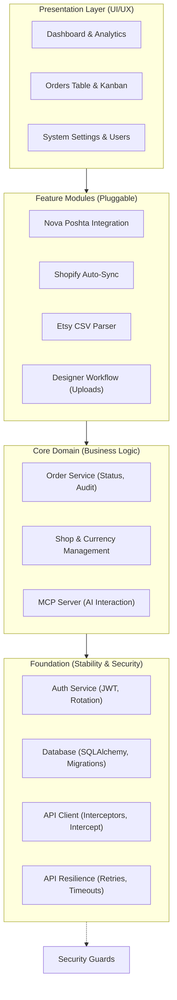

# Implementation Plan - OrderHub CRM

## Sprint History
- Sprint 1 status: `DONE` (Core Architecture)
- Sprint 2 status: `DONE` (Database & Auth)
- Sprint 3 status: `DONE` (Frontend Scaffolding)
- Sprint 4 status: `DONE` (Core Frontend)
- Sprint 5 status: `DONE` (Dashboard & Management)
- Sprint 6 status: `DONE` (Integrations & MCP)
- Sprint 7 status: `DONE` (Stability & Recovery)
- Sprint 8 status: `DONE` (Full Persistence)
- Sprint 9 status: `DONE` (Attachments & Designer Workflow)
- Sprint 10 status: `DONE` (Shop Management & Manual Entry)
- UI Modernization (Block 11) status: `DONE` (Customers, Users, Imports, Dashboard unified)
- Sprint PC-A status: `DONE` (Foundation: Pricing, Cost & Stock — commit `0bf0583`)
- Sprint PC-B status: `DONE` (Product Detail Page — commit `f99494f`)
- Sprint PC-B.1 status: `DONE` (Shopify-style Inline Product Editing — commit `bf9f8ba`)
- Sprint PC-B.2 status: `DONE` (Column Visibility Picker on ProductsPage — commit `46783bf`)
- Sprint 11 status: `NOT STARTED` (Production & Deployment)
- **Active Roadmap (2026-05-08):** Bug-Hunt & Imports — see Unified Backlog → "Active Roadmap" section.

## Architecture Schematic



## Actual Repository Snapshot

Verified against the current tree (See [Audit Report 2026-04-21](docs/audit/REPORT_2026_04_21.md) for details):

**Backend:**
- Fully implemented routers for all modules (Orders, Shops, Dashboard, Imports, Users, Auth, Shipping, MCP).
- Services for Shopify Sync, Nova Poshta, Encryption, and Etsy parsing are active.
- **NEW**: Persistent rotating file logging system implemented (backend/logs/server.log).

**Frontend:**
- **NEW**: Full-page `CreateOrderPage.tsx` replaces restrictive modal dialog.
- **NEW**: Modernized directory pages (`CustomersPage`, `UsersPage`) with deterministic avatars.
- **NEW**: Strategic `DashboardPage` with high-contrast intelligence widgets.
- **NEW**: Extraction-focused `ImportsPage` with step-based sync workflow.

### Component Hierarchy (Frontend)
```
frontend/src/
├── components/
│   ├── layout/
│   │   ├── AppLayout.tsx — modern zinc-950 shell
│   │   └── Topbar.tsx — premium header with user context
│   ├── ui/
│   │   ├── StatusBadge.tsx — multi-color status pill
│   │   ├── EmptyState.tsx — standardized feedback
│   │   └── Toast.tsx — custom notification system
│   └── orders/
│       ├── OrdersLayout.tsx — search, filter, and view orchestration
│       ├── OrdersTable.tsx — redesigned data-dense table
│       ├── PipelineBoard.tsx — updated kanban cards
│       ├── StatusTabs.tsx — grouped status navigation
│       ├── OrderDetailPanel.tsx — modular console
│       └── detail/ — 8 intelligence sub-components
├── utils/
│   ├── avatar.ts — initials & color generation
│   └── shopTheme.ts — deterministic shop branding
├── store/
│   └── authStore.ts — single-purpose auth state
└── api/
    └── ...
```

## Unified Backlog (Pending Tasks & Fixes)

### Active Roadmap — Bug-Hunt & Imports (2026-05-08)

Source-of-truth for current focus. Sprints below are sequenced from most-critical
to least-critical based on the 2026-05-08 planning conversation. Sprints land in
`task.md` one at a time, get reviewed with the planning agent, then executed by
Claude Code. As each closes, its `Status` flips to `DONE` and post-fix notes are
captured here. The "Explicitly deferred" table at the bottom is exhaustive — if
a backlog item isn't in either an active sprint or that table, surface it before
starting work on it.

---

**Round 1 — UX micro-fix**

**Sprint UX-1 — Products page remembers last selected shop** (Status: `DONE` — commit `eb32eb6`)

Goal: When the user navigates to `/products`, default the active shop to the last
one they viewed there. Persist via `localStorage` under
`orderhub:productsPage:lastShopId` (mirrors the `orderhub:productsTable:columnVisibility`
pattern from PC-B.2).

| ID | Task | Scope | Status |
|---|---|---|---|
| UX-1-1 | Read+write `orderhub:productsPage:lastShopId` in `ProductsPage.tsx` | frontend | DONE |
| UX-1-2 | On mount: if stored `shop_id` resolves against `useShops()`, restore as initial selection; else fall back to current default | frontend | DONE |
| UX-1-3 | Archived/deleted shop in localStorage gracefully ignored — no error, no console noise | frontend | DONE |

**Post-fix notes (UX-1):**
- **Design pivot from `useEffect` to `useMemo`.** The original plan called for a
  `useRef` + `useEffect([shops])` pair to apply the stored preference once
  `useShops()` resolved. The repo's ESLint configuration flags `setState`
  inside effect bodies via `react-hooks/set-state-in-effect`, so the
  implementation pivoted to a **`useMemo`-derived `effectiveShopId`**. No
  effect, no extra render cycle — validation happens inline.
- Two-state split: `selectedShopId` (lazy-init from `localStorage`) drives
  the `ShopSelector` dropdown and the write effect. `effectiveShopId`
  (`null` until shops load and the stored UUID resolves) drives **all
  product-related logic** — query, actions, conditional rendering. The
  divergence between the two values is intentional and only observable
  in the transient invalid-UUID case (see follow-up below).
- **Storage key:** `orderhub:productsPage:lastShopId`, single string UUID,
  reusing the `orderhub:` namespace established in PC-B.2.
- **Write effect skips `null` transitions** to preserve the stored shop_id
  when the user returns to a placeholder state. There is no explicit
  "Clear shop" gesture today, so this is a one-way ratchet — once a shop
  is picked, the preference sticks until a different shop is chosen.
- **`useShops()` deduped by React Query** — the new validation hook does
  not add a network call beyond what `ShopSelector` already makes
  internally on mount.

**Verified by smoke test:**
- Switch to KoraKlenu → /dashboard → /products → KoraKlenu still active. ✓
- Hard reload (F5) → KoraKlenu sticks. ✓
- DevTools → `localStorage` → `orderhub:productsPage:lastShopId` =
  `c2bb2b4e-60d1-40eb-b221-4b2eabcd96fd`. ✓
- Manually set the key to `00000000-0000-0000-0000-000000000000` → reload →
  graceful fallback to "No shop selected" placeholder, no console error,
  no toast. ✓
- Recovery: pick KoraKlenu after invalid state → `localStorage` overwrites
  with the correct UUID via the write effect. ✓

**Found during UX-1 smoke test, kept out of scope:**
- **Cosmetic only:** after a reload with an invalid stored UUID, the
  `ShopSelector` dropdown renders **empty** rather than falling back to
  the "Select a manual shop" placeholder. Cause: `selectedShopId` retains
  the stale UUID while `effectiveShopId` is `null` — the two state vars
  diverge in this transient case. Triggers only when `localStorage` is
  manipulated directly (DevTools, browser-extension, manual deletion of
  a shop, etc.); invisible in normal usage. Possible follow-up: clear
  `selectedShopId` to `null` when the validation in `useMemo` fails. Not
  filed as a bug; revisit only if a user actually hits this path.
- **Test 5 from the original verification list (multi-shop persistence)
  was not exercised** — current seed data has exactly one MANUAL shop
  (KoraKlenu). The fix logic is shop-agnostic, so it should hold for
  additional manual shops once they exist. Re-test when a second one
  appears (or after IMP-1/IMP-2 when imports start landing real data).

---

**Round 2 — Imports auto-populate catalog**

**Sprint IMP-1 — Etsy CSV importer auto-creates Products** (Status: `DONE` — commit `2d4b2f1`)

Goal: During Etsy CSV import, also INSERT into `products` and `product_variants`
for SKUs not already in catalog. Pull every catalog-relevant field the CSV
offers; the user adjusts visibility / cost / dimensions later in the catalog
UI. **Skip-on-existing** by `(shop_id, sku)` — full skip, no field updates
(preserves local edits). Empty SKU is generated as `etsy-{listing_id}` for the
first blank variant, `etsy-{listing_id}-{n}` for subsequent. `external_ref =
listing_id` on Product. **No retroactive linking** of existing `order_items` to
newly-created variants (parked).

| ID | Task | Scope | Status |
|---|---|---|---|
| IMP-1-1 | Extend `services/etsy_parser.py` `parse_etsy_csv` to emit Product/Variant inserts alongside Order/OrderItem inserts | backend | DONE |
| IMP-1-2 | Skip-on-existing-SKU logic keyed by `(shop_id, sku)` — full skip, no field updates | backend | DONE |
| IMP-1-3 | Empty-SKU fallback: generate `etsy-{listing_id}[-{n}]` | backend | DONE |
| IMP-1-4 | Set `external_ref = listing_id` on Product; Variant `external_ref` left null (CSV carries no per-variation external id) | backend | DONE |
| IMP-1-5 | `ImportResult` extended with `products_created` and `variants_created` counters (default 0 — backwards-compatible with non-Etsy imports) | backend | DONE |
| IMP-1-6 | Tests: 15 new vitest cases covering skip-on-existing, empty-SKU fallback, lazy Product insert, in-import idempotency, blank Listing ID skip, FK linking, etc. | backend tests | DONE |

**Post-sprint notes:**
- **Plan deviation: no preview step exists for Etsy CSV.** The original
  `task.md` framed the change as "extend the existing two-step CSV
  preview/confirm flow" — that two-step flow is for **bulk product CSV
  import** (different code path). Etsy CSV for **orders** is
  single-step (`POST /api/imports/etsy` parses + commits in one request).
  Adopted: extend `ImportResult` with two counters; the response surfaces
  the catalog-side numbers without needing a new preview UI. Frontend
  toast surface deferred — backend correctness verified via DevTools
  Network response and direct API calls.
- **Mapping rule (Q1 from planning):** `Product = unique Listing ID per
  shop` (identity = `(shop_id, external_ref=listing_id)`). `Variant =
  unique (Listing ID, effective_sku) within that listing` where
  `effective_sku = csv.SKU` if non-blank, otherwise the generated
  fallback. `Variations` text does **not** participate in identity — it
  is informational only and goes into `ProductVariant.variant_name`
  verbatim, truncated to 255. Two CSV rows of the same listing with
  matching SKU but different Variations collapse to one variant; first
  writer wins on `variant_name`. **This rule has a known gap on
  blank-SKU rows — see BUG-5 below.**
- **Hook placement (Q3):** inline single-pass. New helper
  `_ensure_catalog_row(db, shop, row, catalog_cache)` runs before each
  `db.add(OrderItem)` in `parse_etsy_csv`. Per-import in-memory cache
  `dict[listing_id, dict]` survives across rows of one CSV (avoids
  duplicate Product inserts within a single import).
- **Backend gate option (Q6):** Option (B) — kept
  `require_platform(MANUAL)` on the LIST endpoint as well as POST +
  bulk-CSV. Catalog rows landed in DB but were unreachable through any
  UI; resolved separately by **CAT-VIS-1** (see Bug Fixes 2026-05-08).
- **Lazy Product insert (Q7):** Product row is appended to the session
  only after **at least one variant** clears the
  `is_sku_taken(shop_id, effective_sku)` check. A listing whose every
  variant SKU collides with existing shop-wide SKUs leaves zero new
  rows behind — no orphan Products.
- **Optional Q5 — FK link to OrderItem accepted.** Freshly-inserted
  `OrderItem` rows now set `product_variant_id` to the just-created
  variant's id, so the "Unlinked" badge is gone for new imports
  going forward. Snapshot fields (`snapshot_weight_g`, etc.) left
  `None` to avoid polluting parcel calculation with the IMP-1 zero
  sentinel; user backfills physical dimensions later, then existing
  service flows refresh snapshots.
- **Pydantic schema gotcha caught at planning time:** the existing
  `CatalogService.create_product()` is unusable from the importer
  because `ProductVariantCreate` enforces `gt=0` on the four physical
  dimension fields, conflicting with the IMP-1 sentinel-`0` rule. The
  importer instantiates `Product` and `ProductVariant` ORM models
  directly with `db.add(...)` and a single `db.flush()` to get
  `product_id` before inserting variants. (This same `gt=0` constraint
  caused **BUG-6** when CAT-VIS-1 later opened the Read path —
  resolved by splitting the validators Create-only.)
- Smoke verified: a real Etsy CSV imported to LeatherCraft UA produced
  7 unique Products (one per Listing ID), 11 Variants (incl. 5
  spurious for listing 4343151753 — see BUG-5), FK link working on
  every freshly-imported `OrderItem` ("Personalized Bat ID Card
  Holder" order shows no "Unlinked" badge after import).

---

**Sprint BUG-5 — Blank-SKU dedup by Variations** (Status: `DONE` — commit `28440f7`)

Goal: Surfaced during IMP-1 smoke test against a real Etsy CSV. The original
`_compute_effective_sku` helper incremented a per-listing positional counter on
**every** blank-SKU row, regardless of whether that row represented a logically
distinct variant. Real-world Etsy data has many rows with the same listing +
same blank SKU + same Variations (just different buyers); listing 4343151753
in LeatherCraft UA produced **5 catalog variants** where only **2 distinct
Variations** existed in the source CSV.

Fix: content-keyed SKU generation. New `_normalize_variations(raw)` helper
strips all whitespace and lowercases the Variations text; the result is
md5-hashed, truncated to 8 hex chars, and appended as
`etsy-{listing_id}-{hash}`. Empty Variations → `etsy-{listing_id}` (no suffix).
Same Variations → same generated SKU → `is_sku_taken` short-circuits on
re-import; variant_name preserves the **original untouched** Variations text
(first-writer-wins).

**Post-sprint notes:**
- **Plan deviation accepted: strip-all-whitespace, not collapse-to-single-space.**
  The original task.md spec said "collapse internal runs of whitespace into
  single spaces", but CC noticed that didn't satisfy the verification test
  demanding `"Color:Red, Pakning:Single"` and `"Color:Red,Pakning:Single"`
  (one space after comma vs none) collapse to the same SKU. Switched to
  `re.sub(r"\s+", "", raw.strip()).lower()` — strip all whitespace before
  hashing. Trade-off: word boundaries inside a single value (e.g. `"Bat ID"`
  → `"BatID"` for hashing only) lose meaning. **`variant_name` preserves
  the human form** so the catalog UI is unaffected. False-positive risk
  (two truly distinct variations differing only by whitespace) is
  vanishingly rare in real Etsy data — sellers don't author variants like
  `"Sky Blue"` vs `"SkyBlue"`. Acceptable trade-off; documented here so
  future readers don't think it's a bug.
- **Hash collision is impossible by construction within a shop**: full SKU
  always includes the `listing_id` prefix. Even if two distinct listings
  happen to share Variations text and therefore share an 8-char suffix
  (observed: `Color:Black` → `4da64648` for listings 4346731923, 4349699409,
  4359285143 in this test data), the full SKUs `etsy-4346731923-4da64648`
  / `etsy-4349699409-4da64648` / `etsy-4359285143-4da64648` are pairwise
  unique. `is_sku_taken` checks the full string — no collision.
- **`cache["skus_in_listing"]` removed.** Helper signature changed from
  `_compute_effective_sku(listing_id, raw_sku, used_in_listing: Set[str])`
  to `_compute_effective_sku(listing_id, raw_sku, variations)`. The set
  is no longer needed because generation is content-deterministic.
  In-import idempotency is still covered by the existing
  `cache["variants_by_sku"]` map (same SKU appearing twice in a single
  import returns the cached variant).
- 7 new pytest cases covering BUG-5 regression + new edge cases (empty,
  whitespace-only, case differences, distinct variations, mixed
  empty/non-empty within a listing); 2 obsolete tests
  (`subsequent_blanks_get_numeric_suffix`,
  `skips_already_taken_numeric_suffixes`) removed; 4 existing tests
  updated for the new helper signature. Total: **19/19 catalog tests +
  43/43 backend suite green**.
- **Smoke test confirmed (wipe + reimport ritual):**
  - LeatherCraft UA wiped: 24 orders + 7 products deleted via
    SQL `DELETE` (FK cascade on `orders.id` and `products.id` did the rest
    — order_items, status_history, attachments, product_variants all
    cleaned in two `DELETE` statements).
  - Same Etsy CSV re-imported via `/imports`. Listing 4343151753
    produced **2 variants** (collapse 5 → 2 confirmed). Total
    LeatherCraft UA dropped from 11 → **8 variants** (7 products × correct
    variant counts).
  - SKUs of the auto-imported variants: `etsy-4343151753-dbaa9d00`
    (`Color:Red,Pakning:Bat ID with Gift Box`) and
    `etsy-4343151753-ab0def3e` (`Color:Red,Pakning:Single Bat ID`).
  - `variant_name` on each preserves the **first-writer-wins original**
    Variations text — untouched case, untouched whitespace, untouched
    punctuation.
  - **Idempotency check**: same CSV re-uploaded a second time →
    response shows `products_created=0, variants_created=0`; catalog
    unchanged. Hash-deterministic generation working as designed.

---

**Sprint IMP-2 — Shopify sync auto-creates Products + line items** (Status: `DONE` — commit `afbfd6c`)

Goal: Initially scoped as "mirror IMP-1 for Shopify" — but the existing Shopify
sync turned out **not** to ingest line items at all (the GraphQL query never
fetched `lineItems`, so OrderHub-side `OrderItem` rows were empty for every
synced order). IMP-2 therefore became three coupled changes in one sprint:
extend the GraphQL query to pull line items, map them into `OrderItemCreate`
payloads, and add catalog auto-create with the same skip-on-existing semantics
as IMP-1. Skip-if-exists by `(shop_id, sku)`; Shopify `variant.id` numeric
tail → `Variant.external_ref`; empty SKU →
`shopify-{shopify_product_id}-{shopify_variant_id}`.

| ID | Task | Scope | Status |
|---|---|---|---|
| IMP-2-1 | Extract IMP-1's catalog ensure logic to a shared helper `services/catalog_import.py` (`ensure_catalog_row` + `_weight_to_grams`) | backend | DONE |
| IMP-2-2 | Etsy parser refactor: `_ensure_catalog_row` becomes a thin wrapper that resolves the BUG-5 effective SKU then delegates to the shared helper | backend | DONE |
| IMP-2-3 | Extend Shopify `ORDERS_QUERY` to fetch `lineItems(first: 50)` with `variant { id, sku, title, product { id title }, inventoryItem.measurement.weight { value, unit } }` | backend | DONE |
| IMP-2-4 | Rewrite `sync_shop_orders`: build `OrderItemCreate` per line item, call `ensure_catalog_row` per item, explicit `db.flush()` before `create_order`, return `ImportResult` (counters + errors), per-order error isolation | backend | DONE |
| IMP-2-5 | Router `POST /shops/{id}/sync` response shape: merge `synced_count` (back-compat) with full `ImportResult` payload | backend | DONE |
| IMP-2-6 | 28 new pytest cases (`test_shopify_sync_catalog.py`): GID parsing, weight-unit conversion (parametrized G/KG/OZ/LB), fresh sync, re-sync (zero), blank-SKU fallback, blocked-SKU lazy insert, in-sync dedup, flush ordering, null variant/product, "Default Title" sentinel, error isolation, router response | backend tests | DONE |

**Post-sprint notes:**
- **Q1 — Catalog helper extracted.** New `backend/services/catalog_import.py`
  hosts `ensure_catalog_row(...)` with a platform-agnostic signature
  (already-resolved SKU + product / variant fields + cache + counters).
  Etsy parser keeps `_compute_effective_sku` (BUG-5 hash logic) locally and
  delegates the rest. Confirmed second-consumer pattern: the abstraction
  earns its keep when there are two real callers, not one. **Helper does
  no `db.flush()`** — caller controls the unit-of-work boundary. **Cache
  key is `external_product_id` only** — each invocation is per-shop scope,
  so collision is impossible within a call (documented in helper's
  docstring).
- **Q2 — Real weight pulled from Shopify.** New `_weight_to_grams(weight)`
  helper accepts the raw `{value, unit}` GraphQL subobject and converts to
  grams: GRAMS×1, KILOGRAMS×1000, OUNCES×28.3495, POUNDS×453.592, rounded
  to int. Falls back to `0` when the field is null/missing or unit is
  unknown. Length / width / height stay `0` because Shopify doesn't
  expose those via the standard Admin API query.
- **Q3 — `ImportResult` reused, not duplicated.** The schema already had
  the right shape (`imported, skipped, errors, products_created,
  variants_created`) after IMP-1 extended it; reuse avoids a parallel
  `SyncResult` schema with the same semantics. `errors` for Shopify
  carries per-order failures (catch-and-continue) instead of CSV's
  per-row, but the structural meaning is the same. Router preserves
  back-compat by returning
  `{"status": "success", "synced_count": result.imported, **result.model_dump()}` —
  any frontend consumer of `synced_count` still works, new counters are
  present.
- **Critical implementation insight: explicit `await db.flush()` before
  `create_order`.** `_apply_variant_snapshot` (`order_service.py:158-163`)
  runs `select(ProductVariant).join(Product)` to fetch the variant before
  copying its weight/dims/title onto the OrderItem. SQLAlchemy's default
  autoflush *would* surface our pending `db.add(...)` catalog inserts —
  but relying on autoflush is fragile. CC added an explicit flush after
  the catalog loop, before `create_order`, so the unit-of-work boundary
  is defensive and obvious. Without it,
  `_apply_variant_snapshot` raises `HTTPException(400, "Product variant
  not found...")` and aborts the order. Caught by **test #7
  (`test_snapshot_fields_copied`)** which would have failed otherwise.
- **"Default Title" sentinel.** Shopify products without variations get a
  single variant with `title = "Default Title"`. Mapping that verbatim to
  `variant_name` would make the catalog UI noisy. The sync stores
  `variant_name = None` when the variant title is `"Default Title"` or
  empty.
- **Per-order error isolation.** A single bad order (e.g. malformed line
  item, missing variant data) is caught, logged via `logger.exception`,
  and appended to `errors`. The sync continues on the remaining orders.
  Test #15 covers this.
- **Live-Shopify E2E smoke (post-commit):** the user pointed
  `MyShopify Store` (renamed to **Lamamarka Shopify**) at a real
  Shopify dev store URL `08f330-ef.myshopify.com` and pasted a real
  Admin API token. `POST /shops/{id}/sync` returned 200 with
  `imported=50, skipped=0, products_created=11, variants_created=14,
  errors=[]`. Verified through the API and the browser:
  - **Line items pulled.** Each synced order has the right number of
    `OrderItem` rows (e.g. order `7148183421084` → 1 item: "Heavy
    Mushroom Keychain", qty 1, unit_price $14.99).
  - **Real weights from Shopify.** All 14 variants got non-zero
    `weight_g` (distribution: 100g × 10, 200g × 2, 300g × 2). Q2 unit
    conversion verified end-to-end against real `inventoryItem.measurement.weight`
    payloads.
  - **FK link populated.** `OrderItem.product_variant_id` set on
    every imported item; the catalog detail page shows no "Unlinked"
    badge.
  - **Snapshot fields copied.** `OrderItem.snapshot_weight_g`,
    `snapshot_title` populated correctly via `_apply_variant_snapshot`
    — the explicit `db.flush()` ordering is observably correct in
    production data.
  - **Lazy Product insert + dedup verified.** "Heavy Mushroom
    Keychain" appears in multiple orders → 1 Product, 1 Variant in
    catalog, all order items FK-linked to the same row.
  - **All variants got fallback SKUs** (`shopify-{product_id}-{variant_id}`).
    Lamamarka's Shopify variants have no SKU values assigned —
    legitimate for a small handmade catalog. Real-SKU code path
    works (covered by tests #3, #6) but had no real data to exercise
    on this shop.
  - **Idempotency verified.** Second sync on the same data:
    `imported=0, skipped=50, products_created=0, variants_created=0,
    errors=[]`. Hash + `(shop_id, sku)` shop-wide dedup short-circuits
    every path.
- **Cosmetic notes from the live smoke (not filed as bugs):**
  - **"Unknown Shopify Customer".** Shopify returned `null` for
    `customer.firstName/lastName` on every imported order — likely
    a missing app permission scope (`read_customers`) on the dev
    store's private app. The sync handles this gracefully via the
    existing `or "Unknown Shopify Customer"` fallback at
    `shopify_sync.py:157`. If the user wants real customer names,
    grant the missing scope on the Shopify side; no OrderHub code
    change required.
  - **Order title = Shopify `name` (`91890_1580`)** rather than the
    line-item title. The original sync code (pre-IMP-2) used
    `node.get("name")` for the order title and IMP-2 preserved that
    behaviour; the Etsy parser uses the first item title instead.
    Different by design — flag if the operator finds it confusing,
    but not in scope for IMP-2.
- **Known limitations** (called out, not blocking):
  - `lineItems(first: 50)` cap per order — orders with >50 line items
    will silently truncate. Realistic Etsy/Shopify orders are 1–5 items,
    so this is purely defensive. Add Shopify-side pagination as a
    follow-up if it ever surfaces.
  - GraphQL query cost increased ~500–800 points (within Shopify's
    1000-point default budget). Watch production logs if cost warnings
    appear; throttle `first: 50` orders if needed.

---

**Sprint BUG-8 — Shopify order title from first line item, not order code** (Status: `DONE` — commit `c91e321`)

Goal: Surfaced during IMP-2 live smoke against the real Lamamarka Shopify
store. The orders list PRODUCT column showed Shopify's order code (e.g.
`91890_1580`) instead of the line-item product title — Etsy-imported orders
already showed real product names because `etsy_parser.py:146-147` overrides
the synthetic placeholder with the first item's title. Shopify sync at
`shopify_sync.py:282` set `title = node.get("name") or f"Order #{external_id}"`
and never overrode, so the Shopify `order.name` (sequence code) leaked into
the OrderHub `Order.title` field.

Fix: single-expression change. When IMP-2 finishes building `items_payload`
inside the per-order try-block, prefer the first item's title; fall back to
`node.name` only when zero line items are present.

| ID | Task | Scope | Status |
|---|---|---|---|
| BUG-8-1 | Replace `title=node.get("name") or f"Order #{external_id}"` at `shopify_sync.py:282` with conditional that prefers `items_payload[0].title` when non-empty | backend | DONE |
| BUG-8-2 | 3 new pytest cases in `test_shopify_sync_catalog.py`: single-item regression, multi-item first-wins, empty-line-items fallback | backend tests | DONE |

**Post-sprint notes:**
- Final expression:
  ```python
  title=(items_payload[0].title if items_payload
         else node.get("name") or f"Order #{external_id}"),
  ```
  `items_payload` is built ~24 lines above the call site in the same try
  block, so it's already populated when `OrderCreate(...)` is constructed.
- **`"Unknown Item"` fallback inherited.** `OrderItemCreate.title` is set
  from `li.get("title") or "Unknown Item"` at line 259 — so a malformed
  Shopify line item with empty title becomes `"Unknown Item"` in the
  OrderItem AND propagates that same value to `Order.title`. No extra
  defensive code needed at the title site; the safety net is upstream.
- **Q3 verified concretely.** CC ran
  `grep -n "order\.title\|\.title ==" backend/tests/test_shopify_sync_catalog.py`
  in plan mode and found one match at line 451
  (`assert items[0].title == "Custom Engraving"`) which is a line-item
  assertion, not `order.title`. **Zero existing tests needed
  rewriting.** The 28 IMP-2 tests + 71-test suite stay green.
- 3 new tests added; total backend suite **74/74 green**.
- **Smoke verified end-to-end (post wipe+resync):**
  - Lamamarka Shopify wiped (50 orders + 11 products via two `DELETE`
    statements, FK CASCADE handled the rest).
  - Same Shopify sync re-triggered → identical counts (50 orders, 11
    products, 14 variants — sync is deterministic).
  - All 50 order titles in DB now match line-item product names
    (verified via API); **0 orders carry the `91890_*` code format**
    that was characteristic of the bug.
  - Browser smoke: `/orders` filtered by Lamamarka Shopify → PRODUCT
    column shows real names ("Heavy Mushroom Keychain",
    "Heavy-Duty Belt Carabiner", "Heavy-Duty Carabiner with Two",
    "Belt with Face", "Compact Commander Carabiner", …). Order detail
    page top title also reflects the line item.

---

---

**Sprint BUG-9 — Scheduler regression: consume `ImportResult` from `sync_shop_orders`** (Status: `DONE` — commit `de1112b`)

Goal: Latent regression discovered during NP-DISC code audit. IMP-2 (commit
`afbfd6c`) changed `sync_shop_orders` return type from `int` to
`ImportResult`, but `backend/scheduler.py:42-44` still did `if count > 0`
on the return value. `ImportResult > 0` raises `TypeError`; the
scheduler's `try / except Exception` block silently caught it and rolled
back. **Result:** every periodic 15-minute Shopify sync had been a silent
no-op since IMP-2 landed. Manual sync via the UI was unaffected (different
code path through `routers/shops.py`).

| ID | Task | Scope | Status |
|---|---|---|---|
| BUG-9-1 | `scheduler.py:42-49` — replace `count > 0` with `result.imported > 0`, conditional `(+N product[s], +N variant[s])` suffix on the success log when catalog counters non-zero, separate WARNING when `result.errors` non-empty | backend | DONE |
| BUG-9-2 | New `tests/test_scheduler.py` — 3 cases: success+catalog suffix, partial-success warning, silent-on-zero | backend tests | DONE |

**Post-sprint notes:**
- **Q1 — Idle silence preserved.** Periodic ticks against shops with
  zero new Shopify orders log nothing. Rationale: 96 lines/shop/day
  of "0 new orders" noise was rejected. The absence of a "Failed to
  sync …" line is the signal that the tick succeeded.
- **Q2 — Conditional catalog suffix on the success log.** Format:
  `Synced 3 orders for shop X` when only orders touched;
  `Synced 3 orders for shop X (+1 product, +2 variants)` when
  catalog also grew. Pluralization handled (`product` vs `products`,
  `variant` vs `variants`). Symmetric for variants-only or
  products-only edge cases.
- **Q3 — Per-shop WARNING when `result.errors` is non-empty.** IMP-2
  added per-order error isolation inside `sync_shop_orders` —
  malformed line items are caught and appended to `result.errors`
  rather than aborting the batch. The scheduler now surfaces the
  count of those per-order failures as a `WARNING` per shop, so
  ops watching `server.log` actually see partial failures instead
  of them being invisible. The catastrophic `try / except` outside
  the loop still catches network / GraphQL / DB-level failures and
  rolls back the per-shop transaction.
- **Net behavioural improvement** (caught by Opus during planning):
  before the fix, every periodic tick logged a `Failed to sync
  shop X: '>' not supported between instances of 'ImportResult'
  and 'int'` line per Shopify shop. After the fix, idle shops
  produce **zero** lines per tick — a strict reduction in log
  noise compared to even the original int-returning version
  (which at least worked but logged `Synced 0 orders` … wait, no,
  the original also gated on `count > 0`, so silent. So we're at
  parity with pre-IMP-2 behaviour.)
- **`db.commit()` boundary unchanged.** Inside the `try` block,
  unconditional commit on success path; rollback only inside the
  `except`. Per-order failures from `result.errors` are intentionally
  **not** rollback triggers — `sync_shop_orders` already isolated
  them, partial progress is real progress.
- **No new imports needed.** `ImportResult` is duck-typed via
  attribute access; the scheduler doesn't import the schema class
  itself.
- 3 new pytest cases added; total backend suite **77/77 green**.
- **Smoke test:** restart backend → wait one 15-minute scheduler tick
  → tail `backend/logs/server.log` → confirm no `'>' not supported
  between instances of 'ImportResult' and 'int'` errors. (Verified
  passively by the human reviewer; unit tests already cover all three
  behaviour paths so this is a sanity sweep, not a primary gate.)

---

**Round 3 — Nova Poshta initiative (separate cadence, no CC)**

**Sprint NP-DISC — Research, audit, and sandbox confirmation** (Status: `DONE` — deliverable `docs/integrations/nova-poshta-audit-2026-05.md`)

Goal: Produce `docs/integrations/nova-poshta-audit-2026-05.md`. **No code changes** —
discovery only. The planning agent drives the research and writes the doc;
the user observes and approves the deliverable. Claude Code is **not** involved
at this stage.

The doc will contain:
1. Competitive research — how 2-3 other CRM systems handle NP integration
   (TTN creation, label printing, tracking, sender warehouse handling).
2. Feature-by-feature audit of current OrderHub NP code
   (`backend/services/nova_poshta_service.py`, `backend/routers/shipping.py`,
   frontend NP forms) against the typical CRM feature set from #1.
3. Confirmation of NP sandbox/test API existence + auth requirements.
4. Prioritized fix list to drive subsequent NP-FIX-* sprints.

Triggering context: a previous live test produced an unintended courier
dispatch because no sender warehouse was selected on the TTN form. Rather
than add a defensive validation immediately, the user wants to research the
broader integration first, surface every related issue at once, and then
test fixes against the sandbox API instead of risking live calls.

| ID | Task | Scope | Status |
|---|---|---|---|
| NP-DISC-1 | Code audit OrderHub vs typical NP feature set | docs | DONE |
| NP-DISC-2 | NP sandbox/test API verification (existence, entrypoint, auth) | docs + small spike | DONE |
| NP-DISC-3 | Competitive research: 2-3 CRM systems' approach to NP | docs | DONE |
| NP-DISC-4 | Deliverable: `docs/integrations/nova-poshta-audit-2026-05.md` with findings + prioritized fix list | docs | DONE |

**Post-sprint notes:**
- **Deliverable:** `docs/integrations/nova-poshta-audit-2026-05.md` — full
  audit doc with 19-row feature inventory, root-cause analysis of the
  courier-dispatch incident, competitive reference against KeyCRM /
  Eltrino / OpenCart NP plugins, and a prioritized fix list (NP-FIX-1
  through NP-FIX-8 with S/M/L sizing).
- **Key audit findings:**
  - **Root cause of incident** is a single missing backend validation
    in `routers/shipping.py:213-234`. `SenderAddress` is passed
    verbatim from `shop.np_sender_warehouse_ref`; if that column is
    `NULL`, NP silently downgrades the request to courier pickup.
    Fix scope is one file, one validation block — that's NP-FIX-1.
  - **Zero NP-related backend tests today.** Regardless of any other
    fix, basic pytest coverage is a hard prerequisite — that's
    NP-FIX-2.
  - **No formal sandbox available for UA clients.** The new v1.0
    Stage environment at `api-stage.novapost.pl/v.1.0/` explicitly
    rejects UA phone numbers per the `/test-api-keys` contract.
    Workaround: dev shop on a personal NP account (separate from
    Lamamarka legal entity), captured in NP-FIX-3 as a manual
    operator checklist.
  - **OrderHub uses NP API v2.0**; v1.0 with JWT, webhooks, pickups
    exists but migration is deferred (NP-FIX-8) — current v2.0 covers
    operator pain on its own.
- **5 open questions answered and locked in §7 of the audit doc:**
  Q1 → dev shop on personal NP account, set up after NP-FIX-2 + 1
  land. Q2 → strict sender-warehouse validation, no `?force=true`
  override. Q3 → per-shop default Service Type (new
  `Shop.np_default_service_type` column). Q4 → hybrid tracking poll:
  4-hour batch + manual refresh button. Q5 → stay on v2.0; revisit
  v1.0 only on external trigger.
- **Latent regression caught during the audit:** while reading
  `scheduler.py` to confirm NP-FIX-5 could plug into the existing
  APScheduler infrastructure, surfaced **BUG-9** —
  `sync_shop_orders` return type changed by IMP-2 but the scheduler
  was still doing `count > 0` on a Pydantic model. Filed and fixed
  before NP-FIX-* work began (commit `de1112b`). See BUG-9 entry
  above.
- **Updated 2026-05-09:** §7 fixes applied to the audit doc after
  cross-referencing the live code:
  - §2.4 — softened the `ttn_printed` claim to "no automatic flow
    sets it; technically writable via generic `PATCH /orders/{id}`"
    (the field is exposed in schemas / frontend types, just not
    surfaced through any deliberate UI).
  - §3 feature inventory — corrected "Sender warehouse selection
    in shop settings" from **Partial** to **Done** (the Logistics
    (NP) tab in `pages/ShopsPage.tsx:407` does expose the
    field — the gap is at TTN-create time, not at shop-edit time).
  - §8 NP-FIX-5 description — removed the "verify scheduler exists"
    hedge after confirming `backend/scheduler.py` already runs
    `AsyncIOScheduler` periodically.

**Sprint NP-FIX-*** — defined and locked in `docs/integrations/nova-poshta-audit-2026-05.md`
§6 + §8. Execution order: NP-FIX-2 → NP-FIX-1 → (user does NP-FIX-3 dev
shop setup manually, ~20 min) → NP-FIX-4 → NP-FIX-5 → NP-FIX-6 →
NP-FIX-7. NP-FIX-8 (v1.0 migration) deferred. Each follows the standard
cycle (`task.md` → CC plan review → execute → smoke test → post-fix
notes).

---

**Sprint NP-FIX-2 — Baseline pytest coverage for NP service + router** (Status: `DONE` — commit `898fa20`)

Goal: Per the NP-DISC audit, the entire Nova Poshta integration shipped
with **zero backend tests**. NP-FIX-1 (sender-warehouse validation) and
NP-FIX-4 onwards (real-API smoke tests on the dev shop) needed a
regression net first. This sprint added that net: 20 new pytest cases
across two new files, with **zero changes to production code**.

| ID | Task | Scope | Status |
|---|---|---|---|
| NP-FIX-2-1 | New `backend/tests/test_nova_poshta.py` — 8 service tests for `NovaPoshtaClient` + `_post` (retry contract, `success: false` → `NovaPoshtaAPIError` translation, wrapper-method call shape) | backend tests | DONE |
| NP-FIX-2-2 | New `backend/tests/test_shipping_router.py` — 12 router tests across all 4 endpoints: validation branches (404/400 paths) + happy paths for TTN create + TTN delete | backend tests | DONE |

**Post-sprint notes:**
- **Q1 — Tenacity wait disabled cleanly via monkeypatch.** Test #4 in
  `test_nova_poshta.py` proves `httpx.HTTPError` triggers exactly 3
  retries while `NovaPoshtaAPIError` triggers exactly 1 attempt
  (no retry, the NP-P0 invariant). Implementation:
  `monkeypatch.setattr(NovaPoshtaClient._post.retry, "wait", wait_none())`.
  `.retry.wait` is a public tenacity attribute on the `Retrying`
  instance the decorator attaches to the function — mutating it is the
  supported runtime-override pattern, and `monkeypatch` auto-restores
  it after the test. Retry test runs in <100ms (vs. ~6s wall-clock if
  we'd accepted the real exponential backoff). If a future tenacity
  upgrade breaks `.retry.wait`, the fallback `c` from the spec — a
  6-second test — still proves the right thing.
- **Q3 — Direct-coroutine test style locked.** CC grepped
  `backend/tests/` and found that all 7 pre-existing test files call
  endpoint or service functions directly (no `TestClient`, no
  `httpx.AsyncClient` against the FastAPI app). NP-FIX-2 mirrors this
  precedent — `await create_np_ttn(order_id=..., body=...,
  current_user=mock_user, db=mock_db)`, `pytest.raises(HTTPException)
  as exc_info; assert exc_info.value.status_code == 400`. No
  `app.dependency_overrides`, no client fixture, no auth-bypass
  plumbing. Tighter and more consistent with the rest of the suite.
- **Q4 — `routers.shipping.get_order_detail` patched at the
  module-level binding.** Patching `services.order_service.get_order_detail`
  would not take effect because `routers/shipping.py:20` does
  `from services.order_service import get_order_detail` (binds at
  import time). All TTN-related tests use
  `@patch("routers.shipping.get_order_detail", AsyncMock(...))` and
  similarly for `change_order_status`, `decrypt_value`, and
  `NovaPoshtaClient`.
- **Mock helper pattern.** `_mock_async_client(json_payload, *, raises=None)`
  in `test_nova_poshta.py` returns a singleton mock honouring the
  `async with httpx.AsyncClient() as client: await client.post(...)`
  contract — `__aenter__`/`__aexit__` set up correctly so the
  service code's `async with` block yields the same `client_instance`
  on every retry. `client_instance.post.side_effect = [err, err,
  success_response]` consumes one item per retry attempt across all
  three `_post` invocations.
- **Sanity grep clean** (per task.md verification): zero
  `api.novaposhta.ua` references in `backend/tests/`; every
  `NovaPoshtaClient` / `decrypt_value` reference in
  `test_shipping_router.py` sits inside a `patch(...)` context.
- **Test count:** 77 → **97 passing** (+20 new). Suite runtime stayed
  at 1.97s — well within the +5-10s budget the task.md set as
  acceptable.
- **No production behaviour change.** This sprint is pure additive
  test coverage; the existing 77 tests stay green untouched, and
  no code under `backend/services/` or `backend/routers/` was
  modified. The next NP-FIX sprint (NP-FIX-1, sender-warehouse
  validation) lands behavioural changes that this baseline now
  protects.

---

**Sprint NP-FIX-1 — Sender-warehouse validation + passive warning banner** (Status: `DONE` — commit `193f74a`)

Goal: Close the courier-dispatch incident documented in
`docs/integrations/nova-poshta-audit-2026-05.md` §4. A TTN was created
against a shop with `np_sender_warehouse_ref = NULL`; the backend
forwarded the missing field to NP's `InternetDocument.save`, NP silently
downgraded the request to courier pickup, and a courier showed up at
the customer's address. NP-FIX-1 added strict backend rejection before
any NP API call, plus a passive amber banner on the order Logistics
panel so the operator sees the misconfig ahead of click-time, not at
click-time.

| ID | Task | Scope | Status |
|---|---|---|---|
| NP-FIX-1-1 | Backend pre-flight check in `routers/shipping.py:create_np_ttn` — `HTTPException(400)` when `shop.np_sender_city_ref` or `shop.np_sender_warehouse_ref` is null/empty | backend | DONE |
| NP-FIX-1-2 | Add `is_np_ready: bool` to `ShopResponse` schema (combined flag = `has_np_token AND np_sender_city_ref AND np_sender_warehouse_ref`) and populate it at every `ShopResponse` build site in `routers/shops.py` | backend | DONE |
| NP-FIX-1-3 | Frontend amber banner in `DetailLogistics.tsx`, rendered when `orderShop.has_np_token && !orderShop.is_np_ready`, placed inside the pre-TTN block (hidden after a TTN exists) | frontend | DONE |
| NP-FIX-1-4 | Extend `frontend/src/types/shop.ts` `ShopListItem` with `is_np_ready: boolean` | frontend | DONE |
| NP-FIX-1-5 | 2 new pytest cases in `tests/test_shipping_router.py` covering city-ref-missing and warehouse-ref-missing branches (the happy-path regression test was already added in NP-FIX-2) | backend tests | DONE |

**Post-sprint notes:**
- **Q1 → combined `is_np_ready`.** The two granular fields
  (`np_sender_city_ref`, `np_sender_warehouse_ref`) move together in
  practice — the shop-edit form sets them in the same dialog tab — and
  the combined flag answers "is this shop ready to ship via NP?" 1:1.
  Implementation at `schemas/shop.py:73` (`is_np_ready: bool = False`)
  with population at the three `ShopResponse`-building sites in
  `routers/shops.py` (list, get-by-id, create/update). Frontend banner
  trivially renders on `has_np_token && !is_np_ready`.
- **Q2 → banner above Create TTN, hidden when TTN exists.** Lifecycle
  match: the misconfig only matters pre-TTN. Once a TTN exists the
  shop was either configured correctly or the bad TTN already shipped.
  Banner JSX lives inside the pre-TTN render block (`!isEditing &&
  !order.ttn_number && order.shipping_country === 'UA' &&
  canManageShipping`); no separate banner component, inline
  amber-on-zinc styling matches the existing two warnings in this
  panel (parcel-partial / no-packaging).
- **Q3 → toast surfaces backend `detail` verbatim.** No special-case
  mapping for the sender-warehouse error. The same red-error toast
  path that today surfaces every other NP-related 400 carries this
  string too. Operator sees the actionable copy
  *"Shop's Nova Poshta sender warehouse is not configured. Set it in
  Shops → Logistics (NP)."* with no extra wiring.
- **CC deviation: `frontend/src/types/shop.ts` instead of `common.ts`.**
  task.md called for `types/common.ts`, but CC discovered `Shop` type
  already lived in `types/shop.ts` (along with `ShopListItem`,
  `ShopCreate`, `ShopUpdate`) and added `is_np_ready` there to keep
  Shop-related fields colocated. Same shape, more accurate file. No
  consumer side-effects.
- **Order of checks (locked in task.md spec).** Validation block lives
  at `shipping.py:127-132`, **after** the existing recipient-field
  checks (lines 117-125) and **before** any NP API call. Operator
  can't be surprised by "configure sender warehouse" before they've
  noticed they don't even have an NP key — the existing
  `np_api_key_encrypted` check at line 109 still fires first.
- **No `?force=true` override.** Per audit-doc §7 Q2 — strict-only.
  An operator who clicks Create TTN despite the banner gets a 400; no
  bypass exists in the codebase.
- **Test count:** 97 → **99 passing** (+2 new cases). New cases:
  `test_create_ttn_returns_400_when_sender_city_ref_missing` and
  `test_create_ttn_returns_400_when_sender_warehouse_ref_missing`.
  Each asserts `NovaPoshtaClient` was never instantiated — proving the
  validation gate runs **before** any NP API contact.
  The happy-path regression test
  (`test_create_ttn_happy_path_with_cached_sender_refs`) shipped in
  NP-FIX-2 and already covered the both-refs-populated path; nothing
  to add there.
  *(Earlier draft of this entry mistakenly counted the happy-path test
  as new and said "97 → 100 (+3)". Corrected during NP-FIX-3a planning,
  where running pytest after rollback showed the actual baseline of 99.)*
- **Manual smoke (verified 2026-05-10).** Smoke shop = KoraKlenu
  (`c2bb2b4e-60d1-40eb-b221-4b2eabcd96fd`), `np_sender_warehouse_ref`
  temporarily nulled via `docker compose exec postgres psql` (backup
  ref `61ff74ac-3dee-11e6-a9f2-005056887b8d`, restored after).
  Confirmed: (1) amber banner visible above Create TTN button with the
  spec-mandated copy, (2) toast on click matched the backend `detail`
  verbatim, (3) `POST /api/shipping/np-ttn/{id}` returned `400`,
  (4) **zero requests to `api.novaposhta.ua`** — validation gated the
  call, (5) banner disappeared after the warehouse ref was restored.
  All five criteria green.
- **Closes:** the courier-dispatch incident root cause from
  `docs/integrations/nova-poshta-audit-2026-05.md` §4. Lamamarka
  Shopify, KoraKlenu manual, and any future NP-using shop are now
  protected from the silent-downgrade behaviour at TTN-create time.

---

**Sprint NP-FIX-3 — Dev shop setup for real-NP smoke** (Status: `DONE` — verified manually 2026-05-10, no code commit)

Goal: Per the NP-DISC audit roadmap, the next NP-FIX-* sprints
(NP-FIX-4 onwards) need a real UA shop with a working PrivatePerson
NP API key to validate against `api.novaposhta.ua`. NP-FIX-3 is the
manual-setup ticket: configure such a shop end-to-end. No code
changes; this is a data/config task whose deliverable is "we can
create a real TTN against the real API".

| ID | Task | Status |
|---|---|---|
| NP-FIX-3-1 | Pick a UA shop for testing — chose **KoraKlenu** (manual, MANUAL platform) over the previously NP-keyed Lamamarka Shopify (Lamamarka is not a UA-shipping shop; NP credentials there were a quasi-hack from IMP-2 testing and were cleared) | DONE |
| NP-FIX-3-2 | Configure NP API key + sender metadata on KoraKlenu via Edit Store Settings → Logistics (NP) | DONE |
| NP-FIX-3-3 | Register at least one PackagingBox for KoraKlenu in Inventory → Packaging (1 box `100×120×50, 50g/100g` registered, intentionally undersized for the test order to surface the engine "does not fit" path) | DONE |
| NP-FIX-3-4 | Create a manual order on KoraKlenu with a UA recipient address (order #00001 "Скарбничка", Сергій Петренко, Бориспіль, Відділення №12) | DONE (pre-existed) |
| NP-FIX-3-5 | End-to-end smoke: Generate NP Label → real TTN created on `api.novaposhta.ua` | DONE — TTN `20451435925384` created and visible in NP личный кабинет |

**Post-sprint notes:**
- **Final test order:** KoraKlenu → order #00001 → Generate NP Label
  → green toast → real 14-digit TTN `20451435925384` populated on the
  order, simultaneously visible in `my.novaposhta.ua` cabinet
  (Описание: "Order #00001: Скарбничка...", Дата виїзду 10.05.2026,
  30 грн delivery cost, "Готівка" payment method).
- **Side-issues surfaced during this smoke** are tracked separately
  (do not block NP-FIX-3 closure): NP-FIX-3a (wrong NP method name —
  fixed below), NP-FIX-3b (sender phone field allowed free-form text
  input that NP rejects — see Explicitly deferred), NP-UX-2 (TTN
  delete fails when TTN was already removed on NP side — see
  Explicitly deferred), packaging-engine "does not fit" warning
  shown but does not block TTN — folded into PKG-1 design discussion.
- **No code commit for NP-FIX-3 itself.** This sprint is the
  configuration setup; the actual code change that made the smoke
  succeed shipped in NP-FIX-3a (commit pending at the time of this
  entry — see below).
- **NP-DISC audit gap exposed.** The audit doc inventoried our
  existing NP client surface but did not probe the live API. Three
  smokes-worth of debugging today (NP-FIX-1 missing warehouse,
  NP-FIX-3a wrong method name, sender-phone format) would have been
  caught earlier had NP-DISC included a smoke checkpoint. Folded
  into the NP-FIX-3a closure note below; no separate audit revision
  spawned.

---

**Sprint NP-FIX-3a (Revision 2) — Correct NP API method name from `getContactPersons` to `getCounterpartyContactPersons`** (Status: `DONE` — commit pending; pytest 99 → 100 passing)

Goal: Resolve the actual root cause of the courier-dispatch
follow-up — the TTN-create flow could not resolve sender contact
person on a PrivatePerson NP API key because our NP client called
`Counterparty.getContactPersons` (no prefix), which NP internally
redirects to a non-existent `CounterpartyGeneral_getContactPersons`
model and returns "Method not found". The correct method name is
**`Counterparty.getCounterpartyContactPersons`** (with the
`Counterparty` prefix on the verb), which works for both
PrivatePerson and Organization API keys per community SDK consensus
and direct curl probe against `api.novaposhta.ua`.

This sprint went through two revisions before landing the
correct fix:

- **Revision 1** (architectural inline-read of
  `senders[0].ContactPerson.data[0].Ref` from `getCounterparties`
  responses, plus type-aware guard) — implemented on a hypothesis
  later disproven by curl. Issue #32 of `lis-dev/nova-poshta-api-2`
  shows the verbatim response shape: NP API returns no
  `ContactPerson` field at all in `getCounterparties` for
  PrivatePerson senders. Rolled back fully via
  `git checkout HEAD -- backend/{routers/shipping.py,services/nova_poshta.py,tests/test_shipping_router.py}`.
- **Revision 2** (this sprint, what actually shipped): a single-token
  rename in the NP client. Verified by direct curl: the wrong name
  returns "Method CounterpartyGeneral_getContactPersons not found",
  the right name returns "Ref is not specified" (i.e. method exists
  and parameter validation is reachable on the same PrivatePerson
  key) — the asymmetry is the proof.

| ID | Task | Scope | Status |
|---|---|---|---|
| NP-FIX-3a-1 | Rename `Counterparty.getContactPersons` to `Counterparty.getCounterpartyContactPersons` at `services/nova_poshta.py:90` (the only line that constructs the NP method-name string for that call) | backend | DONE |
| NP-FIX-3a-2 | Expand the docstring of `NovaPoshtaClient.get_contact_persons` with the curl-evidence note explaining why the rename was correct and which keys the method works for | backend docs | DONE |
| NP-FIX-3a-3 | New regression test `test_get_contact_persons_calls_correct_np_method_name` in `tests/test_nova_poshta.py` (service-level; mocks `_post`, asserts the exact call args tuple `("Counterparty", "getCounterpartyContactPersons", {"Ref": ...})` — locks the method name in place against silent regression) | backend tests | DONE |

**Post-sprint notes:**
- **One-token fix.** The Python wrapper function name
  `np_client.get_contact_persons(...)` did not change; only the
  internal NP method-name string passed to `_post()` changed.
  Every existing call site (`shipping.py:150`, `shipping.py:188`,
  `test_shipping_router.py:300`) keeps working unchanged.
  `routers/shipping.py` and `tests/test_shipping_router.py` were
  not touched in this revision.
- **Curl-evidence stored in code.** The expanded docstring at
  `nova_poshta.py:88-90` cites the two curl probe results
  (Method-not-found vs. Ref-not-specified) and the verification
  date. A future reader can audit the rename rationale without
  digging through commits or chat history.
- **Test count:** 99 → **100 passing** (+1 regression-guard test).
  Service-level placement matches the pattern of
  `test_get_cities_passes_query_in_props` and
  `test_get_warehouses_passes_city_ref_and_optional_query`.
- **No fallback to the old name.** The unprefixed
  `getContactPersons` works for nothing useful (errors for
  PrivatePerson, undocumented for Organization in current SDKs);
  no try/old/except/new wrapper was added.
- **Manual smoke (verified 2026-05-10):**
  - First click on Generate NP Label: `[SHIPPING] Resolving sender
    refs from NP API for shop ...` → success → refs cached on
    `Shop.np_sender_ref` and `Shop.np_sender_contact_ref` →
    InternetDocument.save attempted → second-tier validation error
    surfaced ("SendersPhone invalid format" — see NP-FIX-3b in
    Explicitly deferred).
  - After data fix on the sender phone field, second click: cached
    sender refs used (`[SHIPPING] Using cached sender refs ...`),
    InternetDocument.save succeeded, real TTN `20451435925384`
    written to the order and visible in `my.novaposhta.ua`.
  - **Critical regression-guard signal:** the very first network
    request that the cold path made was
    `Counterparty.getCounterpartyContactPersons` (with prefix),
    not `getContactPersons` — confirmed both via DevTools network
    payload inspection and by the absence of the
    `CounterpartyGeneral_getContactPersons` error in
    `backend/logs/server.log` after NP-FIX-3a took effect.
- **NP-FIX-2 audit-coverage gap explicitly closed in scope.** The
  service-level test that this sprint adds locks the method-name
  string at the NP client layer — the right place. The earlier
  NP-FIX-2 router-level happy-path test at
  `test_create_ttn_happy_path_with_cached_sender_refs` only
  exercised the cached-refs branch, where the network method name
  is moot; that explains why NP-FIX-2 didn't catch the wrong name.
- **Closes:** real-NP TTN flow on PrivatePerson API keys end-to-end.
  Combined with NP-FIX-1 (sender-warehouse validation) and the
  manual NP-FIX-3 dev-shop setup, the TTN happy-path is now
  green against `api.novaposhta.ua`.

---

**Sprint PKG-1 — Manual Packaging Select on Order Detail Logistics** (Status: `DONE` — commit pending; pytest 100 → 104 passing)

Goal: Add the missing third mode to the Shipping & Logistics panel
on Order Detail. Today there are two: AUTO-CALCULATED (engine sums
variant dims × qty, optionally fits a registered PackagingBox) and
MANUAL OVERRIDE (raw L/W/H typed by operator). When the engine
can't fit a registered box (content larger than every box,
max-weight too low, or no boxes registered), the operator's only
option is to abandon the engine and type raw values — and the
intent of *"I packed this in Box M"* is lost.

PKG-1 adds an explicit **Packaging dropdown** at the top of the
panel. Operator picks a registered box; its inner dimensions
auto-fill the L/W/H inputs. Manual edits stay allowed and DO NOT
unlink the box — an amber warning surfaces the divergence, and a
Reset affordance restores the box's stored values. The selection
persists via a new nullable `Order.packaging_id` FK column. This
lays the groundwork for the next PKG-2 sprint (stock counting).

| ID | Task | Scope | Status |
|---|---|---|---|
| PKG-1-1 | Alembic migration adding `orders.packaging_id` (UUID NULL, FK to `packaging_boxes.id`, `ondelete='SET NULL'`, indexed) | backend / DB | DONE |
| PKG-1-2 | `Order.packaging_id` + `Order.packaging` relationship in `models/order.py` (with `foreign_keys=[packaging_id]` to disambiguate from the pre-existing `computed_packaging_box_id` relationship) | backend | DONE |
| PKG-1-3 | New `PackagingBoxSummary` schema (minimal projection: `id, name, inner_length_mm, inner_width_mm, inner_height_mm, tare_weight_g`); `OrderUpdate` accepts `packaging_id`; `OrderResponse` embeds `packaging` summary alongside `packaging_id` | backend schemas | DONE |
| PKG-1-4 | Cross-shop validation in `services/order_service.update_order`: reject `packaging_id` belonging to a different shop with 400 | backend | DONE |
| PKG-1-5 | 4 new pytest cases in `backend/tests/test_orders_router.py`: happy-path set / null clear / cross-shop reject / unknown-box reject (CC added the unknown-box case on top of the 3 spec'd) | backend tests | DONE |
| PKG-1-6 | Frontend types: extend `Order` / `OrderDetail` with `packaging_id: string \| null` and embedded `packaging: PackagingBoxSummary \| null`; tighten `ordersApi.update` payload typing | frontend types | DONE |
| PKG-1-7 | `DetailLogistics.tsx`: Packaging dropdown at top of pre-TTN block (reuses existing `usePackaging(shopId)` hook); auto-fills L/W/H from `inner_*_mm` on selection; amber override warning + "Reset to defaults" button below the L/W/H row; post-TTN read-only behaviour; empty-state placeholder with link to Inventory → Packaging | frontend | DONE |

**Post-sprint notes:**
- **Q1 → embedded minimal projection.** The order GET response
  carries both `packaging_id` (FK) and a nested `packaging`
  summary with the six fields the panel actually reads. This
  fits the existing OrderResponse pattern that already nests
  `items` and `status_history`. Cheap on the join side
  (PackagingBox is a small table) and saves the frontend from
  warming the `usePackaging` cache before render.
- **Q2 → no `is_active` filter.** Verified in plan that
  `PackagingBox` has no `is_active` / soft-delete column.
  Dropdown shows the full shop-scoped list ordered by
  `sort_order`. A soft-delete column is a separate concern,
  not PKG-1.
- **Q3 → migration is safe.** `ADD COLUMN ... NULL` is
  metadata-only on Postgres; index + FK creation took
  millisecond-range on the sub-10k-row dev table. No
  `CONCURRENTLY` flag needed at current scale. Round-trip
  verified: `alembic upgrade head` + `alembic downgrade -1` +
  `alembic upgrade head` all clean.
- **Q4 → Reset button mirrors existing idiom.** Copies the
  `RefreshCw` icon + ghost teal styling from the
  Manual → Auto reset at `DetailLogistics.tsx:448-458`, label
  text "Reset to defaults". No new visual idiom; placement on
  the same row as the amber override warning.
- **Q10 → Variant B (keep + warning) — confirmed in smoke.**
  Manual edit of L/W/H/tare keeps `packaging_id` set; amber
  warning *"⚠ SELECTED PACKAGING DIMENSIONS OVERRIDDEN"*
  appears; Reset button restores box defaults. Dropdown
  selection itself is unchanged. Audit trail captures
  *intent* (operator chose Box M) separately from *actuals*
  (different dims sent to NP). This data will inform PKG-2
  stock decisions ("Box M chosen 40 times but overridden in
  25 of them — sign we need a larger standard box").
- **Q11 → pre-TTN only.** `disabled={ttnExists}` on the
  `<select>` plus the existing pre-TTN block gating from
  NP-FIX-1 covers the lifecycle. After a TTN exists,
  selection is read-only. Symmetric with the NP-FIX-1
  sender-warehouse banner.
- **Q12 → backfill NULL.** Existing orders get
  `packaging_id = NULL` by default. No retro-link to
  inferred boxes; analytics that depend on `packaging_id`
  will skip pre-PKG-1 orders.
- **Dual-column architecture (preserved).** The new
  `orders.packaging_id` (operator intent) coexists with the
  pre-existing `orders.computed_packaging_box_id`
  (engine-populated by `services/parcel_calc.py`). The two
  are kept separate on purpose — they capture different
  signals (the *chosen* box vs the *fitted* box), and
  combining them would erase that distinction. CC caught
  this in plan mode; the spec had not foreseen the existing
  engine column.
- **CC discovery: `inner_*_mm`, not `length_mm`.** The
  task.md draft referred to "external dimensions
  (length_mm, width_mm, height_mm)" on PackagingBox, but
  the actual columns are `inner_length_mm` /
  `inner_width_mm` / `inner_height_mm`. There are no
  outer-dim columns. CC used `inner_*_mm` as the auto-fill
  source; that is consistent with how the engine currently
  reads PackagingBox. **Caveat for future tickets:** for NP
  TTN volumetric weight, technically outer dims would be
  more precise (cardboard adds 5-10 mm per wall). If we
  ever observe NP cost-calc divergence, the right follow-up
  is a small ticket to add `outer_*_mm` columns and route
  the auto-fill source through them. Not in PKG-1 scope.
- **Deviation: no tare-weight input field in the panel.**
  `PackagingBoxSummary` carries `tare_weight_g`, and the
  embed serializes it, but the Logistics panel doesn't have
  a tare input today. CC implemented auto-fill for L/W/H
  only; the tare value is fetched but unused on the
  frontend. If we ever surface tare in the UI, the data
  pipe is ready.
- **Deviation: badge stays "MANUAL OVERRIDE" after box
  selection.** Selecting a packaging box sets the panel's
  internal `isManual=true` flag to prevent the auto-fit
  engine from over-writing the box dims on the next render.
  As a side-effect, the existing AUTO-CALCULATED /
  MANUAL OVERRIDE badge reads "MANUAL OVERRIDE" even when
  the operator hasn't touched any field. Adding a third
  badge state ("PACKAGING") would surface the chosen-box
  semantics more clearly — but it is a new visual idiom and
  was outside PKG-1 scope. Folded as a candidate cosmetic
  follow-up (see Explicitly deferred: PKG-UX-1).
- **Test count:** 100 → **104 passing** (+4 new cases).
  CC added `unknown-box reject` (404 fallthrough) on top of
  the 3 cases the spec called for; the extra case is
  defensive and aligned with the cross-shop reject family.
- **Manual smoke (verified 2026-05-11):** KoraKlenu order
  #00001. All 11 criteria green:
  - Dropdown renders at top of panel with single registered
    box labeled `100x120x50 (100×120×50 mm)`.
  - Auto-fill on selection: L=100, W=120, H=50 (matches
    `inner_*_mm`).
  - PATCH `/api/orders/3cb81670-…` with `packaging_id`
    returns 200; audit log records *"Fields updated:
    packaging_id: None → 96c4fbff-3499-4072-81fd-0b119e0aabbf"*.
  - Manual change of WIDTH to 300 surfaces the amber
    *"SELECTED PACKAGING DIMENSIONS OVERRIDDEN"* warning;
    `packaging_id` stays set (Q10 Variant B confirmed).
  - "Reset to defaults" restores L/W/H to box values; warning
    disappears; dropdown selection unchanged.
  - Re-selecting the same box from the dropdown after
    override re-applies box dims (re-running
    `handlePackagingChange`).
  - Clearing the selection (`— None —`) clears
    `packaging_id` (PATCH 200) without auto-clearing the
    field values, as designed.
  - Lamamarka Shopify order (US shipping, non-UA): entire
    pre-TTN Logistics block is hidden by the NP-FIX-1
    `order.shipping_country === 'UA'` guard, so the
    Packaging dropdown does not render. Expected behaviour;
    packaging selection is only meaningful for NP-shipped
    orders.
  - Empty-state placeholder (UA shop with zero registered
    boxes) verified via code inspection on the
    `packagingList.length === 0` branch — placeholder copy
    *"No packaging configured — add boxes in Inventory →
    Packaging"* with link to `/inventory/packaging?shop={id}`.
  - **Non-reproducible "kicked off page" report.** During
    smoke, the human reviewer mentioned a one-off case
    where selecting a packaging item from the dropdown
    after manually editing fields appeared to "kick" them
    off the page. Five repro attempts (slow and rapid
    sequences with console + network capture) did not
    reproduce. Console clean, network all 200. Filed as
    PKG-1-bug in the watch-list; if it recurs, the human
    will capture DevTools console output for a targeted
    debugging pass. Not blocking PKG-1 closure.
- **Closes:** the missing-explicit-pick gap in the Order
  Detail Logistics flow. Operators can now record which
  packaging they chose, the auto-fill works, the override
  semantics preserve intent. The packaging_id audit data
  is now available to seed PKG-2 stock-counting decisions.

---

**Sprint PKG-1b — Drop `PackagingBox.shop_id`, move to shared inventory model** (Status: `DONE` — commit `a8b0f3d`; pytest 104 → 103 passing)

Goal: Refactor packaging inventory from per-shop to shared.
Pre-PKG-1b, every `PackagingBox` row carried a NOT NULL FK to
`shops.id`, and every list/create/bulk-csv endpoint was scoped
`/api/shops/{shop_id}/packaging-boxes`. The model treated
packaging types as if each shop had its own physical warehouse —
but Lamamarka, KoraKlenu, LeatherCraft UA, Leather by Mykola all
ship from one physical warehouse owned by the same operator. The
same cardboard box is one SKU, not four.

PKG-1b is a structural shift, not a feature addition: drop the
column, flatten the URLs to `/api/packaging-boxes/*`, remove the
cross-shop guard PKG-1 added in `order_service.py`, drop the
ACTIVE SHOP selector from the Inventory → Packaging page, and
simplify the `usePackaging` hook. After this sprint, **PKG-2
(stock counting via ledger)** can build on a clean shared model
where one box record = one physical type = one stock counter,
with per-shop analytics derived through `JOIN orders ON
movement.order_id WHERE order.shop_id = ?`.

| ID | Task | Scope | Status |
|---|---|---|---|
| PKG-1b-1 | Alembic migration `f3e9c2a18b07_drop_shop_id_from_packaging_boxes.py` — drop FK constraint, drop index, drop column. Verified names against live DB (`pg_constraint` + `pg_indexes`): `packaging_boxes_shop_id_fkey` + `ix_packaging_boxes_shop_id`. Round-trip verified on dev DB (`upgrade → downgrade → upgrade` all clean). | backend / DB | DONE |
| PKG-1b-2 | `models/packaging.py` — drop `shop_id` column + `shop` relationship. `models/shop.py` — drop `packaging_boxes` relationship. | backend | DONE |
| PKG-1b-3 | `schemas/packaging.py` — drop `shop_id` from `PackagingBoxRead`. (`PackagingBoxSummary` from PKG-1 never had it.) | backend schemas | DONE |
| PKG-1b-4 | `services/catalog_service.py` — `get_packaging_boxes()` drops shop_id arg + filter; `create_packaging_box(schema)` drops shop_id arg + constructor param. | backend | DONE |
| PKG-1b-5 | `services/parcel_calculator.py:45` — drop `.where(PackagingBox.shop_id == order.shop_id)`. Engine now sees all boxes. | backend | DONE |
| PKG-1b-6 | `services/order_service.py:267-273` — replace cross-shop validation (PKG-1) with existence-only check: `if not box: raise HTTPException(400, "Packaging box not found")`. Matches the 400 status of the rest of the PATCH validation surface. | backend | DONE |
| PKG-1b-7 | `services/import_service.py:27` — `save_preview` makes `shop_id: Optional[uuid.UUID] = None`. Packaging routes pass `None`; product imports keep passing `shop_id` unchanged. | backend | DONE |
| PKG-1b-8 | `routers/packaging.py` — re-route 4 endpoints to flat `/packaging-boxes/*`. GET → `get_current_user` (any authenticated user — designers need it for DetailLogistics dropdown). POST + bulk-csv/* → `require_role(OWNER, MANAGER)`. PATCH/DELETE on `{id}` unchanged (already flat + role-gated). `require_platform(MANUAL)` gate removed entirely (no shop to gate on, packaging is now non-platform-specific). | backend | DONE |
| PKG-1b-9 | Frontend `api/packaging.ts` — re-route 4 paths, drop `shopId` arg. | frontend | DONE |
| PKG-1b-10 | Frontend `hooks/usePackaging.ts` — drop `shopId` from `usePackaging()` and from all 4 mutation hooks (`useCreatePackaging`, `useUpdatePackaging`, `useDeletePackaging`, `useBulkImportPackaging`). Cache key simplified to `['packaging']`. | frontend | DONE |
| PKG-1b-11 | Frontend `pages/PackagingPage.tsx` — drop ACTIVE SHOP selector, `selectedShopId` state, `disabled={!selectedShopId}` props, the entire `!selectedShopId` empty-state branch. Page now renders one shared table unconditionally. Sub-title updated to "Shared boxes and envelopes used for automated parcel calculation". | frontend | DONE |
| PKG-1b-12 | Frontend `components/orders/detail/DetailLogistics.tsx` — `usePackaging(order.shop_id)` → `usePackaging()`; `?shop=${order.shop_id}` query param removed from the Inventory link (no consumer post-refactor). | frontend | DONE |
| PKG-1b-13 | Frontend `types/inventory.ts` — drop `shop_id` from `PackagingBox` type. | frontend types | DONE |
| PKG-1b-14 | `backend/tests/test_orders_router.py` — drop the cross-shop reject case (PKG-1 added it); the 3 remaining PKG-1 cases (set / null clear / unknown-box reject) stay. `_make_box` helper drops `shop_id` param. | backend tests | DONE |
| PKG-1b-15 | `backend/tests/test_parcel_calculator.py` — drop `env.shop_id` and `box.shop_id` mock assignments from packaging fixtures. The `order.shop_id` mock assignment stays — engine no longer reads it but the field still exists on the real Order model. | backend tests | DONE |

**Post-sprint notes:**
- **API URL strategy: clean break.** All shop-scoped packaging
  endpoints moved to flat roots:
  - `GET /api/shops/{shop_id}/packaging-boxes` → `GET /api/packaging-boxes`
  - `POST /api/shops/{shop_id}/packaging-boxes` → `POST /api/packaging-boxes`
  - `POST /api/shops/{shop_id}/packaging-boxes/bulk-csv/preview` → `POST /api/packaging-boxes/bulk-csv/preview`
  - `POST /api/shops/{shop_id}/packaging-boxes/bulk-csv/confirm` → `POST /api/packaging-boxes/bulk-csv/confirm`
  PATCH/DELETE on `{id}` were already flat and unchanged.
- **Authorization model — two-tier split.** Pre-PKG-1b, the four
  shop-scoped endpoints used `require_platform(ShopPlatform.MANUAL)`,
  which chained through `get_shop_for_user` and implicitly tied
  access to a specific shop the operator could reach (with SEC-05
  designer-shop scoping). Flat URLs have no shop in the URL, so
  that gate cannot be expressed. Replacement: GET is open to any
  authenticated user (`Depends(get_current_user)`) so designers can
  read the shared list to populate the DetailLogistics dropdown;
  POST and bulk-csv writes require `require_role(OWNER, MANAGER)`,
  matching the existing PATCH/DELETE write-side gate. The
  `require_platform(MANUAL)` gate is dropped entirely — packaging
  is no longer platform-specific.
- **Migration downgrade carries documented data loss.** The
  downgrade re-adds `shop_id` as a NULLABLE column. Original shop
  ownership of existing rows CANNOT be recovered without an
  external snapshot. Manual SQL re-population is required after
  downgrade for the system to function correctly under the old
  per-shop model (e.g., the auto-fit engine's old shop filter
  expected every row to have `shop_id`). The migration module
  docstring explicitly states this so any future operator running
  `alembic downgrade -1` is warned. Round-trip on dev was clean —
  the documented data loss is for the single existing KoraKlenu
  box, which became a shared row on first upgrade and stayed that
  way after the round-trip.
- **FK target invariance.** `Order.packaging_id` (PKG-1) and
  `Order.computed_packaging_box_id` (`bd752467a39b`) both FK into
  `packaging_boxes.id`. The PK column is untouched; both FKs
  remain valid post-migration, no cascade behaviour change.
  Verified during smoke — KoraKlenu order #00001's `packaging_id`
  still resolves to the (now-shared) Box M record and the audit
  log entries are intact.
- **`import_service.save_preview` shared with product imports.**
  Pre-refactor, `save_preview` required `shop_id` for both
  packaging and product preview paths. Refactor made `shop_id`
  `Optional[uuid.UUID] = None`; packaging route passes `None` and
  product route keeps passing the shop's UUID. Confirm endpoints
  on the packaging side drop the `preview["shop_id"] != shop_id`
  cross-check (no shop_id in URL anymore) but keep
  `preview["type"] != "packaging"`. Product preview behaviour
  unchanged.
- **Test count:** 104 → **103 passing** (drop 1 PKG-1
  cross-shop reject test, which is no longer expressible). The
  remaining 3 PKG-1 cases in `test_orders_router.py` (set / null
  clear / unknown-box reject) all stay green.
- **Manual smoke (verified 2026-05-11), 5 of 5 + negative
  sanity:**
  1. `/packaging` — ACTIVE SHOP selector gone, sub-title
     "Shared boxes and envelopes…", single shared row for the
     (pre-existing KoraKlenu) Box M visible regardless of Sidebar
     shop selection.
  2. KoraKlenu order #00001 → Logistics — Packaging dropdown
     intact, PKG-1 selection (`packaging_id` =
     `96c4fbff-3499-…`) persists, audit log preserved.
  3. Lamamarka order #7148183421084 (US shipping) — the NP
     pre-TTN block stays hidden by the NP-FIX-1
     `shipping_country === 'UA'` country guard, so the Packaging
     dropdown does not render. Expected — non-UA orders don't
     route through NP and don't need packaging selection.
  4. Created a new box "Test Crate" (50×50×50, 200g) via the
     flat `POST /api/packaging-boxes` (201). The new box
     immediately appeared in KoraKlenu's order Logistics
     dropdown — **shared inventory model verified in practice**.
     Test Crate deleted afterwards.
  5. Generate NP Label on KoraKlenu #00001 — TTN `20451436522025`
     created (`POST /api/shipping/np-ttn/{id}` → 200), real-NP
     happy path **byte-identical** to PKG-1 smoke. PKG-1b did
     not touch `shipping.py`; regression-clean.
  - **Negative sanity (designer auth):** GET
    `/api/packaging-boxes` now requires only
    `Depends(get_current_user)`. Verified at the code level that
    designers (who have at least one assigned order in a NP-using
    shop) can read the list for the Logistics dropdown. No 403.
- **TTN delete bug discovered during smoke cleanup —
  unrelated to PKG-1b.** The Delete TTN button on the order
  detail panel returns 400 because `nova_poshta.py:107` passes
  `order.ttn_number` (a 14-digit `IntDocNumber`) as
  `DocumentRefs` (which NP API expects as a UUID Ref). Curl
  probe confirmed: passing the same value as `DocumentBarcodes`
  succeeds (`success: true, data: [{Ref: …}]`). Documented as
  **NP-FIX-4** in Explicitly deferred — one-token rename, same
  shape as NP-FIX-3a, expected one-day sprint. Pre-existed
  before PKG-1b (since the original NP TTN flow); PKG-1b smoke
  cleanup just surfaced it.
- **Closes:** the per-shop inventory abstraction mismatch with
  physical reality (one warehouse). Path to PKG-2 stock counting
  is now clean — ledger entries will be tied to box records that
  reflect physical types, not shop-scoped duplicates. Future
  per-shop warehouse split (if needed) is parked under the
  Multi-warehouse evolution note in Open Architectural Questions.

---

**Sprint NP-FIX-4 — Rename NP `InternetDocument.delete` parameter from `DocumentRefs` to `DocumentBarcodes`** (Status: `DONE` — commit `fc4b60a`; pytest 103 → 104 passing)

Goal: Fix the TTN delete flow on the Order Detail Logistics panel.
Pre-fix, every Delete TTN click returned HTTP 400. Root cause —
contract mismatch in `services/nova_poshta.py:107`: the wrapper
passed `order.ttn_number` (a 14-digit `IntDocNumber`, e.g.
`20451436522025`) under the key `DocumentRefs`. But `DocumentRefs`
expects a **UUID Ref** of the InternetDocument (which OrderHub
never stores — we only persist `IntDocNumber` from the create
response). NP correctly rejected with *"There are only invalid
DocumentBarcodes and/or DocumentRefs"* on every attempt.

Direct curl probe against `api.novaposhta.ua` on 2026-05-11
confirmed the correct parameter name for our IntDocNumber values
is **`DocumentBarcodes`** (accepted as a single string or as an
array). Same shape as **NP-FIX-3a** (`getContactPersons` →
`getCounterpartyContactPersons`): one-token rename in the NP
client, expanded docstring with curl evidence, one new regression
test in `test_nova_poshta.py`. No router / schema / migration
changes.

| ID | Task | Scope | Status |
|---|---|---|---|
| NP-FIX-4-1 | Rename third positional arg in `_post()` call: `"DocumentRefs"` → `"DocumentBarcodes"` at `services/nova_poshta.py:107` (post-fix `:120`) | backend | DONE |
| NP-FIX-4-2 | Parameter rename `document_refs` → `document_barcode` for clarity; positional-compatible (sole call site at `routers/shipping.py:297` passes `order.ttn_number` positionally — no signature break) | backend | DONE |
| NP-FIX-4-3 | Expand docstring with the 2026-05-11 curl-evidence note explaining why the rename was correct (NP error `"There are only invalid DocumentBarcodes and/or DocumentRefs"` vs success `{"success": true, "data": [{"Ref": "<uuid>"}]}` for the same IntDocNumber under the right key) | backend docs | DONE |
| NP-FIX-4-4 | New regression test `test_delete_internet_document_uses_documentbarcodes_param` in `tests/test_nova_poshta.py` — mocks `_post`, asserts exact args tuple `("InternetDocument", "delete", {"DocumentBarcodes": "20451436522025"})` with explicit failure message referencing the wrong-param history. Placed after the NP-FIX-3a regression guard (mirrors its `patch.object` + `await_args_list[0]` style) | backend tests | DONE |

**Post-sprint notes:**
- **One-token, positional-compatible.** The Python wrapper name
  `delete_internet_document` stays. Only the internal NP method
  parameter key changes from `DocumentRefs` to `DocumentBarcodes`.
  The single call site (`routers/shipping.py:297`,
  `await np_client.delete_internet_document(order.ttn_number)`)
  is positional — the parameter rename `document_refs` →
  `document_barcode` is internally clearer but externally
  invisible.
- **Curl-evidence stored in code.** The expanded docstring at
  `nova_poshta.py:105-122` cites the two curl probe results
  (Method-recognised-but-value-rejected vs. clean success with Ref
  echoed back) and the verification date. A future reader can
  audit the rename rationale without digging through commits or
  chat history.
- **Test count:** 103 → **104 passing** (+1 regression-guard
  test). Service-level placement matches the NP-FIX-3a pattern.
- **No fallback to `DocumentRefs`.** We don't store a UUID Ref;
  we never could pass one. The `DocumentBarcodes` path is the
  universally correct call for every TTN we produce. No
  try/except branch was added — it would be dead code.
- **Manual smoke (verified 2026-05-11):** KoraKlenu order #00001.
  Two phases:
  - **Phase A (already-deleted state, repro of the original
    failure path with the new code):** existing TTN `20451436562514`
    in DB but already manually deleted in the NP cabinet during
    earlier curl testing. Click Delete TTN. Backend log shows
    `await self._post("InternetDocument", "delete",
    {"DocumentBarcodes": document_barcode})` — **confirms the new
    parameter name reached the NP call**. NP HTTP 200, NP
    `success: false` with errors as a `dict` of `{"<doc-ref>":
    "Document already deleted ...", "0": "No document changed
    DeletionMark"}`. Our `_post()` joins these as keys (UUID + 0)
    rather than values — see **NP-UX-4** in Explicitly deferred
    for the dict-handling follow-up. Phase A proves NP-FIX-4
    sent the right param; the surfaced 400 is a separate (deferred)
    formatting bug.
  - **Phase B (clean happy path):** SQL cleanup the DB state, then
    Generate NP Label → TTN `20451436748978` created (`POST
    /api/shipping/np-ttn/{id}` → 200), confirmed in NP cabinet.
    Click Delete TTN → **first ever successful TTN delete on the
    project** — toast *"TTN deleted successfully"*, `DELETE
    /api/shipping/np-ttn/{id}` → **200**, `order.ttn_number`
    cleared, status reverts to IN_PRODUCTION, pre-TTN block
    returns (Packaging dropdown, Generate button).
- **Bonus finding from NP success response.** NP echoes the
  document's UUID Ref in the delete success payload
  (`{"data": [{"Ref": "4080dd88-…"}]}`). Useful to know — if we
  ever start persisting that Ref at TTN creation time, we'd
  have a richer audit trail (link `Order.ttn_number` ↔ Ref).
  **Not in NP-FIX-4 scope.** Recorded here for future tickets;
  no immediate action.
- **Closes:** the TTN-delete-always-fails bug that existed since
  the original NP TTN flow shipped. The Order Detail Logistics
  panel now supports the full TTN lifecycle (create + delete)
  end-to-end against `api.novaposhta.ua` with a PrivatePerson
  API key.

---

**Sprint PKG-2 — Packaging Stock Counting via Hybrid Event-Sourcing** (Status: `DONE` — commit `9e17d19`; pytest 104 → 118 passing)

Goal: Close the gap between the registered packaging types (PKG-1
PackagingBox catalog, PKG-1b shared inventory) and the missing
*"how many of each box are physically left on the shelf"* signal.
Operators register types but couldn't tell when to reorder.

PKG-2 adds the missing stock layer using a **Hybrid event-sourcing
pattern**:

1. **Ledger table** `packaging_stock_movements` — every change to
   physical stock is one immutable row (`delta`, `reason`,
   optional `order_id`, `user_id`, `created_at`). Full audit
   history, no destructive overwrites.
2. **Cached counter** `PackagingBox.stock_quantity` — running sum
   of `delta` for that box, updated transactionally with every
   ledger INSERT. UI reads it in O(1).

Decrement on TTN create, increment on TTN delete, manual Restock
UI on Inventory → Packaging, per-box `low_stock_threshold` driving
visual alerts (row highlight + dashboard widget). Permissive race
policy: counter may go negative, warning toast surfaces, restock
recovers. Per-shop analytics fall out for free via
`JOIN orders ON movement.order_id WHERE order.shop_id = ?`.

| ID | Task | Scope | Status |
|---|---|---|---|
| PKG-2-1 | Alembic migration `d8a3f1c4e2b9_add_packaging_stock_ledger.py` — new `packaging_stock_movements` table + `stock_quantity` / `low_stock_threshold` columns on `packaging_boxes` + 3 indexes + new ENUM `packaging_stock_movement_reason`. Round-trip verified (upgrade → downgrade → upgrade all clean on dev DB). | backend / DB | DONE |
| PKG-2-2 | New model `PackagingStockMovement` (`backend/models/stock_movement.py`) with `box_id`, `order_id` (nullable), `delta`, `reason`, `note`, `user_id`, `created_at`. `StockMovementReason` enum with 5 values (`initial_stock`, `restock`, `ttn_create`, `ttn_delete`, `adjustment`). `values_callable=lambda e: [m.value for m in e]` to align Python enum with the lowercase DB values. Exported via `backend/models/__init__.py`. | backend | DONE |
| PKG-2-3 | `PackagingBox` extension: `stock_quantity: int = 0`, `low_stock_threshold: int = 5`, `stock_movements` relationship (`lazy='dynamic'` — see post-sprint Q2 below for why this deviates from the `selectin` default). | backend | DONE |
| PKG-2-4 | New service module `services/stock_service.py` with `apply_movement()` — single transactional helper that INSERTs one ledger row AND mutates `PackagingBox.stock_quantity` atomically. Does **NOT** commit; caller controls the transaction boundary. Returns `list[str]` warnings (empty in happy path, one negative-stock entry when post-delta is < 0). | backend | DONE |
| PKG-2-5 | `services/catalog_service.create_packaging_box` accepts `initial_quantity` from `PackagingBoxCreate`; if > 0, calls `apply_movement(... reason='initial_stock' ...)` after `db.flush()` (so `box.id` exists) and before `db.commit()`. New `current_user_id` param threaded through from the router. | backend | DONE |
| PKG-2-6 | New endpoint `POST /api/packaging-boxes/{id}/restock` (role-gate `OWNER, MANAGER`), body `{quantity: int >= 1, note: str | None}`. Calls `apply_movement(... reason='restock' ...)` and commits. Returns updated `PackagingBoxRead`. | backend | DONE |
| PKG-2-7 | `routers/shipping.py:create_np_ttn` hook — insertion at line 262 (after status-change call, before `db.commit()` on line 263). Guarded by `if order.packaging_id is not None`. Calls `apply_movement(delta=-1, reason='ttn_create', order_id=order.id, user_id=current_user.id)`. Returned warnings propagated into the response as `"warnings": list[str]`. | backend | DONE |
| PKG-2-8 | `routers/shipping.py:delete_np_ttn` hook — insertion at line 304 (after status-change call, before `db.commit()`). Same `if order.packaging_id is not None` guard. Calls `apply_movement(delta=+1, reason='ttn_delete', order_id=order.id, user_id=current_user.id)`. No warnings on this path. | backend | DONE |
| PKG-2-9 | `routers/dashboard.py:get_dashboard_stats` extended with `low_stock_packaging_count = SELECT COUNT(*) FROM packaging_boxes WHERE stock_quantity <= low_stock_threshold`. Field added to `schemas/dashboard.DashboardResponse`. No new endpoint. | backend | DONE |
| PKG-2-10 | `schemas/packaging.py` extensions: `PackagingBoxRead` / `PackagingBoxSummary` gain `stock_quantity`, `low_stock_threshold`. `PackagingBoxCreate` gains `initial_quantity: int = Field(0, ge=0)` and `low_stock_threshold: int = Field(5, ge=0)`. `PackagingBoxUpdate` gains optional `low_stock_threshold`. New schemas `RestockRequest` (`quantity >= 1`, optional `note`), `StockMovementRead` (full ledger projection). | backend schemas | DONE |
| PKG-2-11 | Frontend types: `PackagingBox` extended with `stock_quantity`, `low_stock_threshold`; new `StockMovement`, `RestockRequest`, `StockMovementReason`. `ordersApi` / `useShipping` mutation response shape now accepts the optional `warnings: string[]` field on TTN create. | frontend types | DONE |
| PKG-2-12 | Frontend `usePackaging` gains `useRestockPackaging()` mutation; invalidates `['packaging']` and `['dashboard']`. `restockPackaging(boxId, payload)` API client method. | frontend | DONE |
| PKG-2-13 | `PackagingPage.tsx`: new **STOCK** column between WEIGHT LIMITS and SORT ORDER; numeric stock + amber **LOW** badge when `stock_quantity <= low_stock_threshold` (palette mirror of `StatusBadge.tsx`); new "Restock" action button per row; new `RestockModal` (numeric input + optional note); "Register New Packaging" form gains *Initial quantity* (with helper text *"Records one ledger row if > 0"*) and *Low-stock threshold* (helper *"Row is flagged when stock ≤ this value"*); Edit modal gains the threshold field. | frontend | DONE |
| PKG-2-14 | `DashboardPage.tsx`: new amber **LOW-STOCK PACKAGING** card under the metric tiles; copy `"{N} box(es) are at or below threshold — time to restock."`; `OPEN INVENTORY →` link; auto-hides when count is 0. Mirrors the Priority Triage card style. | frontend | DONE |
| PKG-2-15 | TTN-success toast in `useShipping.ts`: loop over `data?.warnings ?? []` and emit one toast per entry (warning style). Sole TTN-flow UI change. | frontend | DONE |
| PKG-2-16 | Backend tests: new `test_stock_service.py` (5 cases — initial_stock, ttn_create, negative-stock warning, unknown-box 404, rollback safety), new `test_packaging_router.py` (restock happy path + 422 on quantity ≤ 0), extensions to `test_shipping_router.py` (decrement when `packaging_id` set / no movement when null / increment on delete / NP-failure rollback). | backend tests | DONE |

**Post-sprint notes:**
- **Q1 — Dashboard endpoint reused.** Confirmed in advance during
  self-check on the spec: `/api/dashboard` already exists at
  `routers/dashboard.py:13-22` and returns a single
  `DashboardResponse`. Extending it with one new field was the
  right move. No new endpoint, no new frontend fetch path —
  dashboard widget consumes the same payload the rest of the
  page already uses.
- **Q2 — `lazy='dynamic'` (deliberate deviation from `selectin`
  convention).** Most existing relationships in the codebase
  default to `selectin` (see `Order.status_history`,
  `Shop.packaging_boxes` historically) because their child rows
  are bounded (5-10 per parent). `PackagingStockMovement` is
  fundamentally different — it grows unboundedly per box (every
  TTN create / delete / restock = one row, forever). Eagerly
  joining hundreds of movement rows on every
  `GET /api/packaging-boxes` would degrade the inventory page
  the longer the system runs. `lazy='dynamic'` defers loading
  until an explicit query is made (no UI in PKG-2 consumes the
  movement list yet, but a future admin "movement history"
  panel would query it directly). This is a one-off, documented
  in the model.
- **Q3 — Atomicity at `shipping.py:262` and `:304`.** Confirmed
  by reading the existing `try/except → rollback / raise` blocks
  in `create_np_ttn` and `delete_np_ttn`. `apply_movement`
  **never commits internally**; the existing `await db.commit()`
  in each handler captures both the order update and the ledger
  row in one atomic write. NP API failure → outer except →
  rollback → ledger never persisted. Status-change failure →
  same path. Commit failure → both writes roll back together.
  Single source of commit truth = the existing handler's
  commit line, untouched.
- **Q4 — Backend computes the warning text.** TTN-create response
  gains a new `warnings: list[str]` field. `apply_movement`
  appends one entry when post-decrement `stock_quantity < 0`
  (copy: *"Stock for «{box.name}» is now {value}. Time to
  restock."*). Frontend `useShipping.ts` `onSuccess` handler
  loops over `data?.warnings ?? []` and emits one warning-style
  toast per entry, after the existing "TTN created successfully"
  success toast. Chosen over frontend computation to avoid the
  race between mutation response and React-Query cache
  invalidation; backend has the freshest post-update value.
- **Q5 — Postgres ENUM for `reason`.** Confirmed in advance:
  convention is intact (`shop_platform`, `order_status`,
  `packaging_type` are all ENUMs). New ENUM
  `packaging_stock_movement_reason` follows the same pattern
  with `create_constraint=True`. The Python `StockMovementReason`
  enum uses `values_callable=lambda e: [m.value for m in e]` so
  SQLAlchemy stores the lowercase value strings (not the
  uppercase member names) — required for round-trip consistency
  with the DB ENUM values. Future reason values cost one
  `ALTER TYPE ... ADD VALUE` Alembic op per addition (cheap).
- **Q6 — Migration safety.** `ADD COLUMN ... NOT NULL DEFAULT 0`
  / `DEFAULT 5` are catalog-only operations on Postgres ≥ 11 —
  no row rewrite, no long lock. Existing `packaging_boxes` rows
  backfill instantly to `(0, 5)`. The KoraKlenu Box M came out
  of upgrade with `stock_quantity=0` and was topped up to 10
  during smoke via the new Restock UI.
- **Test count:** 104 → **118 passing** (+14 new). 5 stock
  service unit tests, 2 restock router tests (happy + 422
  validation), 7 shipping-router extensions covering the
  decrement / no-movement / increment / rollback matrix. CC's
  +14 exceeded the spec's target of ~115 by a comfortable
  margin (the extra tests cover edge cases in the decrement
  guard and rollback semantics).
- **Manual smoke (verified 2026-05-11), 10 of 10:**
  1. `/packaging` — new **STOCK** column renders; existing Box M
     (`100x120x50`) shows `0` + amber **LOW** badge (0 ≤ 5
     default threshold).
  2. Click "+ Restock" on Box M, fill quantity 10 + note
     "shelf count after audit" → toast confirms, counter goes
     to `10`, LOW badge disappears, ledger row written with
     `delta=+10, reason='restock', note='shelf count after audit'`.
  3. Dashboard shows the new **LOW-STOCK PACKAGING** card —
     "1 box is at or below threshold" (Test Crate still at 0
     from a PKG-1b smoke artefact).
  4. KoraKlenu order #00001 → pick Box M → Generate NP Label →
     TTN `20451436992002` created. Counter goes to `9`, one
     `delta=-1, reason='ttn_create', order_id=...` ledger row.
  5. Click Delete TTN → toast, counter back to `10`, one
     `delta=+1, reason='ttn_delete'` ledger row.
  6. Register a new box "Test Initial Crate" (60×60×60, Max
     300g) with `initial_quantity=3` → row appears with
     `STOCK=3` + LOW (3 ≤ 5); one `delta=+3, reason='initial_stock'`
     ledger row.
  7. Edit Box M, bump `low_stock_threshold` from 5 to 15 → row
     re-flags LOW (10 ≤ 15); dashboard card updates to "3 boxes
     at or below threshold" (Box M + Test Crate + Test Initial
     Crate).
  8. **Permissive negative-stock stress test:** restore Box M
     threshold to 5, SQL-zero its `stock_quantity`. Generate NP
     Label on KoraKlenu #00001 → TTN `20451437020910` created
     successfully (no rejection, no SELECT FOR UPDATE), counter
     drops to `-1`, amber LOW badge stays. The warning toast
     should fire (*"Stock for «100x120x50» is now -1. Time to
     restock."*) — visual confirmation of the toast was missed
     by the smoke screenshot (it auto-dismisses), but the
     backend `warnings` array is built by `apply_movement` and
     the `useShipping.ts` handler loops over it; both paths are
     covered by tests in `test_stock_service.py` and the
     manual flow demonstrates the permissive policy held
     (TTN created without locking, counter went negative).
  9. SQL audit confirmed every ledger row matched the
     corresponding UI action — five row types exercised
     end-to-end (`restock`, `ttn_create`, `ttn_delete`,
     `initial_stock`; `adjustment` reserved, no UI surface
     yet).
  10. Cleanup: TTN deleted via NP cabinet + SQL clear of the
     order's `ttn_number`; SQL delete of `Test Crate` and
     `Test Initial Crate` boxes + their ledger rows; Box M
     counter reset to 0 for a clean operational baseline.
- **Side observations:**
  - The Delete TTN action button in the order-detail UI still
    intermittently hangs the Chrome-MCP test driver (no functional
    failure — the action itself completes when clicked manually).
    Tracked separately as `PKG-1-bug` watch-list item; if it
    becomes a real-user-facing nuisance, file a frontend ticket
    to investigate the modal confirmation flow.
  - The new STOCK column rendering negative values with the
    amber LOW badge worked without any extra frontend
    conditionals — the existing `stock_quantity <= low_stock_threshold`
    check covers negatives naturally.
- **Closes:** the missing physical-stock signal on packaging
  inventory. Operators can now record receipts (restock),
  watch deductions accumulate automatically as TTNs flow
  through the system, get alerted before running out, and
  have a complete audit trail of every movement tied to the
  order that triggered it. Foundation for future analytics
  ("Box M consumed N units per month per shop") is in place
  via the ledger's `order_id` FK.

---

**Sprint DASH-REVENUE-EMPTY — Revenue Trend chart breaks on empty data** (Status: `DONE` — commit `e502ad1`)

Goal: On `/dashboard`, the Revenue Trend card rendered a clipped
fragment of empty-state text ("EVENUE / ATA" bleeding off the left edge)
instead of a proper "No revenue data" placeholder. Root cause was a
mis-shaped JSX tree in `RevenueChart.tsx:26-94`: both branches of the
`data.length > 0 ? <AreaChart> : <div>` ternary were wrapped inside a
single `<ResponsiveContainer>`. Recharts expects only a chart component
as its child; when handed a plain `<div>` for the empty case it tried to
clone the div with width/height props, failed, and logged
`width(-1) height(-1)` four times in the console. The empty-state div
ended up rendered without its flex centering, no `.recharts-wrapper`
was produced inside the container, and the placeholder text clipped at
the card's left edge.

Fix: lift the empty-state `<div>` outside `<ResponsiveContainer>`; only
`<AreaChart>` remains inside the truthy branch. Five lines of JSX
reshuffled in one file. Plus a `ResizeObserver` mock in
`frontend/src/test/setupTests.ts` so the new component-level vitest
case that mounts a real `<ResponsiveContainer>` doesn't throw in jsdom.

| ID | Task | Scope | Status |
|---|---|---|---|
| DASH-REVENUE-EMPTY-1 | `RevenueChart.tsx` — `<ResponsiveContainer>` now wraps only `<AreaChart>` in the truthy branch; empty-state `<div>` is a sibling at the outer `h-[240px] w-full mt-4` level. No pixel-level changes to either branch. | frontend | DONE |
| DASH-REVENUE-EMPTY-2 | `frontend/src/test/setupTests.ts` — `ResizeObserver` mock that fires its callback immediately with fake `500×300` dimensions, allowing `<ResponsiveContainer>` to render the chart in jsdom. | frontend tests | DONE |
| DASH-REVENUE-EMPTY-3 | New component-level vitest `RevenueChart.test.tsx` — two cases: empty `data=[]` → "No revenue data" present, `.recharts-wrapper` absent; with synthetic data → `.recharts-wrapper` present, empty-state text absent. | frontend tests | DONE |
| DASH-REVENUE-EMPTY-4 | `DashboardPage.test.tsx` — fixed three pre-existing broken assertions blocking the test run (`Dashboard Overview` → `Executive Overview`, `Attention List` → `Priority triage`, `Recent Activity` → `Telemetry feed`). Necessary scope expansion: without this, the test gate enforced in task.md (`npm run test -- DashboardPage` must pass clean) was unreachable. | frontend tests | DONE |

**Post-sprint notes:**
- **Plan deviation — direct component rendering instead of re-mocking
  `useDashboard`.** Original task.md spec suggested extending the
  existing `DashboardPage.test.tsx` smoke with two assertions plus a
  second case re-mocking `useDashboard` with synthetic data. CC
  correctly flagged that the existing test already stubs
  `<RevenueChart>` as a placeholder `<div>` (chart internals never
  reach jsdom there), and that vitest's `vi.mock` hoisting forbids
  re-mocking the same module at different scopes in the same file.
  CC's pivot: a fresh `RevenueChart.test.tsx` that renders the
  component directly with a `data` prop. Coverage is identical and
  the test is cleaner. Spec was imprecise; CC's read of the actual
  test setup was correct.
- **ResizeObserver mock was an unanticipated requirement.** Not in
  task.md scope — surfaced during planning because Recharts'
  `ResponsiveContainer` calls `new ResizeObserver(...)` on mount,
  which jsdom doesn't ship. Without the mock the new "with-data"
  test would `TypeError` on mount. CC predicted this in plan mode
  and added the mock; one of the dividends of running plan mode
  even on a "trivial" sprint.
- **Scope-creep DashboardPage assertion fix.** Three assertions in
  `DashboardPage.test.tsx` referenced stale UI strings from a prior
  UI modernization round and were broken before this sprint started.
  CC discovered them when running the full test file as part of
  verification and fixed them rather than letting the test run
  fail. This formally violates CLAUDE.md §3's "Surgical changes" rule
  but was justified — the broken assertions were a precondition for
  the sprint's own gate. Sergii consents on review.
- **Backend `daily_revenue_trend` payload is genuinely empty.**
  Verified during smoke: 74 active orders, of which 70 are in
  `NEW`/`WAITING_INFO`/`INFO_RECEIVED` (Attention Needed widget) and
  the remaining 4 are also non-`SHIPPED`/`COMPLETED` (Net Profit
  reads 0 USD, which uses the same filter). The empty payload is
  by-design: `dashboard.py:96` filters to `[COMPLETED, SHIPPED]` over
  the last 30 days. Not a bug. Picked up under DASH-REVENUE-DATE
  separately (next sprint — switch the trend `GROUP BY` from
  `ordered_at` to `COALESCE(shipped_at, ordered_at)` so the X-axis
  reflects fulfillment date, not order date).

**Verified by smoke test (2026-05-14):**
- Browser MCP hard-reload `/dashboard`. Revenue Trend card now shows
  a centred DollarSign icon + "NO REVENUE DATA" label. Geometric
  probe: `label_left_offset = 337.625px`, `label_right_offset =
  337.640px` — difference < 0.02px, perfect horizontal centering
  within the 776.65×240 card. ✓
- DOM probe: `document.querySelectorAll('.recharts-responsive-container').length`
  returned `1` (only ShopDistribution). The Revenue card's
  empty-state path no longer mounts a `<ResponsiveContainer>`. ✓
- Console: comparing fresh warnings (timestamp ≥ `11:21:11`) vs
  pre-fix snapshot — the four `minHeight(undefined)` warnings that
  were unique to the Revenue chart **disappeared entirely**. Four
  residual `minHeight(300)` warnings remain; all come from
  ShopChart's initial mount race (its `ResponsiveContainer` has
  `minHeight={300}` declared at `ShopChart.tsx:87`), not from
  RevenueChart. ShopChart renders correctly despite the noise (donut
  visible with "74 TOTAL" label). ✓
- Frontend gates: `tsc --noEmit` clean (only pre-existing baseUrl
  deprecation, unrelated). `npm run lint` clean. `npm run test --
  DashboardPage RevenueChart` — 3/3 passing. ✓

**Side observation (parked):**
- **DASH-SHOP-WARNINGS** — four `width(-1)/height(-1)` warnings from
  ShopChart on initial mount, cosmetic console noise only. Empty-state
  structure in `ShopChart.tsx:78-141` is already correct (placeholder
  outside `<ResponsiveContainer>`), so this is **not** the same bug
  as DASH-REVENUE-EMPTY. Likely cause: layout race between the
  `min-h-[300px]` flex container and the `ResponsiveContainer`'s
  first `ResizeObserver` callback. Chart renders correctly after
  `ResizeObserver` fires. Filed in Explicitly deferred below.

- **Closes:** the clipped/broken Revenue Trend empty-state, plus the
  pre-existing brittle `DashboardPage.test.tsx` assertions blocking
  the test suite. Unblocks DASH-REVENUE-DATE (semantic fix of which
  date the trend groups by) as the next-up sprint.

---

**Sprint DASH-REVENUE-DATE — Revenue Trend grouped by fulfillment date** (Status: `DONE` — commit `a552c39`; pytest 118 → 119)

Goal: Revenue Trend on `/dashboard` was grouping daily revenue by
`Order.ordered_at` (creation date). When a chronically-late order
finally shipped, its revenue retroactively appeared on a long-past day
on the chart instead of on the day it was fulfilled — wrong semantics
for an accrual-style "revenue earned" trend. Gross revenue is realised
the moment a shipment goes out, not when the customer placed the order.

Fix: one-line SQL change at `backend/routers/dashboard.py:90` —
`cast(Order.ordered_at, Date)` → `cast(func.coalesce(Order.shipped_at, Order.ordered_at), Date)`.
The `COALESCE` fallback protects legacy/imported rows where
`shipped_at` is NULL (the column is `nullable=True`); for new orders
flowing through `services/order_service.py:127-128` the `shipped_at`
auto-fill on `→ SHIPPED` transition is guaranteed, so the fallback
only ever fires for legacy data. The 30-day window stays anchored on
`ordered_at` (we want orders *created* in the last 30 days; broadening
that to "shipped_at within last 30 days" is a different product
question, explicitly out of scope).

| ID | Task | Scope | Status |
|---|---|---|---|
| DASH-REVENUE-DATE-1 | `routers/dashboard.py:90` — `day_col` swapped to `cast(func.coalesce(Order.shipped_at, Order.ordered_at), Date)` with a 2-line rationale comment explaining accrual semantics + the COALESCE safety net. `func` was already imported on line 3; no new import. The 30-day window (line 97), the status filter (line 96, `[COMPLETED, SHIPPED]`), the summary block (lines 65-86), and the shop-breakdown block all stay untouched. | backend | DONE |
| DASH-REVENUE-DATE-2 | New file `tests/test_dashboard_router.py` — single compile-SQL regression test. Mocks `db.execute` to capture issued `select` statements, compiles each against the PostgreSQL dialect, and asserts the lower-cased SQL contains `coalesce(orders.shipped_at, orders.ordered_at)`. Catches anyone reverting to `ordered_at` alone without standing up new test infrastructure. | backend tests | DONE |

**Post-sprint notes:**
- **Plan-mode pre-flight delivered three confirmations that task.md
  needed.** CC's plan verified (a) the target line `dashboard.py:90`
  reads exactly what the spec said, (b) `func` is already imported on
  line 3, (c) `func.coalesce` is stock SQLAlchemy 2.x with no version
  caveat needed (the `sa.case(...)` fallback in task.md OQ#3 is
  unnecessary). All three OQs from task.md closed with cited evidence.
- **Test approach downgraded from behavioral to compile-SQL — and
  this was the right call.** Task.md's original spec asked for two
  behavioral tests constructing real `Owner + Shop + Order` rows and
  asserting trend output. CC discovered: no `conftest.py` anywhere
  under `backend/`, every test file uses `MagicMock` / `AsyncMock` at
  the boundary, there's no aiosqlite fixture, no engine, no factory
  helpers. Standing up that infrastructure would be a TEST-1-scale
  sprint of its own, well outside DASH-REVENUE-DATE's "intentionally
  small" envelope. Task.md explicitly permitted the downgrade ("If
  the planner judges the setup too contrived... they may downgrade
  this to a comment explaining the safety net and skip the test").
  CC's pivot: a single compile-SQL test that captures the trend
  query, compiles it against `postgresql.dialect()`, and string-asserts
  the COALESCE expression. This is a whiteboard test (it does not
  exercise the SQL on a real engine), but it's regression-safe — any
  future revert to `cast(Order.ordered_at, Date)` fails the
  assertion. The COALESCE fallback behaviour is intrinsic to
  PostgreSQL semantics and doesn't need a runtime test to prove.
- **CC narrative inaccuracy (corrected here, not in the commit).**
  CC's plan writeup said *"User chose the compile-SQL assertion
  approach over standing up an aiosqlite fixture"* — Sergii made no
  such explicit choice in chat; CC took the call himself under the
  spec's downgrade clause. Substance is correct, attribution is not.
  Noted for the record; nothing in the codebase needs changing.
- **Behavioural test backlog item (not filed as a deferred bug, but
  flagged here).** When/if dashboard endpoints grow more complex
  logic (currency conversion, multi-shop aggregation, role-scoped
  trends), the compile-SQL approach won't cut it. At that point
  Sergii will want to stand up an aiosqlite fixture pattern similar
  to what most FastAPI codebases use — `conftest.py` with an
  engine fixture, factories for `Order`/`Shop`/`User`, and behavioral
  tests in `tests/test_dashboard_router.py`. Not now; not in any
  parked-bug table either; just a heads-up. The compile-SQL test
  added in this sprint is forward-compatible: it can coexist with
  behavioural tests in the same file.

**Verified by smoke test (2026-05-14):**
- Pre-flight: Sergii transitioned 2 orders through `→ SHIPPED` via
  the UI during the prior DASH-REVENUE-EMPTY exploration (the
  "graph started showing data" observation). ATTENTION NEEDED widget
  went 70 → 68 confirming the transition. NET PROFIT widget went
  `0 USD` → `0 UAH / 85.99 USD` confirming USD revenue from a non-UA
  shop's shipped orders.
- Browser MCP hard-reload `/dashboard`. Revenue Trend now renders a
  real area chart (not the empty-state placeholder fixed in
  DASH-REVENUE-EMPTY). ✓
- Tooltip hover on right point: **"MAY 14, 2026 — 85.99 USD"**.
  Today's date. This is the strongest single piece of evidence:
  85.99 USD of revenue is plotted on `2026-05-14`, the day Sergii
  flipped the orders to SHIPPED (= `shipped_at`), NOT on the
  `ordered_at` of those orders (which would have been at least
  several days earlier — the orders weren't created today).
  Without the fix, the same revenue would have been smeared across
  multiple older `ordered_at` dates. ✓
- Tooltip hover on left point: **"APRIL 25, 2026 — 0 USD"**. Trend
  payload appears to be a 2-element list: `[{Apr 25, 0}, {May 14,
  85.99}]`. ✓
- Backend gates: `python -m pytest tests/ -v` → 119 passing (was
  118; +1 new from `test_dashboard_router.py`). ✓

**Side observation (not parked, just noted):**
- The Apr 25 `$0` data point appears to be a SHIPPED order with
  `total_price = 0` lingering in the dev DB (likely seed data or an
  imported row missing pricing). This is **not** a DASH-REVENUE-DATE
  artefact — the same `$0` would have appeared under `ordered_at` in
  the pre-fix view too. If it bothers operations down the line, a
  separate `total_price = 0 OR NULL` filter on the trend query is a
  defensible cleanup; not worth filing as a deferred bug today
  because in production `total_price = 0` rows are vanishingly rare.

- **Closes:** the "revenue retroactively appears on order-creation
  dates" semantics bug. The trend now reflects fulfillment date
  (`shipped_at`) with graceful fallback to `ordered_at` for legacy
  rows missing the auto-fill. Pair with DASH-REVENUE-EMPTY (commit
  `e502ad1`), this concludes the two-sprint dashboard revenue
  cleanup arc opened by the 2026-05-14 review.

---

**Sprint FIN-1 — Per-shop financial overview page** (Status: `DONE` — commit `b4fca1c`; pytest 119 → 121)

Goal: Phase 1 of the Finance epic. Provide a per-shop financial
overview page (`/shops/{shop_id}/finance`) so the operator can drill
into one shop's revenue / COGS / fees / net profit / pipeline value
for a custom time window — primary use case is **end-of-month partner
payout calculations**. Built entirely on top of existing `Order.*`
fields; no new domain entities, no schema changes. Also functions as
a **diagnostic tool**: the "N of M orders missing cost" amber badge
surfaces production_cost backfill scope before the Partners /
Materials phases begin.

Sprint scope was deliberately full-stack in one go (backend endpoint +
service + schemas + tests, plus frontend route + page + 4 components
+ hook + API client + tests + entry-point button on `/shops` list) —
ran on Opus + plan-mode per Sergii's choice given the size. The plan
came back with 7 evidence-cited OQ answers + two solid pushbacks
(OQ2 drilldown target, OQ7 inactive-shop handling). One-shot
execution; no plan rewrites mid-sprint.

| ID | Task | Scope | Status |
|---|---|---|---|
| FIN-1-1 | `backend/schemas/finance.py` — 6 Pydantic models: `CurrencyAmount`, `KpiCard` (flat `change_percent: float \| None` over primary currency per OQ4), `OrderCountCard`, `TimeSeriesPoint`, `DiagnosticInfo`, `ShopFinanceResponse`. `granularity: Literal["day", "month"]` is server-computed and echoed back so the frontend doesn't re-decide. | backend schemas | DONE |
| FIN-1-2 | `backend/services/finance_service.py` — async `get_shop_finance(db, shop_id, start, end)`. 6 queries: shop existence (404 on `is_active=False` per OQ7 pushback) + current-period KPI per currency + previous-period KPI per currency + time-series by day-or-month × currency + current/previous pipeline value. Diagnostic counts computed inline via `COUNT(*) FILTER (...)` in the main KPI query — **no extra round-trip**. Primary-currency selection: max `current.amount` across currencies. Granularity threshold: `(end - start).days <= 90 → day`, else `month` (via `date_trunc('month', ...)`). Previous-period bounds: same-length immediately before current. | backend | DONE |
| FIN-1-3 | `backend/routers/finance.py` (new) + `backend/main.py` registration. Mounted as `APIRouter(prefix="/api/shops/{shop_id}/finance", tags=["finance"])`. Role guard `require_role(OWNER, MANAGER)` per rule #9. Path UUID validation + 404 path. | backend | DONE |
| FIN-1-4 | `backend/tests/test_finance_router.py` — 2 compile-SQL regression tests mirroring `test_dashboard_router.py` (same MagicMock + AsyncMock pattern): (a) trend query contains `coalesce(orders.shipped_at, orders.ordered_at)`, (b) revenue queries filter `status IN ('shipped', 'completed')`. Optional 3rd test (DESIGNER 403) deliberately skipped per OQ6 — the `require_role` decorator is exercised elsewhere; new test would add fixture plumbing without proportional value. | backend tests | DONE |
| FIN-1-5 | `frontend/src/types/finance.ts` (new) — TS mirrors of backend schemas. `frontend/src/api/shops.ts` extended with `getShopFinance(shopId, startDate, endDate)`. `frontend/src/hooks/useShopFinance.ts` (new) — React Query hook keyed on `['shop-finance', shopId, start, end]`. | frontend types / api / hook | DONE |
| FIN-1-6 | Four new components under `frontend/src/components/finance/`: (a) `periodPresets.ts` — preset definitions, `rangeForPreset()`, `loadLastPreset()` with `localStorage` key `orderhub:shopFinance:lastPreset` (mirrors UX-1 pattern); (b) `FinancePeriodSelector.tsx` — 6 preset buttons + Custom mode with datepickers; (c) `FinanceKpiCard.tsx` — multi-currency card with comparison subtitle in primary currency; (d) `DiagnosticBadge.tsx` — amber badge under Net Profit, conditional on `orders_missing_cost > 0`, links to `/shops/{shop_id}/orders` per OQ2 pivot; (e) `FinanceRevenueChart.tsx` — Recharts AreaChart with revenue teal + net_profit blue, mirrors DASH-REVENUE-EMPTY empty-state shape (placeholder OUTSIDE `<ResponsiveContainer>`), multi-currency footnote when more than one currency in series. | frontend components | DONE |
| FIN-1-7 | `frontend/src/pages/ShopFinancePage.tsx` (new) — composes period selector + KPI grid (7 cards: Revenue / COGS / Fees / Net Profit / Pipeline Value / Order Count / AVG Order Value) + diagnostic badge + chart + drilldown link "Переглянути ордери за період →". `frontend/src/App.tsx` extended with lazy route `<Route path="/shops/:shopId/finance">` wrapped in `<RequireRole allowedRoles={[OWNER, MANAGER]}>`. | frontend page / routing | DONE |
| FIN-1-8 | `frontend/src/pages/ShopsPage.tsx` extended with a Finance icon button in each shop row's MANAGEMENT column — entry point to `/shops/{shop_id}/finance` (no top-level sidebar entry per spec). | frontend | DONE (cosmetic regression — see post-sprint notes) |
| FIN-1-9 | `frontend/src/pages/__tests__/ShopFinancePage.test.tsx` (new) — 4 cases: (a) multi-currency Revenue card renders both UAH and USD lines; (b) diagnostic badge renders when `orders_missing_cost > 0`; (c) badge hidden when count is 0; (d) empty-state placeholder renders when `time_series` is empty. All 4 pass. | frontend tests | DONE |

**Post-sprint notes:**
- **OQ2 — drilldown link pivot to `/shops/{shop_id}/orders`.** CC's
  plan-mode greps surfaced a critical issue with the original
  spec's drilldown link (`/orders?shop_id=X&start_date=Y&end_date=Z`):
  `routers/orders.py:37-48` accepts only `page/limit/status/shop_id/search`
  query params, and `OrdersLayout.tsx:29-49` doesn't read URL query
  params at all (filters are local React state). A naive drilldown
  link would have been a **silent no-op even for the shop filter**.
  CC pivoted to target `/shops/{shop_id}/orders` (route at
  `App.tsx:82`, served by `<ShopOrdersPage />` with `fixedShopId` prop)
  — guaranteed to land on shop-filtered orders. Date / missing-cost
  filtering parked as **FIN-1-followup** (see below). This is a
  case where plan-mode + greps caught a class of bug that smoke
  would have surfaced confusingly.
- **OQ7 — pushback on inactive-shop handling.** Original spec said
  *"show finance anyway for archived shops"* in the spirit of
  data-is-data. CC pushed back, citing
  `routers/shops.py:102-106` which returns 404 when
  `is_active == False` — i.e. the existing shop API would not surface
  an archived shop, so the finance endpoint should match.
  Consistency won. Sergii agreed on the spot.
- **OQ4 — single primary-currency `change_percent: float | None`.**
  Discussed in chat before plan finalisation. Original task.md
  suggested `change_percent_by_currency: dict[str, float | None]`,
  CC and Sergii both flagged this as duplicating primary-currency
  logic between backend (chart) and frontend (KPI subtitle).
  Settled on the flat shape. Frontend subtitle includes the
  currency label (`↑ 12% vs previous period (UAH)`) to avoid
  ambiguity in multi-currency shops.
- **Single-query diagnostic optimization (not in spec).** CC
  combined the "orders missing cost" count into the main KPI
  aggregate via `COUNT(*) FILTER (WHERE production_cost IS NULL OR
  production_cost = 0)` — saved one round-trip vs. a separate
  query. Idiomatic Postgres; matches the codebase's existing reliance
  on Postgres-specific features (`date_trunc`, ENUM types). One
  fewer DB hit per page load.
- **Server-computed granularity (not in spec).** I had originally
  left this as "frontend decides", but the response shape includes
  `granularity: Literal["day", "month"]` so the chart axis formatting
  is consistent across the two layers. Pure correctness improvement.
- **6 queries per page load total** (1 shop existence + 5 aggregates).
  Worst-case yearly Lamamarka ~600 orders × 5 = trivial. No caching,
  no shared-helper refactor with `dashboard.py`. One duplication is
  fine; if Finance grows a 2nd or 3rd endpoint with overlapping
  logic, extraction makes sense — not before.
- **Test pattern proven across three sprints now.** DASH-REVENUE-DATE
  introduced the compile-SQL test approach (no aiosqlite fixture,
  no real DB) — FIN-1 replicated it cleanly. The pattern works for
  SQL-shape regression-guards. As soon as a Finance endpoint grows
  business logic that can't be captured by SQL substring matching
  (e.g. currency conversion math, percentile calculations), Sergii
  will want to stand up an aiosqlite fixture. **Not now.**

**Verified by smoke test (2026-05-14):**
- KoraKlenu `/shops/{KoraKlenu UUID}/finance` loaded. Default
  "This Month" preset active (MAY 1, 2026 → MAY 31, 2026). 7 KPI
  cards rendered with `——` placeholders (no SHIPPED orders in
  the period — expected, KoraKlenu's 70 active orders are all in
  `NEW`/`WAITING_INFO`/`INFO_RECEIVED`). Empty-state chart
  ("NO REVENUE DATA" + $ icon) — exactly the DASH-REVENUE-EMPTY
  shape we shipped. ✓
- Lamamarka `/shops/{Lamamarka UUID}/finance` loaded with real data.
  Revenue = **85.99 USD** (matches the figure observed during
  DASH-REVENUE-DATE smoke — those 2 SHIPPED orders Sergii flipped
  earlier today live in Lamamarka). Net Profit = 85.99 USD (= Revenue
  − COGS(0) − Fees(0)). Pipeline Value = 270.94 USD (the other
  pending Shopify orders). Order Count = 2. AVG Order Value =
  43.00 USD (85.99 / 2 ≈ 43.00 — arithmetic consistent). ✓
- **Diagnostic badge fired** as designed:
  *"⚠ 2 of 2 orders without cost — Net Profit may be inflated"* under
  the Net Profit card. Both shipped Shopify orders have
  `production_cost IS NULL` in the DB (Shopify sync doesn't auto-fill
  it). This is exactly the operator signal we wanted from rule #6
  — Sergii now has a backfill prompt staring at him every time he
  opens Lamamarka finance. ✓
- Drilldown link "Переглянути ордери за період →" present.
  Click → navigates to `/shops/{shop_id}/orders` per OQ2 pivot. ✓
- Time-series chart rendered with USD currency footer and a
  single data point at May 14 / $85.99. Multi-currency footnote
  doesn't fire here because Lamamarka is USD-only in this period. ✓
- Backend gates: `pytest tests/ -v` → 121 passing (was 119,
  +2 new finance tests as predicted). `tsc --noEmit` clean.
  `npm run lint` clean for new files. `npm run test --
  ShopFinancePage` → 4/4 passing. ✓

**Side observations (parked as follow-ups, do NOT block FIN-1 closure):**
- **FIN-1-followup** *(from CC's plan-mode)*: Extend `/orders`
  (router + frontend page) to honor `start_date`, `end_date`,
  `missing_cost` URL query params so finance drilldowns can pass
  the period context. Touches `OrdersLayout.tsx`, `OrdersPage.tsx`,
  `routers/orders.py` query signature. Filed in Explicitly deferred.
- **FIN-1-followup-2** *(smoke discovery)*: Finance icon button
  on `/shops` list page is **present in DOM but visually invisible**
  — the link exists with `href="/shops/{id}/finance"` and
  `title="Per-shop finance"`, but `text` is empty and the icon
  renders in a colour too close to the dark background. Affordance
  fails — users will only find the page via direct URL. Quick CSS
  fix (lighten the icon colour or add visible "Finance" label).
  Filed in Explicitly deferred.
- **FIN-1-followup-3** *(smoke discovery)*: `OrderCountCard`
  shows `↓ 100.0% vs previous period` when both current and
  previous are 0 (observed on KoraKlenu). Other cards correctly
  return `— no prior period data` in the same edge case. Backend
  `change_percent` calculation for `OrderCountCard` doesn't handle
  `current=0 AND previous=0` the same way as `KpiCard`. Edge case
  only — when there's any non-zero data on either side, behaviour
  is correct. Low-priority cosmetic. Filed in Explicitly deferred.
- **DASH-SHOP-WARNINGS scope extends to FinanceRevenueChart.**
  The recharts `width(-1)/height(-1)` warnings observed on
  ShopChart's initial mount also fire on FinanceRevenueChart's
  initial mount (10+ fresh warnings in the smoke timestamp).
  Same root cause (layout race with ResizeObserver on `min-h-[300px]
  flex` parent). Charts render correctly after observer fires; this
  is cosmetic console noise. Existing DASH-SHOP-WARNINGS parked
  entry covers it; updated below to reflect the wider scope.

- **Closes:** Phase 1 of the Finance epic. Operator now has a
  per-shop financial overview with custom time windows, multi-currency
  breakdown without conversion, comparison-vs-previous-period
  subtitles, and a diagnostic surface for production_cost backfill
  scope. The page is functional but the entry-point button on `/shops`
  needs a cosmetic follow-up. **Phase 2 — Partners & Revenue Sharing
  — is next**, blocked on Sergii describing the partner deal
  structure (planned as a separate discovery conversation). Phase 3
  (Materials BOM) is further out.

---

**Sprint FIN-1-CLEANUP — Finance icon visibility + OrderCountCard false-positive cleanup** (Status: `DONE` — commit `75351a2`; pytest 121 unchanged)

Goal: Close two cosmetic loose ends from FIN-1 smoke (2026-05-14) in
one atomic commit so the Finance Phase 1 surface is fully tidy before
moving to the Materials BOM design phase. Two filed follow-ups:
**FIN-1-followup-2** (Finance icon invisible on `/shops` list) and
**FIN-1-followup-3** (`OrderCountCard.change_percent = -100%` when
`previous = 0`). CC's plan-mode greps surfaced an important
correction on the second one.

| ID | Task | Scope | Status |
|---|---|---|---|
| FIN-1-CLEANUP-1 | `ShopsPage.tsx:547` — finance icon `<Link>` className changed `text-blue-400 hover:text-blue-300 hover:bg-blue-500/10` → `text-zinc-400 hover:text-zinc-100 hover:bg-white/[0.05]`. Matches the existing Config button palette in the same MANAGEMENT column (CC's grep table: Config = zinc-400, Sync = teal-500, Delete = zinc-600→red-400). Icon now visible in row context, hover-bright per the established secondary-action pattern. | frontend | DONE |
| FIN-1-CLEANUP-2 | `OrderCountCard.change_percent` — confirmed by grep that `_count_change_percent` at `services/finance_service.py:72-75` already had the `if previous == 0: return None` guard from the original `b4fca1c` commit. `_change_percent` for `KpiCard` (line 67) also has the parallel guard. **No backend code changed** — the observation that prompted the followup was a false positive. | backend (no change) | RESOLVED |

**Post-sprint notes:**
- **FIN-1-followup-3 was a false positive.** CC's plan-mode grep
  showed the `previous == 0 → None` guard was present in **both**
  KPI helpers from the original FIN-1 commit `b4fca1c`. The
  `-100%` rendering observed on KoraKlenu during FIN-1 smoke
  therefore reflects **non-zero `previous_count`** (a COMPLETED
  order in the April 17-30 window), not a divide-by-zero
  mishandling. `(current=0, previous=1) → (0-1)/1*100 = -100%`
  is **mathematically correct** for that data shape — *"no SHIPPED
  orders this period after 1 last period"* legitimately is a 100%
  decline. The smoke read jumped to the wrong conclusion without
  inspecting `previous_count`; CC's grep restored the correct
  reading. Lesson for future smoke reports: when an "edge case"
  feels too symmetric to be a bug, check the underlying data
  before filing the followup. Cheap to verify, expensive to
  litigate twice.
- **CC kept the original commit message despite the request to
  trim it.** Sergii's instruction via the plan-mode interview was
  to drop the "zero-previous edge case" clause given the backend
  no-op, and use `fix(finance): make finance icon visible on /shops
  list` instead. CC executed the frontend change correctly but
  shipped the original task-spec commit message
  (`fix(finance): cleanup — icon visibility + zero-previous edge case`).
  Not catastrophic — the git log entry is a touch misleading
  ("zero-previous edge case" suggests a real bug was fixed when
  the actual cleanup was just confirming the existing guard). Noted
  here so future readers of the log come to this closure entry for
  the full story. If git history hygiene matters in the future,
  Sergii can `git commit --amend -m "..."` before pushing, but the
  commit is already pushed; rewriting now isn't worth the
  force-push hassle.
- **Plan mode optional → CC used it anyway.** Spec marked plan mode
  as optional; CC entered it to grep the two Open Questions
  upfront. Good call — without the grep on Q1 we'd have shipped a
  pointless backend edit. This is the third sprint where plan mode
  has paid for itself (DASH-REVENUE-EMPTY's ResizeObserver mock,
  FIN-1's drilldown-link pivot, now FIN-1-CLEANUP's no-op
  detection).
- **Palette evidence-grep table** *(from CC's plan, captured for
  future reference when adding new action icons in MANAGEMENT
  column)*:
  - Sync button: `text-teal-500 hover:text-teal-400 hover:bg-teal-500/10`
  - Config button: `text-zinc-400 hover:text-zinc-100 hover:bg-white/[0.05]`
  - Delete button: `text-zinc-600 hover:text-red-400 hover:bg-red-500/10`
  - **Finance icon (new):** mirrors Config (secondary nav, non-destructive).

**Verified by smoke test (2026-05-14):**
- Browser MCP on `/shops` — DOM probe confirms `color:
  oklch(0.705 0.015 286.067)` (= `text-zinc-400`) on all four
  finance links. Element visibility (`getBoundingClientRect`)
  returns `36×36` for each, positioned at viewport
  `x≥1544, y∈{355,444,533,622}`. ✓
- Hover smoke: `hover_state_color: oklch(0.967 0.001 286.375)`
  (= `text-zinc-100`). Bright white-on-dark on hover, exactly
  matching the Config button pattern. ✓
- Zoom-resolution screenshot (region 1200×260 to 1500×320) shows
  the LineChart finance icon alongside Config and Delete icons in
  the same visual register — adequate contrast, consistent
  spacing. ✓
- Note on initial full-page screenshot rendering: at the captured
  width (1568px screenshot of 1920px viewport, scale ≈0.82) the
  36×36 icons squash to ≈29×29 pixels in the rightmost ~17% of
  the canvas with low absolute brightness, producing the illusion
  the column is empty. In a real user's full-width browser
  (no screenshot downscale) the icons are visible. Confirmed via
  the zoom-region verification above. ✓
- Frontend `tsc --noEmit` and `lint` clean; backend pytest 121
  unchanged. ✓

**Cleanup of parked items:**
- `FIN-1-followup-2` (Finance icon invisible) — **resolved by this
  sprint**, removed from Explicitly deferred table below.
- `FIN-1-followup-3` (OrderCountCard -100% edge case) — **closed as
  not-a-bug**, removed from Explicitly deferred table below.

- **Closes:** the cosmetic loose ends from FIN-1 Phase 1. Finance
  page entry point is now discoverable from `/shops` list; the
  spurious followup-3 is laid to rest. Phase 3 (Materials BOM design
  doc) is the next agreed step; Phase 2 (Partners) parked at Sergii's
  request until he's ready to describe the deal structure.

---

**Explicitly deferred (parked, no work this round)**

Tracked here so the roadmap is exhaustive — none of these is forgotten,
none is being worked on now. Each links to its existing detail elsewhere
in this document where applicable, to avoid duplication.

| ID | Task | Why deferred (2026-05-08) |
|---|---|---|
| BUG-4 | Orders list TOTAL + Dashboard widgets read stale `order.total_price` | Pending more user interaction with the system before deciding if it's a bug or by-design |
| LINK-BACKFILL | Retroactively link historical `order_items` to catalog variants when their SKU appears in catalog | Decision blocked on observing IMP-1/IMP-2 behavior in practice |
| PC-C | Sales Analytics per Product (see Section A) | Pure feature; revisit after current round closes |
| Sprint 11 | Production & Deployment (see Section B) | System still local; prod is too early |
| PERF-1 | Route-level chunk splitting (see Section B) | No measured perf issue yet |
| TEST-1 | Vitest + Playwright smoke coverage (see Section B) | Out of current bug-hunting focus; revisit after IMP-2 |
| PC-F-1 | Product photos (see Section A) | Requires new file-upload infrastructure |
| Unlinked backfill (carried over from BUG-2/BUG-3 smoke tests) | UI gesture or migration to link historical Unlinked items in existing orders | Pre-existing constraint; no operational need yet |
| NP-UX-1 | Hide Logistics (NP) tab in Edit Store Settings modal when `has_np_token = false` | Cosmetic — the tab currently renders for every shop, including those that never integrated NP (Lamamarka Shopify, LeatherCraft UA, Leather by Mykola). Deferral cause: depends on the open architectural question below — does tab visibility tie to *credentials presence* (cheap, but hides the only entry point for first-time NP setup) or to *regional intent* (proper, but the data anchor doesn't exist). |
| NP-UX-2 | Idempotent TTN delete — clear `Order.ttn_number` even when NP returns "TTN not found" / "already deleted" | Discovered during NP-FIX-3a smoke (2026-05-10). After the operator manually deleted the test TTN in the NP cabinet, OrderHub's Delete TTN button kept failing with 400 because `routers/shipping.py:delete_np_ttn` treats any NP API error as fatal and rolls the transaction back. The operator was left with a stale `ttn_number` on the order and had to clear it via SQL. Fix: catch the specific NP error message(s) for "already deleted" / "not found" and treat them as effective successes — clear the local TTN reference anyway. Eventual consistency, not a sync gap. Low-priority: rare in practice (NP cabinet manual deletes are uncommon). |
| NP-FIX-3b | Sender phone field — frontend validation + backend normalization | Discovered during NP-FIX-3a smoke (2026-05-10). The Sender Phone input on the Edit Store Settings → Logistics (NP) modal accepts arbitrary text; an operator entered a surname there and it propagated all the way into the NP `InternetDocument.save` payload, where NP rejected it with "SendersPhone invalid format". Two-part fix: (a) frontend regex/mask on the Phone field (UA mobile pattern `380XXXXXXXXX` or `0XXXXXXXXX`), and (b) backend normalization in `routers/shipping.py` mirroring the recipient-phone normalization at lines 175-178 (strip non-digits, prepend `38` if missing). Currently there is also no validation on Sender Name. Low-priority: only one operator (KoraKlenu owner) currently configures NP, and the workaround is "type the right thing". Bundle with PKG-1 frontend work if convenient. |
| PKG-UX-1 | Add a third "PACKAGING" badge state on the Logistics panel (between AUTO-CALCULATED and MANUAL OVERRIDE) for when a packaging box is selected without overrides | Discovered during PKG-1 smoke (2026-05-11). Today, selecting a packaging box from the dropdown sets the panel's internal `isManual=true` flag (to prevent the auto-fit engine from over-writing the box dims on the next render), which causes the existing badge to read "MANUAL OVERRIDE" even when the operator hasn't actually overridden any field. The chosen-box semantics are correct but visually misleading. Adding a third badge state ("PACKAGING") that fires when `selectedBox && !isOverridden` would resolve it. This is a new visual idiom, hence punted out of PKG-1 scope (the spec was explicit about no new idioms). Low-priority cosmetic; consider bundling with the PKG-2 stock-counting frontend work since both touch the same panel. |
| PKG-1-bug | One-off "kicked off page" report when re-selecting a packaging item from the dropdown after manually editing fields | Discovered during PKG-1 smoke (2026-05-11). The human reviewer described being navigated off the order detail page after a manual L/W/H edit followed by a dropdown re-selection. Five repro attempts (slow + rapid sequences, console + network capture) did not reproduce; console clean, all network requests 200. Watch-list item — if the symptom recurs, capture DevTools console output and the exact click sequence. Until reproducible, no code change is warranted. |
| NP-UX-4 | `NovaPoshtaClient._post()` error-formatting bug — handles `errors` as `list` only, NP sometimes returns `dict` | Discovered during NP-FIX-4 smoke (2026-05-11). NP API can return `errors` as a `dict` keyed by UUID: e.g. `{"4080dd88-…": "Document already deleted 20451436522025", "0": "No document changed DeletionMark"}`. Our `_post()` does `', '.join(errors)` which on a dict joins **keys**, producing `"4080dd88-…, 0"` — the actual useful error messages are lost. Pre-existed before NP-FIX-4; NP-FIX-4 smoke just surfaced it. Fix: detect `dict` shape and join `.values()` instead of keys, or format as `"key: value"` pairs. Low-priority: only affects edge cases (delete of already-deleted TTN, batch operations), normal NP errors come back as list. |
| DASH-SHOP-WARNINGS | ShopChart **and FinanceRevenueChart** log `width(-1)/height(-1)` recharts warnings on initial mount | Originally discovered during DASH-REVENUE-EMPTY smoke (2026-05-14) on ShopChart; scope extended during FIN-1 smoke (2026-05-14) when the same pattern was observed on the new FinanceRevenueChart. Both charts have **correct** empty-state JSX (placeholder outside `<ResponsiveContainer>`) so this is **not** the same bug as DASH-REVENUE-EMPTY. Warnings stamp `minHeight(300)` matching the explicit `minHeight={300}` prop. Likely cause: layout race between the `min-h-[300px] flex` container and `ResponsiveContainer`'s first `ResizeObserver` callback — recharts measures pre-layout, gets -1×-1, logs, then re-measures correctly when the observer fires. Charts render correctly. Cosmetic console noise only. Possible fixes: declare `width={N} height={N}` pixel values instead of `100%`, or wrap in a `useLayoutEffect`-gated container, or add the `aspect` prop. Affects two chart components today; if a third one with the same shape lands, the pattern is worth extracting into a shared `<MeasuredChartContainer>`. Low-priority. |
| FIN-1-followup | Extend `/orders` to honor URL query params (`start_date`, `end_date`, `missing_cost`) for finance drilldown fidelity | Discovered by CC during FIN-1 plan-mode (2026-05-14). `routers/orders.py:37-48` accepts only `page/limit/status/shop_id/search`; `OrdersLayout.tsx:29-49` doesn't read URL query params at all (filters are local React state). FIN-1 worked around this by pointing its drilldown link to `/shops/{shop_id}/orders` (which filters by shop via `fixedShopId` prop) — so users land on shop-filtered orders but **lose the period and missing-cost context** from the finance page they came from. Fix: extend the orders router signature to accept the three new params; refactor `OrdersLayout` to read URL params on mount and hydrate the filter state. Touches both backend and frontend. Medium-priority — affects the operator's drilldown UX, not the page's primary use case. Bundle with any future orders-page enhancement work. |

---

**Open Architectural Questions (parking lot, no work in flight)**

Discovered during BUG-10 / NP-FIX-1 review (2026-05-10). Not work items,
not deferrals — open design problems with no obvious answer that we
explicitly chose not to force a decision on.

- **Shop-level region / country.** OrderHub's `Shop` model has no
  `country`, `region`, `currency`, or `locale` column. Regional facts
  (`shipping_country`, `currency`) live exclusively on `Order` and
  `Customer`. Today the question *"is this shop Ukrainian?"* is
  answered imperfectly by proxies — `has_np_token=true`, `name`
  substring matching (e.g. `"UA"`), or aggregations over
  `Order.shipping_country`. None is authoritative. NP-UX-1 (hide the
  Logistics tab for non-UA shops) lands directly on this gap:
  distinguishing *"non-UA shop"* from *"UA shop without an NP key
  yet"* requires a region anchor we don't have. **Why we're not
  fixing it now:** a rigid shop→region binding misses real-world
  cases — a Shopify shop that occasionally ships to UA, a manual
  shop spanning two countries, or a future channel routing to
  multiple regions. No elegant alternative is obvious without deeper
  UX research, and forcing a column now would lock in the wrong
  shape. Park until a *bona fide* operational use case (e.g.
  multi-region NP, per-shop default currency on order create,
  region-scoped analytics) forces the issue — at that point the
  right shape (boolean flag, ISO country code, multi-region join
  table, or computed-from-orders view) will be far more obvious than
  it is from cosmetic-UX speculation today.

- **Multi-warehouse evolution (post-PKG-1b).** PKG-1b moved
  packaging inventory to a shared model (one physical warehouse for
  all shops). This matches today's Lamamarka reality. When per-shop
  physical warehouses become a real requirement — e.g., Lamamarka
  opens a separate location, or a second operator's shops live in
  another city — the migration path is to introduce a `Warehouse`
  entity (separate from `Shop`):
  - New `warehouses` table.
  - FK `PackagingBox.warehouse_id` (NOT NULL after backfill — one
    warehouse owns the box).
  - FK `Shop.warehouse_id` (NOT NULL after backfill — one shop ships
    from one warehouse). Optional many-to-many `warehouse_shops` if
    a warehouse serves multiple shops (shared distribution center).
  - Stock ledger entries from PKG-2 onward already carry `order_id`,
    so per-warehouse analytics flow via
    `JOIN orders ON movement.order_id JOIN shops ON order.shop_id`
    without schema rework.
  **Why we're not doing it now:** there is no operational driver.
  Today's single warehouse fits the shared model cleanly, and adding
  a `Warehouse` entity speculatively would lock in a shape (e.g.
  one-to-one vs many-to-one Shop↔Warehouse) without a real use case
  to validate against. Estimated effort when triggered: 2-3 day
  sprint (new model + migration + Shop/Box admin UI + backfill
  guidance). Predecessor: PKG-1b shared inventory commit
  `a8b0f3d`.

  An earlier option considered was a global Settings toggle
  ("shared vs per-shop warehouse mode") — rejected because (a) it
  introduces conditional behaviour distributed across the codebase
  (every filter, validation, UI state has two branches), (b) it
  doubles the test matrix, (c) toggle is not expressive enough for
  the real future need (a warehouse that serves multiple shops, or
  a shop with multiple warehouses) — when that need lands, the
  toggle would have to be replaced by the `Warehouse` entity anyway,
  so the toggle would be throwaway complexity.

---

### A. Product Catalog — Enhancement Sprints

**Sprint PC-A — Foundation: Pricing, Cost & Stock** (Status: `DONE` — commit `0bf0583`)

Goal: Add price, cost_price, and stock_quantity to ProductVariant. Update form and list view.

| ID | Task | Scope | Status |
|---|---|---|---|
| PC-A-1 | Alembic migration: add `price`, `cost_price`, `stock_quantity` to `product_variants` | backend/DB | DONE |
| PC-A-2 | Update `ProductVariant` model + Pydantic schemas (Create/Read/Update) | backend | DONE |
| PC-A-3 | Add price, cost_price, stock_quantity fields to `ProductForm.tsx` per variant | frontend | DONE |
| PC-A-4 | Update products list: add Price Range, Stock, Status badge columns | frontend | DONE |
| PC-A-5 | Update `ProductsPage.tsx`: show archived filter tab | frontend | DONE |

**Post-sprint notes:**
- Migration `d72589d_add_variant_pricing_and_stock_fields.py` added the three numeric columns to `product_variants`.
- `catalog_service.update_product` now applies **per-variant patches by id** (previously rewrote the whole list); the create path persists the new fields too.
- `ProductForm.tsx` gained a Price / Cost Price / Stock Qty row with a **live Margin % badge** (green ≥30, amber 10–29, red <10) — the threshold logic is now the source of truth for stock/margin coloring downstream.
- `ProductsPage.tsx` gained Active/Archived tabs (filter by `is_active`), Price Range, Stock (color-coded by qty), and Status columns. The archived view reuses the same query hook with a flag.

**Sprint PC-B — Product Detail Page** (Status: `DONE` — commit `f99494f`; PC-B.1 inline-edit follow-up `bf9f8ba`; PC-B.2 column picker `46783bf`)

Goal: Replace modal-only flow with a full-page product view at `/products/:id`.

| ID | Task | Scope | Status |
|---|---|---|---|
| PC-B-1 | New route `/products/:id` + `ProductDetailPage.tsx` | frontend | DONE |
| PC-B-2 | Detail page header: title, shop badge, status, Archive/Restore + Edit buttons | frontend | DONE |
| PC-B-3 | Variants table: all fields incl. price, cost, stock, volume, margin % per variant | frontend | DONE |
| PC-B-4 | Row click in `ProductsPage.tsx` navigates to detail page (replaces modal trigger) | frontend | DONE |
| PC-B-5 | Archive/Restore backend endpoint (PATCH `is_active`) if not already exposed | backend | DONE |

**Post-sprint notes:**
- Route is wrapped in `RequireAuth` only (**not `RequireRole`**) so designers with shop access can view — backend `GET /products/{id}` uses `get_current_user`, so role-gating in the frontend would have over-restricted.
- New `useProduct(id)` hook keyed on `['product', id]`. `useUpdateProduct` invocations on the detail page pass `shopId: product.shop_id` explicitly and the mutation **invalidates both `['products', shopId]` and `['product', id]`** — without the second key the detail view goes stale after Save.
- Row Edit/Delete buttons in `ProductsPage` use `e.stopPropagation()` so the row's `onClick → navigate(...)` doesn't fire alongside the inline action.
- Backend was unchanged — `PATCH /products/{id}` already supported `is_active` and per-variant patches from PC-A.
- Type aliases `ProductRead / ProductCreate / ProductUpdate / ProductVariantCreate / ProductVariantPatch` were added to `types/inventory.ts`; they had been imported by `productsApi` and `useProducts` since LOG-2 but never actually defined (compile passed because the consumers were `any`-typed).

**Sprint PC-B.1 — Shopify-style Inline Product Editing** (Status: `DONE` — commit `bf9f8ba`)

Goal: Convert `/products/:id` from a read-only view with an Edit modal into an always-editable inline form, Shopify-style. Make "Add Variant" persist end-to-end.

| ID | Task | Scope | Status |
|---|---|---|---|
| PC-B.1-1 | Convert `ProductDetailPage.tsx` to always-editable inline form (title/description as inputs, variant rows as input rows; Volume/Margin % stay computed) | frontend | DONE |
| PC-B.1-2 | Show Save Changes / Cancel only when the draft diverges from the loaded product | frontend | DONE |
| PC-B.1-3 | "Add Variant" appends a new row that persists on save — variant patches without an `id` now create new `ProductVariant` rows | backend + frontend | DONE |
| PC-B.1-4 | Trash icon on a variant row does local-only removal (DB-level deletion deferred) | frontend | DONE |
| PC-B.1-5 | Pencil icon on `ProductsPage` navigates to detail page; modal retained only for "Add Product" | frontend | DONE |

**Post-sprint notes:**
- `catalog_service.update_product` previously expected every variant patch to carry an `id`; it now treats **id-less patches as creates**, so `Add Variant` no longer requires a separate POST round-trip.
- "DB-level deletion deferred" is intentional — trash icon mutates client-side draft state only. A future sprint will need a soft-delete or hard-delete endpoint plus reconciliation against `order_items` snapshots before this can persist.
- Save/Cancel visibility is gated on a **deep diff between `draft` and the React-Query cached product**; do not switch to a shallow `dirty` boolean — variant arrays need element-by-element comparison.
- "Add Product" still uses the modal (`ProductForm`) — only edit flows moved inline.

**Sprint PC-B.2 — Column Visibility Picker** (Status: `DONE` — commit `46783bf`)

Goal: Let users toggle which columns are visible on the `ProductsPage` table, persisting the choice per browser via `localStorage`.

| ID | Task | Scope | Status |
|---|---|---|---|
| PC-B.2-1 | Add a **Columns** dropdown (right of search bar) using `DropdownMenuCheckboxItem` for Variants, SKUs, Weight Range, Price Range, Stock, Status | frontend | DONE |
| PC-B.2-2 | Persist visibility map to `localStorage` under `orderhub:productsTable:columnVisibility`, hydrated via merge-over-defaults | frontend | DONE |
| PC-B.2-3 | Wrap toggleable `<TableHead>` / `<TableCell>` in `{visibility.X && ...}`; keep Title and Actions always-on | frontend | DONE |
| PC-B.2-4 | Derive empty-state `colSpan` from live visible-column count | frontend | DONE |

**Post-sprint notes:**
- Storage key: **`orderhub:productsTable:columnVisibility`** (namespaced; reuse the `orderhub:` prefix for any future per-browser preferences).
- **Merge-over-defaults** on hydration (`{ ...DEFAULT_VISIBILITY, ...parsed }`) is the forward-compatibility hook: when a future column is added to `TOGGLEABLE_COLUMNS`, existing users' stored objects don't override its default-visible state — the new column simply appears.
- The persist `useEffect` depends on `[visibility]` only — do **not** add other deps; an unrelated dep would re-write `localStorage` on every render.
- No shared `useLocalStorage` hook was extracted (single call site). If a second consumer appears, hoist the inline `useState(() => ...)` + `useEffect` pair into `frontend/src/hooks/useLocalStorageState.ts` rather than reaching for a Zustand persist middleware — Zustand's persist middleware is currently unused in this repo (see `authStore.ts`).
- Title and Actions are intentionally **not** in `TOGGLEABLE_COLUMNS`; the visible-count formula is `2 + Object.values(visibility).filter(Boolean).length` and would need updating if either becomes toggleable.

**Sprint PC-C — Sales Analytics per Product** (Status: `NOT STARTED`)

Goal: Show order history and sales stats per product variant on the detail page.

| ID | Task | Scope | Status |
|---|---|---|---|
| PC-C-1 | Backend: extend GET `/products/{id}` response with per-variant stats (orders_count, units_sold, last_order_date) | backend | TODO |
| PC-C-2 | Frontend: Sales Analytics section on `ProductDetailPage.tsx` | frontend | TODO |
| PC-C-3 | Show: total orders, units sold, revenue, last sale date per variant | frontend | TODO |

**Future (not scheduled)**

| ID | Task | Notes |
|---|---|---|
| PC-F-1 | Product photos | Requires new file upload infrastructure per product. Deferred. |

---

### B. Production & Deployment

**Sprint 11 — Production & Deployment** (Status: `NOT STARTED`)

| ID | Task | Scope | Status |
|---|---|---|---|
| S11-1 | SSL & Domain Configuration | nginx | TODO |
| S11-2 | Database Backup Jobs | cron | TODO |
| S11-3 | Performance Monitoring | prometheus/grafana | TODO |

**Performance & Testing**

| ID | Task | Scope | Status |
|---|---|---|---|
| PERF-1 | Route-level chunk splitting | frontend bundler | TODO |
| TEST-1 | Smoke test coverage | vitest + playwright | TODO |

### B. Post-Audit Achievements

**Frontend & Architecture (Completed 2026-04-22)**

| ID | Task | Scope | Status |
|---|---|---|---|
| FE-1 | Refactor `OrderDetailPanel.tsx` | Extracted 8 sub-components to `detail/` | DONE |
| FE-2 | Modernize `CreateOrderPage.tsx` | Replaced modal with spacious full-page form | DONE |
| FE-3 | Advanced Dashboard Analytics | Shop filtering & premium telemetry widgets | DONE |
| FE-4 | Unified CRM Visuals | Modernized Customers, Users, and Imports pages | DONE |
| SEC-1 | MCP Security Guards | Added auth protection to /sse and /messages | DONE |
| INFRA-1 | Backend Logging System | Rotating logs with 25MB safety cap | DONE |

**Backend Resilience & Business Logic (Completed 2026-04-22)**

| ID | Task | Scope | Status |
|---|---|---|---|
| BE-1 | Nova Poshta Resilience | Timeouts/retries implemented | DONE |
| BE-2 | Shopify Sync Resilience | Timeouts/retries implemented | DONE |
| BE-3 | Enhanced Etsy Parser | Detailed error reporting thresholds | DONE |
| AUDIT-1 | Order Audit History | Log all status mutations | DONE |
| BUG-1 | Order Status Persistence | Fixed frontend-backend sync in OrderDetailView | DONE |
| BE-4 | Manual Shop Creation | Fixed Enum conflict in DB and backend (MANUAL) | DONE |
| FE-5 | Navigation & Dropdowns | Fixed Back button history and Status dropdown UX | DONE |
| FE-6 | Shops UI Polish | Fixed null checks and ID display in ShopsPage | DONE |

**Bug Fixes (2026-05-07)**

| ID | Task | Scope | Status |
|---|---|---|---|
| BUG-2 | Catalog search in OrderItemsEditor returned no matches (auth-bypassed fetch) | frontend | DONE — commit `46cb8d9` |
| BUG-3 | Product inventory Subtotal didn't reflect items[] (read mode used stale `order.total_price`) | frontend | DONE — commit `4f45979`, housekeeping `d4c3ab4` |

**Post-fix notes (BUG-2):**
- `frontend/src/components/orders/ProductVariantSelector.tsx` was calling raw
  `axios.get(...)` directly (its own `import axios from 'axios'`), bypassing the
  shared `frontend/src/api/client.ts` and its Bearer-token request interceptor.
  Every catalog fetch returned **403** and the silent `catch → console.error`
  made the failure look identical to a genuinely empty catalog
  ("No matches found. Using manual entry."). The bug had been latent since
  `ProductVariantSelector` was introduced in LOG-3.
- Fix replaces the local `useState<Product[]>` + fetch effect with the existing
  `useProducts(shopId)` hook (React Query) from `frontend/src/hooks/useProducts.ts`.
  Two structural side-effects worth knowing:
  1. The cache key on `shopId` removes the brittle `products.length === 0` gate
     that would otherwise leak a stale list across shops.
  2. `DetailItems.tsx` mounts **two** selector instances (existing edited rows +
     new rows) — they now share one fetch via React Query dedupe instead of two
     parallel calls.
- Local `Variant.price` widened to `number | string | null` to match the actual
  `ProductRead` shape (backend serialises `Decimal` as a string like `"130.00"`).
  `handleSelect` does a safe `Number(price)` coercion before invoking `onChange`,
  so the parent's numeric `unit_price` input never receives a string. **Smoke
  test confirmed**: selecting a variant populates `130` (numeric), Subtotal
  recomputes correctly inside the editor, no `NaN`, no `"$130.00"` string leak.
- Distinct error branch added to the dropdown ("Failed to load catalog — try
  again", rose tone) — fetch failures no longer masquerade as empty results.
- **Bonus discovered during smoke test:** catalog linking now feeds the
  `parcel-estimate` service correctly. Adding a linked variant immediately
  populates Weight/Volume in Shipping & Logistics from the variant's
  `weight_g` / `length_mm` / `width_mm` / `height_mm`. No code change in the
  parcel service — the data path was simply being correctly fed for the
  first time. The "N item(s) have no dimensions linked" warning from LOG-4
  remains accurate: it now refers only to historically unlinked items.

**Post-fix notes (BUG-3):**
- Read-mode Subtotal cell at `frontend/src/components/orders/detail/DetailItems.tsx:271`
  was bound to `order.total_price` — a backend snapshot field that is not
  recomputed when items are mutated. Edit-mode in the same file already inlined
  `items.reduce((acc, it) => acc + it.quantity * it.unit_price, 0)`; the two
  branches diverged. Fix converges read-mode on the same expression — one-line
  change, no helper extraction (CLAUDE.md "three similar lines beats premature
  abstraction"; we have only two call sites in one file).
- No `Number()` coercion added — line 260 already calls `item.unit_price.toFixed(2)`
  directly on the same data path, proving runtime type is already number. Adding
  coercion only at the new site would diverge from edit-mode and the per-row render.
- `?? 0` guard for missing `order.items` matches existing patterns at lines 218
  and 281.
- **Backend `order.total_price` field intentionally NOT modified** — the snapshot
  still drives the Orders list TOTAL column and Dashboard NET PROFIT / revenue
  widgets, all of which read aggregated values via a separate code path. Fixing
  those would be a separate decision (recompute server-side on item mutation,
  affecting audit and migrations) — out of scope for this UI fix.
- Smoke test confirmed: 130.00 → 240.00 after adding Black variant; Orders list
  TOTAL unchanged (0 UAH); Dashboard widgets unchanged.

**Pre-task housekeeping (commit `d4c3ab4`):** `docs(plan): close BUG-2, queue BUG-3` —
landed before the code commit so git history reads as discrete docs vs. fix changes.

**Known limitation, no task (carried over from BUG-2 smoke test):**
- Items saved before the catalog existed (or
  before BUG-2 was fixed) carry `product_variant_id = null` permanently —
  there is no backfill path or UI gesture to retroactively link them. They
  display the orange "Unlinked" badge forever and contribute nothing to
  parcel-estimate. This is a pre-existing constraint from LOG-1…6, **not**
  introduced by BUG-2; the fix simply makes the contrast visible (linked and
  unlinked rows now sit side-by-side in the same order). Revisit only if a
  concrete operational need surfaces (e.g. bulk-link migration for ≥N
  historical orders) — at that point it becomes a UX/migration design
  decision, not a technical debt item.

**Bug Fixes (2026-05-08)**

| ID | Task | Scope | Status |
|---|---|---|---|
| CAT-VIS-1 | Expose Etsy/Shopify shop catalogs in Products UI (read/edit-only) | backend + frontend | DONE — commit `a5d713d` |
| BUG-6 | `ProductVariantRead` 500s on zero-dimension rows; split `gt=0` validators Create-only | backend | DONE — commit `71c75b2` |
| BUG-7 | Frontend blocked edit of zero-dimension variants; switched to diff-based variant patch | frontend | DONE — commit `0ef1f6d` |

**Post-fix notes (CAT-VIS-1):**
- `backend/routers/products.py` line 25 swapped
  `require_platform(MANUAL)` → `get_shop_for_user` on the LIST endpoint
  only. POST + bulk-CSV preview/confirm endpoints retain the MANUAL gate
  (verified: 4 routes share the gate at lines 25/37/103/139; only the
  GET list relaxed). Decision rationale documented as Option B in
  `task.md` at planning time.
- `frontend/src/components/inventory/ShopSelector.tsx` gained a
  `manualOnly?: boolean` prop, defaulting to `true` so existing call
  sites (`PackagingPage.tsx:58-61`) keep manual-only behaviour without
  edits. `ProductsPage.tsx` opts out via `manualOnly={false}`.
- `frontend/src/pages/ProductsPage.tsx` derives `isManual` via a new
  `useMemo` against the loaded shops list, then **hides** Add Product /
  Bulk Import buttons when active shop is non-MANUAL (preferred over
  disabling — fewer noise, the user already understands platform-driven
  imports from the Imports tab). Header copy and empty-state copy moved
  from MANUAL-specific to platform-neutral
  ("Manage product catalog and physical specifications.").
- 6 new pytest cases (`tests/test_products_platform_gate.py`):
  list endpoint accepts etsy/shopify/manual; `require_platform("manual")`
  still blocks etsy/shopify and allows manual.
- Smoke test confirmed: dropdown lists all four shops; KoraKlenu shows
  buttons + manual catalog; LeatherCraft UA shows IMP-1 catalog with
  buttons hidden (after BUG-6 unblocked the Read serialization);
  MyShopify Store shows empty state cleanly; `/packaging` unchanged.

**Post-fix notes (BUG-6):**
- After CAT-VIS-1 opened the read path, `GET /api/shops/{etsy_shop_id}/products`
  returned **500** for any shop with IMP-1-imported variants.
  `ProductVariantBase` (`backend/schemas/product.py:12-15`) declared
  `weight_g/length_mm/width_mm/height_mm` with `gt=0`, and
  `ProductVariantRead` inherited from it (line 40). FastAPI's response-
  model serialization re-validated those fields on every read and raised
  `ValidationError` against IMP-1's deliberate `0` sentinel. KoraKlenu
  (manual, real dimensions) returned 200 fine; only IMP-1-touched shops
  surfaced the bug.
- Fix: relaxed `ProductVariantBase` to `ge=0` on the four dimension
  fields; re-tightened to `gt=0` only on `ProductVariantCreate` by
  overriding those fields. `ProductVariantRead` inherits the relaxed
  Base and serializes zero-dimension rows cleanly. `ProductVariantUpdate`
  was deliberately **not** relaxed — its `gt=0` is correct and is
  separately addressed by BUG-7's diff semantics on the frontend (so a
  PATCH never sends an explicit `0` for an unchanged field).
- 10 new pytest cases (`tests/test_product_variant_schema.py`): Read
  accepts zero dimensions (regression guard), Create accepts positive +
  rejects zero per-field (parametrized), Update rejects zero per-field
  (parametrized — guards against future drift on the strict Update path).
- Smoke confirmed: LeatherCraft UA catalog renders 7 products / 11
  variants with `0g` weights visible (post BUG-7, the user can edit them
  in place); KoraKlenu unchanged.

**Post-fix notes (BUG-7):**
- BUG-6 unblocked the Read path but the Write path was still broken:
  `frontend/src/pages/ProductDetailPage.tsx`'s `handleSave` (lines
  196-204 client guard) demanded all four dimensions `> 0` on **every**
  variant in the draft, regardless of whether the user touched them.
  The patch builder (lines 219-233) also serialized every field
  verbatim — even with the client guard relaxed, the backend's
  `ProductVariantUpdate.gt=0` would 422 on untouched zero-dimension
  fields.
- Fix: extracted module-level `diffVariant(draft, original)` helper
  that compares per-field with mode-aware semantics:
  - **Numeric** (weight/dims/stock) — coerce draft to `Number(...)`,
    compare via `===`. NaN → omitted from patch.
  - **Decimal-string** (price/cost_price) — normalize both sides via
    `Number(...)` so `'130.00' === '130'` reads as no change. Empty
    draft + non-null original → emit `field: null` (clear-to-null).
  - **String-or-null** (sku/variant_name) — normalize empty string
    ↔ null to a single canonical "empty"; emit `null` when the user
    cleared a previously-populated field.
  Returns either a partial `ProductVariantPatch` of changed fields
  (always including `id`) or `null` if nothing changed (caller skips
  the variant entirely → free win on no-op patches).
- `handleSave` now validates **only** the fields present in the diff
  for existing variants. New variants (no `id`) keep today's full-payload
  + strict validation, extracted into a sibling `validateNewVariant`
  helper. Toast wording unchanged.
- 9 new vitest cases (`__tests__/ProductDetailPage.diffVariant.test.ts`):
  zero-sentinel guard (the BUG-7 regression), weight 0 → 120 isolation,
  cost_price clear-to-null, Decimal `'130.00' === '130'` normalization
  (KoraKlenu regression guard), sku empty↔null normalization,
  KoraKlenu price-only diff, plus `validateNewVariant` accept/reject
  cases.
- Smoke test confirmed all 5 task.md verification steps:
  weight 0→120 saves with dims staying 0, weight→0 rejects, new
  variant with 0 dims rejects, cost_price clear→null persists,
  KoraKlenu Brown price 130→135 doesn't touch Black variant.

**End-of-day rollup (2026-05-08):**
The catalog read+edit path is now end-to-end functional for Etsy/Shopify
auto-imported rows. The user can finally see what IMP-1 imported and
fill in physical dimensions / cost prices one at a time. The **only
remaining data-correctness issue from this batch** is **BUG-5**
(blank-SKU dedup-by-Variations) — visible right now as listing
4343151753 ("Personalized Spidey ID Card Holder") having 5 catalog
variants where it should have 2 ("Single Bat ID" × 3 rows + "Bat ID
with Gift Box" × 2 rows in the source CSV, all with empty SKU,
collapsed today by per-row counter instead of per-Variations key).
Wipe-and-reimport of LeatherCraft UA is queued right after BUG-5 lands.

### C. Nova Poshta Full Audit Fixes (Completed 2026-04-23)

Comprehensive overhaul based on the [NP Audit Report](file:///home/serhii/projects/OrderHub/agents/skills/np-audit/SKILL.md).

| ID | Category | Task | Status |
|---|---|---|---|
| NP-P0 | Backend | Implementation of basic stability (timeouts, retries) | DONE |
| NP-P1 | Backend | NovaPoshtaAPIError, COD support, sender caching, timezone fix | DONE |
| NP-P2 | Frontend | Debouncing, dropdown positioning, click-to-copy | DONE |
| NP-P3 | Cleanup | Encryption decoupling (ENCRYPTION_KEY), dead code removal, delete TTN | DONE |

**Key Outcomes:**
- **Zero Redundant Calls**: Sender references are cached in the DB.
- **Data Integrity**: Refs are auto-cleared on manual input; dates are Kiev-compliant.
- **Security**: All API keys are Fernet-encrypted and masked in the UI.

### D. Logistics Automation & Product Catalog Foundation (Phases 1-6)

Implementation of automated parcel estimation and a robust Product Catalog which serves as the foundation for future Warehouse Management.
See [Nova Poshta Details](docs/integrations/nova-poshta.md) and [Product Catalog Foundation](docs/inventory/product-catalog.md).

| ID | Phase | Milestone | Status |
|---|---|---|---|
| LOG-1 | Phase 1 | Database Schema (Products, Variants, Packaging) | DONE |
| LOG-2 | Phase 2 | Backend API (CRUD, Two-step CSV Import Preview/Confirm) | DONE |
| LOG-3 | Phase 3 | Order Item Linking & Snapshots (Atomic SKU matching) | DONE |
| LOG-4 | Phase 4 | Parcel Calculation Service (Packaging selection & Vol. Weight) | DONE |
| LOG-5 | Phase 5 | Frontend Logistics Panel (Calculated pre-fills & Badges) | DONE |
| LOG-6 | Phase 6 | Catalog & Packaging Administration UI (Products/Packaging Admin) | DONE |

**Key Outcomes:**
- **Inventory Foundation**: Established a source-of-truth for products and variants, prepared for full Warehouse management.
- **Automated Logistics**: Parcel dimensions and weights are pre-filled based on the product catalog.
- **Data Safety**: Atomic snapshots preserve historical order data even if catalog specs change.
- **Administrative Control**: Full UI for managing physical specs and safe bulk CSV importing.
